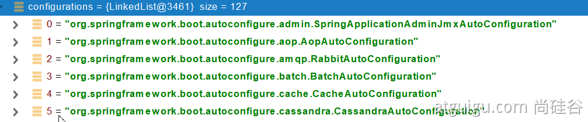
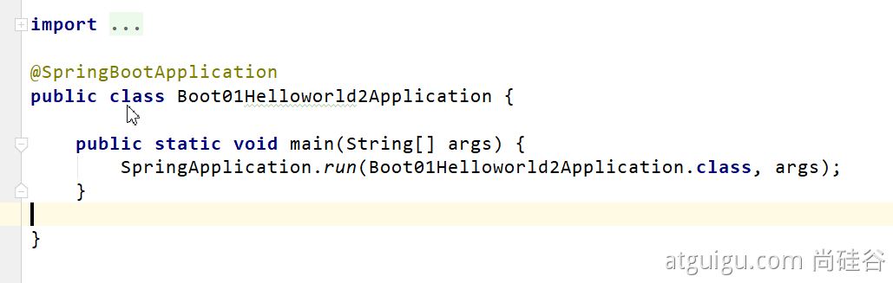

# 基礎入門 Spring Boot2
- ##### 尚硅谷IT培训学校
  [Youtube影片](https://www.youtube.com/playlist?list=PLmOn9nNkQxJFKh2PMfWbGT7RVuMowsx-u)、[課件文檔](https://www.yuque.com/atguigu/springboot)

# 第一章 SpringBoot2 核心技術

## 第一節 SpringBoot2 基礎入門 
  - ### 學習要求
    - 熟悉 Spring 基礎
    - 熟悉 Maven 使用
  - ### 環境要求
    - Java8 及以上
    - [Maven 3.3 及以上](https://docs.spring.io/spring-boot/docs/current/reference/html/getting-started.html#getting-started-system-requirements)
  - ### 學習資料
    - [文檔地址](https://www.yuque.com/atguigu/springboot)
    - [影片地址](http://www.gulixueyuan.com/)、[影片地址2](https://www.bilibili.com/video/BV19K4y1L7MT?p=1)
    - [源碼地址](https://gitee.com/leifengyang/springboot2)
  
### 01. Spring 與 SpringBoot
  - #### Spring 能做什麼
    - ##### Spring 的能力
      

      - 微服開發 - Microservices
      - 響應式編程 - Reactive
      - 分布式雲開發 - Cloud
      - web應用程式開發 - Web apps
      - 無伺服器開發 - Serverless 
      - 事件驅動 - Event Driven 
      - 批次處理- Batch 
    
    - ##### Spring 的生態
      [生態圈](https://spring.io/projects/spring-boot)
      `Spring 廣義`，指的是 `整個 Spring 生態圈`。
      `Spring 狹義`，指的是 `Spring Framework` (只是生態圈的其中一個項目)。

      SpringBoot 包含以下項目...等等
      - `Spring Framework`：含 Spring MVC
      - `Spring Data`：用來解決資料庫存取
      - `Spring Cloud`：用來解決分布式下的所有問題
      - `Spring Security`：提供整個應用的安全控制管理
      - `Spring Session`：提供分布式下的 session 管理

    - ##### Spring5 重大升級
      - ###### 響應式編程
        
        SpringBoot2 包含兩套方案：
        - `Reactive Stack`：`響應式 容器`，非同步數據流，Spring WebFlux。
        - `Servlet Stack`：`Servlet 容器`，同步數據流，Spring MVC。
      - ###### 內部源碼設計
        基於 Java8 的一些新特性，如：介面預設實現。重新設計源碼架構。

  - #### 為什麼用 SpringBoot
    能快速創建出 生產級的 Spring 應用。
    - ##### SpringBoot 優點
      - 創建獨立 Spring 應用
      - 內嵌 web 服務器
      - 自動 starter(啟動器) 依賴，簡化構建配置
      - 自動配置 Spring 以及第三方功能
      - 提供生產級別的監控、健康檢查及外部化配置
      - 無代碼生成、無需編寫 XML

      `SpringBoot` 是整合 Spring 技術線的 一站式框架
      `SpringBoot` 是簡化 Spring 技術線的 快速開發腳手架

    - ##### SpringBoot 缺點
      - 更新快，需要時刻關注變化
      - 封裝太深，內部原理複雜，不容易精通
      
  - #### 時代背景
    - ##### 微服務
      James Lewis and Martin Fowler (2014)  提出微服务完整概念。https://martinfowler.com/microservices/
      - 微服務是一種架構風格
      - 一個應用拆分為一組小型服務
      - 每個服務運行在自己的進程內，也就是可獨立部署和升級
      - 服務之間使用輕量級 HTTP 交互
      - 服務圍繞業務功能拆分
      - 可以由全自動部署機制獨立部署
      - 去中心化，服務自治。服務可以使用不同的語言、不同的儲存技術

    - ##### 分布式
      
      - ###### 分布式的困難
        - 遠程調用 (各機器間的功能調用)
        - 服務發現 (找到可運行的機器)
        - 負載均衡 (分配負載)
        - 服務容錯 (遇到問題時，默認機制啟動)
        - 配置管理 (修改配置中心檔案，其他機器同步更新)
        - 服務監控 (監控機器健康狀況)
        - 鏈路追蹤 (出現問題時，可以追蹤整條鏈路)
        - 日誌管理
        - 任務調度
        - ...

      - ###### 分布式的解決
        `SpringBoot` + `SpringCloud`
        
        - Spring Boot 快速構建應用
        - Spring Cloud 將所有應用網狀包覆起來
        - Spring Cloud Data Flow 網狀結構數據流，成為響應式數據流

    - ##### 雲原生
      原生應用如何上雲。Cloud Native
      - ###### 上雲的困難
        - 服務自癒 (掛點了，自動起一抬起來)
        - 彈性伸縮 (流量爆點時，自動起多台)
        - 服務隔離 (掛點了，要能自動隔離)
        - 自動化部屬
        - 局部發布 (更版時，先針對單一系統發布，等穩定後再全部發布) 
        - 流量治理 (控制每一台流量控制)
        - ...
      - ###### 上雲的解決
        

  - #### 如何學習 SpringBoot
    - ##### 查找官網文件
      1. 官方網址 (https://spring.io/)
      2. Projects/Spring Boot (https://spring.io/projects/spring-boot)
      3. [LEARN](https://spring.io/projects/spring-boot#learn)
        - `CURRENT`：當前穩定發布版。
        - `SNAPSHOT`：快照版本，可以不用關注。
    - ##### 官方文檔架構
      - [官網教學 Spring-Boot 2.7.9](https://docs.spring.io/spring-boot/docs/2.7.9/reference/html/)
      

      - [文檔](https://docs.spring.io/spring-boot/docs/2.7.9/reference/html/)
      - [官方PDF文檔](https://docs.spring.io/spring-boot/docs/2.7.9/reference/pdf/spring-boot-reference.pdf)

      - [更版資訊](https://github.com/spring-projects/spring-boot/wiki#release-notes)
      
### 02. SpringBoot2 入門
  - #### 1. 系統要求
    - [Java 8](https://www.java.com/zh-TW/) & 兼容java14 .
    - Maven 3.3+
    - idea 2019.1.2

      >  mac 安裝方式，先安裝 java SDK v1.8，
      >  然後安裝 IDE (Intellij 或 eclipse)

    - JDK 版本查看方式
      ```sh
      javac -version
      ```

    - Maven 版本查看方式
      ```bash
      mvn -v
      ```

    - ##### 1.1 maven設置
      ```xml
      <!-- .m2/settings.xml -->
      <mirrors>
        <mirror>
          <id>nexus-aliyun</id>
          <mirrorOf>central</mirrorOf>
          <name>Nexus aliyun</name>
          <url>http://maven.aliyun.com/nexus/content/groups/public</url>
        </mirror>
      </mirrors>

      <profiles>
        <profile>
          <id>jdk-1.8</id>
          <activation>
            <activeByDefault>true</activeByDefault>
            <jdk>1.8</jdk>
          </activation>
          <properties>
            <maven.compiler.source>1.8</maven.compiler.source>
            <maven.compiler.target>1.8</maven.compiler.target>
            <maven.compiler.compilerVersion>1.8</maven.compiler.compilerVersion>
          </properties>
        </profile>
      </profiles>
      ```

  - #### 2. HelloWorld
    需求：瀏覽發送 /hello，響應 Hello，Spring Boot 2

    - ##### 2.1 創建 maven 工程
      1. 開啟 intellij
      2. 創建 new Project
      3. 選擇 Java、Maven
      
    - ##### 2.2 引入依賴
      在 `pom.xml` 增加 `spring-boot-starter-parent` 、 `spring-boot-starter-web`
      ```xml
      <?xml version="1.0" encoding="UTF-8"?>
      <project xmlns="http://maven.apache.org/POM/4.0.0" xmlns:xsi="http://www.w3.org/2001/XMLSchema-instance"
          xsi:schemaLocation="http://maven.apache.org/POM/4.0.0 https://maven.apache.org/xsd/maven-4.0.0.xsd">
          <modelVersion>4.0.0</modelVersion>

          <groupId>com.example</groupId>
          <artifactId>myproject</artifactId>
          <version>0.0.1-SNAPSHOT</version>

          <parent>
            <groupId>org.springframework.boot</groupId>
            <artifactId>spring-boot-starter-parent</artifactId>
            <version>2.7.9</version>
          </parent>

          <!-- Additional lines to be added here... -->
          <!-- 添加 starter 依賴 -->
          <dependencies>
            <dependency>
              <groupId>org.springframework.boot</groupId>
              <artifactId>spring-boot-starter-web</artifactId>
            </dependency>
          </dependencies>
      </project>
      ```
    
    - ##### 2.3 創建主程序
      - 在 `src/main/java/` 右鍵 `new / Java Class`，輸入 `com.atguigu.boot.MainApplication`。
      - 並加上 `@SpringBootApplication`，告訴 SpringBoot 這是一個 SpringBoot 應用
      - 並加上 `SpringApplication.run(MainApplication.class, args);`，告訴 `SpringApplication` 將主類為`MainApplication` 跑起來，並將 `args` 傳入。
      ```java
      /**
      * 主程序類 (相當於所有啟動的入口)
      * @SpringBootApplication：這是一個SpringBoot應用
      */
      @SpringBootApplication
      public class MainApplication {
        public static void main(String[] args) {
          SpringApplication.run(MainApplication.class, args);
        }
      }
      ```

    - ##### 2.4 編寫業務
      - 在 `src/main/java/com/atguigu/boot` 右鍵 `new / Java Class`，輸入 `controller.HelloController`。
      - 並在 class 前面 標註註解，加上 `@Controller`
      - 編寫一個 `handleo1` 方法
      - 在方法上 標註註解，為 `/hello` 映射一個請求，加上 `@RequestMapping("/hello")`
      - 在 `handleo1` 方法內，撰寫 回傳值 `return "Hello, Spring Boot 2!";`
        ```java
        @Controller
        public class HelloController {
          @RequestMapping("/hello")
          public String handle01(){
            return "Hello, Spring Boot 2!";
          }
        }
        ```

      - 由於 返回值 要以字串的形式返回瀏覽器，所以 在 `@RequestMapping("/hello")` 前面還必須加上 `@ResponseBody`。
        ```java
        @Controller
        public class HelloController {
          @ResponseBody
          @RequestMapping("/hello")
          ...
        }
        ```

      - 然而，因為 `HelloController` 這個處理器，可能會處理非常多的請求，都要給瀏覽器返回字符串。所以可以將 `@ResponseBody` 搬到 `@Controller` 之上。
        ```java
        @ResponseBody
        @Controller
        public class HelloController {
          ...
        }
        ```

      - `SpringMVC` 有一個新註解 `@RestController`，它其實就是 `@Controller` 和 `ResponseBody` 的合體，所以可以直接改用 `@RestController`
        ```java
        @RestController
        public class HelloController {
          @RequestMapping("/hello")
          public String handle01(){
            return "Hello, Spring Boot 2!";
          }
        }
        ```

    - ##### 2.5 測試
      直接運行 `main` 方法
      - 可在主類 `MainApplication` 檔案中，`public static void main` 左側，點擊 run (綠色三角形) 按鈕，`Run 'MainApplication.main()'`。

      - 查找運行的 prot： 如： `Tomcat started on port(s): 8080`，表示 可在 `http://localhost:8080/` 找到該環境，
      
      - 後面加上 `/hello`，可測試 請求 `/hello` 時，瀏覽器會顯示 `Hello, Spring Boot 2!`

    - ##### 2.6 簡化配置
      `application.properties`
      - `SpringBoot` 只要在一處(`application.properties`)，就可以更改所有配置。
      - 在 `src/main/resources` 右鍵 選擇 `New / File`，輸入 `application.properties`，在這個檔案中，可以修改 `Tomcat` 的設置，包括 MVC 的設置。在 `src/main/resources/application.properties`
      - 如更改 `server.port`，
        ```
        server.port=8888
        ```
      - 重新啟動 `Run 'MainApplication.main()'`，即可看到 port 已經改為 8888。

      - 所有設定都可以在此檔案裡面做修改，未配置的項目，則會以 `SpringBoot2` 的預設為主。

      - 在官方文件的 [Application Properties](https://docs.spring.io/spring-boot/docs/2.7.9/reference/html/application-properties.html#appendix.application-properties)，可查看所有配置項的設定說明。

    - ##### 2.7 簡化部屬
      把項目打包成 `jar` 包，直接在目標服務器執行即可。
      - 以前，要將應用部署到server，server 必須安裝 `Tomcat`等套件，再把應用包成 `war`。
      - `Maven` 的 `pom.xml` 若沒有設定打包方式，默認就會是 `jar`，
        ```xml
          <packaging>jar</packaging>
        ```

      - 有了 `SpringBoot2` 以後，只要在 `pom.xml`，加上以下語法，就能將項目打包成 `jar`，`jar` 中，自帶了運行環境。
        ```xml
        <build>
          <plugins>
            <plugin>
              <groupId>org.springframework.boot</groupId>
              <artifactId>spring-boot-maven-plugin</artifactId>
            </plugin>
          </plugins>
        </build>
        ```
        - 點擊右邊 `Maven` 頁籤，打開 `Project` 的細項，找到 `Lifecycle`，選取 `clean` 和 `package` 這兩項。(按住 `ALT` 可 多選)，再來點選上面的 `Run Maven Build` (綠色箭頭)。

        - 運行打包完之後，會產生 `/target/`，打包的 `jar` 就在裡面。
        - `cd` 到 該資料夾位置，
        - 執行
          ```bash
          java -jar <專案名稱>.jar
          ```
    
    > (windows)注意，取消掉 `cmd` 的 `快速編輯模式`。
  
### 03. 了解自動配置原理
  - #### 1. SpringBoot 特點
    - ##### 1.1 依賴管理
      - ###### 父項目做依賴管理
        ```xml
        <!-- pom.xml -->
        <!-- 依賴管理-->
        <parent>
          <groupId>org.springframework.boot</groupId>
          <artifactId>spring-boot-starter-parent</artifactId>
          <version>2.3.4.RELEASE</version>
        </parent>

        <!-- spring-boot-starter-parent 檔案中 的父項目 -->
        <parent>
          <groupId>org.springframework.boot</groupId>
          <artifactId>spring-boot-dependencies</artifactId>
          <version>2.3.4.RELEASE</version>
        </parent>
        ```

        每一個 Spring-boot 工程，都有一個父項目(spring-boot-starter-parent)，
        父項目的作用，是用來作依賴管理的，
        子項目只要繼承了父項目，子項目以後寫依賴就不需要寫版本號。

        1. pom.xml 可找到 父項目 `spring-boot-starter-parent`
        2. `spring-boot-starter-parent` 可找到 父項目 `spring-boot-dependencies`
        3. 而 `spring-boot-dependencies` 裡的 `<properties>` 幾乎聲明了所有開發中常用的依賴的版本號

      - ###### 開發導入 starter 場景起動器
        1. 見到很多 `spring-boot-starter-*`：* 就代表某種場景
        2. 只要引入 `starter`，這個場景的所有常規需要的依賴，都會自動引入
        3. SpringBoot 所有支持的場景
          - [2.7.9](https://docs.spring.io/spring-boot/docs/2.7.9/reference/html/using.html#using.build-systems.starters)
          - [current](https://docs.spring.io/spring-boot/docs/current/reference/html/using-spring-boot.html#using-boot-starter)
        4. 見到的 `*-spring-boot-starter`：第三方為我們提供的簡化開發的場景啟動器。
        5. 所有場景啟動器最底層的依賴，都會依賴 `spring-boot` 核心依賴
            ```xml
            <dependency>
              <groupId>org.springframework.boot</groupId>
              <artifactId>spring-boot-starter</artifactId>
              <version>2.3.4.RELEASE</version>
              <scope>compile</scope>
            </dependency>
            ```

      - ###### 無需關注版本號，自動版本仲裁
        1. 引入依賴默認項目，都可以不寫版本號
        2. 引入非版本仲裁的 jar，就需要寫版本號

      - ###### 可以修改默認版本號
        1. 查看 `spring-boot-dependencies` 裡面規定當前依賴的版本 用的 key。
        2. 在當前項目裡面 重寫配置
            ```xml
            <properties>
              <mysql.version>5.1.43</mysql.version>
            </properties>
            ```
    - #### 1.2 自動配置
      - ##### 自動配好 Tomcat
        - 引入Tomcat依賴
          - 在引入 `spring-boot-starter-web` 時，會自動引入 `spring-boot-starter-tomcat`
            ```xml
            <dependency>
              <groupId>org.springframework.boot</groupId>
              <artifactId>spring-boot-starter-tomcat</artifactId>
              <version>2.3.4.RELEASE</version>
              <scope>compile</scope>
            </dependency>
            ```
        - 配置 Tomcat
          
      - ##### 自動配好 SpringMVC
        - 引入 SpringMVC 全套組件
        - 自動配好 SpringMVC 常用組件 (功能)
      - ##### 自動配好Web常見功能，如：字符編碼問題
        - SpringBoot 幫我們配置好了所有web開發的常見場景
      
      - ##### 默認的包結構
        - 主程序所在的包 及 其下面的所有子包 裡面的組件都會被默認掃描進來
        - 無需以前的包掃描配置
        - 想要改變掃描路徑，
          - 改變主入口的 `@SpringBootApplication` 配置引數，
             `@SpringBootApplication(scanBasePackages="com.atguigu")`
          - 或者 `@ComponentScan` 指定掃描路徑
            ```java
            @SpringBootApplication
            等同於
            @SpringBootConfiguration
            @EnableAutoConfiguration
            @ComponentScan("com.atguigu")
            ```

            - 原因在於 `@SpringBootApplication` 裡面 設定了 `@SpringBootConfiguration`、`@EnableAutoConfiguration`、`@ComponentScan()`

      - ##### 各種配置擁有默認值
        - 默認配置 最終都是映射到 某個類 上，如：`MultipartProperties`
        - 配置文件的值 最終會綁定到 某個類 上，這個類會在容器中創建對象

        - 自定義配置項，可寫在 `resources/ application.properties`
      - ##### 按需加載所有自動配置項
        - 非常多的 starter
        - 引入了哪些場景，這些場景的自動配置才會開啟
        - SpringBoot 所有的自動配置功能 都在 `spring-boot-autoconfigure` 包裡面
          - `spring-boot-starter-web` -> `spring-boot-starter` -> `spring-boot-autoconfigure`

  - #### 2. 容器功能
    - #### 2.1、组件添加
      - ##### 1、@Configuration
        ● 基本使用
        ● Full模式与Lite模式
          ○ 範例
          ○ 最佳实战
            ■ 配置 类组件之间无依赖关系用Lite模式加速容器启动过程，减少判断
            ■ 配置类组件之间有依赖关系，方法会被调用得到之前单实例组件，用Full模式

        ```java
        #############################Configuration使用範例######################################################
        /**
        * 1、配置类里面使用@Bean标注在方法上给容器注册组件，默认也是单实例的
        * 2、配置类本身也是组件
        * 3、proxyBeanMethods：代理bean的方法
        *      Full(proxyBeanMethods = true)、【保证每个@Bean方法被调用多少次返回的组件都是单实例的】
        *      Lite(proxyBeanMethods = false)【每个@Bean方法被调用多少次返回的组件都是新创建的】
        *      组件依赖必须使用Full模式默认。其他默认是否Lite模式
        *
        *
        *
        */
        @Configuration(proxyBeanMethods = false) //告诉SpringBoot这是一个配置类 == 配置文件
        public class MyConfig {

            /**
            * Full:外部无论对配置类中的这个组件注册方法调用多少次获取的都是之前注册容器中的单实例对象
            * @return
            */
            @Bean //给容器中添加组件。以方法名作为组件的id。返回类型就是组件类型。返回的值，就是组件在容器中的实例
            public User user01(){
                User zhangsan = new User("zhangsan", 18);
                //user组件依赖了Pet组件
                zhangsan.setPet(tomcatPet());
                return zhangsan;
            }

            @Bean("tom")
            public Pet tomcatPet(){
                return new Pet("tomcat");
            }
        }


        ################################@Configuration测试代码如下########################################
        @SpringBootConfiguration
        @EnableAutoConfiguration
        @ComponentScan("com.atguigu.boot")
        public class MainApplication {

            public static void main(String[] args) {
                //1、返回我们IOC容器
                ConfigurableApplicationContext run = SpringApplication.run(MainApplication.class, args);

                //2、查看容器里面的组件
                String[] names = run.getBeanDefinitionNames();
                for (String name : names) {
                    System.out.println(name);
                }

                //3、从容器中获取组件

                Pet tom01 = run.getBean("tom", Pet.class);

                Pet tom02 = run.getBean("tom", Pet.class);

                System.out.println("组件："+(tom01 == tom02));


                //4、com.atguigu.boot.config.MyConfig$$EnhancerBySpringCGLIB$$51f1e1ca@1654a892
                MyConfig bean = run.getBean(MyConfig.class);
                System.out.println(bean);

                //如果@Configuration(proxyBeanMethods = true)代理对象调用方法。SpringBoot总会检查这个组件是否在容器中有。
                //保持组件单实例
                User user = bean.user01();
                User user1 = bean.user01();
                System.out.println(user == user1);


                User user01 = run.getBean("user01", User.class);
                Pet tom = run.getBean("tom", Pet.class);

                System.out.println("用户的宠物："+(user01.getPet() == tom));


            }
        }

        ```

      - ##### 2、@Bean、@Component、@Controller、@Service、@Repository
      - ##### 3、@ComponentScan、@Import
        ```java
          * 4、@Import({User.class, DBHelper.class})
          *      给容器中自动创建出这两个类型的组件、默认组件的名字就是全类名
          *
          *
          *
          */

          @Import({User.class, DBHelper.class})
          @Configuration(proxyBeanMethods = false) //告诉SpringBoot这是一个配置类 == 配置文件
          public class MyConfig {
          }
        ```
        @Import 高级用法： https://www.bilibili.com/video/BV1gW411W7wy?p=8

      - ##### 4、@Conditional
        条件装配：满足Conditional指定的条件，则进行组件注入
        

        ```java
        =====================测试条件装配==========================
        @Configuration(proxyBeanMethods = false) //告诉SpringBoot这是一个配置类 == 配置文件
        //@ConditionalOnBean(name = "tom")
        @ConditionalOnMissingBean(name = "tom")
        public class MyConfig {


            /**
            * Full:外部无论对配置类中的这个组件注册方法调用多少次获取的都是之前注册容器中的单实例对象
            * @return
            */

            @Bean //给容器中添加组件。以方法名作为组件的id。返回类型就是组件类型。返回的值，就是组件在容器中的实例
            public User user01(){
                User zhangsan = new User("zhangsan", 18);
                //user组件依赖了Pet组件
                zhangsan.setPet(tomcatPet());
                return zhangsan;
            }

            @Bean("tom22")
            public Pet tomcatPet(){
                return new Pet("tomcat");
            }
        }

        public static void main(String[] args) {
                //1、返回我们IOC容器
                ConfigurableApplicationContext run = SpringApplication.run(MainApplication.class, args);

                //2、查看容器里面的组件
                String[] names = run.getBeanDefinitionNames();
                for (String name : names) {
                    System.out.println(name);
                }

                boolean tom = run.containsBean("tom");
                System.out.println("容器中Tom组件："+tom);

                boolean user01 = run.containsBean("user01");
                System.out.println("容器中user01组件："+user01);

                boolean tom22 = run.containsBean("tom22");
                System.out.println("容器中tom22组件："+tom22);


            }
        ```

    - #### 2.2、原生配置文件引入
      - ##### 1、@ImportResource
        ```xml
        ======================beans.xml=========================
        <?xml version="1.0" encoding="UTF-8"?>
        <beans xmlns="http://www.springframework.org/schema/beans"
              xmlns:xsi="http://www.w3.org/2001/XMLSchema-instance"
              xmlns:context="http://www.springframework.org/schema/context"
              xsi:schemaLocation="http://www.springframework.org/schema/beans http://www.springframework.org/schema/beans/spring-beans.xsd http://www.springframework.org/schema/context https://www.springframework.org/schema/context/spring-context.xsd">

            <bean id="haha" class="com.atguigu.boot.bean.User">
                <property name="name" value="zhangsan"></property>
                <property name="age" value="18"></property>
            </bean>

            <bean id="hehe" class="com.atguigu.boot.bean.Pet">
                <property name="name" value="tomcat"></property>
            </bean>
        </beans>
        ```

        ```java
        @ImportResource("classpath:beans.xml")
        public class MyConfig {}

        ======================测试=================
                boolean haha = run.containsBean("haha");
                boolean hehe = run.containsBean("hehe");
                System.out.println("haha："+haha);//true
                System.out.println("hehe："+hehe);//true
        ```
    
    - #### 2.3、配置绑定 
      如何使用Java读取到properties文件中的内容，并且把它封装到JavaBean中，以供随时使用；
      
      ```java
      public class getProperties {
          public static void main(String[] args) throws FileNotFoundException, IOException {
              Properties pps = new Properties();
              pps.load(new FileInputStream("a.properties"));
              Enumeration enum1 = pps.propertyNames();//得到配置文件的名字
              while(enum1.hasMoreElements()) {
                  String strKey = (String) enum1.nextElement();
                  String strValue = pps.getProperty(strKey);
                  System.out.println(strKey + "=" + strValue);
                  //封装到JavaBean。
              }
          }
      }
      ```

      - ##### 1、@ConfigurationProperties
        ```java
        /**
        * 只有在容器中的组件，才会拥有SpringBoot提供的强大功能
        */
        @Component
        @ConfigurationProperties(prefix = "mycar")
        public class Car {

            private String brand;
            private Integer price;

            public String getBrand() {
                return brand;
            }

            public void setBrand(String brand) {
                this.brand = brand;
            }

            public Integer getPrice() {
                return price;
            }

            public void setPrice(Integer price) {
                this.price = price;
            }

            @Override
            public String toString() {
                return "Car{" +
                        "brand='" + brand + '\'' +
                        ", price=" + price +
                        '}';
            }
        }
        ```

      - ##### 2、@EnableConfigurationProperties + @ConfigurationProperties

      - ##### 3、@Component + @ConfigurationProperties
        ```java
        @EnableConfigurationProperties(Car.class)
        //1、开启Car配置绑定功能
        //2、把这个Car这个组件自动注册到容器中
        public class MyConfig {
        }
        ```

  - #### 3、自动配置原理入门
    - #### 3.1、引导加载自动配置类
      ```java
      @SpringBootConfiguration
      @EnableAutoConfiguration
      @ComponentScan(excludeFilters = { @Filter(type = FilterType.CUSTOM, classes = TypeExcludeFilter.class),
          @Filter(type = FilterType.CUSTOM, classes = AutoConfigurationExcludeFilter.class) })
      public @interface SpringBootApplication{}


      ======================
          
      ```
      - ##### 1、@SpringBootConfiguration
        @Configuration。代表当前是一个配置类
      
      - ##### 2、@ComponentScan
        指定扫描哪些，Spring注解；
      
      - ##### 3、@EnableAutoConfiguration
        ```java
        @AutoConfigurationPackage
        @Import(AutoConfigurationImportSelector.class)
        public @interface EnableAutoConfiguration {}
        ```


        - ###### 1、@AutoConfigurationPackage
          自动配置包？指定了默认的包规则

          ```java
          @Import(AutoConfigurationPackages.Registrar.class)  //给容器中导入一个组件
          public @interface AutoConfigurationPackage {}

          //利用Registrar给容器中导入一系列组件
          //将指定的一个包下的所有组件导入进来？MainApplication 所在包下。
          ```

        - ###### 2、@Import(AutoConfigurationImportSelector.class)
          ```java

          1、利用getAutoConfigurationEntry(annotationMetadata);给容器中批量导入一些组件
          2、调用List<String> configurations = getCandidateConfigurations(annotationMetadata, attributes)获取到所有需要导入到容器中的配置类
          3、利用工厂加载 Map<String, List<String>> loadSpringFactories(@Nullable ClassLoader classLoader)；得到所有的组件
          4、从META-INF/spring.factories位置来加载一个文件。
            默认扫描我们当前系统里面所有META-INF/spring.factories位置的文件
              spring-boot-autoconfigure-2.3.4.RELEASE.jar包里面也有META-INF/spring.factories
          ```

          
    
          ```xml
          文件里面写死了spring-boot一启动就要给容器中加载的所有配置类
          spring-boot-autoconfigure-2.3.4.RELEASE.jar/META-INF/spring.factories
          # Auto Configure
          org.springframework.boot.autoconfigure.EnableAutoConfiguration=\
          org.springframework.boot.autoconfigure.admin.SpringApplicationAdminJmxAutoConfiguration,\
          org.springframework.boot.autoconfigure.aop.AopAutoConfiguration,\
          org.springframework.boot.autoconfigure.amqp.RabbitAutoConfiguration,\
          org.springframework.boot.autoconfigure.batch.BatchAutoConfiguration,\
          org.springframework.boot.autoconfigure.cache.CacheAutoConfiguration,\
          org.springframework.boot.autoconfigure.cassandra.CassandraAutoConfiguration,\
          org.springframework.boot.autoconfigure.context.ConfigurationPropertiesAutoConfiguration,\
          org.springframework.boot.autoconfigure.context.LifecycleAutoConfiguration,\
          org.springframework.boot.autoconfigure.context.MessageSourceAutoConfiguration,\
          org.springframework.boot.autoconfigure.context.PropertyPlaceholderAutoConfiguration,\
          org.springframework.boot.autoconfigure.couchbase.CouchbaseAutoConfiguration,\
          org.springframework.boot.autoconfigure.dao.PersistenceExceptionTranslationAutoConfiguration,\
          org.springframework.boot.autoconfigure.data.cassandra.CassandraDataAutoConfiguration,\
          org.springframework.boot.autoconfigure.data.cassandra.CassandraReactiveDataAutoConfiguration,\
          org.springframework.boot.autoconfigure.data.cassandra.CassandraReactiveRepositoriesAutoConfiguration,\
          org.springframework.boot.autoconfigure.data.cassandra.CassandraRepositoriesAutoConfiguration,\
          org.springframework.boot.autoconfigure.data.couchbase.CouchbaseDataAutoConfiguration,\
          org.springframework.boot.autoconfigure.data.couchbase.CouchbaseReactiveDataAutoConfiguration,\
          org.springframework.boot.autoconfigure.data.couchbase.CouchbaseReactiveRepositoriesAutoConfiguration,\
          org.springframework.boot.autoconfigure.data.couchbase.CouchbaseRepositoriesAutoConfiguration,\
          org.springframework.boot.autoconfigure.data.elasticsearch.ElasticsearchDataAutoConfiguration,\
          org.springframework.boot.autoconfigure.data.elasticsearch.ElasticsearchRepositoriesAutoConfiguration,\
          org.springframework.boot.autoconfigure.data.elasticsearch.ReactiveElasticsearchRepositoriesAutoConfiguration,\
          org.springframework.boot.autoconfigure.data.elasticsearch.ReactiveElasticsearchRestClientAutoConfiguration,\
          org.springframework.boot.autoconfigure.data.jdbc.JdbcRepositoriesAutoConfiguration,\
          org.springframework.boot.autoconfigure.data.jpa.JpaRepositoriesAutoConfiguration,\
          org.springframework.boot.autoconfigure.data.ldap.LdapRepositoriesAutoConfiguration,\
          org.springframework.boot.autoconfigure.data.mongo.MongoDataAutoConfiguration,\
          org.springframework.boot.autoconfigure.data.mongo.MongoReactiveDataAutoConfiguration,\
          org.springframework.boot.autoconfigure.data.mongo.MongoReactiveRepositoriesAutoConfiguration,\
          org.springframework.boot.autoconfigure.data.mongo.MongoRepositoriesAutoConfiguration,\
          org.springframework.boot.autoconfigure.data.neo4j.Neo4jDataAutoConfiguration,\
          org.springframework.boot.autoconfigure.data.neo4j.Neo4jRepositoriesAutoConfiguration,\
          org.springframework.boot.autoconfigure.data.solr.SolrRepositoriesAutoConfiguration,\
          org.springframework.boot.autoconfigure.data.r2dbc.R2dbcDataAutoConfiguration,\
          org.springframework.boot.autoconfigure.data.r2dbc.R2dbcRepositoriesAutoConfiguration,\
          org.springframework.boot.autoconfigure.data.r2dbc.R2dbcTransactionManagerAutoConfiguration,\
          org.springframework.boot.autoconfigure.data.redis.RedisAutoConfiguration,\
          org.springframework.boot.autoconfigure.data.redis.RedisReactiveAutoConfiguration,\
          org.springframework.boot.autoconfigure.data.redis.RedisRepositoriesAutoConfiguration,\
          org.springframework.boot.autoconfigure.data.rest.RepositoryRestMvcAutoConfiguration,\
          org.springframework.boot.autoconfigure.data.web.SpringDataWebAutoConfiguration,\
          org.springframework.boot.autoconfigure.elasticsearch.ElasticsearchRestClientAutoConfiguration,\
          org.springframework.boot.autoconfigure.flyway.FlywayAutoConfiguration,\
          org.springframework.boot.autoconfigure.freemarker.FreeMarkerAutoConfiguration,\
          org.springframework.boot.autoconfigure.groovy.template.GroovyTemplateAutoConfiguration,\
          org.springframework.boot.autoconfigure.gson.GsonAutoConfiguration,\
          org.springframework.boot.autoconfigure.h2.H2ConsoleAutoConfiguration,\
          org.springframework.boot.autoconfigure.hateoas.HypermediaAutoConfiguration,\
          org.springframework.boot.autoconfigure.hazelcast.HazelcastAutoConfiguration,\
          org.springframework.boot.autoconfigure.hazelcast.HazelcastJpaDependencyAutoConfiguration,\
          org.springframework.boot.autoconfigure.http.HttpMessageConvertersAutoConfiguration,\
          org.springframework.boot.autoconfigure.http.codec.CodecsAutoConfiguration,\
          org.springframework.boot.autoconfigure.influx.InfluxDbAutoConfiguration,\
          org.springframework.boot.autoconfigure.info.ProjectInfoAutoConfiguration,\
          org.springframework.boot.autoconfigure.integration.IntegrationAutoConfiguration,\
          org.springframework.boot.autoconfigure.jackson.JacksonAutoConfiguration,\
          org.springframework.boot.autoconfigure.jdbc.DataSourceAutoConfiguration,\
          org.springframework.boot.autoconfigure.jdbc.JdbcTemplateAutoConfiguration,\
          org.springframework.boot.autoconfigure.jdbc.JndiDataSourceAutoConfiguration,\
          org.springframework.boot.autoconfigure.jdbc.XADataSourceAutoConfiguration,\
          org.springframework.boot.autoconfigure.jdbc.DataSourceTransactionManagerAutoConfiguration,\
          org.springframework.boot.autoconfigure.jms.JmsAutoConfiguration,\
          org.springframework.boot.autoconfigure.jmx.JmxAutoConfiguration,\
          org.springframework.boot.autoconfigure.jms.JndiConnectionFactoryAutoConfiguration,\
          org.springframework.boot.autoconfigure.jms.activemq.ActiveMQAutoConfiguration,\
          org.springframework.boot.autoconfigure.jms.artemis.ArtemisAutoConfiguration,\
          org.springframework.boot.autoconfigure.jersey.JerseyAutoConfiguration,\
          org.springframework.boot.autoconfigure.jooq.JooqAutoConfiguration,\
          org.springframework.boot.autoconfigure.jsonb.JsonbAutoConfiguration,\
          org.springframework.boot.autoconfigure.kafka.KafkaAutoConfiguration,\
          org.springframework.boot.autoconfigure.availability.ApplicationAvailabilityAutoConfiguration,\
          org.springframework.boot.autoconfigure.ldap.embedded.EmbeddedLdapAutoConfiguration,\
          org.springframework.boot.autoconfigure.ldap.LdapAutoConfiguration,\
          org.springframework.boot.autoconfigure.liquibase.LiquibaseAutoConfiguration,\
          org.springframework.boot.autoconfigure.mail.MailSenderAutoConfiguration,\
          org.springframework.boot.autoconfigure.mail.MailSenderValidatorAutoConfiguration,\
          org.springframework.boot.autoconfigure.mongo.embedded.EmbeddedMongoAutoConfiguration,\
          org.springframework.boot.autoconfigure.mongo.MongoAutoConfiguration,\
          org.springframework.boot.autoconfigure.mongo.MongoReactiveAutoConfiguration,\
          org.springframework.boot.autoconfigure.mustache.MustacheAutoConfiguration,\
          org.springframework.boot.autoconfigure.orm.jpa.HibernateJpaAutoConfiguration,\
          org.springframework.boot.autoconfigure.quartz.QuartzAutoConfiguration,\
          org.springframework.boot.autoconfigure.r2dbc.R2dbcAutoConfiguration,\
          org.springframework.boot.autoconfigure.rsocket.RSocketMessagingAutoConfiguration,\
          org.springframework.boot.autoconfigure.rsocket.RSocketRequesterAutoConfiguration,\
          org.springframework.boot.autoconfigure.rsocket.RSocketServerAutoConfiguration,\
          org.springframework.boot.autoconfigure.rsocket.RSocketStrategiesAutoConfiguration,\
          org.springframework.boot.autoconfigure.security.servlet.SecurityAutoConfiguration,\
          org.springframework.boot.autoconfigure.security.servlet.UserDetailsServiceAutoConfiguration,\
          org.springframework.boot.autoconfigure.security.servlet.SecurityFilterAutoConfiguration,\
          org.springframework.boot.autoconfigure.security.reactive.ReactiveSecurityAutoConfiguration,\
          org.springframework.boot.autoconfigure.security.reactive.ReactiveUserDetailsServiceAutoConfiguration,\
          org.springframework.boot.autoconfigure.security.rsocket.RSocketSecurityAutoConfiguration,\
          org.springframework.boot.autoconfigure.security.saml2.Saml2RelyingPartyAutoConfiguration,\
          org.springframework.boot.autoconfigure.sendgrid.SendGridAutoConfiguration,\
          org.springframework.boot.autoconfigure.session.SessionAutoConfiguration,\
          org.springframework.boot.autoconfigure.security.oauth2.client.servlet.OAuth2ClientAutoConfiguration,\
          org.springframework.boot.autoconfigure.security.oauth2.client.reactive.ReactiveOAuth2ClientAutoConfiguration,\
          org.springframework.boot.autoconfigure.security.oauth2.resource.servlet.OAuth2ResourceServerAutoConfiguration,\
          org.springframework.boot.autoconfigure.security.oauth2.resource.reactive.ReactiveOAuth2ResourceServerAutoConfiguration,\
          org.springframework.boot.autoconfigure.solr.SolrAutoConfiguration,\
          org.springframework.boot.autoconfigure.task.TaskExecutionAutoConfiguration,\
          org.springframework.boot.autoconfigure.task.TaskSchedulingAutoConfiguration,\
          org.springframework.boot.autoconfigure.thymeleaf.ThymeleafAutoConfiguration,\
          org.springframework.boot.autoconfigure.transaction.TransactionAutoConfiguration,\
          org.springframework.boot.autoconfigure.transaction.jta.JtaAutoConfiguration,\
          org.springframework.boot.autoconfigure.validation.ValidationAutoConfiguration,\
          org.springframework.boot.autoconfigure.web.client.RestTemplateAutoConfiguration,\
          org.springframework.boot.autoconfigure.web.embedded.EmbeddedWebServerFactoryCustomizerAutoConfiguration,\
          org.springframework.boot.autoconfigure.web.reactive.HttpHandlerAutoConfiguration,\
          org.springframework.boot.autoconfigure.web.reactive.ReactiveWebServerFactoryAutoConfiguration,\
          org.springframework.boot.autoconfigure.web.reactive.WebFluxAutoConfiguration,\
          org.springframework.boot.autoconfigure.web.reactive.error.ErrorWebFluxAutoConfiguration,\
          org.springframework.boot.autoconfigure.web.reactive.function.client.ClientHttpConnectorAutoConfiguration,\
          org.springframework.boot.autoconfigure.web.reactive.function.client.WebClientAutoConfiguration,\
          org.springframework.boot.autoconfigure.web.servlet.DispatcherServletAutoConfiguration,\
          org.springframework.boot.autoconfigure.web.servlet.ServletWebServerFactoryAutoConfiguration,\
          org.springframework.boot.autoconfigure.web.servlet.error.ErrorMvcAutoConfiguration,\
          org.springframework.boot.autoconfigure.web.servlet.HttpEncodingAutoConfiguration,\
          org.springframework.boot.autoconfigure.web.servlet.MultipartAutoConfiguration,\
          org.springframework.boot.autoconfigure.web.servlet.WebMvcAutoConfiguration,\
          org.springframework.boot.autoconfigure.websocket.reactive.WebSocketReactiveAutoConfiguration,\
          org.springframework.boot.autoconfigure.websocket.servlet.WebSocketServletAutoConfiguration,\
          org.springframework.boot.autoconfigure.websocket.servlet.WebSocketMessagingAutoConfiguration,\
          org.springframework.boot.autoconfigure.webservices.WebServicesAutoConfiguration,\
          org.springframework.boot.autoconfigure.webservices.client.WebServiceTemplateAutoConfiguration
          ```

    - #### 3.2、按需开启自动配置项
      ```java
      虽然我们127个场景的所有自动配置启动的时候默认全部加载。xxxxAutoConfiguration
      按照条件装配规则（@Conditional），最终会按需配置。
      ```


    - #### 3.3、修改默认配置
      ```java
        @Bean
        @ConditionalOnBean(MultipartResolver.class)  //容器中有这个类型组件
        @ConditionalOnMissingBean(name = DispatcherServlet.MULTIPART_RESOLVER_BEAN_NAME) //容器中没有这个名字 multipartResolver 的组件
        public MultipartResolver multipartResolver(MultipartResolver resolver) {
                //给@Bean标注的方法传入了对象参数，这个参数的值就会从容器中找。
                //SpringMVC multipartResolver。防止有些用户配置的文件上传解析器不符合规范
          // Detect if the user has created a MultipartResolver but named it incorrectly
          return resolver;
        }
        给容器中加入了文件上传解析器；
      ```

      SpringBoot默认会在底层配好所有的组件。但是如果用户自己配置了以用户的优先

      ```java
      @Bean
        @ConditionalOnMissingBean
        public CharacterEncodingFilter characterEncodingFilter() {
          }
      ```

      总结：
      ● SpringBoot先加载所有的自动配置类  xxxxxAutoConfiguration
      ● 每个自动配置类按照条件进行生效，默认都会绑定配置文件指定的值。xxxxProperties里面拿。xxxProperties和配置文件进行了绑定
      ● 生效的配置类就会给容器中装配很多组件
      ● 只要容器中有这些组件，相当于这些功能就有了
      ● 定制化配置
        ○ 用户直接自己@Bean替换底层的组件
        ○ 用户去看这个组件是获取的配置文件什么值就去修改。
      xxxxxAutoConfiguration ---> 组件  ---> xxxxProperties里面拿值  ----> application.properties


    - #### 3.4、最佳实践
      ● 引入场景依赖
        ○ https://docs.spring.io/spring-boot/docs/current/reference/html/using-spring-boot.html#using-boot-starter
      ● 查看自动配置了哪些（选做）
        ○ 自己分析，引入场景对应的自动配置一般都生效了
        ○ 配置文件中debug=true开启自动配置报告。Negative（不生效）\Positive（生效）
      ● 是否需要修改
        ○ 参照文档修改配置项
          ■ https://docs.spring.io/spring-boot/docs/current/reference/html/appendix-application-properties.html#common-application-properties
          ■ 自己分析。xxxxProperties绑定了配置文件的哪些。
        ○ 自定义加入或者替换组件
          ■ @Bean、@Component。。。
        ○ 自定义器  XXXXXCustomizer；
        ○ ......


  - #### 4、开发小技巧
    - #### 4.1、Lombok
      简化JavaBean开发
      ```xml
        <dependency>
            <groupId>org.projectlombok</groupId>
            <artifactId>lombok</artifactId>
        </dependency>
      ```

      ```java


      idea中搜索安装lombok插件
      ===============================简化JavaBean开发===================================
      @NoArgsConstructor
      //@AllArgsConstructor
      @Data
      @ToString
      @EqualsAndHashCode
      public class User {

          private String name;
          private Integer age;

          private Pet pet;

          public User(String name,Integer age){
              this.name = name;
              this.age = age;
          }


      }


      ================================简化日志开发===================================
      @Slf4j
      @RestController
      public class HelloController {
          @RequestMapping("/hello")
          public String handle01(@RequestParam("name") String name){
              
              log.info("请求进来了....");
              
              return "Hello, Spring Boot 2!"+"你好："+name;
          }
      }
      ```
    
    - #### 4.2、dev-tools
      ```xml
      <dependency>
        <groupId>org.springframework.boot</groupId>
        <artifactId>spring-boot-devtools</artifactId>
        <optional>true</optional>
      </dependency>
      ```

      项目或者页面修改以后：Ctrl+F9；


    - #### 4.3、Spring Initailizr（项目初始化向导）

      - ##### 0、选择我们需要的开发场景
        ;


      - ##### 1、自动依赖引入
        ;


      - ##### 2、自动创建项目结构
        ;

      - ##### 3、自动编写好主配置类
        ;


### 第二節 SpringBoot2 核心功能
  - #### 04. 配置文件
  - #### 05. Web開發
    - ##### SpringMVC 自動配置
    - ##### 請求映射與處理
    - ##### 試圖解析與內容協商
    - ##### 跨域處理
    - ##### 文件上傳
    - ##### 異常處理
    - ##### 攔截器
    - ##### Web 原生
    - ##### 定制化
  - #### 06. 數據訪問
    - ##### 訪問 MySQL
    - ##### 整合 MyBatis
    - ##### 整合 MyBatis-Plus
  - #### 07. JUnit5 單元測試
    - ##### JUnit5 介紹
    - ##### JUnit5 斷言
    - ##### JUnit5 常用註解
  - #### 08. Actutor 生產指標監控
  - #### 09. SpringBoot 核心原理解析

### 第三節 SpringBoot2 場景整合
  - #### 虛擬化技術
  - #### 安全控制
  - #### 緩存技術
  - #### 消息中間件
  - #### 分布式入門

### 擴展篇 SpringBoot2 架構師視野


## 第二章 SpringBoot2 響應式編程
### 第一節 響應式編程基礎 
  #### 響應式編程模型
  #### 使用 Reactor 開發
### 第二節 Webflux 開發 Web 應用 
  #### Webflux 構建 RESTful 應用
  #### 函數式構建 RESTful 應用
  #### RestTemplate 與 WebClient

### 第三節 響應式訪問持久化層
  #### 響應式訪問MySQL
  #### 響應式訪問Redis

### 第一節 響應式安全開發
  #### Spring Security Reactive 構建安全服務
### 第一節 響應式原理
  #### 幾種 IO 模型
  #### Netty-Reactor
  #### 數據流處理原理