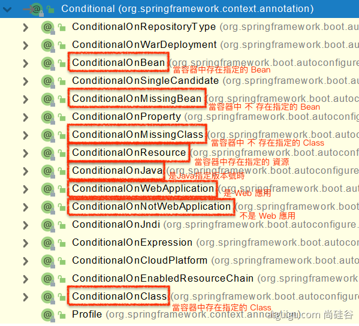
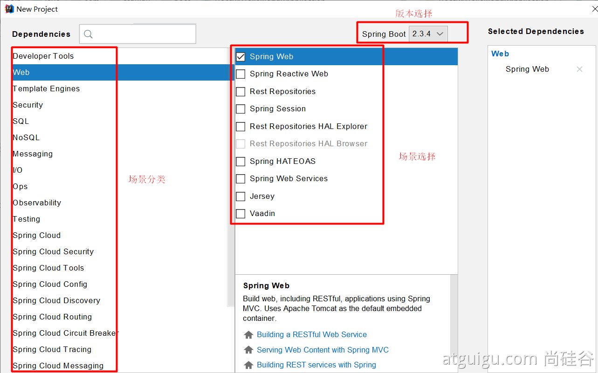

# 03、 了解自動配置原理
  - ## 1、 SpringBoot 特點
    - ### 1.1、 依賴管理
      - #### 父項目做依賴管理
        ```xml
        <!-- pom.xml -->
        <!-- 依賴管理-->
        <parent>
          <groupId>org.springframework.boot</groupId>
          <artifactId>spring-boot-starter-parent</artifactId>
          <version>2.3.4.RELEASE</version>
        </parent>

        <!-- spring-boot-starter-parent 檔案中 的父項目 -->
        <parent>
          <groupId>org.springframework.boot</groupId>
          <artifactId>spring-boot-dependencies</artifactId>
          <version>2.3.4.RELEASE</version>
        </parent>
        ```

        每一個 Spring-boot 工程，都有一個父項目(spring-boot-starter-parent)，
        父項目的作用，是用來作依賴管理的，
        子項目只要繼承了父項目，子項目以後寫依賴就不需要寫版本號。

        1. pom.xml 可找到 父項目 `spring-boot-starter-parent`
        2. `spring-boot-starter-parent` 可找到 父項目 `spring-boot-dependencies`
        3. 而 `spring-boot-dependencies` 裡的 `<properties>` 幾乎聲明了所有開發中常用的依賴的版本號

      - #### 開發導入 starter 場景起動器
        1. 見到很多 `spring-boot-starter-*`：* 就代表某種場景
        2. 只要引入 `starter`，這個場景的所有常規需要的依賴，都會自動引入
        3. SpringBoot 所有支持的場景
            - [2.7.9](https://docs.spring.io/spring-boot/docs/2.7.9/reference/html/using.html#using.build-systems.starters)
            - [current](https://docs.spring.io/spring-boot/docs/current/reference/html/using-spring-boot.html#using-boot-starter)
        4. 見到的 `*-spring-boot-starter`：第三方為我們提供的簡化開發的場景啟動器。
        5. 所有場景啟動器最底層的依賴，都會依賴 `spring-boot` 核心依賴
          ```xml
          <dependency>
            <groupId>org.springframework.boot</groupId>
            <artifactId>spring-boot-starter</artifactId>
            <version>2.3.4.RELEASE</version>
            <scope>compile</scope>
          </dependency>
          ```

      - #### 無需關注版本號，自動版本仲裁
        1. 引入依賴默認項目，都可以不寫版本號
        2. 引入非版本仲裁的 jar，就需要寫版本號

      - #### 可以修改默認版本號
        1. 查看 `spring-boot-dependencies` 裡面規定當前依賴的版本 用的 key。
        2. 在當前項目裡面 重寫配置
          ```xml
          <properties>
            <mysql.version>5.1.43</mysql.version>
          </properties>
          ```
    
    - ### 1.2、 自動配置
      - #### 自動配好 Tomcat
        - 引入Tomcat依賴
          - 在引入 `spring-boot-starter-web` 時，會自動引入 `spring-boot-starter-tomcat`
            ```xml
            <dependency>
              <groupId>org.springframework.boot</groupId>
              <artifactId>spring-boot-starter-tomcat</artifactId>
              <version>2.3.4.RELEASE</version>
              <scope>compile</scope>
            </dependency>
            ```
        - 配置 Tomcat

          ```xml
          <dependency>
            <groupId>org.springframework.boot</groupId>
            <artifactId>spring-boot-starter-tomcat</artifactId>
            <version>2.3.4.RELEASE</version>
            <scope>compile</scope>
          </dependency>
          ```
          
      - #### 自動配好 SpringMVC
        - 引入 SpringMVC 全套組件
        - 自動配好 SpringMVC 常用組件 (功能)
      
      - #### 自動配好 Web常見功能，如：字符編碼問題
        - SpringBoot 幫我們配置好了所有web開發的常見場景
      
      - #### 默認的包結構
        - 主程序所在的包 及 其下面的所有子包 裡面的組件都會被默認掃描進來
        - 無需以前的包掃描配置
        - 想要改變掃描路徑，
          - 改變主入口的 `@SpringBootApplication` 配置引數，
             `@SpringBootApplication(scanBasePackages="com.atguigu")`
          - 或者 `@ComponentScan` 指定掃描路徑
            ```java
            @SpringBootApplication

            // 等同於

            @SpringBootConfiguration
            @EnableAutoConfiguration
            @ComponentScan("com.atguigu")
            ```

            - 原因在於 `@SpringBootApplication` 裡面 設定了 `@SpringBootConfiguration`、`@EnableAutoConfiguration`、`@ComponentScan()`

      - #### 各種配置擁有默認值
        - 默認配置 最終都是映射到 某個類 上，如：`MultipartProperties`。
        - 配置文件的值 最終會綁定到 某個類 上，這個類會在容器中創建對象。
        - 自定義配置項，可寫在 `resources/ application.properties`。
      
      - #### 按需加載所有自動配置項
        - 非常多的 starter
        - 引入了哪些場景，這些場景的自動配置才會開啟
        - SpringBoot 所有的自動配置功能 都在 `spring-boot-autoconfigure` 包裡面
          - `spring-boot-starter-web` -> `spring-boot-starter` -> `spring-boot-autoconfigure`

  - ## 2、 容器功能
    - ### 2.1、 組件添加
      - #### 1、 @Configuration
        - 基本使用
        - Full模式 (全配置) 與 Lite模式 (輕量配置)
          - 範例
          - 最佳實戰
            - 配置類組件 之間 `無依賴關係` 用 `Lite模式` 加速容器啟動過程，減少判斷。
            - 配置類組件 之間 `有依賴關係`，方法會被調用得到之前單實例組件，用 `Full模式`。

        ```java
        // ### Configuration 使用範例 ###
        /**
        * 1、配置類裡面使用 @Bean 標註在方法上給容器註冊組件，默認也是單實例的
        * 2、配置類本身也是組件
        * 3、proxyBeanMethods：代理bean的方法
        *      全配置 Full(proxyBeanMethods = true)【保證每個 @Bean 方法被調用多少次返回的組件都是 單實例 的】
        *      輕量配置 Lite(proxyBeanMethods = false)【每個 @Bean 方法被調用多少次返回的組件都是 新創建 的】
        *      組件依賴必須使用 Full模式 默認。其他默認是否 Lite模式
        */
        
        // 告訴 SpringBoot 這是一個配置類 == 以前的配置文件
        @Configuration(proxyBeanMethods = false) 
        public class MyConfig {
          /**
          * Full：外部無論對配置類中的這個組件註冊方法調用多少次，獲取的都是之前註冊容器中的單實例對象
          * @return
          */
          @Bean // 給容器中添加組件。以方法名作為組件的id。返回類型就是組件類型 。返回的值，就是組件在容器中的實例
          public User user01(){
            User zhangsan = new User("zhangsan", 18);
            // user組件 依賴了 Pet組件
            zhangsan.setPet(tomcatPet());
            return zhangsan;
          }

          @Bean("tom")
          public Pet tomcatPet(){
            return new Pet("tomcat");
          }
        }

        // ### @Configuration測試代碼如下 ###
        @SpringBootConfiguration
        @EnableAutoConfiguration
        @ComponentScan("com.atguigu.boot")
        public class MainApplication {
          public static void main(String[] args) {
            // 1、返回我們IOC容器
            ConfigurableApplicationContext run = SpringApplication.run(MainApplication.class, args);

            // 2、查看容器裡面的組件
            String[] names = run.getBeanDefinitionNames();
            for (String name : names) {
                System.out.println(name);
            }

            // 3、從容器中獲取組件
            Pet tom01 = run.getBean("tom", Pet.class);
            Pet tom02 = run.getBean("tom", Pet.class);
            System.out.println("組件："+(tom01 == tom02));

            // 4、com.atguigu.boot.config.MyConfig$$EnhancerBySpringCGLIB$$51f1e1ca@1654a892
            MyConfig bean = run.getBean(MyConfig.class);
            System.out.println(bean);

            // 如果 @Configuration(proxyBeanMethods = true) 代理對象調用方法。
            // SpringBoot 總會檢查這個組件是否在容器中有。
            // 保持組件單實例
            User user = bean.user01();
            User user1 = bean.user01();
            System.out.println(user == user1);

            User user01 = run.getBean("user01", User.class);
            Pet tom = run.getBean("tom", Pet.class);

            System.out.println("用戶的寵物："+(user01.getPet() == tom));

            // 5、獲取組件
            String[] beanNamesForType = run.getBeanNamesForType(user.class);
            for (String s : beanNamesForType) {
              System.out.println(s);
            }
          }
        }
        ```

      - #### 2、 @Bean、@Component、@Controller、@Service、@Repository
      - #### 3、 @ComponentScan、@Import
        ```java
          /* 4、@Import({User.class, DBHelper.class})
          *      給容器中自動創建出這兩個類型的組件、默認組件的名字就是全類名 (如：com.atguigu.boot.bean.User)
          */

          @Import({User.class, DBHelper.class})
          @Configuration(proxyBeanMethods = false) //告訴 SpringBoot 這是一個配置類 == 配置文件
          public class MyConfig {
          }
        ```

        `@Import` 高級用法： https://www.bilibili.com/video/BV1gW411W7wy?p=8

      - #### 4、 @Conditional
        條件裝配：滿足 Conditional 指定的條件，則進行組件注入

        > 打開 『 Hierarchy 』(快捷鍵：`ctrl + H` / `^ + H`)
        > 也可按兩下 `Shift`

        

        ```java
        // config/ MyConfig.class

        // ==== 測試條件裝配 === //
        ...

        // 容器中 是否有 tom Bean 組件，條件成立 才生成 class
        // @ConditionalOnBean(name = "tom")
        // @ConditionalOnMissingBean(name = "tom")
        public class MyConfig {

          // 有 tom Bean 組件 才生成 user01
          @ConditionalOnBean(name = "tom")
          @Bean
          public User user01(){
            ...
          }

          @Bean("tom22")
          public Pet tomcatPet(){
            ...
          }
        }
        ```

        ```java
        // MainApplication.class

        public static void main(String[] args) {
          ...

          // 容器中 是否有 tom Bean 組件
          boolean tom = run.containsBean("tom");
          System.out.println("容器中Tom組件："+tom);

          // 容器中 是否有 user01 Bean 組件
          boolean user01 = run.containsBean("user01");
          System.out.println("容器中user01組件："+user01);

          // 容器中 是否有 tom22 Bean 組件
          boolean tom22 = run.containsBean("tom22");
          System.out.println("容器中tom22組件："+tom22);
        }
        ```

    - ### 2.2、 原生配置文件引入 (beans.xml)
      - #### 1、 @ImportResource
        ```xml
        <!-- 以前的 配置文件 beans.xml -->

        <?xml version="1.0" encoding="UTF-8"?>
        <beans xmlns="http://www.springframework.org/schema/beans"
              xmlns:xsi="http://www.w3.org/2001/XMLSchema-instance"
              xmlns:context="http://www.springframework.org/schema/context"
              xsi:schemaLocation="http://www.springframework.org/schema/beans http://www.springframework.org/schema/beans/spring-beans.xsd http://www.springframework.org/schema/context https://www.springframework.org/schema/context/spring-context.xsd">

          <bean id="haha" class="com.atguigu.boot.bean.User">
            <property name="name" value="zhangsan"></property>
            <property name="age" value="18"></property>
          </bean>

          <bean id="hehe" class="com.atguigu.boot.bean.Pet">
            <property name="name" value="tomcat"></property>
          </bean>
        </beans>
        ```

        ```java
        // 引入 原生配置文件
        
        @ImportResource("classpath:beans.xml")
        public class MyConfig {}

        // ======================測試=================
        boolean haha = run.containsBean("haha");
        boolean hehe = run.containsBean("hehe");
        System.out.println("haha："+haha);//true
        System.out.println("hehe："+hehe);//true
        ```
    
    - ### 2.3、 配置綁定 
      如何使用 Java 讀取到 properties 文件中的内容，並且把它封裝到 JavaBean 中，以供隨時使用；
      
      - 以前的作法： 讀取配置文件，再一個一個解析：
        ```java
        public class getProperties {
          public static void main(String[] args) throws FileNotFoundException, IOException {
            Properties pps = new Properties();
            pps.load(new FileInputStream("a.properties"));
            Enumeration enum1 = pps.propertyNames();    //得到配置文件的名字
            while(enum1.hasMoreElements()) {
              String strKey = (String) enum1.nextElement();
              String strValue = pps.getProperty(strKey);
              System.out.println(strKey + "=" + strValue);
              //封裝到 JavaBean。
            }
          }
        }
        ```

      - 現在可使用 以下方式：
        ```java
        // resources / application.properties
        // 在配置文件中  增加參數

        mycar.brand=BYD
        mycar.price=100000
        ```

      - #### 1、@Component + @ConfigurationProperties
        ```java
        /**
        * 只有在容器中的組件，才會拥有 SpringBoot 提供的强大功能，所以要加上 @Component
        */
        @Component
        @ConfigurationProperties(prefix = "mycar")  // 設定文件中 mycar 前綴的所有屬性
        public class Car {

          private String brand;
          private Integer price;

          public String getBrand() {
            return brand;
          }

          public void setBrand(String brand) {
            this.brand = brand;
          }

          public Integer getPrice() {
            return price;
          }

          public void setPrice(Integer price) {
            this.price = price;
          }

          @Override
          public String toString() {
            return "Car{" +
              "brand='" + brand + '\'' +
              ", price=" + price +
              '}';
          }
        }
        ```

      - #### 2、@EnableConfigurationProperties + @ConfigurationProperties
        若引入的是第三方組件，因為無法在組件中，使用 `@Component`，改換成用 `@EnableConfigurationProperties`，將組件註冊到容器中

        ```java
        // config / MyConfig

        @EnableConfigurationProperties(Car.class)
        // 1、開啟 Car 配置綁定功能
        // 2、把這個Car這個組件自動註冊到容器中
        public class MyConfig {
        }
        ```

      - #### 3、@ConfigurationProperties
        只引入 配置文件的參數，卻未將組件註冊到容器中，會報錯

  - ## 3、 自動配置原理入門
    - ### 3.1、 引導加載自動配置類
      `MainApplication.java` 主程序入口中，引入了 `@SpringBootApplication`，宣告這是一個 `SpringBoot` 應用。

      `@SpringBootApplication` 包含了下面 3 個註解：(按住Ctrl + 點擊，可以查看此註解中的資訊)
        ```java
        @SpringBootConfiguration
        @EnableAutoConfiguration
        @ComponentScan(excludeFilters = { @Filter(type = FilterType.CUSTOM, classes = TypeExcludeFilter.class),
            @Filter(type = FilterType.CUSTOM, classes = AutoConfigurationExcludeFilter.class) })

        public @interface SpringBootApplication{}
        ```
      
      - #### 1、 @SpringBootConfiguration
        `@Configuration`。代表當前是一個配置類
      
      - #### 2、 @ComponentScan
        指定掃描哪些，Spring註解；
      
      - #### 3、 @EnableAutoConfiguration
        `@EnableAutoConfiguration` 包含了 底下 2 個
        ```java
        @AutoConfigurationPackage
        @Import(AutoConfigurationImportSelector.class)
        public @interface EnableAutoConfiguration {}
        ```

        - ##### 1、 @AutoConfigurationPackage
          自動配置包，指定了默認的包規則則

          ```java
          @Import(AutoConfigurationPackages.Registrar.class)  //給容器中導入一個組件
          public @interface AutoConfigurationPackage {}

          //利用 Registrar 給容器中導入一系列組件 (批量)
          //將指定的一個包 (MainApplication) 下的所有組件導入進來。
          ```

        - ##### 2、 @Import(AutoConfigurationImportSelector.class)
          - 1、 利用 `getAutoConfigurationEntry(annotationMetadata);` 給容器中批量導入一些組件。
          - 2、 調用 `List<String> configurations = getCandidateConfigurations(annotationMetadata, attributes)` 獲取到所有需要導入到容器中的配置類。
            
          - 3、 利用工廠加載 `Map<String, List<String>> loadSpringFactories(@Nullable ClassLoader classLoader)；`得到所有的組件
          - 4、 從 `META-INF/spring.factories` 位置來加載一個文件。
            默認掃描我們當前系統裡面所有 `META-INF/spring.factories` 位置的文件
            `spring-boot-autoconfigure-2.3.4.RELEASE.jar` 包裡面也有 `META-INF/spring.factories`

            ```xml
            <!-- 文件裡面寫死了spring-boot一啟動就要給容器中加載的所有配置類 -->
            spring-boot-autoconfigure-2.3.4.RELEASE.jar/META-INF/spring.factories
            <!-- # Auto Configure -->
            org.springframework.boot.autoconfigure.EnableAutoConfiguration=\
            org.springframework.boot.autoconfigure.admin.SpringApplicationAdminJmxAutoConfiguration,\
            org.springframework.boot.autoconfigure.aop.AopAutoConfiguration,\
            org.springframework.boot.autoconfigure.amqp.RabbitAutoConfiguration,\
            org.springframework.boot.autoconfigure.batch.BatchAutoConfiguration,\
            org.springframework.boot.autoconfigure.cache.CacheAutoConfiguration,\
            org.springframework.boot.autoconfigure.cassandra.CassandraAutoConfiguration,\
            org.springframework.boot.autoconfigure.context.ConfigurationPropertiesAutoConfiguration,\
            org.springframework.boot.autoconfigure.context.LifecycleAutoConfiguration,\
            org.springframework.boot.autoconfigure.context.MessageSourceAutoConfiguration,\
            org.springframework.boot.autoconfigure.context.PropertyPlaceholderAutoConfiguration,\
            org.springframework.boot.autoconfigure.couchbase.CouchbaseAutoConfiguration,\
            org.springframework.boot.autoconfigure.dao.PersistenceExceptionTranslationAutoConfiguration,\
            org.springframework.boot.autoconfigure.data.cassandra.CassandraDataAutoConfiguration,\
            org.springframework.boot.autoconfigure.data.cassandra.CassandraReactiveDataAutoConfiguration,\
            org.springframework.boot.autoconfigure.data.cassandra.CassandraReactiveRepositoriesAutoConfiguration,\
            org.springframework.boot.autoconfigure.data.cassandra.CassandraRepositoriesAutoConfiguration,\
            org.springframework.boot.autoconfigure.data.couchbase.CouchbaseDataAutoConfiguration,\
            org.springframework.boot.autoconfigure.data.couchbase.CouchbaseReactiveDataAutoConfiguration,\
            org.springframework.boot.autoconfigure.data.couchbase.CouchbaseReactiveRepositoriesAutoConfiguration,\
            org.springframework.boot.autoconfigure.data.couchbase.CouchbaseRepositoriesAutoConfiguration,\
            org.springframework.boot.autoconfigure.data.elasticsearch.ElasticsearchDataAutoConfiguration,\
            org.springframework.boot.autoconfigure.data.elasticsearch.ElasticsearchRepositoriesAutoConfiguration,\
            org.springframework.boot.autoconfigure.data.elasticsearch.ReactiveElasticsearchRepositoriesAutoConfiguration,\
            org.springframework.boot.autoconfigure.data.elasticsearch.ReactiveElasticsearchRestClientAutoConfiguration,\
            org.springframework.boot.autoconfigure.data.jdbc.JdbcRepositoriesAutoConfiguration,\
            org.springframework.boot.autoconfigure.data.jpa.JpaRepositoriesAutoConfiguration,\
            org.springframework.boot.autoconfigure.data.ldap.LdapRepositoriesAutoConfiguration,\
            org.springframework.boot.autoconfigure.data.mongo.MongoDataAutoConfiguration,\
            org.springframework.boot.autoconfigure.data.mongo.MongoReactiveDataAutoConfiguration,\
            org.springframework.boot.autoconfigure.data.mongo.MongoReactiveRepositoriesAutoConfiguration,\
            org.springframework.boot.autoconfigure.data.mongo.MongoRepositoriesAutoConfiguration,\
            org.springframework.boot.autoconfigure.data.neo4j.Neo4jDataAutoConfiguration,\
            org.springframework.boot.autoconfigure.data.neo4j.Neo4jRepositoriesAutoConfiguration,\
            org.springframework.boot.autoconfigure.data.solr.SolrRepositoriesAutoConfiguration,\
            org.springframework.boot.autoconfigure.data.r2dbc.R2dbcDataAutoConfiguration,\
            org.springframework.boot.autoconfigure.data.r2dbc.R2dbcRepositoriesAutoConfiguration,\
            org.springframework.boot.autoconfigure.data.r2dbc.R2dbcTransactionManagerAutoConfiguration,\
            org.springframework.boot.autoconfigure.data.redis.RedisAutoConfiguration,\
            org.springframework.boot.autoconfigure.data.redis.RedisReactiveAutoConfiguration,\
            org.springframework.boot.autoconfigure.data.redis.RedisRepositoriesAutoConfiguration,\
            org.springframework.boot.autoconfigure.data.rest.RepositoryRestMvcAutoConfiguration,\
            org.springframework.boot.autoconfigure.data.web.SpringDataWebAutoConfiguration,\
            org.springframework.boot.autoconfigure.elasticsearch.ElasticsearchRestClientAutoConfiguration,\
            org.springframework.boot.autoconfigure.flyway.FlywayAutoConfiguration,\
            org.springframework.boot.autoconfigure.freemarker.FreeMarkerAutoConfiguration,\
            org.springframework.boot.autoconfigure.groovy.template.GroovyTemplateAutoConfiguration,\
            org.springframework.boot.autoconfigure.gson.GsonAutoConfiguration,\
            org.springframework.boot.autoconfigure.h2.H2ConsoleAutoConfiguration,\
            org.springframework.boot.autoconfigure.hateoas.HypermediaAutoConfiguration,\
            org.springframework.boot.autoconfigure.hazelcast.HazelcastAutoConfiguration,\
            org.springframework.boot.autoconfigure.hazelcast.HazelcastJpaDependencyAutoConfiguration,\
            org.springframework.boot.autoconfigure.http.HttpMessageConvertersAutoConfiguration,\
            org.springframework.boot.autoconfigure.http.codec.CodecsAutoConfiguration,\
            org.springframework.boot.autoconfigure.influx.InfluxDbAutoConfiguration,\
            org.springframework.boot.autoconfigure.info.ProjectInfoAutoConfiguration,\
            org.springframework.boot.autoconfigure.integration.IntegrationAutoConfiguration,\
            org.springframework.boot.autoconfigure.jackson.JacksonAutoConfiguration,\
            org.springframework.boot.autoconfigure.jdbc.DataSourceAutoConfiguration,\
            org.springframework.boot.autoconfigure.jdbc.JdbcTemplateAutoConfiguration,\
            org.springframework.boot.autoconfigure.jdbc.JndiDataSourceAutoConfiguration,\
            org.springframework.boot.autoconfigure.jdbc.XADataSourceAutoConfiguration,\
            org.springframework.boot.autoconfigure.jdbc.DataSourceTransactionManagerAutoConfiguration,\
            org.springframework.boot.autoconfigure.jms.JmsAutoConfiguration,\
            org.springframework.boot.autoconfigure.jmx.JmxAutoConfiguration,\
            org.springframework.boot.autoconfigure.jms.JndiConnectionFactoryAutoConfiguration,\
            org.springframework.boot.autoconfigure.jms.activemq.ActiveMQAutoConfiguration,\
            org.springframework.boot.autoconfigure.jms.artemis.ArtemisAutoConfiguration,\
            org.springframework.boot.autoconfigure.jersey.JerseyAutoConfiguration,\
            org.springframework.boot.autoconfigure.jooq.JooqAutoConfiguration,\
            org.springframework.boot.autoconfigure.jsonb.JsonbAutoConfiguration,\
            org.springframework.boot.autoconfigure.kafka.KafkaAutoConfiguration,\
            org.springframework.boot.autoconfigure.availability.ApplicationAvailabilityAutoConfiguration,\
            org.springframework.boot.autoconfigure.ldap.embedded.EmbeddedLdapAutoConfiguration,\
            org.springframework.boot.autoconfigure.ldap.LdapAutoConfiguration,\
            org.springframework.boot.autoconfigure.liquibase.LiquibaseAutoConfiguration,\
            org.springframework.boot.autoconfigure.mail.MailSenderAutoConfiguration,\
            org.springframework.boot.autoconfigure.mail.MailSenderValidatorAutoConfiguration,\
            org.springframework.boot.autoconfigure.mongo.embedded.EmbeddedMongoAutoConfiguration,\
            org.springframework.boot.autoconfigure.mongo.MongoAutoConfiguration,\
            org.springframework.boot.autoconfigure.mongo.MongoReactiveAutoConfiguration,\
            org.springframework.boot.autoconfigure.mustache.MustacheAutoConfiguration,\
            org.springframework.boot.autoconfigure.orm.jpa.HibernateJpaAutoConfiguration,\
            org.springframework.boot.autoconfigure.quartz.QuartzAutoConfiguration,\
            org.springframework.boot.autoconfigure.r2dbc.R2dbcAutoConfiguration,\
            org.springframework.boot.autoconfigure.rsocket.RSocketMessagingAutoConfiguration,\
            org.springframework.boot.autoconfigure.rsocket.RSocketRequesterAutoConfiguration,\
            org.springframework.boot.autoconfigure.rsocket.RSocketServerAutoConfiguration,\
            org.springframework.boot.autoconfigure.rsocket.RSocketStrategiesAutoConfiguration,\
            org.springframework.boot.autoconfigure.security.servlet.SecurityAutoConfiguration,\
            org.springframework.boot.autoconfigure.security.servlet.UserDetailsServiceAutoConfiguration,\
            org.springframework.boot.autoconfigure.security.servlet.SecurityFilterAutoConfiguration,\
            org.springframework.boot.autoconfigure.security.reactive.ReactiveSecurityAutoConfiguration,\
            org.springframework.boot.autoconfigure.security.reactive.ReactiveUserDetailsServiceAutoConfiguration,\
            org.springframework.boot.autoconfigure.security.rsocket.RSocketSecurityAutoConfiguration,\
            org.springframework.boot.autoconfigure.security.saml2.Saml2RelyingPartyAutoConfiguration,\
            org.springframework.boot.autoconfigure.sendgrid.SendGridAutoConfiguration,\
            org.springframework.boot.autoconfigure.session.SessionAutoConfiguration,\
            org.springframework.boot.autoconfigure.security.oauth2.client.servlet.OAuth2ClientAutoConfiguration,\
            org.springframework.boot.autoconfigure.security.oauth2.client.reactive.ReactiveOAuth2ClientAutoConfiguration,\
            org.springframework.boot.autoconfigure.security.oauth2.resource.servlet.OAuth2ResourceServerAutoConfiguration,\
            org.springframework.boot.autoconfigure.security.oauth2.resource.reactive.ReactiveOAuth2ResourceServerAutoConfiguration,\
            org.springframework.boot.autoconfigure.solr.SolrAutoConfiguration,\
            org.springframework.boot.autoconfigure.task.TaskExecutionAutoConfiguration,\
            org.springframework.boot.autoconfigure.task.TaskSchedulingAutoConfiguration,\
            org.springframework.boot.autoconfigure.thymeleaf.ThymeleafAutoConfiguration,\
            org.springframework.boot.autoconfigure.transaction.TransactionAutoConfiguration,\
            org.springframework.boot.autoconfigure.transaction.jta.JtaAutoConfiguration,\
            org.springframework.boot.autoconfigure.validation.ValidationAutoConfiguration,\
            org.springframework.boot.autoconfigure.web.client.RestTemplateAutoConfiguration,\
            org.springframework.boot.autoconfigure.web.embedded.EmbeddedWebServerFactoryCustomizerAutoConfiguration,\
            org.springframework.boot.autoconfigure.web.reactive.HttpHandlerAutoConfiguration,\
            org.springframework.boot.autoconfigure.web.reactive.ReactiveWebServerFactoryAutoConfiguration,\
            org.springframework.boot.autoconfigure.web.reactive.WebFluxAutoConfiguration,\
            org.springframework.boot.autoconfigure.web.reactive.error.ErrorWebFluxAutoConfiguration,\
            org.springframework.boot.autoconfigure.web.reactive.function.client.ClientHttpConnectorAutoConfiguration,\
            org.springframework.boot.autoconfigure.web.reactive.function.client.WebClientAutoConfiguration,\
            org.springframework.boot.autoconfigure.web.servlet.DispatcherServletAutoConfiguration,\
            org.springframework.boot.autoconfigure.web.servlet.ServletWebServerFactoryAutoConfiguration,\
            org.springframework.boot.autoconfigure.web.servlet.error.ErrorMvcAutoConfiguration,\
            org.springframework.boot.autoconfigure.web.servlet.HttpEncodingAutoConfiguration,\
            org.springframework.boot.autoconfigure.web.servlet.MultipartAutoConfiguration,\
            org.springframework.boot.autoconfigure.web.servlet.WebMvcAutoConfiguration,\
            org.springframework.boot.autoconfigure.websocket.reactive.WebSocketReactiveAutoConfiguration,\
            org.springframework.boot.autoconfigure.websocket.servlet.WebSocketServletAutoConfiguration,\
            org.springframework.boot.autoconfigure.websocket.servlet.WebSocketMessagingAutoConfiguration,\
            org.springframework.boot.autoconfigure.webservices.WebServicesAutoConfiguration,\
            org.springframework.boot.autoconfigure.webservices.client.WebServiceTemplateAutoConfiguration
            ```

    - ### 3.2、按需開啟自動配置項
      雖然我們 127 個場景的所有自動配置啟動的時候默認全部加載。
      查找 xxxx`AutoConfiguration` 類名。
      不過，按照條件裝配規則（ `@Conditional` ），最終會按需配置。


    - ### 3.3、修改默認配置
      - 給容器中加入了文件上傳解析器：
        ```java
          @Bean
          @ConditionalOnBean(MultipartResolver.class)  // 容器中有這個類型組件
          @ConditionalOnMissingBean(name = DispatcherServlet.MULTIPART_RESOLVER_BEAN_NAME) // 容器中沒有這個名字 multipartResolver 的組件
          public MultipartResolver multipartResolver(MultipartResolver resolver) {
            // 給 @Bean 標註的方法傳入了對象參数，這個參数的值就會從容器中找。
            // SpringMVC multipartResolver。防止有些用戶配置的文件上傳解析器不符合規範(如：名字未依規定取名，也能抓到並返回)
            // Detect if the user has created a MultipartResolver but named it incorrectly
            return resolver;
          }
        ```

      SpringBoot 默認會在底層配好所有的組件。但是如果用戶自己配置了以用戶的優先
      
      ```java
      @Bean
        @ConditionalOnMissingBean
        public CharacterEncodingFilter characterEncodingFilter() {
        }
      ```

      - 自動配置原理 總結：
        - SpringBoot 先加載所有的自動配置類  `xxxxxAutoConfiguration`。
        - 每個自動配置類 按照條件 進行生效，默認都會綁定配置文件指定的值。
          默認的值，都是從 `xxxxProperties` 裡面拿的。
          `xxxProperties` 會和 配置文件 進行了綁定。
        - 生效的配置類就會給容器中裝配很多組件。
        - 只要容器中有這些組件，相當於這些功能就有了
        - 客制化配置
          - 用戶直接自己 `@Bean` 替換底層的組件
          - 用戶去看這個組件是獲取的 `配置文件` 什麼值就去修改 (查看原始碼，再從 `application.properties` 中添加相同參數，去修改)。
      
      - 自動配置 流程：
        `xxxxxAutoConfiguration` ---> 導入組件  ---> `xxxxProperties` 裡面取得預設值  ----> `application.properties`。
      
      - [官網 配置類 說明](https://docs.spring.io/spring-boot/docs/2.7.9/reference/html/application-properties.html#appendix.application-properties)

    - ### 3.4、最佳實踐
      - 引入場景依賴
        - [查看有哪些場景](https://docs.spring.io/spring-boot/docs/current/reference/html/using-spring-boot.html#using-boot-starter)

      - 查看自動配置了哪些（選做）
        - 自己分析，引入場景對應的自動配置一般都生效了
        - 在配置文件(`application.properties`)中，加入`debug = true` 可以開啟自動配置報告。
          `Negative（不生效）` \ `Positive（生效）`。

      - 是否需要修改
        - [參照文檔修改配置項](https://docs.spring.io/spring-boot/docs/current/reference/html/appendix-application-properties.html#common-application-properties)
          - 自己分析。`xxxxProperties` 綁定了配置文件的哪些。
        - 自定義加入或者替換組件
          - `@Bean`、`@Component`...
          - 用戶設定了，以用戶設定優先
        - 自定義器 `XXXXXCustomizer`；
        - ... 其他業務邏輯

  - ## 4、 開發小技巧
    - ### 4.1、 Lombok
      自定義 bean 時，需要設定一推 get、set、有參構建器、無參構建器、重寫 toString() 等等，`Lombok` 可以簡化這些。

      - 在 `pom.xml` 引入 `Lombok`
        ```xml
          <dependency>
              <groupId>org.projectlombok</groupId>
              <artifactId>lombok</artifactId>
          </dependency>
        ```

      - 在 `preferences / Plugins` 的 軟件市場 中，搜尋安裝 `lombok` 插件
        用來簡化 JavaBean 開發

        就可以將 所有 get、set 移除，並在上方新增 註解
          - `@Data`：生成變數的 get、set
          - `@ToString`：生成 toString()
          - `@AllArgsConstructor`：生成 有參構建器
          - `@NoArgsConstructor`：生成 無參構建器

        ```java
        @NoArgsConstructor
        //@AllArgsConstructor
        @Data
        @ToString
        @EqualsAndHashCode
        public class User {
          private String name;
          private Integer age;
          private Pet pet;

          public User(String name,Integer age){
            this.name = name;
            this.age = age;
          }
        }
        ```

        簡化日誌開發
          - `@Slf4j`：不需在控制台產生 log 訊息，可直接在編輯器中顯示
          ```java
          // controller / HelloController
          @Slf4j
          @RestController
          public class HelloController {
            @RequestMapping("/hello")
            public String handle01(@RequestParam("name") String name){
              log.info("請求進來了....");
              
              return "Hello, Spring Boot 2!"+"你好："+name;
            }
          }
          ```
    
    - ### 4.2、 dev-tools
      在 `pom.xml` 引入 `devtools`
      ```xml
      <dependency>
        <groupId>org.springframework.boot</groupId>
        <artifactId>spring-boot-devtools</artifactId>
        <optional>true</optional>
      </dependency>
      ```

      項目或者頁面修改以後：`Ctrl + F9`，就可執行 `ReStart`。
      或不安裝，直接使用 intellij 系統上的 `Shift + F10`。
      差異在於 `devtools` 會偵測 是某有參數變更，沒有的話不會重新啟動。

    - ### 4.3、Spring Initailizr（項目初始化向導）
      `New Project`，並選擇 `Spring INitailizr` 選項，能快速創建 SpringBoot 應用
      - #### 0、 選擇需要的開發場景
        

      - #### 1、 依賴會被自動引入
        ;

      - #### 2、 並自動創建好了 項目結構
        ;

      - #### 3、 自動編寫好 主配置類
        ;

----
