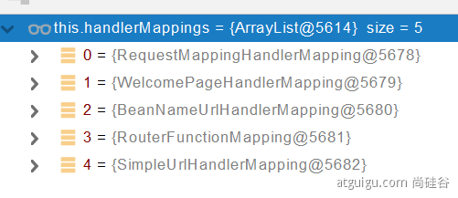
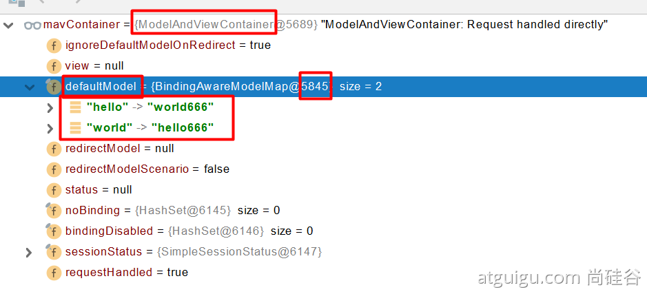
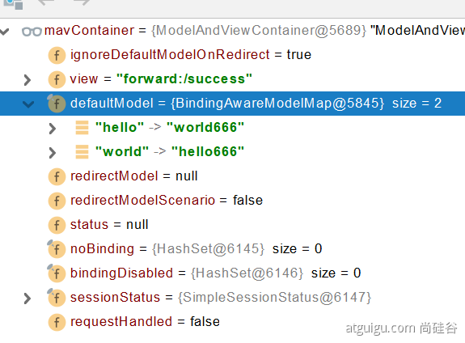
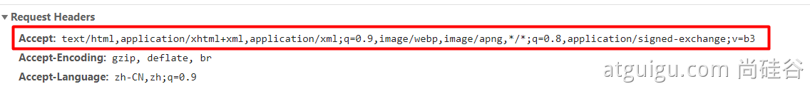

# 05、 Web開發
  - ## 1、 SpringMVC 自動配置概覽
    [Features](https://docs.spring.io/spring-boot/docs/2.7.10/reference/html/features.html#features)

    `Spring Boot` 為 `Spring MVC` 提供自動配置，適用於大多數應用程序。( **大多數場景我們都不需要自定義配置** )

    自動配置在 Spring 的默認值之上添加了以下功能：
      - `內容協商視圖解析器 (ContentNegotiatingViewResolver)` 和 `BeanName (BeanNameViewResolver beans) 視圖解析器`
      - 支持提供靜態資源，包括對 `WebJars` 的支持。
      - 自動註冊 `Converter`、`GenericConverter`、`Formatter`。
      - 支持 `HttpMessageConverters`（以後我們配搭內容協議解析原理）。
      - 自動註冊 `MessageCodesResolver` （國際化用)。
      - 支持 靜態 index.html 頁面
      - 支持 自定義 Favicon 圖標
      - 自動使用 ConfigurableWebBindingInitializer ，（ DataBinder 負責將請求數據綁定到 JavaBean 上 ）

    > 如果您想保留那些 Spring Boot MVC 自定義並進行更多 MVC 自定義（攔截器、格式化程序、視圖控制器和其他功能），您可以添加自己的 WebMvcConfigurer 類型的 @Configuration 類，但不添加 @EnableWebMvc。
    不使用 @EnableWebMvc 註解。使用 @Configuration + WebMvcConfigurer 自定義規則。

    > 如果您想提供 RequestMappingHandlerMapping、RequestMappingHandlerAdapter 或 ExceptionHandlerExceptionResolver 的自定義實例，並且仍然保留 Spring Boot MVC 自定義，您可以聲明一個 WebMvcRegistrations 類型的 bean 並使用它來提供這些組件的自定義實例。
    聲明 WebMvcRegistrations 修改默認認知層組件

    > 如果你想完全控制 Spring MVC，你可以添加你自己的帶有 @EnableWebMvc 註釋的@Configuration，或者添加你自己的帶有 @Configuration 註釋的DelegatingWebMvcConfiguration，如 @EnableWebMvc 的Javadoc 中所述。
    使用 @EnableWebMvc + @Configuration + DelegatingWebMvcConfiguration 全面接管SpringMVC

  - ## 2、 簡單功能分析
    - (mac) 開啟 Spring Initializr 方式：
      - 新增 plugins：
        Preferences > Plugins，搜尋 Spring Boot Helper，安裝完後重新啟動。
      - 新增專案
        File > New > Project，選擇 Spring Initializr
    - ### 2.1、 [靜態資源訪問](https://docs.spring.io/spring-boot/docs/2.5.14/reference/html/features.html#features.developing-web-applications.spring-mvc.static-content)
      - #### 1、 靜態資源目錄
        只需要靜態資源放類路徑下：
          `resources/static`
          (
            or `resources/public `
            or `resources/resources`
            or `resources/META-INF/resources`
          )
        訪問：當前項目根路徑/ + 靜態資源名稱，如：`localhost:8080/zhifubao.png`。

        原理：靜態投影 `/**`。
        請求進來，
        會先去找到 `Controller` 看能不能處理 (是否有設定 controller)。
        不能處理的所有請求又都交給靜態資源處理器。
        靜態資源也找不到則響應404頁。

        修改默認的靜態資源路徑
        ```yaml
        spring:
          mvc:
            static-path-pattern: /res/**      # 訪問路徑需要增加的攔截器路徑

          resources:
            static-locations: [classpath:/haha/]      # 默認查找的資料夾路徑，可放多筆路徑
        ```

      - #### 2、 靜態資源訪問前綴
        默認無前綴
        ```yaml
        spring:
          mvc:
            static-path-pattern: /res/**
        ```
        當前項目 + `static-path-pattern` + 靜態資源名稱 = 靜態資源文件夾下找

      - #### 3、 webjar
        導入後，會自動映射 `/webjars/**`
        https://www.webjars.org/

        ```xml
        <dependency>
          <groupId>org.webjars</groupId>
          <artifactId>jquery</artifactId>
          <version>3.5.1</version>
        </dependency>
        ```

        訪問地址：
        `http://localhost:8080/webjars/jquery/3.5.1/jquery.js` 後面地址要按照依賴裡面的路徑

    - ### 2.2、 [歡迎頁支持](https://docs.spring.io/spring-boot/docs/2.5.14/reference/html/features.html#features.developing-web-applications.spring-mvc.welcome-page)
      - #### 靜態資源路徑下 index.html
        - 可以配置 靜態資源路徑 (static-locations)
        - 但是不能配置 靜態資源的訪問前綴 (static-path-pattern)。
          否則會導向 `index.html` 不能被默認訪問

        ```yaml
        spring:
        #  mvc:
        #    static-path-pattern: /res/**   # 這個會導致 歡迎頁面 功能失效

          resources:
            static-locations: [classpath:/haha/]
        ```
      - ###### controller 能處理 /index

    - ### 2.3、 自定義 Favicon
      `favicon.ico` 放在靜態資源目錄下即可。
      
      ```YAML
      spring:
      #  mvc:
      #    static-path-pattern: /res/**   # 這個會導致Favicon 功能失效
      ```

    - ### 2.4、 靜態資源配置原理
      - SpringBoot 啟動默認加載 `xxxAutoConfiguration` 類（自動配置類）
      - SpringMVC 功能的自動配置類： `WebMvcAutoConfiguration` 查看是否生效

        ```java
        // WebMvcAutoConfiguration.java

        @Configuration(proxyBeanMethods = false)
        @ConditionalOnWebApplication(type = Type.SERVLET)
        @ConditionalOnClass({ Servlet.class, DispatcherServlet.class, WebMvcConfigurer.class })
        @ConditionalOnMissingBean(WebMvcConfigurationSupport.class)
        @AutoConfigureOrder(Ordered.HIGHEST_PRECEDENCE + 10)
        @AutoConfigureAfter({ DispatcherServletAutoConfiguration.class, TaskExecutionAutoConfiguration.class,
            ValidationAutoConfiguration.class })
        public class WebMvcAutoConfiguration {}
        ```

      - 給容器中配了什麼。
        ```java
        @Configuration(proxyBeanMethods = false)
        @Import(EnableWebMvcConfiguration.class)
        @EnableConfigurationProperties({ WebMvcProperties.class, ResourceProperties.class })
        @Order(0)
        public static class WebMvcAutoConfigurationAdapter implements WebMvcConfigurer {}
        ```

      - 配置文件的相關屬性 和 xxx 進行了綁定。
        `WebMvcProperties == spring.mvc`、
        `ResourceProperties == spring.resources`

      - #### 1、 配置類只有一個有參構造器
        ```java
        // 有參構造器所有參數的值，都會從容器中確定
        // ResourceProperties resourceProperties：獲取和 spring.resources 綁定的所有的值的對象
        // WebMvcProperties mvcProperties：獲取和 spring.mvc 綁定的所有的值的對象
        // ListableBeanFactory beanFactory：Spring 的 beanFactory
        // HttpMessageConverters：找到所有的 HttpMessageConverters
        // ResourceHandlerRegistrationCustomizer 找到資源處理器的自定義工具。=========
        // DispatcherServlet：路徑
        // ServletRegistrationBean：給應用程序註冊 Servlet、Filter....

          public WebMvcAutoConfigurationAdapter(
            ResourceProperties resourceProperties,
            WebMvcProperties mvcProperties,
            ListableBeanFactory beanFactory,
            ObjectProvider<HttpMessageConverters> messageConvertersProvider,
            ObjectProvider<ResourceHandlerRegistrationCustomizer> resourceHandlerRegistrationCustomizerProvider,
            ObjectProvider<DispatcherServletPath> dispatcherServletPath,
            ObjectProvider<ServletRegistrationBean<?>> servletRegistrations) {
              this.resourceProperties = resourceProperties;
              this.mvcProperties = mvcProperties;
              this.beanFactory = beanFactory;
              this.messageConvertersProvider = messageConvertersProvider;
              this.resourceHandlerRegistrationCustomizer = resourceHandlerRegistrationCustomizerProvider.getIfAvailable();
              this.dispatcherServletPath = dispatcherServletPath;
              this.servletRegistrations = servletRegistrations;
            }
        ```
      
      - #### 2、 資源處理的默認規則
        ```java
        @Override
        public void addResourceHandlers(ResourceHandlerRegistry registry) {
          if (!this.resourceProperties.isAddMappings()) {
            logger.debug("Default resource handling disabled");
            return;
          }
          Duration cachePeriod = this.resourceProperties.getCache().getPeriod();
          CacheControl cacheControl = this.resourceProperties.getCache().getCachecontrol().toHttpCacheControl();

          // webjars 的規則
          if (!registry.hasMappingForPattern("/webjars/**")) {
            customizeResourceHandlerRegistration(registry.addResourceHandler("/webjars/**")
                .addResourceLocations("classpath:/META-INF/resources/webjars/")
                .setCachePeriod(getSeconds(cachePeriod)).setCacheControl(cacheControl));
          }

          String staticPathPattern = this.mvcProperties.getStaticPathPattern();
          if (!registry.hasMappingForPattern(staticPathPattern)) {
            customizeResourceHandlerRegistration(registry.addResourceHandler(staticPathPattern)
                .addResourceLocations(getResourceLocations(this.resourceProperties.getStaticLocations()))
                .setCachePeriod(getSeconds(cachePeriod)).setCacheControl(cacheControl));
          }
        }
        ```

        ```YAML
        # application.yaml
        
        spring:
        #  mvc:
        #    static-path-pattern: /res/**

          resources:
            add-mappings: false   # false：禁用所有靜態資源規則
        ```

        `staticPathPattern` 默認的 4 個 位置
        ```java
        @ConfigurationProperties(prefix = "spring.resources", ignoreUnknownFields = false)
        public class ResourceProperties {

          private static final String[] CLASSPATH_RESOURCE_LOCATIONS = { "classpath:/META-INF/resources/",
              "classpath:/resources/", "classpath:/static/", "classpath:/public/" };

          /**
          * Locations of static resources. Defaults to classpath:[/META-INF/resources/,
          * /resources/, /static/, /public/].
          */
          private String[] staticLocations = CLASSPATH_RESOURCE_LOCATIONS;
        ```

      - #### 3、 歡迎頁的處理規則
        ```java
        	// HandlerMapping：處理器鏡像。保存了每個Handler能處理哪些請求

          @Bean
            public WelcomePageHandlerMapping welcomePageHandlerMapping(ApplicationContext applicationContext,
                FormattingConversionService mvcConversionService, ResourceUrlProvider mvcResourceUrlProvider) {
              WelcomePageHandlerMapping welcomePageHandlerMapping = new WelcomePageHandlerMapping(
                  new TemplateAvailabilityProviders(applicationContext), applicationContext, getWelcomePage(),
                  this.mvcProperties.getStaticPathPattern());
              welcomePageHandlerMapping.setInterceptors(getInterceptors(mvcConversionService, mvcResourceUrlProvider));
              welcomePageHandlerMapping.setCorsConfigurations(getCorsConfigurations());
              return welcomePageHandlerMapping;
            }

          WelcomePageHandlerMapping(TemplateAvailabilityProviders templateAvailabilityProviders,
              ApplicationContext applicationContext, Optional<Resource> welcomePage, String staticPathPattern) {
            if (welcomePage.isPresent() && "/**".equals(staticPathPattern)) {
              // 要用歡迎頁面功能，必須是 `/**`
              logger.info("Adding welcome page: " + welcomePage.get());
              setRootViewName("forward:index.html");
            }
            else if (welcomeTemplateExists(templateAvailabilityProviders, applicationContext)) {
              // 調用Controller  /index
              logger.info("Adding welcome page template: index");
              setRootViewName("index");
            }
          }
        ```

      - #### 4、 favicon
        `/favicon`，是瀏覽器的默認行為。與 Spring 較無關係。

  - ## 3、 請求參數處理
    - ### 0、 請求映射
      在 Controller 設定一個 `@RestController`，
      在` @RequestMapping('/...')` 底下聲明請求回應。
      
      - #### 1、 rest 使用與原理
        - `@xxxMapping`；
        - Rest 風格支持 ( 使用 HTTP請求方式 動詞 來表示對資源的操作 )
          - 以前： `/getUser 獲取用戶`、`/deleteUser 刪除用戶`、`/editUser 修改用戶`、`/saveUser 保存用戶`
          - 現在： `/user`，`GET-獲取用戶`、`DELETE-刪除用戶`、`PUT-修改用戶`、`POST-保存用戶`
          - 核心過濾器：`HiddenHttpMethodFilter`
            - 使用方法：表單 `method = post`，隱藏域_method = put (`name="_method" type="hidden" value="PUT"`)
              ```html
                <form action="/user" method="get">
                  <input value="REST-GET 提交" type="submit" />
                </form>
                <form action="/user" method="post">
                  <input value="REST-POST 提交" type="submit" />
                </form>
                <form action="/user" method="post">
                  <input name="_method" type="hidden" value="DELETE" />
                  <input value="REST-DELETE 提交" type="submit" />
                </form>
                <form action="/user" method="post">
                  <input name="_method" type="hidden" value="PUT" />
                  <input value="REST-PUT 提交" type="submit" />
                </form>
              ```

              ```java
              @RequestMapping(value = "/user",method = RequestMethod.GET)
              // 等同於 GetMapping("/user")
              public String getUser(){
                  return "GET-張三";
              }

              @RequestMapping(value = "/user",method = RequestMethod.POST)
              // 等同於 PostMapping("/user")
              public String saveUser(){
                  return "POST-張三";
              }


              @RequestMapping(value = "/user",method = RequestMethod.PUT)
              // 等同於 PutMapping("/user")
              public String putUser(){
                  return "PUT-張三";
              }

              @RequestMapping(value = "/user",method = RequestMethod.DELETE)
              // 等同於 DeleteMapping("/user")
              public String deleteUser(){
                  return "DELETE-張三";
              }

              @Bean
              @ConditionalOnMissingBean(HiddenHttpMethodFilter.class)
              @ConditionalOnProperty(prefix = "spring.mvc.hiddenmethod.filter", name = "enabled", matchIfMissing = false)
              public OrderedHiddenHttpMethodFilter hiddenHttpMethodFilter() {
                return new OrderedHiddenHttpMethodFilter();
              }
              ```
            
            - `SpringBoot` 中手動啟動 `hiddenmethod.filter.enabled` (預設為 false)
              ```yaml
              mvc:
                hiddenmethod:
                  filter:
                    enabled: true
              ```
          - 擴展：如何把 `_method` 這個名字替換成我們自己喜歡的。
            ```java
            // 自定義 filter (新增一個 class，將 HiddenHttpMethodFilter 屬性變更)
            @Bean
            public HiddenHttpMethodFilter hiddenHttpMethodFilter(){
                HiddenHttpMethodFilter methodFilter = new HiddenHttpMethodFilter();
                methodFilter.setMethodParam("_m");
                return methodFilter;
            }
            ```

        Rest原理（表單提交要使用 REST 的時候）
        - 表單提交會帶上 _method = PUT (`name="_method" value="PUT"`)
        - 請求過來，先被 `HiddenHttpMethodFilter` 攔截
          - 判斷請求是否正常，並且是 `POST`
            - 獲取到 `_method` 的值。
            - 兼容以下請求：`PUT`、`DELETE`、`PATCH`
            - 原始 `request（post）`，包裝模式 `requesWrapper` 重寫了 `getMethod` 方法，返回的是傳入的值。
            - 過濾器鏈接放行的時候使用 `wrapper`。以後的方法調用 `getMethod` 是調用 `requesWrapper` 的。

        Rest 使用客戶端工具，
          - 如 `PostMan` 直接發送 `Put`、`delete` 等方式請求，無需 `Filter`。

        ```YAML
        spring:
          mvc:
            hiddenmethod:
              filter:
                enabled: true     # 啟動頁面表單的 Rest功能
        ```

      - ###### 2、 請求映射原理
        

        SpringMVC 功能分析都從 org.springframework.web.servlet.DispatcherServlet-》doDispatch（）

        ```java
        protected void doDispatch(HttpServletRequest request, HttpServletResponse response) throws Exception {
        HttpServletRequest processedRequest = request;
        HandlerExecutionChain mappedHandler = null;
        boolean multipartRequestParsed = false;

        WebAsyncManager asyncManager = WebAsyncUtils.getAsyncManager(request);

        try {
          ModelAndView mv = null;
          Exception dispatchException = null;

          try {
            processedRequest = checkMultipart(request);
            multipartRequestParsed = (processedRequest != request);

            // 找到當前請求使用哪個 Handler（Controller的方法）處理
            mappedHandler = getHandler(processedRequest);
            
            // HandlerMapping：處理器映射。/xxx ->> xxxx
        ```

        默認有 5 個 `HandlerMapping`：
          

        `RequestMappingHandlerMapping`：保存了所有 `@RequestMapping` 和 `handler` 的映射規則。

        

        所有的請求映射都在 `HandlerMapping` 中。

        - `SpringBoot` 自動配置歡迎頁面的 `WelcomePageHandlerMapping`。訪問/能訪問到 index.html；
        - SpringBoot 自動配置了默認的 `RequestMappingHandlerMapping`
        - 請求進來，試試所有的 `HandlerMapping` 看是否有請申請信息。
          - 如果有就找到這個請求 對應的 `handler`
          - 如果沒有就是下一個 `HandlerMapping`
        - 我們需要一些自定義的映射處理，我們也可以自己給容器中放 `HandlerMapping`。
        自定義 `HandlerMapping`

        ```java
        	protected HandlerExecutionChain getHandler(HttpServletRequest request) throws Exception {
            if (this.handlerMappings != null) {
              for (HandlerMapping mapping : this.handlerMappings) {
                HandlerExecutionChain handler = mapping.getHandler(request);
                if (handler != null) {
                  return handler;
                }
              }
            }
            return null;
          }
        ```

    - ### 1、 普通參數與基礎註解
      - ###### 1.1、 註解
        `@PathVariable` (路徑變數)、
        `@RequestHeader` (獲取請求頭)、
        `@RequestParam` (獲取請求參數)、
        `@CookieValue` (獲取 cookie 值)、
        `@RequestBody` (獲取 請求體 [Post])
        `@RequestAttribute` (獲取 request 域屬性)、
        `@MatrixVariable` (矩陣變數)、

        ```java
        @RestController
        public class ParameterTestController {
          // 如： car/2/owner/zhangsan
          @GetMapping("/car/{id}/owner/{username}")
          public Map<String,Object> getCar(
            // ---------- 獲取路徑變數 ---------- //
              @PathVariable("id") Integer id,
                // {id: 2}
              @PathVariable("username") String name,
                // {name: zhangsan}
              @PathVariable Map<String,String> pv,
                // {pv: {id: 2, username: zhangsan}}

            // ---------- 獲取請求頭 ---------- //
              @RequestHeader("User-Agent") String userAgent,
                // 只提取 User-Agent 資訊
              @RequestHeader Map<String,String> header,
                // 提取 所有 Header 資訊


            // ---------- 獲取請求參數 ---------- //
              // 如：car/2/owner/zhangsan?age=18&inters=basketball
              @RequestParam("age") Integer age,
              @RequestParam("inters") List<String> inters,
              @RequestParam Map<String,String> params,

            // ---------- 獲取 cookie 值 ---------- //
              @CookieValue("_ga") String _ga,
              @CookieValue("_ga") Cookie cookie
          ){
            Map<String,Object> map = new HashMap<>();

        //        map.put("id",id);
        //        map.put("name",name);
        //        map.put("pv",pv);
        //        map.put("userAgent",userAgent);
        //        map.put("headers",header);
            map.put("age",age);
            map.put("inters",inters);
            map.put("params",params);
            map.put("_ga",_ga);
            System.out.println(cookie.getName()+"===>"+cookie.getValue());
            return map;
          }

          // ---------- 獲取 Request Body ---------- //
          @PostMapping("/save")
          public Map postMethod(@RequestBody String content){
            Map<String,Object> map = new HashMap<>();
            map.put("content",content);
            return map;
          }
        }
        ```

        - `@RequestAttribute`
        ```java
        // controller/RequestController

        import org.springframework.web.bind.annotation.RequestAttribute;
        import org.springframework.web.bind.annotation.ResponseBody;

        import javax.servlet.http.HttpServletRequest;

        @Controller
        public class RequestController {

          @GetMapping("/goto")
          public String goToPage(HttpServletRequest request) {
            request.setAttribute("msg", "成功了...");
            request.setAttribute("code", 200);

            return "forward:/success";    // 轉發到 /success 請求
          }

          @ResponseBody
          @GetMapping("/success")
          public Map success(
            @RequestAttribute("msg") String msg,
            @RequestAttribute("code") Integer code,
            HttpServletRequest request
          ) {
            Object msg1 = request.getAttribute("msg");

            Map<String, Object> map = new HashMap<>();

            map.put("reqMethod_msg", msg1);
            map.put("annotation_msg", msg);
            return map;
          }
        }
        ```

        - `MatrixVariable` 矩陣變數
          - 「 /cars/{path}?xxx=xx&aaa=aa 」：稱為 `queryString` 查詢字符串，使用 `@RequestParam` 來獲取。
          - 「 /cars/{path;low=34;brand=byd,audi,yd} 」：稱為 `矩陣變數`。
            - 頁面開發時，若 `cookie` 被禁用了，要怎麼獲取 session 裡面的內容？
              - 使用 session.set(a, b) 時，每個 session 都有個 jsessionid，會被保存在 cookie 中，而 cookie 會在每次發請求時攜帶。
              - 當 cookie 無法攜帶 jsessionid 時，可以使用 矩陣變數 方式來攜帶。
              - 如：/abc;jsessionid=xxx，稱為 `url 重寫`。
              - 把 cookie 的值，使用矩陣變數的方式進行傳遞。

          ```java
          // ---------- 獲取 矩陣變數 ---------- //
          // 矩陣變數需要在 SpringBoot 中手動開啟
          // 根據 RFC3986 的規範，矩陣變數應當綁定在路徑變數中！
          // 若是有多個矩陣變數，應當使用英文符號;進行分隔。
          // 若是一個矩陣變數有多個值，應當使用英文符號,進行分隔，或之命名多個重複的key 即可。
          // 如： /cars/sell;low=34;brand=byd,audi,yd

          // 1、語法： 請求路徑：/cars/sell;low=34;brand=byd,audi,yd
          // 2、SpringBoot 默認禁用了矩陣變數的功能 
          //      手動開啟：原理。對於路徑的處理。UrlPathHelper 進行解析。
          //              removeSemicolonContent（移去分號內容）支持矩陣變數的
          // 3、矩陣變數必須有 url路徑變數 才能被解析
          
          @GetMapping("/cars/{path}")
          public Map carsSell(@MatrixVariable("low") Integer low,
                              @MatrixVariable("brand") List<String> brand,
                              @PathVariable("path") String path){
              Map<String,Object> map = new HashMap<>();

              map.put("low",low);
              map.put("brand",brand);
              map.put("path",path);
              return map;
          }

          // /boss/1;age=20/2;age=10
          // 可使用 pathVar 來設定 要取得哪個路徑下的值
          // 沒區分的情況下，age 只會取到 第一個值 20
          // 分號左邊是訪問路徑，分後右邊是矩陣變數
          @GetMapping("/boss/{bossId}/{empId}")
          public Map boss(
            @MatrixVariable(value = "age",pathVar = "bossId") Integer bossAge,
            @MatrixVariable(value = "age",pathVar = "empId") Integer empAge
          ){
            Map<String,Object> map = new HashMap<>();
            map.put("bossAge",bossAge);
            map.put("empAge",empAge);
            return map;
          }
          ```

          開啟 矩陣變數 功能方式：
          ```java
          // ----- 方法一 ----- //
          // 1. 讓 WebConfig implements(實現) WebMvcConfigurer
          // 2. 複寫 configurePathMatch
          // 3. new UrlPathHelper，並設定屬性 setRemoveSemicolonContent 為 false
          // 4. 將設定餵給 configurer

          // config/ WebConfig
          package com.atguigu.boot.config;

          import org.springframework.context.annotation.Bean;
          import org.springframework.context.annotation.Configuration;
          import org.springframework.web.filter.HiddenHttpMethodFilter;
          import org.springframework.web.servlet.config.annotation.PathMatchConfigurer;
          import org.springframework.web.servlet.config.annotation.WebMvcConfigurer;
          import org.springframework.web.util.UrlPathHelper;

          @Configuration(proxyBeanMethods = false)
          public class WebConfig implements WebMvcConfigurer {
            @Bean
            public HiddenHttpMethodFilter hiddenHttpMethodFilter(){
              HiddenHttpMethodFilter methodFilter = new HiddenHttpMethodFilter();
              methodFilter.setMethodParam("_m");
              return methodFilter;
            }

            // 方法一
            @Override
            public void configurePathMatch(PathMatchConfigurer configurer) {
              UrlPathHelper urlPathHelper = new UrlPathHelper();
              // 默認會將分號後面的內容移除，需要將這個關掉，矩陣變數功能才能正常運作
              urlPathHelper.setRemoveSemicolonContent(false); 
              configurer.setUrlPathHelper(urlPathHelper)
            }

            // 方法二
            @Bean
            public WebMvcConfigurer webMvcConfigurer(){
              return new WebMvcConfigurer() {
                @Override
                public void configurePathMatch(PathMatchConfigurer configurer) {
                  UrlPathHelper urlPathHelper = new UrlPathHelper();
                  urlPathHelper.setRemoveSemicolonContent(false); 
                  configurer.setUrlPathHelper(urlPathHelper)
                }
              }
            }
            }
          ```

      - ###### 1.2、 Servlet API：
        `WebRequest`、
        `ServletRequest`、
        `MultipartRequest`、
        `HttpSession`、
        `javax.servlet.http.PushBuilder`、
        `Principal`、
        `InputStream`、
        `Reader`、
        `HttpMethod`、
        `Locale`、
        `TimeZone`、
        `ZoneId`

        ServletRequestMethodArgumentResolver  以上的部分參數

        ```java
        @Override
        public boolean supportsParameter(MethodParameter parameter) {
          Class<?> paramType = parameter.getParameterType();
          return (
            WebRequest.class.isAssignableFrom(paramType) ||
            ServletRequest.class.isAssignableFrom(paramType) ||
            MultipartRequest.class.isAssignableFrom(paramType) ||
            HttpSession.class.isAssignableFrom(paramType) ||
            (pushBuilder != null && pushBuilder.isAssignableFrom(paramType)) ||
            Principal.class.isAssignableFrom(paramType) ||
            InputStream.class.isAssignableFrom(paramType) ||
            Reader.class.isAssignableFrom(paramType) ||
            HttpMethod.class == paramType ||
            Locale.class == paramType ||
            TimeZone.class == paramType ||
            ZoneId.class == paramType
          );
        }
        ```

      - ###### 1.3、複雜參數：
        `Map`、`Model`（map、model 裡面的數據會被放在 request 的請求域  request.setAttribute）、
        `Errors/BindingResult`、
        `RedirectAttributes`（ 重定向攜帶數據 ）、
        `ServletResponse`（response）、
        `SessionStatus`、
        `UriComponentsBuilder`、
        `ServletUriComponentsBuilder`

        ```java
        Map<String,Object> map,
        Model model,
        HttpServletRequest request
        // 都是可以給 request 域中 放數據，
        request.getAttribute();
        ```
        
        `Map`、`Model` 類型的參數，會返回 `mavContainer.getModel（）`；
        ---> `BindingAwareModelMap` 是 `Model` 也是 `Map`
        `mavContainer.getModel()`; 獲得到值的

        
        
        

      - ###### 1.4、 自定義對象參數：
        可以自動類型轉換與格式化，可以級聯封裝。

        ```java
        /**
        *     姓名： <input name="userName"/> <br/>
        *     年齡： <input name="age"/> <br/>
        *     生日： <input name="birth"/> <br/>
        *     寵物姓名：<input name="pet.name"/><br/>
        *     寵物年齡：<input name="pet.age"/>
        */
        @Data
        public class Person {
          private String userName;
          private Integer age;
          private Date birth;
          private Pet pet;
        }

        @Data
        public class Pet {
          private String name;
          private String age;
        }
        ```

    - ### 2、 POJO 封裝過程 (自定義對象參數 封裝過程)
      - ###### ServletModelAttributeMethodProcessor

    - ### 3、 參數處理原理
      - `HandlerMapping` 中找到能處理請求的 `Handler(Controller.method())`
      - 為當前 `Handler` 找一個適配器 `HandlerAdapter`； `RequestMappingHandlerAdapter`
      - 適配器執行目標方法並確定方法參數的每一個值

      - #### 1、 HandlerAdapter (處理器的適配器)
        

        最常用的兩種：
        0 = {RequestMappingHandlerAdapter} - 支持方法上標註 `@RequestMapping` 
        1 = {HandlerFunctionAdapter} - 支持函數式編程的
        xxxxxx

      - #### 2、 執行目標方法
        ```java
        // Actually invoke the handler.
        // DispatcherServlet -- doDispatch
        mv = ha.handle(processedRequest, response, mappedHandler.getHandler());
        ```

        ```java
        // 執行目標方法
        mav = invokeHandlerMethod(request, response, handlerMethod);

        // ServletInvocableHandlerMethod
        Object returnValue = invokeForRequest(webRequest, mavContainer, providedArgs);
        // 獲取方法的參數值
        Object[] args = getMethodArgumentValues(request, mavContainer, providedArgs);
        ```

      - #### 3、 參數解析器 - HandlerMethodArgumentResolver
        確定將要執行的目標方法的每一個參數的值是什麼;
        `SpringMVC` 目標方法能寫多少種參數類型，取決於參數解析器。

        
        
        
        - 當前解析器 是否支持 解析 這種參數
        - 支持就調用 `resolveArgument`

      - #### 4、 返回值處理器
        

      - #### 5、 如何確定目標方法的每一個參數的值
        ```java
        // ============ InvocableHandlerMethod ============
        protected Object[] getMethodArgumentValues(NativeWebRequest request, @Nullable ModelAndViewContainer mavContainer, Object... providedArgs) throws Exception {
          MethodParameter[] parameters = getMethodParameters();
          if (ObjectUtils.isEmpty(parameters)) {
            return EMPTY_ARGS;
          }

          Object[] args = new Object[parameters.length];
          for (int i = 0; i < parameters.length; i++) {
            MethodParameter parameter = parameters[i];
            parameter.initParameterNameDiscovery(this.parameterNameDiscoverer);
            args[i] = findProvidedArgument(parameter, providedArgs);
            if (args[i] != null) {
              continue;
            }
            if (!this.resolvers.supportsParameter(parameter)) {
              throw new IllegalStateException(formatArgumentError(parameter, "No suitable resolver"));
            }
            try {
              args[i] = this.resolvers.resolveArgument(parameter, mavContainer, request, this.dataBinderFactory);
            }
            catch (Exception ex) {
              // Leave stack trace for later, exception may actually be resolved and handled...
              if (logger.isDebugEnabled()) {
                String exMsg = ex.getMessage();
                if (exMsg != null && !exMsg.contains(parameter.getExecutable().toGenericString())) {
                  logger.debug(formatArgumentError(parameter, exMsg));
                }
              }
              throw ex;
            }
          }
          return args;
        }
        ```

        - ##### 5.1、判斷 所有參數解析器中，哪個支持解析這個參數
          ```java
          @Nullable
          private HandlerMethodArgumentResolver getArgumentResolver(MethodParameter parameter) {
            HandlerMethodArgumentResolver result = this.argumentResolverCache.get(parameter);
            if (result == null) {
              for (HandlerMethodArgumentResolver resolver : this.argumentResolvers) {
                if (resolver.supportsParameter(parameter)) {
                  result = resolver;
                  this.argumentResolverCache.put(parameter, result);
                  break;
                }
              }
            }
            return result;
          }
          ```

        - ##### 5.2、解析這個參數的值
          調用各自 `HandlerMethodArgumentResolver` 的 resolveArgument 方法即可
        
        - ##### 5.3、自定義類型參數 封裝 POJO
          `ServletModelAttributeMethodProcessor` 這個參數處理器支持 是否為 簡單類型。

          ```java
          public static boolean isSimpleValueType(Class<?> type) {
            return (Void.class != type && void.class != type &&
                (ClassUtils.isPrimitiveOrWrapper(type) ||
                Enum.class.isAssignableFrom(type) ||
                CharSequence.class.isAssignableFrom(type) ||
                Number.class.isAssignableFrom(type) ||
                Date.class.isAssignableFrom(type) ||
                Temporal.class.isAssignableFrom(type) ||
                URI.class == type ||
                URL.class == type ||
                Locale.class == type ||
                Class.class == type));
          }
          ```

          ```java
          @Override
          @Nullable
          public final Object resolveArgument(MethodParameter parameter, @Nullable ModelAndViewContainer mavContainer,
              NativeWebRequest webRequest, @Nullable WebDataBinderFactory binderFactory) throws Exception {

            Assert.state(mavContainer != null, "ModelAttributeMethodProcessor requires ModelAndViewContainer");
            Assert.state(binderFactory != null, "ModelAttributeMethodProcessor requires WebDataBinderFactory");

            String name = ModelFactory.getNameForParameter(parameter);
            ModelAttribute ann = parameter.getParameterAnnotation(ModelAttribute.class);
            if (ann != null) {
              mavContainer.setBinding(name, ann.binding());
            }

            Object attribute = null;
            BindingResult bindingResult = null;

            if (mavContainer.containsAttribute(name)) {
              attribute = mavContainer.getModel().get(name);
            }
            else {
              // Create attribute instance
              try {
                attribute = createAttribute(name, parameter, binderFactory, webRequest);
              }
              catch (BindException ex) {
                if (isBindExceptionRequired(parameter)) {
                  // No BindingResult parameter -> fail with BindException
                  throw ex;
                }
                // Otherwise, expose null/empty value and associated BindingResult
                if (parameter.getParameterType() == Optional.class) {
                  attribute = Optional.empty();
                }
                bindingResult = ex.getBindingResult();
              }
            }

            if (bindingResult == null) {
              // Bean property binding and validation;
              // skipped in case of binding failure on construction.
              WebDataBinder binder = binderFactory.createBinder(webRequest, attribute, name);
              if (binder.getTarget() != null) {
                if (!mavContainer.isBindingDisabled(name)) {
                  bindRequestParameters(binder, webRequest);
                }
                validateIfApplicable(binder, parameter);
                if (binder.getBindingResult().hasErrors() && isBindExceptionRequired(binder, parameter)) {
                  throw new BindException(binder.getBindingResult());
                }
              }
              // Value type adaptation, also covering java.util.Optional
              if (!parameter.getParameterType().isInstance(attribute)) {
                attribute = binder.convertIfNecessary(binder.getTarget(), parameter.getParameterType(), parameter);
              }
              bindingResult = binder.getBindingResult();
            }

            // Add resolved attribute and BindingResult at the end of the model
            Map<String, Object> bindingResultModel = bindingResult.getModel();
            mavContainer.removeAttributes(bindingResultModel);
            mavContainer.addAllAttributes(bindingResultModel);

            return attribute;
          }
          ```

          `WebDataBinder binder` = binderFactory.createBinder(webRequest, attribute, name);
          `WebDataBinder`：web數據綁定器，將請求參數的值綁定到指定的 `JavaBean` 裡面
          `WebDataBinder` 利用它裡面的 `Converters` 將請求數據轉成指定的數據類型。再次封裝到 `JavaBean` 中

          `GenericConversionService`：在設置每一個值的時候，找它裡面的所有 `converter` 那個可以將這個數據類型（request帶來參數的字符串）轉換到指定的類型（JavaBean -- Integer）
          如：byte -- > file
          
          ```java
          @FunctionalInterfacepublic interface Converter<S, T>
          ```

          
          

          未來我們可以給 `WebDataBinder` 裡面放自己的 `Converter`；
          ```java
          private static final class StringToNumber<T extends Number> implements Converter<String, T>
          ```

          自定義 Converter
          ```java
          // 1、WebMvcConfigurer定制化SpringMVC的功能
          @Bean
          public WebMvcConfigurer webMvcConfigurer(){
            return new WebMvcConfigurer() {
              @Override
              public void configurePathMatch(PathMatchConfigurer configurer) {
                UrlPathHelper urlPathHelper = new UrlPathHelper();
                // 不移除；後面的內容。矩陣變量功能就可以生效
                urlPathHelper.setRemoveSemicolonContent(false);
                configurer.setUrlPathHelper(urlPathHelper);
              }

              @Override
              public void addFormatters(FormatterRegistry registry) {
                registry.addConverter(new Converter<String, Pet>() {
                  @Override
                  public Pet convert(String source) {
                    // 啊猫,3 (Key, value)
                    if(!StringUtils.isEmpty(source)){
                      Pet pet = new Pet();
                      String[] split = source.split(",");
                      pet.setName(split[0]);
                      pet.setAge(Integer.parseInt(split[1]));
                      return pet;
                    }
                    return null;
                  }
                });
              }
            };
          }
          ```

      - #### 6、 目標方法執行完成
        將所有的數據都放在 ModelAndViewContainer；
        包含要去的頁面地址 View。
        還包含Model數據。

        

      - #### 7、 處理派發結果
        ```java
        processDispatchResult(processedRequest, response, mappedHandler, mv, dispatchException);

        renderMergedOutputModel(mergedModel, getRequestToExpose(request), response);
        ```

        ```java
        // InternalResourceView：
        @Override
          protected void renderMergedOutputModel(
              Map<String, Object> model, HttpServletRequest request, HttpServletResponse response) throws Exception {

            // Expose the model object as request attributes.
            exposeModelAsRequestAttributes(model, request);

            // Expose helpers as request attributes, if any.
            exposeHelpers(request);

            // Determine the path for the request dispatcher.
            String dispatcherPath = prepareForRendering(request, response);

            // Obtain a RequestDispatcher for the target resource (typically a JSP).
            RequestDispatcher rd = getRequestDispatcher(request, dispatcherPath);
            if (rd == null) {
              throw new ServletException("Could not get RequestDispatcher for [" + getUrl() +
                  "]: Check that the corresponding file exists within your web application archive!");
            }

            // If already included or response already committed, perform include, else forward.
            if (useInclude(request, response)) {
              response.setContentType(getContentType());
              if (logger.isDebugEnabled()) {
                logger.debug("Including [" + getUrl() + "]");
              }
              rd.include(request, response);
            }

            else {
              // Note: The forwarded resource is supposed to determine the content type itself.
              if (logger.isDebugEnabled()) {
                logger.debug("Forwarding to [" + getUrl() + "]");
              }
              rd.forward(request, response);
            }
          }
        ```

        ```java
        // 暴露模型作為請求域屬性
        // Expose the model object as request attributes.
          exposeModelAsRequestAttributes(model, request);
        ```

        ```java
          protected void exposeModelAsRequestAttributes(Map<String, Object> model,
            HttpServletRequest request) throws Exception {

          // model中的所有數據 遍歷 挨個放在請求域中
          model.forEach((name, value) -> {
            if (value != null) {
              request.setAttribute(name, value);
            }
            else {
              request.removeAttribute(name);
            }
          });
        }
        ```

  - ## 4、 數據響應與內容協商
    - ### 1、 響應JSON
      - #### 1.1、 jackson.jar + @ResponseBody
        - 想讓 SpringBoot MVC 能快速返回一個 JSON 數據，必須在 pom.xml 裡面引入 spring-boot-starter-web
          ```xml
          <!-- pom.xml -->
          <dependency>
            <groupId>org.springframework.boot</groupId>
            <artifactId>spring-boot-starter-web</artifactId>
          </dependency>
          ```

          ```xml
          <!-- spring-boot-starter-web -->
          <!-- web場景自動引入了json場景 -->
          <dependency>
            <groupId>org.springframework.boot</groupId>
            <artifactId>spring-boot-starter-json</artifactId>
            <version>2.3.4.RELEASE</version>
            <scope>compile</scope>
          </dependency>
          ```

        

        給前端自動返回json數據；

        - ##### 1、 返回值解析器
          

          利用返回值處理器處理返回
          ```java
          try {
            this.returnValueHandlers.handleReturnValue(
              returnValue, getReturnValueType(returnValue), mavContainer, webRequest
            );
          }
          ```

          尋找有哪個返回值處理器，能夠處理返回。
          ```java
          	@Override
            public void handleReturnValue(@Nullable Object returnValue, MethodParameter returnType, ModelAndViewContainer mavContainer, NativeWebRequest webRequest) throws Exception {

              HandlerMethodReturnValueHandler handler = selectHandler(returnValue, returnType);
              if (handler == null) {
                throw new IllegalArgumentException("Unknown return value type: " + returnType.getParameterType().getName());
              }
              handler.handleReturnValue(returnValue, returnType, mavContainer, webRequest);
            }
          ```

          ```java
          RequestResponseBodyMethodProcessor  	
          @Override
            public void handleReturnValue(@Nullable Object returnValue, MethodParameter returnType, ModelAndViewContainer mavContainer, NativeWebRequest webRequest) throws IOException, HttpMediaTypeNotAcceptableException, HttpMessageNotWritableException {

              mavContainer.setRequestHandled(true);
              ServletServerHttpRequest inputMessage = createInputMessage(webRequest);
              ServletServerHttpResponse outputMessage = createOutputMessage(webRequest);

              // Try even with null return value. ResponseBodyAdvice could get involved.
              // 使用消息轉換器進行寫出操作
              writeWithMessageConverters(returnValue, returnType, inputMessage, outputMessage);
            }
          ```

        - ##### 2、 返回值解析器原理
          

          - 1、返回值處理器判斷是否支持這種類型返回值 `supportsReturnType`。
          - 2、返回值處理器調用 `handleReturnValue` 進行處理
          - 3、`RequestResponseBodyMethodProcessor` 可以處理返回值標了 `@ResponseBody` 註解的。
            - 1、利用 `MessageConverters` 進行處理 將數據寫為json
              - 1、內容協商（瀏覽器默認會以請求頭的方式告訴服務器他能接受什麼樣的內容類型）
                
              - 2、服務器最終根據自己自身的能力，決定服務器能生產出什麼樣內容類型的數據，
              - 3、SpringMVC 會挨個遍歷所有容器底層的 `HttpMessageConverter` ，看誰能處理？
                - 1、得到 `MappingJackson2HttpMessageConverter` 可以將對象寫為json
                - 2、利用 `MappingJackson2HttpMessageConverter` 將對象轉為json再寫出去。

      - #### 1.2、 SpringMVC 到底支持哪些返回值
        - `ModelAndView`
        - `Model`
        - `View`
        - `ResponseEntity` 
        - `ResponseBodyEmitter`
        - `StreamingResponseBody`
        - `HttpEntity`
        - `HttpHeaders`
        - `Callable`
        - `DeferredResult`
        - `ListenableFuture`
        - `CompletionStage`
        - `WebAsyncTask`
        
        有 `@ModelAttribute` 且為對像類型的
        返回值 有標註 `@ResponseBody` 註解，
        就使用此處理器 ---> `RequestResponseBodyMethodProcessor`；
        ---> `MessageConverter`

      - #### 1.3、 HTTPMessageConverter 原理
        - ##### 1、 MessageConverter規範
          

          `HttpMessageConverter`: 看是否支持將 此 Class類型的對象，轉為MediaType類型的數據。
          例子：`Person 對象轉為 JSON`。或者 `JSON 轉為 Person`

        - ##### 2、 默認的MessageConverter
          

          - 0 - 只支持 Byte 類型的返回值
          - 1 - String
          - 2 - String
          - 3 - Resource
          - 4 - ResourceRegion
          - 5 - DOMSource.class \ SAXSource.class) \ StAXSource.class \ StreamSource.class \Source.class
          - 6 - MultiValueMap
          - 7 - true (會將任何資料返回)
          - 8 - true
          - 9 - 支持註解方式 xml 處理的。

          最終 `MappingJackson2HttpMessageConverter` 把對象轉為 JSON
          （利用底層的 jackson 的 objectMapper 轉換的）

          

    - ### 2、 內容協商
      根據客戶端接收能力不同，返回不同媒體類型的數據。

      - #### 1、 引入xml依賴
        ```xml
        <dependency>
          <groupId>com.fasterxml.jackson.dataformat</groupId>
          <artifactId>jackson-dataformat-xml</artifactId>
        </dependency>
        ```

      - #### 2、 postman分別測試返回 json 和 xml
        只需要改變請求頭中Accept字段。 Http協議中規定的，告訴服務器本客戶端可以接收的數據類型。
        
        

      - #### 3、 開啟瀏覽器參數方式內容協商功能
        為了方便內容協商，開啟基於請求參數的內容協商功能。

        ```YAML
        # application.yaml
        spring:
          contentnegotiation:
            favor-parameter: true  # 開啟請求參數內容協商模式
        ```

        在發送請求時，帶上 `format` 參數

        發請求：
          - http://localhost:8080/test/person?format=json
          - http://localhost:8080/test/person?format=xml

        

        確定客戶端接收什麼樣的內容類型：
          - 1、Parameter 策略 優先確定是要返回 json 數據（獲取請求頭中的 format 的值）
          

          - 2、最終進行內容協商返回給客戶端 json 即可。

      - #### 4、 內容協商原理
        - 1、 判斷當前響應頭中是否已經有確定的媒體類型。 `MediaType` (是否有自定義)
        - 2、 獲取客戶端（如：PostMan、瀏覽器）支持接收的內容類型。 （獲取客戶端 `Accept` 請求頭字段）【 如：application/xml】
          - `contentNegotiationManager` 內容協商管理器 默認使用基於請求頭的策略
          
          - `HeaderContentNegotiationStrategy` 確定客戶端可以接收的內容類型 
          

        - 3、遍歷循環所有當前系統的 `MessageConverter`，看誰支持操作這個對象（Person）
        - 4、找到支持操作 Person 的 converter，把 `converter` 支持的媒體類型統計出來。
        - 5、客戶端需要【application/xml】。服務端能力【10種、json、xml】
          

        - 6、進行內容協商的 最佳匹配 媒體類型
        - 7、用 能支持 將對象轉為 最佳匹配媒體類型 的 `converter`。調用它進行轉化。
          

          導入了 jackson 處理 xml 的包，xml 的 converter 就會自動進來

          ```java
          WebMvcConfigurationSupport
          jackson2XmlPresent = ClassUtils.isPresent("com.fasterxml.jackson.dataformat.xml.XmlMapper", classLoader);

          if (jackson2XmlPresent) {
            Jackson2ObjectMapperBuilder builder = Jackson2ObjectMapperBuilder.xml();
            if (this.applicationContext != null) {
              builder.applicationContext(this.applicationContext);
            }
            messageConverters.add(new MappingJackson2XmlHttpMessageConverter(builder.build()));
          }
          ```

      - #### 5、 自定義 MessageConverter
        實現多協議數據兼容。 json、xml、x-guigu
        - 0、`@ResponseBody` 響應數據出去 調用 `RequestResponseBodyMethodProcessor` 處理
        - 1、Processor 處理方法返回值。通過 `MessageConverter` 處理
        - 2、所有 `MessageConverter` 合起來可以支持各種媒體類型數據的操作（讀、寫）
        - 3、內容協商找到最終的 `messageConverter；`

        SpringMVC 的什麼功能。一個入口給容器中添加一個 `WebMvcConfigurer`

        ```java
          @Bean
        public WebMvcConfigurer webMvcConfigurer(){
          return new WebMvcConfigurer() {
            @Override
            public void extendMessageConverters(List<HttpMessageConverter<?>> converters) {

            }
          }
        }
        ```

        

        自定義 application/x-guigu
        

        有可能我們添加的自定義的功能會覆蓋 默認很多功能，導致一些默認的 請求頭 寫法功能 將會失效。
          - 除了自定義參數請求外，請求頭的也要撰寫進去
          
        大家考慮，上述功能除了我們完全自定義外？
        SpringBoot 有沒有為我們提供基於配置文件的快速修改媒體類型功能？
        怎麼配置呢？ 【提示：參照SpringBoot官方文檔web開發內容協商章節】

  - ## 5、 視圖解析與模板引擎
    視圖解析：SpringBoot 默認不支持 JSP，需要引入第三方模板引擎技術實現頁面渲染。
    - ### 1、 視圖解析
      - #### 1、視圖解析原理流程
        - 1、目標方法處理的過程中，所有數據都會被放在 `ModelAndViewContainer` 裡面。包括 數據 和 視圖地址
        - 2、方法的參數是一個自定義類型對象（從請求參數中確定的），把他重新放在 `ModelAndViewContainer `
        - 3、任何目標方法執行完成以後都會返回 `ModelAndView（數據 和 視圖地址）。`
        - 4、`processDispatchResult` 處理派發結果（決定頁面改如何響應）
          - 1、`render(mv, request, response);` 進行頁面渲染邏輯
            - 1、根據方法的 `String` 返回值得到 `View 對象`【 定義了頁面的渲染邏輯 】
              - 1、所有的 `視圖解析器` 嘗試是否能根據當前返回值得到 `View對象`
              - 2、得到了 `redirect:/main.html` --> `Thymeleaf new RedirectView()`
                
              - 3、`ContentNegotiationViewResolver` 裡面包含了下面所有的 視圖解析器，內部還是利用下面所有視圖解析器 得到 視圖對象。
                
              - 4、view.render(mv.getModelInternal(), request, response);
                視圖對象調用自定義的 `render` 進行頁面渲染工作
                
                - `RedirectView` 如何渲染【重定向到一個頁面】
                  - 1、獲取目標 url地址
                  - 2、`response.sendRedirect(encodedURL)`;

          - 視圖解析：
              
            - `返回值以 forward: 開始`： new InternalResourceView(forwardUrl); -->  轉發 `request.getRequestDispatcher(path).forward(request, response); `
            - `返回值以 redirect: 開始`： new RedirectView() --->  render就是重定向 
            - `返回值是普通字符串`： new ThymeleafView（）---> 
      
          可以 自定義視圖解析器 + 自定義視圖；
      
    - ### 2. 模板引擎-Thymeleaf
      - #### 1、thymeleaf 簡介
        Thymeleaf is a modern server-side Java template engine for both web and standalone environments, capable of processing HTML, XML, JavaScript, CSS and even plain text.
        現代化、服務端Java模板引擎

      - #### 2、基本語法
        - ##### 1、表達式
          | 表達式名字  | 語法   | 用途                             |
          |-----------|--------|---------------------------------|
          | 變量取值   | ${...} | 獲取請求域、session域、對像等值     |
          | 選擇變量   | *{...} | 獲取上下文對象值                   |
          | 消息       | #{...} | 獲取國際化等值                    |
          | 鏈接       | @{...} | 生成鏈接                         |
          | 片段表達式  | ~{...} | jsp:include 作用，引入公共頁面片段 |

        - ##### 2、字面量
          文本值: 'one text' , 'Another one!' ,…
          數字: 0 , 34 , 3.0 , 12.3 ,…
          布林值: true , false
          空值: null
          變量： one，two，.... 變量不能有空格

        - ##### 3、文本操作
          字符串拼接: +
          變量替換: |The name is ${name}| 

        - ##### 4、數學運算
          運算符: + , - , * , / , %

        - ##### 5、邏輯運算
          運算符:  and , or
          一元運算: ! , not

        - ##### 6、比較運算
          比較: > , < , >= , <= ( gt , lt , ge , le )等式: == , != ( eq , ne ) 

        - ##### 7、條件運算
          If-then: (if) ? (then)
          If-then-else: (if) ? (then) : (else)
          Default: (value) ?: (defaultvalue) 

        - ##### 8、特殊操作
          無操作： _

      - #### 3、設置屬性值 - th:attr
        設置單個值

        ```html
        <form action="subscribe.html" th:attr="action=@{/subscribe}">
          <fieldset>
            <input type="text" name="email" />
            <input type="submit" value="Subscribe!" th:attr="value=#{subscribe.submit}"/>
          </fieldset>
        </form>
        ```

        設置多個值
        ```html
        
        ```

        以上兩個的代替寫法 th:xxxx
        ```html
        <input type="submit" value="Subscribe!" th:value="#{subscribe.submit}"/>
        <form action="subscribe.html" th:action="@{/subscribe}">
        ```

        所有 h5 兼容的標籤寫法
        https://www.thymeleaf.org/doc/tutorials/3.0/usingthymeleaf.html#setting-value-to-specific-attributes

      - #### 4、迭代
        ```html
        <tr th:each="prod : ${prods}">
          <td th:text="${prod.name}">Onions</td>
          <td th:text="${prod.price}">2.41</td>
          <td th:text="${prod.inStock}? #{true} : #{false}">yes</td>
        </tr>
        ```

        ```html
        <tr th:each="prod,iterStat : ${prods}" th:class="${iterStat.odd}? 'odd'">
          <td th:text="${prod.name}">Onions</td>
          <td th:text="${prod.price}">2.41</td>
          <td th:text="${prod.inStock}? #{true} : #{false}">yes</td>
        </tr>
        ```

      - #### 5、條件運算
        ```html
        <a href="comments.html"
          th:href="@{/product/comments(prodId=${prod.id})}"
          th:if="${not #lists.isEmpty(prod.comments)}">view</a>
        ```

        ```html
        <div th:switch="${user.role}">
          <p th:case="'admin'">User is an administrator</p>
          <p th:case="#{roles.manager}">User is a manager</p>
          <p th:case="*">User is some other thing</p>
        </div>
        ```

      - #### 6、屬性優先級
        

    - ### 3、thymeleaf 使用
      - #### 1、引入 Starter
        ```xml
        <dependency>
          <groupId>org.springframework.boot</groupId>
          <artifactId>spring-boot-starter-thymeleaf</artifactId>
        </dependency>
        ```

      - #### 2、自動配置好了 thymeleaf
        - ThymeleafAutoConfiguration.java 備註頭如下：
        ```java
        @Configuration(proxyBeanMethods = false)    // 
        @EnableConfigurationProperties(ThymeleafProperties.class)
        @ConditionalOnClass({ TemplateMode.class, SpringTemplateEngine.class })
        @AutoConfigureAfter({ WebMvcAutoConfiguration.class, WebFluxAutoConfiguration.class })
        public class ThymeleafAutoConfiguration { }
        ```

        自動配好的策略
        - 1、所有 `thymeleaf` 的配置值，都在 ThymeleafProperties
        - 2、配置好了 `SpringTemplateEngine `
        - 3、配好了 `ThymeleafViewResolver `
        - 4、我們只需要直接開發頁面

        ```java
        public static final String DEFAULT_PREFIX = "classpath:/templates/";

        public static final String DEFAULT_SUFFIX = ".html";  //xxx.html
        ```

      - #### 3、頁面開發
        - html 頁面中的 `<html>` 需加上 `xmlns:th="http://www.thymeleaf.org"`
        ```html
        <!DOCTYPE html>
        <html lang="en" xmlns:th="http://www.thymeleaf.org">
        <head>
            <meta charset="UTF-8">
            <title>Title</title>
        </head>
        <body>
        <h1 th:text="${msg}">哈哈</h1>
        <h2>
            <a href="www.atguigu.com" th:href="${link}">去百度</a>  <br/>
            <a href="www.atguigu.com" th:href="@{link}">去百度2</a>
        </h2>
        </body>
        </html>
        ```

    - ### 4、 構建後台管理系統
      - #### 1、項目創建
        `thymeleaf`、`web-starter`、`devtools`、`lombok`

      - #### 2、靜態資源處理
        自動配置好，我們只需要把所有靜態資源 (/js、/css、/image 等)放到 static 文件夾下

      - #### 3、路徑構建
        `th:action="@{/login}"`

      - #### 4、模板抽取
        - ##### 宣告方式：
          - 方法一： fragment
            使用 `th:fragment="xxx"` 將欲抽離的區塊，做宣告
          
          - 方法二： 引入 cssClass 或 id
            `class="xxx"`、`id="xxx"`。
            使用 `th:fragment=".class"`、`th:fragment="#id"`


        - ##### 引入方式：
          - `th:insert` (會將資源 insert 進 該標籤中)
          - `th:replace` (會將資源 取代 整個標籤)
          - `th:include` (官方不建議在 3.0後使用)(會將 th:include 裡面的內容 放進 div 中)

          ```html
          <footer th:fragment="copy">
            ...
          </footer>
          ```

          ```html
          <!-- 此處的 footer，不是標籤，是檔案名稱 -->
          <div th:insert="footer :: copy"></div>
          <div th:replace="footer :: copy"></div>
          <div th:include="footer :: copy"></div>
          ```

      - #### 5、頁面跳轉
        ```java
        @PostMapping("/login")
        public String main(User user, HttpSession session, Model model){

          if(StringUtils.hasLength(user.getUserName()) && "123456".equals(user.getPassword())){
            // 把登陸成功的用戶保存起來
            session.setAttribute("loginUser",user);
            // 登錄成功重定到main.html;重定向防範表單重複提示交
            return "redirect:/main.html";
          }else {
            model.addAttribute("msg","帳號密碼錯誤");
            // 回到登錄頁面
            return "login";
          }

        }
        ```

      - #### 6、數據渲染
        ```java
        @GetMapping("/dynamic_table")
        public String dynamic_table(Model model){
          //表格内容的遍历
          List<User> users = Arrays.asList(
            new User("zhangsan", "123456"),
            new User("lisi", "123444"),
            new User("haha", "aaaaa"),
            new User("hehe ", "aaddd"));
          model.addAttribute("users",users);

          return "table/dynamic_table";
        }
        ```

        ```html
        <table class="display table table-bordered" id="hidden-table-info">
          <thead>
          <tr>
            <th>#</th>
            <th>用戶名</th>
            <th>密碼</th>
          </tr>
          </thead>
          <tbody>
          <tr class="gradeX" th:each="user,stats:${users}">
            <td th:text="${stats.count}">Trident</td>
            <td th:text="${user.userName}">Internet</td>
            <td >[[${user.password}]]</td>
          </tr>
          </tbody>
        </table>
        ```

  - ## 6、 攔截器
    - ### 1、HandlerInterceptor 接口
      裡面定義了 3 種方法：
        - `preHandle`：預處理，目標方法執行之前。
        - `postHandle`：預處理完後，還未到達頁面渲染前。
        - `afterCompletion`：頁面渲染後。

      ```java
      // interceptor/LoginInterceptor.java
      /**
      * 登錄檢查
      * 1、配置好 攔截器 要 攔截哪些請求
      * 2、把這些配置 放在容器中
      */
      @Slf4j
      public class LoginInterceptor implements HandlerInterceptor {
        /**
        * 目標方法執行之前
        * @param request
        * @param response
        * @param handler
        * @return
        * @throws Exception
        */
        @Override
        public boolean preHandle(HttpServletRequest request, HttpServletResponse response, Object handler) throws Exception {
          // debugger 打印攔截路徑
          String requestURI = request.getRequestURI();
          log.info("preHandle 攔截的請求路徑是{}",requestURI);

          // 登錄檢查邏輯
          HttpSession session = request.getSession();
          Object loginUser = session.getAttribute("loginUser");

          if(loginUser != null){
            return true;        // 放行
          }

          // 攔截住。未登錄。跳轉到登錄頁
          request.setAttribute("msg", "請先登錄");
          // re.sendRedirect("/");
          request.getRequestDispatcher("/").forward(request,response);
          return false;
        }

        /**
        * 目標方法執行完成以後
        * @param request
        * @param response
        * @param handler
        * @param modelAndView
        * @throws Exception
        */
        @Override
        public void postHandle(HttpServletRequest request, HttpServletResponse response, Object handler, ModelAndView modelAndView) throws Exception {
          log.info("postHandle執行{}", modelAndView);
        }

        /**
        * 頁面渲染以後
        * @param request
        * @param response
        * @param handler
        * @param ex
        * @throws Exception
        */
        @Override
        public void afterCompletion(HttpServletRequest request, HttpServletResponse response, Object handler, Exception ex) throws Exception {
          log.info("afterCompletion執行異常{}", ex);
        }
      }
      ```

    - ### 2、配置攔截器
      ```java
      // config/AdminWebConfig.java
      /**
      * 1、編寫一個攔截器實現 HandlerInterceptor 接口
      * 2、攔截器註冊到容器中（實現 WebMvcConfigurer 的 addInterceptors ）
      * 3、指定攔截規則【如果是攔截所有，靜態資源 也會被攔截】
      */
      @Configuration
      public class AdminWebConfig implements WebMvcConfigurer {
        @Override
        public void addInterceptors(InterceptorRegistry registry) {
          registry.addInterceptor(new LoginInterceptor())
                  .addPathPatterns("/**")  // 攔截的對象，所有請求都會被攔截，包括靜態資源 js、css
                  .excludePathPatterns("/","/login","/css/**","/fonts/**","/images/**","/js/**"); // 放行的請求，要加上 靜態資源
        }
      }
      ```

    - ### 3、攔截器原理
      - 1、根據當前請求，找到 `HandlerExecutionChain`【可以處理請求的 handler 以及 handler 的所有 攔截器】
      - 2、先來 `順序執行` 所有攔截器的 `preHandle 方法`
        - 1、如果當前攔截器 `prehandler` 返回為 `true`。則執行下一個攔截器的 `preHandle`
        - 2、如果當前攔截器返回為 `false`。直接 `倒序執行` 所有已經執行了的攔截器的  `afterCompletion`；
      - 3、如果任何一個攔截器返回 `false`。直接跳出 不執行目標方法
      - 4、所有攔截器都返回 `True`。執行目標方法
      - 5、`倒序執行`所有攔截器的 `postHandle 方法`。
      - 6、前面的步驟有任何異常，都會直接 `倒序` 觸發 `afterCompletion`
      - 7、頁面成功渲染完成以後，也會倒序觸發 `afterCompletion`

      
      

  - ## 7、 文件上傳
    - ### 1、頁面表格
      ```html
      <form method="post" action="/upload" enctype="multipart/form-data">
        <input type="file" name="file"><br>
        <input type="submit" value="提交">
      </form>
      ```

    - ### 文件上傳代號
      ```java
      /**
      * MultipartFile 自動封裝上傳過來的文件
      * @param email
      * @param username
      * @param headerImg
      * @param photos
      * @return
      */
      @PostMapping("/upload")
      public String upload(
        @RequestParam("email") String email,
        @RequestParam("username") String username,
        @RequestPart("headerImg") MultipartFile headerImg,
        @RequestPart("photos") MultipartFile[] photos
      ) throws IOException {
        log.info("上傳的信息：email={}，username={}，headerImg={}，photos={}",
                  email,username,headerImg.getSize(),photos.length);
        if(!headerImg.isEmpty()){
          // 保存到文件服務器，OSS服務器
          String originalFilename = headerImg.getOriginalFilename();
          headerImg.transferTo(new File("H:\\cache\\"+originalFilename));
        }

        if(photos.length > 0){
          for (MultipartFile photo : photos) {
            if(!photo.isEmpty()){
              String originalFilename = photo.getOriginalFilename();
              photo.transferTo(new File("H:\\cache\\"+originalFilename));
            }
          }
        }
        return "main";
      }

      ```

    - ### 3、自動配置原理
      `文件上傳自動配置類` - `MultipartAutoConfiguration` - `MultipartProperties`
        - 自動配置好了 `StandardServletMultipartResolver` 【文件上傳解析器】
        - 原理步驟
          - 1、請求進來，使用文件上傳解析器判斷（`isMultipart`）並封裝（`resolveMultipart`，返回 `MultipartHttpServletRequest`）文件上傳請求
          - 2、參考解析器來解析請求中的文件內容封裝成 `MultipartFile`
          - 3、將request中，文件信息封裝為一個 `Map`；`MultiValueMap<String, MultipartFile>`
          
          `FileCopyUtils`。現實文件流的拷貝

      ```java
      @PostMapping("/upload")
      public String upload(@RequestParam("email") String email,
                         @RequestParam("username") String username,
                         @RequestPart("headerImg") MultipartFile headerImg,
                         @RequestPart("photos") MultipartFile[] photos)
      ```

      

  - ## 8、 異常處理
    - ### 1、錯誤處理
      - #### 1、默認規則
        - 默認情況下，`Spring Boot` 提供 `/error` 處理所有錯誤的映射
        - 對於 `機器 client 端`(如打api)，它將生成 JSON 響應，其中包含錯誤，HTTP狀態 和 異常消息 的詳細信息。
        
        
        - 對於 `瀏覽器 client端`，響應一個`" whitelabel "錯誤視圖`，以 HTML格式呈現相同的數據
        

        - 要對其進行自定義，添加 `View` 解析為 `error`

        - 要完全替換默認行為，可以實現 `ErrorController` 並註冊該類型的 `Bean` 定義，或添加 `ErrorAttributes` 類型的組件以使用現有機制但替換其內容。
        - 在 `template/` 資料夾下，新增 `error/` 並增加檔案 `4xx`，`5xx` 頁面，攔截錯誤碼時，就會被自動解析；(如：5xx，可以匹配所有 5開頭的錯誤碼)

        

      - #### 2、定制錯誤處理邏輯
        - 自定義 錯誤頁
          - `error/404.html`   `error/5xx.html`；
            有精確的錯誤狀態碼頁面就匹配精確，沒有就找 4xx.html；
            如果都沒有就觸發白頁
            
        - `@ControllerAdvice` + `@ExceptionHandler` 處理全局異常；底層是 `ExceptionHandlerExceptionResolver` 支持的
        - `@ResponseStatus` + 自定義異常；
        底層是 `ResponseStatusExceptionResolver` ，把 `responsestatus` 註解的信息底層調用 `response.sendError(statusCode, resolvedReason)；` tomcat 發送的 `/error`
        - Spring底層的異常，如 參數類型轉換異常；`DefaultHandlerExceptionResolver` 處理框架底層的異常。
          - response.sendError(HttpServletResponse.SC_BAD_REQUEST, ex.getMessage());
          
        - 自定義實現 `HandlerExceptionResolver` 處理異常；可以作為默認的全局異常處理規則
          
        - `ErrorViewResolver`  實現自定義處理異常；
          - `response.sendError` 。 error 請求就會轉給 controller
          - 你的異常沒有任何人能處理。 tomcat底層 `response.sendError`。 error請求就會轉給controller
          - `basicErrorController` 要去的頁面地址是 `ErrorViewResolver` 解析的。

      - #### 3、異常處理自動配置原理
        - `ErrorMvcAutoConfiguration`：自動配置異常處理規則
          - 容器中的組件：類型：DefaultErrorAttributes -> id：`errorAttributes`
            - public class `DefaultErrorAttributes` implements `ErrorAttributes`, `HandlerExceptionResolver`
            - DefaultErrorAttributes：定義錯誤頁面中可以包含哪些數據。
            
            
          - 容器中的組件：類型：BasicErrorController --> id：`basicErrorController`（json + 白頁 適配響應）
            - 處理默認 `/error` 路徑的請求；頁面響應 `new ModelAndView("error", model)`；
            - 容器中有組件 View -> id 是 `error`；（響應默認錯誤頁）
            - 容器中放組件 `BeanNameViewResolver（視圖解析器）`；按照返回的視圖名 作為組件的id 去容器中找 View對象。
          - 容器中的組件：類型：DefaultErrorViewResolver -> id：`conventionErrorViewResolver`
            - 如果發生錯誤，會以 HTTP的狀態碼 作為視圖頁地址（viewName），找到真正的頁面
            - error/`404`、`5xx.html`

        如果想要返回頁面；就會找error視圖【`StaticView`】。 (默認是一個白頁)

        

      - #### 4、異常處理步驟流程
        - 1、執行目標方法，目標方法運行期間有任何異常都會被 `catch`、而且標誌當前請求結束；並且用 `dispatchException` 
        - 2、進入視圖解析流程（頁面渲染？） 
        processDispatchResult(processedRequest, response, mappedHandler, `mv`, `dispatchException`);
        - 3、`mv` = `processHandlerException`；處理 handler 發生的異常，處理完成返回ModelAndView；
          - 1、遍歷所有的 `handlerExceptionResolvers`，看誰能處理當前異常【 `HandlerExceptionResolver` 處理器異常解析器】
          

          - 2、系統默認的 異常解析器；
            
            - 1、`DefaultErrorAttributes` 先來處理異常。把異常信息保存到 request域，並且返回null；
            - 2、默認沒有任何人能處理異常，所以異常會被拋出
              - 1、如果沒有任何人能處理最終底層就會發送 /error 請求。會被底層的`BasicErrorController` 處理
              - 2、解析錯誤視圖；遍歷所有的 `ErrorViewResolver` 看誰能解析。
              
              - 3、默認的 `DefaultErrorViewResolver`，作用是把響應狀態碼作為錯誤頁的地址，如：error/500.html 
              - 4、模板引擎最終響應這個頁面 error/500.html
        
  - ## 9、 Web原生組件注入 (Servlet、Filter、Listener)
    - ### 1、使用 Servlet API
      - `@ServletComponentScan(basePackages = "com.atguigu.admin")`：指定原生 Servlet 組件都放在那裡
        ```java
        // Boot05WebAdminApplication
        ...
        @ServletComponentScan(basePackages = "com.atguigu.admin")
        @SpringBootApplication
        public class Boot05WebAdminApplication {
          public static void main(String[] args) {
            SpringApplication.run(Boot05WebAdminApplication.class, args);
          }
        }
        ```
      
      - `@WebServlet(urlPatterns = "/my")`：效果：直接響應，沒有經過 Spring的攔截器？(下方 Tomcat-Servlet 示意圖)
        ```java
        // servlet/MyServlet
        ...
        @WebServlet(urlPatterns = "/my")
        public class MyServlet extends HttpServlet {
          @Override
          protected void doGet(HttpServletRequest req, HttpServletResponse resp) throws ServletException, IOException {
            resp.getWriter().write("66666");
          }
        }
        ```

      - `@WebFilter(urlPatterns={"/css/*","/images/*"})`
        ```java
        // servlet/MyFilter
        ...
        @Slf4j
        @WebFilter(urlPatterns = {"/css/*", "/images/*"})
        public class MyFilter implements Filter {
          @Override
          public void init(FilterConfig filterConfig) throws ServletException {
            log.info("MyFilter 初始化完成");
          }

          @Override
          public void doFilter(ServletRequest servletRequest, ServletResponse servletResponse, FilterChain filterChain) throws IOException, ServletException {
            log.info("MyFilter 工作");
            filterChain.doFilter(servletRequest, servletResponse);
          }

          @Override
          public void destroy() {
            log.info("MyFilter 銷毀");
          }
        }
        ```
      
      - `@WebListener`
        ```java
        // servlet/MyFilter
        ...
        @Slf4j
        @WebListener
        public class MyServletContextListener implements ServletContextListener {
          @Override
          public void contextInitialized(ServletContextEvent sce) {
            log.info("MyServletContextListener 監聽到項目初始化完成");
          }

          @Override
          public void contextDestroyed(ServletContextEvent sce) {
            log.info("MyServletContextListener 監聽到項目銷毀");
          }
        }
        ```

      推薦可以使用這種方式；
      
      擴展：`DispatchServlet` 如何註冊進來
      - 容器中自動配置了 `DispatcherServlet` 屬性綁定到 `WebMvcProperties`；對應的配置文件配置項是 `spring.mvc`。
      - 通過 `ServletRegistrationBean<DispatcherServlet>` 把 `DispatcherServlet` 配置進來。
      - 默認映射的是 / 路徑。

      
      Tomcat-Servlet；
        多個Servlet都能處理到同一層路徑，精確優選原則
        A： /my/
        B： /my/1
    
    - ### 2、使用 RegistrationBean
      `ServletRegistrationBean`, `FilterRegistrationBean`, and `ServletListenerRegistrationBean`
      ```java
      @Configuration
      public class MyRegistConfig {

        @Bean
        public ServletRegistrationBean myServlet(){
          MyServlet myServlet = new MyServlet();
          return new ServletRegistrationBean(myServlet,"/my","/my02");
        }

        @Bean
        public FilterRegistrationBean myFilter(){
          MyFilter myFilter = new MyFilter();
          // return new FilterRegistrationBean(myFilter,myServlet());
          FilterRegistrationBean filterRegistrationBean = new FilterRegistrationBean(myFilter);
          filterRegistrationBean.setUrlPatterns(Arrays.asList("/my","/css/*"));
          return filterRegistrationBean;
        }

        @Bean
        public ServletListenerRegistrationBean myListener(){
          MySwervletContextListener mySwervletContextListener = new MySwervletContextListener();
          return new ServletListenerRegistrationBean(mySwervletContextListener);
        }
      }
      ```

  - ## 10、 嵌入式 Servlet 容器 (Web 原生)
    - ### 1、 切換嵌入式Servlet容器
      - 默認支持的 webServer
        - `Tomcat`, `Jetty`, or `Undertow`
        - `ServletWebServerApplicationContext` 容器啟動尋找`ServletWebServerFactory` 並引導創建服務器
      - 切換服務器
        

        ```xml
        <dependency>
            <groupId>org.springframework.boot</groupId>
            <artifactId>spring-boot-starter-web</artifactId>
            <exclusions>
                <exclusion>
                    <groupId>org.springframework.boot</groupId>
                    <artifactId>spring-boot-starter-tomcat</artifactId>
                </exclusion>
            </exclusions>
        </dependency>
        ```
      - 原理
        - SpringBoot 應用啟動發現當前是 Web應用。web場景包 - 導入tomcat
        - web應用會創建一個 web版的ioc容器 `ServletWebServerApplicationContext` 
        - `ServletWebServerApplicationContext` 啟動的時候尋找 `ServletWebServerFactory`（Servlet 的 web服務器工廠 ---> Servlet 的 web服務器）
        - SpringBoot 底層默認有很多的 WebServer工廠；如：`TomcatServletWebServerFactory`, `JettyServletWebServerFactory`, or `UndertowServletWebServerFactory`
        - 底層直接會有一個自動配置類。 `ServletWebServerFactoryAutoConfiguration`
        - `ServletWebServerFactoryAutoConfiguration` 導入了 `ServletWebServerFactoryConfiguration`（配置類）
        - `ServletWebServerFactoryConfiguration` 配置類 根據動態判斷系統中到底導入了那個 Web服務器的包。 （默認是 web-starter 導入 `tomcat 包` ），容器中就有 `TomcatServletWebServerFactory`
        - `TomcatServletWebServerFactory` 創建出 Tomcat 服務器並啟動；`TomcatWebServer` 的構造器擁有初始化方法 `initialize` ---> `this.tomcat.start()`;
        - 內嵌服務器，就是手動把啟動服務器的代碼調用（`tomcat 核心 jar包` 必須存在）

    - ### 2、定制Servlet容器
      - 實現 `WebServerFactoryCustomizer<ConfigurableServletWebServerFactory>`
        - 把配置文件的值和 `ServletWebServerFactory` 進行綁定
      - 修改配置文件 `server.xxx`
      - 直接自定義 `ConfigurableServletWebServerFactory` 

      xxxxxCustomizer：定制化器，可以改變xxxx的默認規則

      ```java
            import org.springframework.boot.web.server.WebServerFactoryCustomizer;
      import org.springframework.boot.web.servlet.server.ConfigurableServletWebServerFactory;
      import org.springframework.stereotype.Component;

      @Component
      public class CustomizationBean implements WebServerFactoryCustomizer<ConfigurableServletWebServerFactory> {

          @Override
          public void customize(ConfigurableServletWebServerFactory server) {
              server.setPort(9000);
          }

      }
      ```

  - ## 11、 定制化原理
    - ### 1、 定制化的常見方式
      - 修改配置文件；
      - `xxxxxCustomizer`；
      - 編寫自定義的配置類 `xxxConfiguration`；+ `@Bean`替換、增加容器中默認組件；視圖解析器 
      - Web應用 編寫一個配置類實現 `WebMvcConfigurer` 即可 定制化web功能；+ `@Bean` 給容器中再擴展一些組件

      ```java
      @Configuration
      public class AdminWebConfig implements WebMvcConfigurer
      ```

      - `@EnableWebMvc` + `WebMvcConfigurer` —— `@Bean`  可以全面接管`SpringMVC`，所有規則全部自己重新配置； 實現定制和擴展功能
        原理：
        - 1、`WebMvcAutoConfiguration` 默認的 `SpringMVC` 的自動配置功能類。靜態資源、歡迎頁.....
        - 2、一旦使用 `@EnableWebMvc` 、
          會 `@Import(DelegatingWebMvcConfiguration.class)`
        - 3、`DelegatingWebMvcConfiguration` 的 作用，只保證 `SpringMVC` 最基本的使用
          - 把所有系統中的 `WebMvcConfigurer` 拿過來。所有功能的定制都是這些 `WebMvcConfigurer` 合起來一起生效
          - 自動配置了一些非常底層的組件。 `RequestMappingHandlerMapping`、這些組件依賴的組件都是從容器中獲取
          - `public class DelegatingWebMvcConfiguration extends WebMvcConfigurationSupport`
        - 4、`WebMvcAutoConfiguration` 裡面的配置要能生效 必須  `@ConditionalOnMissingBean(WebMvcConfigurationSupport.class)`
        - 5、`@EnableWebMvc` 導致了 `WebMvcAutoConfiguration` 沒有生效。
      - ... ...
    - ### 2、 原理分析套路
      `場景starter` - xxxxAutoConfiguration - 導入xxx組件 - 綁定xxxProperties -- `綁定配置文件項`
