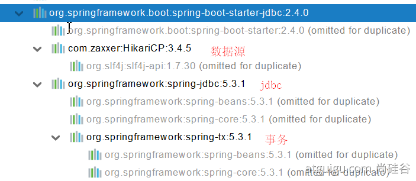

# 06. 數據訪問
  - ## 1、SQL
    - ### 1、數據源的自動配置 - `HikariDataSource`
      - #### 1、導入 `JDBC` 場景
        ```xml
        <dependency>
          <groupId>org.springframework.boot</groupId>
          <artifactId>spring-boot-starter-data-jdbc</artifactId>
        </dependency>
        ```
        

        數據庫驅動？
        為什麼導入JDBC場景，官方不導入驅動？官方不知道我們接下來要操作什麼數據庫。
        注意：`數據庫版本 (本地端電腦)` 要跟 `驅動版本對應`

        ```xml
        默認版本：<mysql.version>8.0.22</mysql.version>

        <dependency>
          <groupId>mysql</groupId>
          <artifactId>mysql-connector-java</artifactId>
          <!-- <version>5.1.49</version> -->
        </dependency>
        <!-- 
          想要修改版本
          1、直接依賴引入具體版本（maven的就近依賴原則）
          2、重新聲明版本（maven的屬性的就近優先原則，在 <properties>）
        -->
        <properties>
          <java.version>1.8</java.version>
          <mysql.version>5.1.49</mysql.version>
        </properties>
        ```

      - #### 2、分析自動配置
        - ##### 1、自動配置的類
          - `DataSourceAutoConfiguration`： 數據源的自動配置
            - 修改數據源相關的配置：`spring.datasource`
            - 數據庫連接池的配置，是自己容器中沒有 `DataSource` 才自動配置的
            - 底層配置好的連接池是：HikariDataSource

            ```java
            	@Configuration(proxyBeanMethods = false)
              @Conditional(PooledDataSourceCondition.class)
              @ConditionalOnMissingBean({ DataSource.class, XADataSource.class })
              @Import({ DataSourceConfiguration.Hikari.class, DataSourceConfiguration.Tomcat.class,
                DataSourceConfiguration.Dbcp2.class, DataSourceConfiguration.OracleUcp.class,
                DataSourceConfiguration.Generic.class, DataSourceJmxConfiguration.class })
              protected static class PooledDataSourceConfiguration
            ```
          
          - `DataSourceTransactionManagerAutoConfiguration`： 事務管理器的自動配置
          - `JdbcTemplateAutoConfiguration`： `JdbcTemplate` 的自動配置，可以來對數據庫進行crud
            - 可以修改這個配置項 `@ConfigurationProperties(prefix = "spring.jdbc")` 來修改 `JdbcTemplate`
            - `@Bean@Primary`： JdbcTemplate；容器中有這個組件
          - `JndiDataSourceAutoConfiguration`： jndi的自動配置
          - `XADataSourceAutoConfiguration`： 分佈式事務相關的

      - #### 3、修改配置項
        ```yaml
        spring:
        datasource:
          url: jdbc:mysql://localhost:3306/db_account
          username: root
          password: 123456
          driver-class-name: com.mysql.jdbc.Driver
        ```

      - #### 4、測試
        ```java
        @Slf4j
        @SpringBootTest
        class Boot05WebAdminApplicationTests {

          @Autowired
          JdbcTemplate jdbcTemplate;

          @Test
          void contextLoads() {
            //        jdbcTemplate.queryForObject("select * from account_tbl")
            //        jdbcTemplate.queryForList("select * from account_tbl",)
            Long aLong = jdbcTemplate.queryForObject("select count(*) from account_tbl", Long.class);
            log.info("记录总数：{}",aLong);
          }
        }
        ```
    
    - ### 2、使用 `Druid` 數據源
      - #### 1、[druid 官方 github 地址](https://github.com/alibaba/druid)
        整合第三方技術的兩種方式：
        - 自定義
        - 找 `starter`

      - #### 2、自定義方式
        - ##### 1、創建數據源
          ```xml
          <dependency>
            <groupId>com.alibaba</groupId>
            <artifactId>druid</artifactId>
            <version>1.1.17</version>
          </dependency>

          <bean id="dataSource" class="com.alibaba.druid.pool.DruidDataSource"
              destroy-method="close">
            <property name="url" value="${jdbc.url}" />
            <property name="username" value="${jdbc.username}" />
            <property name="password" value="${jdbc.password}" />
            <property name="maxActive" value="20" />
            <property name="initialSize" value="1" />
            <property name="maxWait" value="60000" />
            <property name="minIdle" value="1" />
            <property name="timeBetweenEvictionRunsMillis" value="60000" />
            <property name="minEvictableIdleTimeMillis" value="300000" />
            <property name="testWhileIdle" value="true" />
            <property name="testOnBorrow" value="false" />
            <property name="testOnReturn" value="false" />
            <property name="poolPreparedStatements" value="true" />
            <property name="maxOpenPreparedStatements" value="20" />
          ```
        
        - ##### 2、StatViewServlet
          > StatViewServlet的用途包括：
          > - 提供監控信息展示的html頁面
          > - 提供監控信息的JSON API

          ```xml
          	<servlet>
            <servlet-name>DruidStatView</servlet-name>
            <servlet-class>com.alibaba.druid.support.http.StatViewServlet</servlet-class>
          </servlet>
          <servlet-mapping>
            <servlet-name>DruidStatView</servlet-name>
            <url-pattern>/druid/*</url-pattern>
          </servlet-mapping>
          ```

        - ##### 3、StatFilter
          > 用于统计监控信息；如SQL监控、URI监控

          ```xml
          需要给数据源中配置如下属性；可以允许多个filter，多个用，分割；如：

          <property name="filters" value="stat,slf4j" />
          ```

          系统中所有filter：

          | 别名           | Filter类名                                              |
          |---------------|---------------------------------------------------------|
          | default       | com.alibaba.druid.filter.stat.StatFilter                |
          | stat          | com.alibaba.druid.filter.stat.StatFilter                |
          | mergeStat     | com.alibaba.druid.filter.stat.MergeStatFilter           |
          | encoding      | com.alibaba.druid.filter.encoding.EncodingConvertFilter |
          | log4j         | com.alibaba.druid.filter.logging.Log4jFilter            |
          | log4j2        | com.alibaba.druid.filter.logging.Log4j2Filter           |
          | slf4j         | com.alibaba.druid.filter.logging.Slf4jLogFilter         |
          | commonlogging | com.alibaba.druid.filter.logging.CommonsLogFilter       |

          慢SQL记录配置
          ```xml
          <bean id="stat-filter" class="com.alibaba.druid.filter.stat.StatFilter">
              <property name="slowSqlMillis" value="10000" />
              <property name="logSlowSql" value="true" />
          </bean>

          使用 slowSqlMillis 定义慢SQL的时长
          ```

      - #### 3、使用官方 starter 方式
        - ##### 1、引入druid-starter
          ```xml
            <dependency>
              <groupId>com.alibaba</groupId>
              <artifactId>druid-spring-boot-starter</artifactId>
              <version>1.1.17</version>
            </dependency>
          ```

        - ##### 2、分析自動配置
          - 擴展配置項 `spring.datasource.druid`
          - `DruidSpringAopConfiguration.class`，是用來 監控 `SpringBean` 的；
            配置項：`spring.datasource.druid.aop-patterns`
          - `DruidStatViewServletConfiguration.class`, 監控頁的配置：`spring.datasource.druid.stat-view-servlet`；默認開啟
          -  `DruidWebStatFilterConfiguration.class`, web監控配置；`spring.datasource.druid.web-stat-filter`；默認開啟
          - `DruidFilterConfiguration.class` 所有 `Druid` 自己 `filter` 的配置
            ```java
              aprivate static final String FILTER_STAT_PREFIX = "spring.datasource.druid.filter.stat";
              private static final String FILTER_CONFIG_PREFIX = "spring.datasource.druid.filter.config";
              private static final String FILTER_ENCODING_PREFIX = "spring.datasource.druid.filter.encoding";
              private static final String FILTER_SLF4J_PREFIX = "spring.datasource.druid.filter.slf4j";
              private static final String FILTER_LOG4J_PREFIX = "spring.datasource.druid.filter.log4j";
              private static final String FILTER_LOG4J2_PREFIX = "spring.datasource.druid.filter.log4j2";
              private static final String FILTER_COMMONS_LOG_PREFIX = "spring.datasource.druid.filter.commons-log";
              private static final String FILTER_WALL_PREFIX = "spring.datasource.druid.filter.wall";
            ```

        - ##### 3、配置示例
          ```yaml
          spring:
          datasource:
            url: jdbc:mysql://localhost:3306/db_account
            username: root
            password: 123456
            driver-class-name: com.mysql.jdbc.Driver

            druid:
              aop-patterns: com.atguigu.admin.*  # 監控 SpringBean
              filters: stat, wall     # 底層開啟功能，stat（sql監控），wall（防火牆）

              stat-view-servlet:   # 配置監控頁功能
                enabled: true
                login-username: admin
                login-password: admin
                resetEnable: false

              web-stat-filter:  # 監控 web
                enabled: true
                urlPattern: /*
                exclusions: '*.js,*.gif,*.jpg,*.png,*.css,*.ico,/druid/*'

              filter:
                stat:    # 對上面 filters 裡面的 stat 的詳細配置
                  slow-sql-millis: 1000
                  logSlowSql: true
                  enabled: true
                wall:
                  enabled: true
                  config:
                    drop-table-allow: false
          ```

        - [SpringBoot配置示例](https://github.com/alibaba/druid/tree/master/druid-spring-boot-starter)
        
        - [配置项列表](https://github.com/alibaba/druid/wiki/DruidDataSource%E9%85%8D%E7%BD%AE%E5%B1%9E%E6%80%A7%E5%88%97%E8%A1%A8)

    - ### 3、整合 `MyBatis` 操作
      - [官方Github](https://github.com/mybatis)
      - starter
        - `SpringBoot官方的Starter`：spring-boot-starter-*
        - `第三方的`： *-spring-boot-starter

      ```xml
      <dependency>
        <groupId>org.mybatis.spring.boot</groupId>
        <artifactId>mybatis-spring-boot-starter</artifactId>
        <version>2.1.4</version>
      </dependency>
      ```

      `MyBatis` 引入的套件：
      

      - #### 1、配置模式
        - 全局配置文件
        - `SqlSessionFactory`: 自動配置好了
        - `SqlSession`：自動配置了 `SqlSessionTemplate` 組合了 `SqlSession`
        - `@Import(AutoConfiguredMapperScannerRegistrar.class);`
        - `Mapper`： 只要我們寫的操作 `MyBatis` 的接口標準了 `@Mapper` 就會被自動掃描進來

        ```java
        @EnableConfigurationProperties(MybatisProperties.class) ： MyBatis配置項綁定類。
        @AutoConfigureAfter({ DataSourceAutoConfiguration.class, MybatisLanguageDriverAutoConfiguration.class })
        public class MybatisAutoConfiguration{}

        @ConfigurationProperties(prefix = "mybatis")
        public class MybatisProperties
        ```

        可以修改配置文件中 mybatis 開始的所有；

        ```yaml
          # 配置mybatis規則
          mybatis:
            config-location: classpath:mybatis/mybatis-config.xml  # 全局配置文件位置
            mapper-locations: classpath:mybatis/mapper/*.xml  # sql 映射文件位置
        ```

        ```xml
          <!-- mybatis/mapper/AccountMapper.xml -->
          <?xml version="1.0" encoding="UTF-8" ?>
          <!DOCTYPE mapper
              PUBLIC "-//mybatis.org//DTD Mapper 3.0//EN"
              "http://mybatis.org/dtd/mybatis-3-mapper.dtd">
            <!-- Mapper 接口 綁定 Xml => namespace -->
            <mapper namespace="com.atguigu.admin.mapper.AccountMapper">
            <!--    public Account getAcct(Long id); -->
              <select id="getAcct" resultType="com.atguigu.admin.bean.Account">
                select * from  account_tbl where  id=#{id}
              </select>
            </mapper>
        ```

        配置 `private Configuration configuration;`
        `mybatis.configuration` 下面的所有，
        就是相當於改 `mybatis` 全局配置文件中的值

        ```yaml
          # 配置 mybatis 規則
          mybatis:
          #  與底下的 configuration 屬性，只能二擇一，不能同時存在
          #  config-location: classpath:mybatis/mybatis-config.xml
          mapper-locations: classpath:mybatis/mapper/*.xml
          configuration:    # 指定 mybatis 全局配置文件中的相關配置項
            map-underscore-to-camel-case: true
            
        # 可以不寫全局；配置文件，所有全局配置文件的配置都放在configuration配置項中即可
        ```

        - 導入 `mybatis` 官方 `starter`
        - 編寫 `mapper` 接口。標準 `@Mapper` 註解
        - 編寫 `sql映射文件` 並綁定 `mapper` 接口
        - 在 `application.yaml` 中指定 `Mapper` 配置文件的位置，以及指定全局配置文件的信息 （建議；配置在`mybatis.configuration`）

      - #### 2、註解模式
        ```java
        @Mapper
        public interface CityMapper {
          @Select("select * from city where id=#{id}")
          public City getById(Long id);
          public void insert(City city);
        }
        ```

      - #### 3、混合模式
        ```java
        @Mapper
        public interface CityMapper {
          @Select("select * from city where id=#{id}")
          public City getById(Long id);
          public void insert(City city);
        }
        ```

        最佳實戰：
          - 引入 `mybatis-starter`
          - 配置 `application.yaml` 中，指定 `mapper-location` 位置即可
          - 編寫 `Mapper` 接口並標註 `@Mapper` 註解
          - 簡單方法直接註解方式
          - 複雜方法編寫 `mapper.xml` 進行綁定映射
          - `@MapperScan("com.atguigu.admin.mapper")` 簡化，會掃描這個資料夾下的所有檔案，進行 `mapper` 註解，其他的接口就可以不用標註 `@Mapper` 註解

    - ### 4、整合 `MyBatis-Plus` 完成 CRUD
      - #### 1、什麼是MyBatis-Plus
        [MyBatis-Plus](https://github.com/baomidou/mybatis-plus)（簡稱 MP）是一個 [MyBatis](https://mybatis.org/mybatis-3/zh/index.html) 的增強工具，在 `MyBatis` 的基礎上只做增強不做改變，為簡化開發、提高效率而生。
        [mybatis plus 官網](https://baomidou.com/)
        建議安裝 `MybatisX` [插件](https://baomidou.com/pages/ba5b24/)

      - #### 2、整合 MyBatis-Plus
        ```xml
        <dependency>
          <groupId>com.baomidou</groupId>
          <artifactId>mybatis-plus-boot-starter</artifactId>
          <version>3.4.1</version>
        </dependency>
        ```
        自動配置
        - `MybatisPlusAutoConfiguration` 配置類，`MybatisPlusProperties` 配置項綁定。 `mybatis-plus`：xxx 就是對 `mybatis-plus` 的定制
        - `SqlSessionFactory` 已經自動配置好。底層是容器中默認的數據源
        - `mapperLocations` 自動配置好的。有默認值。 `classpath*:/mapper/**/*.xml`；任意包的類路徑下的所有 `mapper` 文件夾下任意路徑下的所有 `xml` 都是 `sql` 映射文件。建議以後 `sql` 映射文件，放在 `mapper` 下
        - 容器中也自動配置好了 `SqlSessionTemplate`
        - `@Mapper` 標註的接口也會被自動掃描；建議直接 `@MapperScan("com.atguigu.admin.mapper")` 批量掃描就行

        優點：
        - 只需要我們的 `Mapper` 繼承 `BaseMapper` 就可以擁有 `crud` 能力

      - #### 3、CRUD功能
        ```java
            @GetMapping("/user/delete/{id}")
            public String deleteUser(@PathVariable("id") Long id,
                                    @RequestParam(value = "pn",defaultValue = "1")Integer pn,
                                    RedirectAttributes ra){

                userService.removeById(id);

                ra.addAttribute("pn",pn);
                return "redirect:/dynamic_table";
            }

            @GetMapping("/dynamic_table")
            public String dynamic_table(@RequestParam(value="pn",defaultValue = "1") Integer pn,Model model){
                // 表格內容的遍歷
        //        response.sendError
        //     List<User> users = Arrays.asList(new User("zhangsan", "123456"),
        //                new User("lisi", "123444"),
        //                new User("haha", "aaaaa"),
        //                new User("hehe ", "aaddd"));
        //        model.addAttribute("users",users);
        //
        //        if(users.size()>3){
        //            throw new UserTooManyException();
        //        }
                // 從數據庫中查出user表中的用戶進行展示

                // 構造分頁參數
                Page<User> page = new Page<>(pn, 2);
                // 調用 page 進行分頁
                Page<User> userPage = userService.page(page, null);

        //        userPage.getRecords()
        //        userPage.getCurrent()
        //        userPage.getPages()

              model.addAttribute("users",userPage);

              return "table/dynamic_table";
            }
        ```

        ```java
        @Service
        public class UserServiceImpl extends ServiceImpl<UserMapper,User> implements UserService {

        }

        public interface UserService extends IService<User> {

        }
        ```

  - ## 2、NoSQL
    `Redis` 是一個開源（BSD許可）的，內存中的數據結構存儲系統，它可以用作 `數據庫` 、 `緩存` 和 `消息中間件`。它支持多種類型的數據結構，如 `字符串（strings`）， `散列（hashes）`， `列表（lists）`， `集合（sets）`， `有序集合（sorted sets）` 與範圍查詢， `bitmaps`， `hyperloglogs` 和 `地理空間（geospatial）` 索引半徑查詢。 Redis 內置了 `複製（replication）`，`LUA腳本（Lua scripting）`， `LRU驅動事件（LRU eviction）`，`事務（transactions）` 和不同級別的 `磁盤持久化（persistence）`， 並通過 `Redis哨兵（Sentinel）` 和自動 `分區（Cluster）` 提供高可用性（high availability）。

    - ### 1、Redis 自動配置
      ```xml
      <dependency>
        <groupId>org.springframework.boot</groupId>
        <artifactId>spring-boot-starter-data-redis</artifactId>
      </dependency>
      ```

      

      自動配置：
      - `RedisAutoConfiguration` 自動配置類。 `RedisProperties` 屬性類 --> `spring.redis.xxx` 是對 `redis` 的配置
      - 連接工廠是準備好的。 `LettuceConnectionConfiguration`、`JedisConnectionConfiguration`
      - 自動注入了 `RedisTemplate<Object, Object> ： xxxTemplate`；
      - 自動注入了 `StringRedisTemplate`； key：value 都是 `String`
      - key：value
      - 底層只要我們使用 `StringRedisTemplate`、`RedisTemplate` 就可以操作 `redis`


      `redis` 環境搭建
        - 1、阿里雲按量付費 `redis`。經典網絡
        - 2、申請 `redis` 的公網連接地址
        - 3、修改白名單，允許 `0.0.0.0/0` 訪問

    - ### 2、RedisTemplate與Lettuce
      ```java
      @Test
      void testRedis(){
        ValueOperations<String, String> operations = redisTemplate.opsForValue();

        operations.set("hello","world");

        String hello = operations.get("hello");
        System.out.println(hello);
      }
      ```

    - ### 3、切換至 jedis
      ```xml
      <dependency>
        <groupId>org.springframework.boot</groupId>
        <artifactId>spring-boot-starter-data-redis</artifactId>
      </dependency>

      <!-- 導入 jedis-->
      <dependency>
        <groupId>redis.clients</groupId>
        <artifactId>jedis</artifactId>
      </dependency>
      ```

      ```yaml
      spring:
        redis:
          host: r-bp1nc7reqesxisgxpipd.redis.rds.aliyuncs.com
          port: 6379
          password: lfy:Lfy123456
          client-type: jedis        # 設定要使用 jedis 還是 lettuce
          jedis:
            pool:
              max-active: 10
      ```

