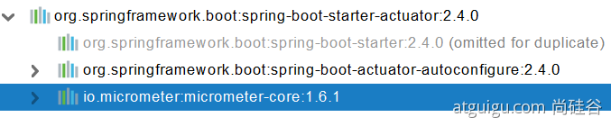
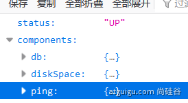

# 08. Actutor 生產指標監控
  - ## 1、SpringBoot Actuator
    - ### 1、簡介
      未來每一個微服務在雲上部署以後，我們都需要對其進行監控、追踪、審計、控制等。 `SpringBoot` 抽取了 `Actuator` 場景，使得我們每個微服務快速引用即可獲得生產級別的應用監控、審計等功能。
      ```xml
      <dependency>
        <groupId>org.springframework.boot</groupId>
        <artifactId>spring-boot-starter-actuator</artifactId>
      </dependency>
      ```
      

    - ### 2、1.x 與 2.x 的不同
      

    - ### 3、如何使用
      - [官方文檔](https://docs.spring.io/spring-boot/docs/2.4.0/reference/html/production-ready-features.html#production-ready)
      - 引入場景
      - 訪問 http://localhost:8080/actuator/**
      - 暴露所有監控信息為 HTTP
        ```yaml
        management:
          endpoints:
            enabled-by-default: true # 暴露所有端點信息
            web:
              exposure:
                include: '*'  # 以web方式暴露
        ```

      - 測試
        - http://localhost:8080/actuator/beans
        - http://localhost:8080/actuator/configprops
        - http://localhost:8080/actuator/metrics
        - http://localhost:8080/actuator/metrics/jvm.gc.pause
        - http://localhost:8080/actuator/endpointName/detailPath
        ...
    
    - ### 4、可視化
      https://github.com/codecentric/spring-boot-admin

  - ## 2、Actuator Endpoint
    - ### 1、最常使用的端點
      | ID               | 描述                                                            |
      |------------------|----------------------------------------------------------------|
      | auditevents      | 暴露當前應用程序的審核事件信息。需要一個AuditEventRepository組件。     |
      | beans            | 顯示應用程序中所有Spring Bean的完整列表。                           |
      | caches           | 暴露可用的緩存。                                                  |
      | conditions       | 顯示自動配置的所有條件信息，包括匹配或不匹配的原因。                    |
      | configprops      | 顯示所有@ConfigurationProperties。                               |
      | env              | 暴露Spring的屬性ConfigurableEnvironment                          |
      | flyway           | 顯示已應用的所有Flyway數據庫遷移。 <br>需要一個或多個Flyway組件。       |
      | health           | 顯示應用程序運行狀況信息。                                          |
      | httptrace        | 顯示HTTP跟踪信息（默認情況下，最近100個HTTP請求-響應）。需要一個HttpTraceRepository組件。 |
      | info             | 顯示應用程序信息。                                                |
      | integrationgraph | 顯示Spring integrationgraph 。需要依賴spring-integration-core。   |
      | loggers          | 顯示和修改應用程序中日誌的配置。                                    |
      | liquibase        | 顯示已應用的所有Liquibase數據庫遷移。需要一個或多個Liquibase組件。     |
      | metrics          | 顯示當前應用程序的"指標"信息。                                      |
      | mappings         | 顯示所有@RequestMapping路徑列表。                                 |
      | scheduledtasks   | 顯示應用程序中的計劃任務。                                         |
      | sessions         | 允許從Spring Session支持的會話存儲中檢索和刪除用戶會話。需要使用Spring Session的基於Servlet的Web應用程序。 |
      | shutdown         | 使應用程序正常關閉。默認禁用。                                      |
      | startup          | 顯示由ApplicationStartup收集的啟動步驟數據。需要使用SpringApplication進行配置BufferingApplicationStartup。                                                  |
      | threaddump       | 執行線程轉儲。                                                   |

      如果您的應用程序是 Web 應用程序（`Spring MVC`，`Spring WebFlux` 或 `Jersey`），則可以使用以下附加端點：
      | ID         | 描述                                                                  |
      |------------|----------------------------------------------------------------------|
      | heapdump   | 返回hprof堆轉儲文件。                                                   |
      | jolokia    | 通過HTTP暴露JMX bean（需要引入Jolokia，不適用於WebFlux）。需要引入依賴jolokia-core。 |
      | logfile    | 返回日誌文件的內容（如果已設置logging.file.name或logging.file.path屬性）。支持使用HTTPRange標頭來檢索部分日誌文件的內容。 |
      | prometheus | 以Prometheus服務器可以抓取的格式公開指標。需要依賴micrometer-registry-prometheus。 |

      #### 最常用的 Endpoint
      - Health：監控狀況
      - Metrics：運行時指標
      - Loggers：日誌記錄

    - ### 2、Health Endpoint
      健康檢查端點，我們一般用於在雲平台，平台會定時的檢查應用的健康狀況，我們就需要 `Health Endpoint` 可以為平台返回當前應用的一系列組件健康狀況的集合。
      
      #### 重要的幾點：
      - `health endpoint` 返回的結果，應該是一系列健康檢查後的一個匯總報告 (全部都健康才返回 `UP`)
      - 很多的健康檢查默認已經自動配置好了，比如：數據庫、redis 等
      - 可以很容易的添加自定義的健康檢查機制

      

    - ### 3、Metrics Endpoint
      提供詳細的、層級的、空間指標信息，這些信息可以被 `pull（主動推送）` 或者 `push（被動獲取）` 方式得到：
      - 通過 `Metrics` 對接多種監控系統
      - 簡化核心 `Metrics` 開發
      - 添加自定義 `Metrics` 或者擴展已有 `Metrics`

      `http://localhost:8080/actuator/metrics/jvm.gc.pause`

      

    - ### 4、管理 Endpoints
      - #### 1、開啟與禁用 Endpoints
        - 默認所有的 Endpoint 除過 shutdown 都是開啟的。
        - 需要開啟或者禁用某個 Endpoint。配置模式為  management.endpoint.<endpointName>.enabled = true
        ```yaml
        management:
          endpoint:
            beans:
              enabled: true
        ```

        - 或者禁用所有的 Endpoint 然後手動開啟指定的 Endpoint
        ```yaml
        management:
          endpoints:
            enabled-by-default: false
          endpoint:
            beans:
              enabled: true
            health:
              enabled: true
        ```

      - #### 2、暴露 Endpoints
        支持的暴露方式
        - HTTP：默認只暴露 health 和 info Endpoint
        - JMX：默認暴露所有Endpoint
        - 除過health和info，剩下的 Endpoint 都應該進行保護訪問。如果引入 SpringSecurity ，則會默認配置安全訪問規則

        | ID               | JMX | Web |
        |------------------|-----|-----|
        | auditevents      | Yes | No  |
        | beans            | Yes | No  |
        | caches           | Yes | No  |
        | conditions       | Yes | No  |
        | configprops      | Yes | No  |
        | env              | Yes | No  |
        | flyway           | Yes | No  |
        | health           | Yes | Yes |
        | heapdump         | N/A | No  |
        | httptrace        | Yes | No  |
        | info             | Yes | Yes |
        | integrationgraph | Yes | No  |
        | jolokia          | N/A | No  |
        | logfile          | N/A | No  |
        | loggers          | Yes | No  |
        | liquibase        | Yes | No  |
        | metrics          | Yes | No  |
        | mappings         | Yes | No  |
        | prometheus       | N/A | No  |
        | scheduledtasks   | Yes | No  |
        | sessions         | Yes | No  |
        | shutdown         | Yes | No  |
        | startup          | Yes | No  |
        | threaddump       | Yes | No  |
    
  - ## 3、定制 Endpoint
    - ### 1、定制 Health 信息
      ```java
      import org.springframework.boot.actuate.health.Health;
      import org.springframework.boot.actuate.health.HealthIndicator;
      import org.springframework.stereotype.Component;

      @Component
      public class MyHealthIndicator implements HealthIndicator {
        @Override
        public Health health() {
          int errorCode = check(); // perform some specific health check
          if (errorCode != 0) {
            return Health.down().withDetail("Error Code", errorCode).build();
          }
          return Health.up().build();
        }
      }

      // 構建Health
      Health build = Health.down()
                      .withDetail("msg", "error service")
                      .withDetail("code", "500")
                      .withException(new RuntimeException())
                      .build();
      ```

      ```yaml
      management:
        health:
          enabled: true
          show-details: always # 總是顯示詳細信息。可顯示每個模塊的狀態信息
      ```

      ```java
      @Component
      public class MyComHealthIndicator extends AbstractHealthIndicator {
        /**
        * 真實的檢查方法
        * @param builder
        * @throws Exception
        */
        @Override
        protected void doHealthCheck(Health.Builder builder) throws Exception {
          // mongodb。獲取連接進行測試
          Map<String,Object> map = new HashMap<>();
          // 檢查完成
          if(1 == 2){
            // builder.up(); //健康
            builder.status(Status.UP);
            map.put("count", 1);
            map.put("ms", 100);
          }else {
          // builder.down();
            builder.status(Status.OUT_OF_SERVICE);
            map.put("err", "連接超時");
            map.put("ms", 3000);
          }
          builder.withDetail("code", 100)
                      .withDetails(map);
        }
      }
      ```
    
    - ### 2、定制 info 信息
      常用兩種方式
      - #### 1、編寫配置文件
        ```yaml
        info:
          appName: boot-admin
          version: 2.0.1
          mavenProjectName: @project.artifactId@  # 使用@ @可以獲取 maven 的 pom 文件值
          mavenProjectVersion: @project.version@
        ```
      - #### 2、編寫 InfoContributor
        ```java
        import java.util.Collections;
        import org.springframework.boot.actuate.info.Info;
        import org.springframework.boot.actuate.info.InfoContributor;
        import org.springframework.stereotype.Component;

        @Component
        public class ExampleInfoContributor implements InfoContributor {
          @Override
          public void contribute(Info.Builder builder) {
            builder.withDetail("example",
              Collections.singletonMap("key", "value"));
          }
        } 
        ```
        http://localhost:8080/actuator/info 會輸出以上方式返回的所有 info 信息

    - ### 3、定制 Metrics 信息
      - #### 1、SpringBoot 支持自動適配的 Metrics
        - JVM metrics, report utilization of:
          - Various memory and buffer pools
          - Statistics related to garbage collection
          - Threads utilization
          - Number of classes loaded/unloaded
        - CPU metrics
        - File descriptor metrics
        - Kafka consumer and producer metrics
        - Log4j2 metrics: record the number of events logged to Log4j2 at each level
        - Logback metrics: record the number of events logged to Logback at each level
        - Uptime metrics: report a gauge for uptime and a fixed gauge representing the application’s absolute start time
        - Tomcat metrics (server.tomcat.mbeanregistry.enabled must be set to true for all Tomcat metrics to be registered)
        - Spring Integration metrics

      - #### 2、增加定制 Metrics
        ```java
        class MyService{
          Counter counter;
          public MyService(MeterRegistry meterRegistry){
            counter = meterRegistry.counter("myservice.method.running.counter");
          }

          public void hello() {
            counter.increment();
          }
        }

        // 也可以使用下面的方式
        @Bean
        MeterBinder queueSize(Queue queue) {
          return (registry) -> Gauge.builder("queueSize", queue::size).register(registry);
        }
        ```

    - ### 4、定制 Endpoint
      ```java
      @Component
      @Endpoint(id = "container")      // 自定義 Endpoint 名稱
      public class DockerEndpoint {
        @ReadOperation                // 端點的讀操作 http://localhost:8080/actuator/container
        public Map getDockerInfo(){
          return Collections.singletonMap("info", "docker started...");
        }

        @WriteOperation
        private void restartDocker(){
          System.out.println("docker restarted....");
        }
      }
      ```

      場景：開發 `ReadinessEndpoint` 來管理程序是否就緒，或者 `LivenessEndpoint` 來管理程序是否存活；
      當然，這個也可以直接使用 https://docs.spring.io/spring-boot/docs/current/reference/html/production-ready-features.html#production-ready-kubernetes-probes
