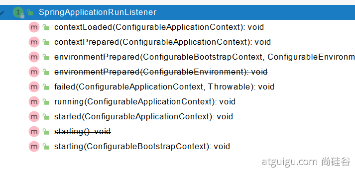

# 09. SpringBoot 核心原理解析
  - ## 1、Profile 功能
    為了方便 多環境適配，`springboot` 簡化了 `profile` 功能。
    - ### 1、application-profile 功能
      - 默認配置文件 `application.yaml`: 任何時候都會加載
      - 指定環境配置文件 `application-{env}.yaml`
      - 激活指定環境
        - 配置文件激活
        - 命令行激活：`java -jar xxx.jar --spring.profiles.active=prod  --person.name=haha`
          - 修改配置文件的任意值，`命令行` 優先
      - 默認配置與環境配置同時生效 
      - 同名配置項，`profile` 配置優先

    - ### 2、@Profile 條件裝配功能
      ```java
      @Configuration(proxyBeanMethods = false)
      @Profile("production")
      public class ProductionConfiguration {
        // ...
      }
      ```

    - ### 3、profile 分組
      ```yaml
      spring.profiles.group.production[0]=proddb
      spring.profiles.group.production[1]=prodmq

      可使用：
        spring.profiles.active = production
        或
        命令行 --spring.profiles.active = production 激活
      ```
  
  - ## 2、外部化配置
    https://docs.spring.io/spring-boot/docs/current/reference/html/spring-boot-features.html#boot-features-external-config

    1. 默認屬性 (通過設置 `SpringApplication.setDefaultProperties`).
    2. `@Configuration` 類上的 `@PropertySource` 註釋。 請注意，在刷新應用程序上下文之前，此類屬性源不會添加到環境中。現在配置某些屬性為時已晚，例如 logging.* 和 spring.main.*，它們在刷新開始前被讀取。
    3. 配置數據（如 application.properties 文件）
    4. 只在 `random.*` 具有屬性的 `RandomValuePropertySource`.
    5. 操作系統環境變量。
    6. Java 系統屬性 (`System.getProperties()`)。
    7. 來自 `java:comp/env` 的 JNDI 屬性。
    8. `ServletContext` 初始化參數。
    9. `ServletConfig` 初始化參數。
    10. 來自 `SPRING_APPLICATION_JSON` 的屬性（嵌入在環境變量或系統屬性中的 `內聯 JSON`）。
    11. 命令行參數. (如：--spring.profiles.active = production)
    12. properties 屬性對你的測試。在 `@SpringBootTest` 和用於測試應用程序特定部分的測試註釋上可用。
    13. `@TestPropertySource` 註釋在你的測試上。
    14. 當devtools 處於活動狀態時，`$HOME/.config/spring-boot` 目錄中的`Devtools` 全局設置屬性。

    - ### 1、外部配置源
      常用：`Java屬性文件`、`YAML文件`、`環境變量`、`命令行參數`；

    - ### 2、配置文件查找位置
      (1) classpath 根路徑
      (2) classpath 根路徑下 config 目錄
      (3) jar包 當前目錄
      (4) jar包 當前目錄的 config 目錄
      (5) /config 子目錄的直接子目錄 (一級子目錄)

    - ### 3、配置文件覆蓋順序：
      1. 當前 `jar包` 內部的 `application.properties` 和 `application.yml`
      2. 當前 `jar包` 內部的 `application-{profile}.properties` 和 `application-{profile}.yml`
      3. 引用的外部 `jar包` 的 `application.properties` 和 `application.yml`
      4. 引用的外部 `jar包` 的 `application-{profile}.properties` 和 `application-{profile}.yml`
    
    - ### 4、`指定環境`優先，`外部`優先，`後面`的可以覆蓋前面的同名配置項
  
  - ## 3、自定義 starter
    - ### 1、starter 啟動原理
      starter-pom 引入 autoconfigurer 包
      

      - `autoconfigure` 包中配置使用 `META-INF/spring.factories` 中 `EnableAutoConfiguration` 的值，使得項目啟動加載指定的自動配置類
      - 編寫自動配置類 `xxxAutoConfiguration` -> `xxxxProperties`
        - `@Configuration`
        - `@Conditional`
        - `@EnableConfigurationProperties`
        - `@Bean`
        - ......
      引入`starter` --- `xxxAutoConfiguration` --- 容器中放入組件 ---- 綁定`xxxProperties` ---- 配置項
    - ### 2、自定義starter
      `atguigu-hello-spring-boot-starter`（啟動器）
      `atguigu-hello-spring-boot-starter-autoconfigure`（自動配置包）

  - ## 4、SpringBoot原理
    Spring原理【[Spring註解](https://www.bilibili.com/video/BV1gW411W7wy?p=1)】、`SpringMVC`原理、`自動配置原理`、SpringBoot原理
    - ### 1、SpringBoot啟動過程
      - 創建 `SpringApplication` 應用
        - 保存一些信息。
        - 判定當前應用的類型。 ClassUtils。 Servlet
        - `bootstrappers`：初始啟動引導器（ `List<Bootstrapper>` ）：去 `spring.factories` 文件中找 `org.springframework.boot.Bootstrapper`
        - 找 `ApplicationContextInitializer`：初始化器，去 `spring.factories` 找 `ApplicationContextInitializer`
          - `List<ApplicationContextInitializer<?>> initializers`
        - 找 `ApplicationListener`：應用監聽器。去 `spring.factories` 找 `ApplicationListener`
          - `List<ApplicationListener<?>> listeners`

      - 運行 `SpringApplication`
        - `StopWatch`
        - 記錄應用的 `啟動時間`。
        - 創建引導上下文（ `Context環境` ）`createBootstrapContext()`
          - 獲取到所有之前的 `bootstrappers` 挨個執行 `intitialize()` 來完成對引導啟動器上下文環境設置
        - 讓當前應用進入 `headless` 模式。 `java.awt.headless`
        - 獲取所有 `RunListener（運行監聽器）`【為了方便所有 Listener 進行事件感知】
          - `getSpringFactoriesInstances` 去 `spring.factories` 找 `SpringApplicationRunListener`. 
        - 遍歷 `SpringApplicationRunListener` 調用 `starting` 方法；
          - 相當於 `通知所有感興趣系統正在啟動過程的人`，項目正在 `starting`。
        - 保存命令行參數；`ApplicationArguments`
        - 準備環境 `prepareEnvironment（）`;
          - 返回或者創建 基礎環境信息對象。 `StandardServletEnvironment`
          - 配置 環境信息對象。
            - 讀取所有的配置源 的 配置屬性值。
          - 綁定 環境信息
          - 監聽器調用 `listener.environmentPrepared()；`通知 所有的監聽器 當前環境準備完成
        - 創建 IOC 容器（`createApplicationContext（）`）
          - 根據項目類型（`Servlet`）創建容器，
          - 當前會創建 `AnnotationConfigServletWebServerApplicationContext`
        - 準備 `ApplicationContext` IOC 容器的基本信息：`prepareContext()`
          - 保存環境信息
          - IOC 容器的後置處理流程。
          - 應用初始化器；`applyInitializers`；
            - 遍歷所有的 `ApplicationContextInitializer`。
              調用 `initialize`。來對 ioc容器 進行初始化擴展功能
            - 遍歷所有的 `listener` 調用 `contextPrepared`。 `EventPublishRunListenr`；通知所有的監聽器 `contextPrepared`
          - 所有的監聽器 調用 `contextLoaded`。通知所有的監聽器 `contextLoaded`；
        - 刷新IOC容器。 `refreshContext`
          - 創建容器中的所有組件（ `Spring 註解` ）
        - 容器刷新完成後工作？ `afterRefresh`
        - 所有監聽器 調用 `listeners.started(context);` 通知所有的監聽器 `started`
        - 調用所有 runners； `callRunners()`
          - 獲取容器中的 `ApplicationRunner` 
          - 獲取容器中的 `CommandLineRunner`
          - 合併所有 runner 並且按照 `@Order` 進行排序
          - 遍歷所有的 runner。調用 run 方法
        - 如果以上有異常，
          - 調用 `Listener` 的 `failed`
        - 調用所有監聽器的 running 方法 `listeners.running(context);` 通知所有的監聽器 running 
        - running 如果有問題。繼續通知 `failed`。
          調用所有 Listener 的 failed；通知所有的監聽器 failed

      ```java
      public interface Bootstrapper {
        /**
        * Initialize the given {@link BootstrapRegistry} with any required registrations.
        * @param registry the registry to initialize
        */
        void intitialize(BootstrapRegistry registry);
      }
      ```

      
      
      
  
      - #### runners
        ```java
        @FunctionalInterface
        public interface ApplicationRunner {
          /**
          * Callback used to run the bean.
          * @param args incoming application arguments
          * @throws Exception on error
          */
          void run(ApplicationArguments args) throws Exception;
        }
        ```

        ```java
        @FunctionalInterface
        public interface CommandLineRunner {
          /**
          * Callback used to run the bean.
          * @param args incoming main method arguments
          * @throws Exception on error
          */
          void run(String... args) throws Exception;
        }
        ```
    
    - ### 2、Application Events and Listeners
      https://docs.spring.io/spring-boot/docs/current/reference/html/spring-boot-features.html#boot-features-application-events-and-listeners
      `ApplicationContextInitializer`
      `ApplicationListener`
      `SpringApplicationRunListener`
    - ### 3、ApplicationRunner 與 CommandLineRunner