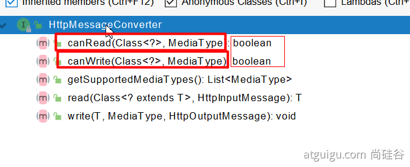
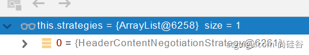

# 第一章 SpringBoot2 核心技術

## 第二節 SpringBoot2 核心功能
### 04、 配置文件
  `SpringBoot` 的配置文件可以在 `properites`，也可寫在 `yaml`。
  - #### 1、 文件類型
    - ##### 1.1、 properites
      同 以前的 properties。
    - ##### 1.2、 yaml
      - ###### 1.2.1、 簡介
        `YAML` 是 "YAML Ain't Markup Language" (YAML 不是一種標記語言) 的遞歸縮寫。
        在開發這種語言時，YAML 的意思其實是： "Yet Another Markup Language" (仍是一種標記語言)。

        非常適合用來做以數據為中心的配置文件。

      - ###### 1.2.2、 基本語法
        - key: value; k v之間有空格。
        - 大小寫敏感。
        - 使用 `縮進`表 示層級關係。
        - 縮進不允許使用 `tab`，只允許 `空格`。
        - 縮進的空格數不重要，只要相同層級的元素向左對齊即可。
        - `#` 表示註釋。
        - 字符串無需加引號，如果要加，`"` 與 `'` 表示字符串內容 會被 轉譯/不轉譯。
      
      - ###### 1.2.3、 數據類型
        - 字面量：單個的、不可再分的值。 `data`、`boolean`、`string`、`number`、`null`
          ```YAML
          k: v
          ```
        
        - 物件：鍵值對的集合。 `map`、`hash`、`set`、`object`
          ```YAML
          <!-- 行內寫法 -->
          k: {k1:v1,k2:v2,k3:v3}
          
          <!-- 或 -->
          k:
            k1: v1
            k2: v2
            k3: v3
          ```

        - 陣列：一組按次序排列的值。 `array``list``queue`
          ```YAML
          <!-- 行內寫法 -->
          k: [v1,v2,v3]
          
          <!-- 或 -->
          k:
           - v1
           - v2
           - v3
          ```

      - ###### 1.2.4、 範例
        ```java
        /* --- /bean/Person --- */
        @ConfigurationProperties(prefix = "person")
        @Component
        @ToString
        @Data
        public class Person {
          private String userName;
          private Boolean boss;
          private Date birth;
          private Integer age;
          private Pet pet;
          private String[] interests;
          private List<String> animal;
          private Map<String, Object> score;
          private Set<Double> salarys;
          private Map<String, List<Pet>> allPets;
        }

        /* --- /bean/Pet --- */
        @Component
        @ToString
        @Data
        public class Pet {
          private String name;
          private Double weight;
        }
        ```

        ```YAML
        # 檔案位置： /resources/application.yml
        # yaml 表示以上對象
        person:
          userName: zhangsan
          boss: false
          birth: 2019/12/12 20:12:33
          age: 18
          pet: 
            name: tomcat
            weight: 23.4
          interests: [籃球,游泳]
          animal: 
            - jerry
            - mario
          score:
            english: 
              first: 30
              second: 40
              third: 50
            math: [131,140,148]
            chinese: {first: 128,second: 136}
          salarys: [3999,4999.98,5999.99]
          allPets:
            sick:
              - {name: tom}
              - {name: jerry,weight: 47}
            health: [{name: mario,weight: 47}]
        ```

  - #### 2、 配置提示
    自定義的類和配置文件綁定一般沒有提示。

    增加 `spring-boot-configuration-processor` dependency 到 `pom.xml`

    並添加到 build 的 exclude 將 此套件排除在打包之外。
    ```xml
    <dependency>
      <groupId>org.springframework.boot</groupId>
      <artifactId>spring-boot-configuration-processor</artifactId>
      <optional>true</optional>
    </dependency>

    <build>
      <plugins>
        <plugin>
          <groupId>org.springframework.boot</groupId>
          <artifactId>spring-boot-maven-plugin</artifactId>
          <configuration>
            <excludes>
              <exclude>
                <groupId>org.springframework.boot</groupId>
                <artifactId>spring-boot-configuration-processor</artifactId>
              </exclude>
            </excludes>
          </configuration>
        </plugin>
      </plugins>
    </build>
    ```

### 05、 Web開發
  - #### 1、 SpringMVC 自動配置概覽
    [Features](https://docs.spring.io/spring-boot/docs/2.7.10/reference/html/features.html#features)

    `Spring Boot` 為 `Spring MVC` 提供自動配置，適用於大多數應用程序。( **大多數場景我們都不需要自定義配置** )

    自動配置在 Spring 的默認值之上添加了以下功能：
      - `內容協商視圖解析器 (ContentNegotiatingViewResolver)` 和 `BeanName (BeanNameViewResolver beans) 視圖解析器`
      - 支持提供靜態資源，包括對 `WebJars` 的支持。
      - 自動註冊 `Converter`、`GenericConverter`、`Formatter`。
      - 支持 `HttpMessageConverters`（以後我們配搭內容協議解析原理）。
      - 自動註冊 `MessageCodesResolver` （國際化用)。
      - 支持 靜態 index.html 頁面
      - 支持 自定義 Favicon 圖標
      - 自動使用 ConfigurableWebBindingInitializer ，（ DataBinder 負責將請求數據綁定到 JavaBean 上 ）

    > 如果您想保留那些 Spring Boot MVC 自定義並進行更多 MVC 自定義（攔截器、格式化程序、視圖控制器和其他功能），您可以添加自己的 WebMvcConfigurer 類型的 @Configuration 類，但不添加 @EnableWebMvc。
    不使用 @EnableWebMvc 註解。使用 @Configuration + WebMvcConfigurer 自定義規則。

    > 如果您想提供 RequestMappingHandlerMapping、RequestMappingHandlerAdapter 或 ExceptionHandlerExceptionResolver 的自定義實例，並且仍然保留 Spring Boot MVC 自定義，您可以聲明一個 WebMvcRegistrations 類型的 bean 並使用它來提供這些組件的自定義實例。
    聲明 WebMvcRegistrations 修改默認認知層組件

    > 如果你想完全控制 Spring MVC，你可以添加你自己的帶有 @EnableWebMvc 註釋的@Configuration，或者添加你自己的帶有 @Configuration 註釋的DelegatingWebMvcConfiguration，如 @EnableWebMvc 的Javadoc 中所述。
    使用 @EnableWebMvc + @Configuration + DelegatingWebMvcConfiguration 全面接管SpringMVC

  - #### 2、 簡單功能分析
    - (mac) 開啟 Spring Initializr 方式：
      - 新增 plugins：
        Preferences > Plugins，搜尋 Spring Boot Helper，安裝完後重新啟動。
      - 新增專案
        File > New > Project，選擇 Spring Initializr
    - ##### 2.1、 [靜態資源訪問](https://docs.spring.io/spring-boot/docs/2.5.14/reference/html/features.html#features.developing-web-applications.spring-mvc.static-content)
      - ###### 1、 靜態資源目錄
        只需要靜態資源放類路徑下：
          `resources/static`
          (
            or `resources/public `
            or `resources/resources`
            or `resources/META-INF/resources`
          )
        訪問：當前項目根路徑/ + 靜態資源名稱，如：`localhost:8080/zhifubao.png`。

        原理：靜態投影 `/**`。
        請求進來，
        會先去找到 `Controller` 看能不能處理 (是否有設定 controller)。
        不能處理的所有請求又都交給靜態資源處理器。
        靜態資源也找不到則響應404頁。

        修改默認的靜態資源路徑
        ```yaml
        spring:
          mvc:
            static-path-pattern: /res/**      # 訪問路徑需要增加的攔截器路徑

          resources:
            static-locations: [classpath:/haha/]      # 默認查找的資料夾路徑，可放多筆路徑
        ```

      - ###### 2、 靜態資源訪問前綴
        默認無前綴
        ```yaml
        spring:
          mvc:
            static-path-pattern: /res/**
        ```
        當前項目 + `static-path-pattern` + 靜態資源名稱 = 靜態資源文件夾下找

      - ###### 3、 webjar
        導入後，會自動映射 `/webjars/**`
        https://www.webjars.org/

        ```xml
        <dependency>
          <groupId>org.webjars</groupId>
          <artifactId>jquery</artifactId>
          <version>3.5.1</version>
        </dependency>
        ```

        訪問地址：
        `http://localhost:8080/webjars/jquery/3.5.1/jquery.js` 後面地址要按照依賴裡面的路徑

    - ##### 2.2、 [歡迎頁支持](https://docs.spring.io/spring-boot/docs/2.5.14/reference/html/features.html#features.developing-web-applications.spring-mvc.welcome-page)
      - ###### 靜態資源路徑下 index.html
        - 可以配置 靜態資源路徑 (static-locations)
        - 但是不能配置 靜態資源的訪問前綴 (static-path-pattern)。
          否則會導向 `index.html` 不能被默認訪問

        ```yaml
        spring:
        #  mvc:
        #    static-path-pattern: /res/**   # 這個會導致 歡迎頁面 功能失效

          resources:
            static-locations: [classpath:/haha/]
        ```
      - ###### controller 能處理 /index

    - ##### 2.3、 自定義 Favicon
      `favicon.ico` 放在靜態資源目錄下即可。
      
      ```YAML
      spring:
      #  mvc:
      #    static-path-pattern: /res/**   # 這個會導致Favicon 功能失效
      ```

    - ##### 2.4、 靜態資源配置原理
      - SpringBoot 啟動默認加載 `xxxAutoConfiguration` 類（自動配置類）
      - SpringMVC 功能的自動配置類： `WebMvcAutoConfiguration` 查看是否生效

        ```java
        // WebMvcAutoConfiguration.java

        @Configuration(proxyBeanMethods = false)
        @ConditionalOnWebApplication(type = Type.SERVLET)
        @ConditionalOnClass({ Servlet.class, DispatcherServlet.class, WebMvcConfigurer.class })
        @ConditionalOnMissingBean(WebMvcConfigurationSupport.class)
        @AutoConfigureOrder(Ordered.HIGHEST_PRECEDENCE + 10)
        @AutoConfigureAfter({ DispatcherServletAutoConfiguration.class, TaskExecutionAutoConfiguration.class,
            ValidationAutoConfiguration.class })
        public class WebMvcAutoConfiguration {}
        ```

      - 給容器中配了什麼。
        ```java
        @Configuration(proxyBeanMethods = false)
        @Import(EnableWebMvcConfiguration.class)
        @EnableConfigurationProperties({ WebMvcProperties.class, ResourceProperties.class })
        @Order(0)
        public static class WebMvcAutoConfigurationAdapter implements WebMvcConfigurer {}
        ```

      - 配置文件的相關屬性 和 xxx 進行了綁定。
        `WebMvcProperties == spring.mvc`、
        `ResourceProperties == spring.resources`

      - ###### 1、 配置類只有一個有參構造器
        ```java
        // 有參構造器所有參數的值，都會從容器中確定
        // ResourceProperties resourceProperties：獲取和 spring.resources 綁定的所有的值的對象
        // WebMvcProperties mvcProperties：獲取和 spring.mvc 綁定的所有的值的對象
        // ListableBeanFactory beanFactory：Spring 的 beanFactory
        // HttpMessageConverters：找到所有的 HttpMessageConverters
        // ResourceHandlerRegistrationCustomizer 找到資源處理器的自定義工具。=========
        // DispatcherServlet：路徑
        // ServletRegistrationBean：給應用程序註冊 Servlet、Filter....

          public WebMvcAutoConfigurationAdapter(
            ResourceProperties resourceProperties,
            WebMvcProperties mvcProperties,
            ListableBeanFactory beanFactory,
            ObjectProvider<HttpMessageConverters> messageConvertersProvider,
            ObjectProvider<ResourceHandlerRegistrationCustomizer> resourceHandlerRegistrationCustomizerProvider,
            ObjectProvider<DispatcherServletPath> dispatcherServletPath,
            ObjectProvider<ServletRegistrationBean<?>> servletRegistrations) {
              this.resourceProperties = resourceProperties;
              this.mvcProperties = mvcProperties;
              this.beanFactory = beanFactory;
              this.messageConvertersProvider = messageConvertersProvider;
              this.resourceHandlerRegistrationCustomizer = resourceHandlerRegistrationCustomizerProvider.getIfAvailable();
              this.dispatcherServletPath = dispatcherServletPath;
              this.servletRegistrations = servletRegistrations;
            }
        ```
      
      - ###### 2、 資源處理的默認規則
        ```java
        @Override
        public void addResourceHandlers(ResourceHandlerRegistry registry) {
          if (!this.resourceProperties.isAddMappings()) {
            logger.debug("Default resource handling disabled");
            return;
          }
          Duration cachePeriod = this.resourceProperties.getCache().getPeriod();
          CacheControl cacheControl = this.resourceProperties.getCache().getCachecontrol().toHttpCacheControl();

          // webjars 的規則
          if (!registry.hasMappingForPattern("/webjars/**")) {
            customizeResourceHandlerRegistration(registry.addResourceHandler("/webjars/**")
                .addResourceLocations("classpath:/META-INF/resources/webjars/")
                .setCachePeriod(getSeconds(cachePeriod)).setCacheControl(cacheControl));
          }

          String staticPathPattern = this.mvcProperties.getStaticPathPattern();
          if (!registry.hasMappingForPattern(staticPathPattern)) {
            customizeResourceHandlerRegistration(registry.addResourceHandler(staticPathPattern)
                .addResourceLocations(getResourceLocations(this.resourceProperties.getStaticLocations()))
                .setCachePeriod(getSeconds(cachePeriod)).setCacheControl(cacheControl));
          }
        }
        ```

        ```YAML
        # application.yaml
        
        spring:
        #  mvc:
        #    static-path-pattern: /res/**

          resources:
            add-mappings: false   # false：禁用所有靜態資源規則
        ```

        `staticPathPattern` 默認的 4 個 位置
        ```java
        @ConfigurationProperties(prefix = "spring.resources", ignoreUnknownFields = false)
        public class ResourceProperties {

          private static final String[] CLASSPATH_RESOURCE_LOCATIONS = { "classpath:/META-INF/resources/",
              "classpath:/resources/", "classpath:/static/", "classpath:/public/" };

          /**
          * Locations of static resources. Defaults to classpath:[/META-INF/resources/,
          * /resources/, /static/, /public/].
          */
          private String[] staticLocations = CLASSPATH_RESOURCE_LOCATIONS;
        ```

      - ###### 3、 歡迎頁的處理規則
        ```java
        	// HandlerMapping：處理器鏡像。保存了每個Handler能處理哪些請求

          @Bean
            public WelcomePageHandlerMapping welcomePageHandlerMapping(ApplicationContext applicationContext,
                FormattingConversionService mvcConversionService, ResourceUrlProvider mvcResourceUrlProvider) {
              WelcomePageHandlerMapping welcomePageHandlerMapping = new WelcomePageHandlerMapping(
                  new TemplateAvailabilityProviders(applicationContext), applicationContext, getWelcomePage(),
                  this.mvcProperties.getStaticPathPattern());
              welcomePageHandlerMapping.setInterceptors(getInterceptors(mvcConversionService, mvcResourceUrlProvider));
              welcomePageHandlerMapping.setCorsConfigurations(getCorsConfigurations());
              return welcomePageHandlerMapping;
            }

          WelcomePageHandlerMapping(TemplateAvailabilityProviders templateAvailabilityProviders,
              ApplicationContext applicationContext, Optional<Resource> welcomePage, String staticPathPattern) {
            if (welcomePage.isPresent() && "/**".equals(staticPathPattern)) {
              // 要用歡迎頁面功能，必須是 `/**`
              logger.info("Adding welcome page: " + welcomePage.get());
              setRootViewName("forward:index.html");
            }
            else if (welcomeTemplateExists(templateAvailabilityProviders, applicationContext)) {
              // 調用Controller  /index
              logger.info("Adding welcome page template: index");
              setRootViewName("index");
            }
          }
        ```

      - ###### 4、 favicon
        `/favicon`，是瀏覽器的默認行為。與 Spring 較無關係。

  - #### 3、 請求參數處理
    - ##### 0、 請求映射
      在 Controller 設定一個 `@RestController`，
      在` @RequestMapping('/...')` 底下聲明請求回應。
      
      - ###### 1、 rest 使用與原理
        - `@xxxMapping`；
        - Rest 風格支持 ( 使用 HTTP請求方式 動詞 來表示對資源的操作 )
          - 以前： `/getUser 獲取用戶`、`/deleteUser 刪除用戶`、`/editUser 修改用戶`、`/saveUser 保存用戶`
          - 現在： `/user`，`GET-獲取用戶`、`DELETE-刪除用戶`、`PUT-修改用戶`、`POST-保存用戶`
          - 核心過濾器：`HiddenHttpMethodFilter`
            - 使用方法：表單 `method = post`，隱藏域_method = put (`name="_method" type="hidden" value="PUT"`)
              ```html
                <form action="/user" method="get">
                  <input value="REST-GET 提交" type="submit" />
                </form>
                <form action="/user" method="post">
                  <input value="REST-POST 提交" type="submit" />
                </form>
                <form action="/user" method="post">
                  <input name="_method" type="hidden" value="DELETE" />
                  <input value="REST-DELETE 提交" type="submit" />
                </form>
                <form action="/user" method="post">
                  <input name="_method" type="hidden" value="PUT" />
                  <input value="REST-PUT 提交" type="submit" />
                </form>
              ```

              ```java
              @RequestMapping(value = "/user",method = RequestMethod.GET)
              // 等同於 GetMapping("/user")
              public String getUser(){
                  return "GET-張三";
              }

              @RequestMapping(value = "/user",method = RequestMethod.POST)
              // 等同於 PostMapping("/user")
              public String saveUser(){
                  return "POST-張三";
              }


              @RequestMapping(value = "/user",method = RequestMethod.PUT)
              // 等同於 PutMapping("/user")
              public String putUser(){
                  return "PUT-張三";
              }

              @RequestMapping(value = "/user",method = RequestMethod.DELETE)
              // 等同於 DeleteMapping("/user")
              public String deleteUser(){
                  return "DELETE-張三";
              }

              @Bean
              @ConditionalOnMissingBean(HiddenHttpMethodFilter.class)
              @ConditionalOnProperty(prefix = "spring.mvc.hiddenmethod.filter", name = "enabled", matchIfMissing = false)
              public OrderedHiddenHttpMethodFilter hiddenHttpMethodFilter() {
                return new OrderedHiddenHttpMethodFilter();
              }
              ```
            
            - `SpringBoot` 中手動啟動 `hiddenmethod.filter.enabled` (預設為 false)
              ```yaml
              mvc:
                hiddenmethod:
                  filter:
                    enabled: true
              ```
          - 擴展：如何把 `_method` 這個名字替換成我們自己喜歡的。
            ```java
            // 自定義 filter (新增一個 class，將 HiddenHttpMethodFilter 屬性變更)
            @Bean
            public HiddenHttpMethodFilter hiddenHttpMethodFilter(){
                HiddenHttpMethodFilter methodFilter = new HiddenHttpMethodFilter();
                methodFilter.setMethodParam("_m");
                return methodFilter;
            }
            ```

        Rest原理（表單提交要使用 REST 的時候）
        - 表單提交會帶上 _method = PUT (`name="_method" value="PUT"`)
        - 請求過來，先被 `HiddenHttpMethodFilter` 攔截
          - 判斷請求是否正常，並且是 `POST`
            - 獲取到 `_method` 的值。
            - 兼容以下請求：`PUT`、`DELETE`、`PATCH`
            - 原始 `request（post）`，包裝模式 `requesWrapper` 重寫了 `getMethod` 方法，返回的是傳入的值。
            - 過濾器鏈接放行的時候使用 `wrapper`。以後的方法調用 `getMethod` 是調用 `requesWrapper` 的。

        Rest 使用客戶端工具，
          - 如 `PostMan` 直接發送 `Put`、`delete` 等方式請求，無需 `Filter`。

        ```YAML
        spring:
          mvc:
            hiddenmethod:
              filter:
                enabled: true     # 啟動頁面表單的 Rest功能
        ```

      - ###### 2、 請求映射原理
        

        SpringMVC 功能分析都從 org.springframework.web.servlet.DispatcherServlet-》doDispatch（）

        ```java
        protected void doDispatch(HttpServletRequest request, HttpServletResponse response) throws Exception {
        HttpServletRequest processedRequest = request;
        HandlerExecutionChain mappedHandler = null;
        boolean multipartRequestParsed = false;

        WebAsyncManager asyncManager = WebAsyncUtils.getAsyncManager(request);

        try {
          ModelAndView mv = null;
          Exception dispatchException = null;

          try {
            processedRequest = checkMultipart(request);
            multipartRequestParsed = (processedRequest != request);

            // 找到當前請求使用哪個 Handler（Controller的方法）處理
            mappedHandler = getHandler(processedRequest);
            
            // HandlerMapping：處理器映射。/xxx ->> xxxx
        ```

        默認有 5 個 `HandlerMapping`：
          

        `RequestMappingHandlerMapping`：保存了所有 `@RequestMapping` 和 `handler` 的映射規則。

        

        所有的請求映射都在 `HandlerMapping` 中。

        - `SpringBoot` 自動配置歡迎頁面的 `WelcomePageHandlerMapping`。訪問/能訪問到 index.html；
        - SpringBoot 自動配置了默認的 `RequestMappingHandlerMapping`
        - 請求進來，試試所有的 `HandlerMapping` 看是否有請申請信息。
          - 如果有就找到這個請求 對應的 `handler`
          - 如果沒有就是下一個 `HandlerMapping`
        - 我們需要一些自定義的映射處理，我們也可以自己給容器中放 `HandlerMapping`。
        自定義 `HandlerMapping`

        ```java
        	protected HandlerExecutionChain getHandler(HttpServletRequest request) throws Exception {
            if (this.handlerMappings != null) {
              for (HandlerMapping mapping : this.handlerMappings) {
                HandlerExecutionChain handler = mapping.getHandler(request);
                if (handler != null) {
                  return handler;
                }
              }
            }
            return null;
          }
        ```

    - ##### 1、 普通參數與基礎註解
      - ###### 1.1、 註解
        `@PathVariable` (路徑變數)、
        `@RequestHeader` (獲取請求頭)、
        `@RequestParam` (獲取請求參數)、
        `@CookieValue` (獲取 cookie 值)、
        `@RequestBody` (獲取 請求體 [Post])
        `@RequestAttribute` (獲取 request 域屬性)、
        `@MatrixVariable` (矩陣變數)、

        ```java
        @RestController
        public class ParameterTestController {
          // 如： car/2/owner/zhangsan
          @GetMapping("/car/{id}/owner/{username}")
          public Map<String,Object> getCar(
            // ---------- 獲取路徑變數 ---------- //
              @PathVariable("id") Integer id,
                // {id: 2}
              @PathVariable("username") String name,
                // {name: zhangsan}
              @PathVariable Map<String,String> pv,
                // {pv: {id: 2, username: zhangsan}}

            // ---------- 獲取請求頭 ---------- //
              @RequestHeader("User-Agent") String userAgent,
                // 只提取 User-Agent 資訊
              @RequestHeader Map<String,String> header,
                // 提取 所有 Header 資訊


            // ---------- 獲取請求參數 ---------- //
              // 如：car/2/owner/zhangsan?age=18&inters=basketball
              @RequestParam("age") Integer age,
              @RequestParam("inters") List<String> inters,
              @RequestParam Map<String,String> params,

            // ---------- 獲取 cookie 值 ---------- //
              @CookieValue("_ga") String _ga,
              @CookieValue("_ga") Cookie cookie
          ){
            Map<String,Object> map = new HashMap<>();

        //        map.put("id",id);
        //        map.put("name",name);
        //        map.put("pv",pv);
        //        map.put("userAgent",userAgent);
        //        map.put("headers",header);
            map.put("age",age);
            map.put("inters",inters);
            map.put("params",params);
            map.put("_ga",_ga);
            System.out.println(cookie.getName()+"===>"+cookie.getValue());
            return map;
          }

          // ---------- 獲取 Request Body ---------- //
          @PostMapping("/save")
          public Map postMethod(@RequestBody String content){
            Map<String,Object> map = new HashMap<>();
            map.put("content",content);
            return map;
          }
        }
        ```

        - `@RequestAttribute`
        ```java
        // controller/RequestController

        import org.springframework.web.bind.annotation.RequestAttribute;
        import org.springframework.web.bind.annotation.ResponseBody;

        import javax.servlet.http.HttpServletRequest;

        @Controller
        public class RequestController {

          @GetMapping("/goto")
          public String goToPage(HttpServletRequest request) {
            request.setAttribute("msg", "成功了...");
            request.setAttribute("code", 200);

            return "forward:/success";    // 轉發到 /success 請求
          }

          @ResponseBody
          @GetMapping("/success")
          public Map success(
            @RequestAttribute("msg") String msg,
            @RequestAttribute("code") Integer code,
            HttpServletRequest request
          ) {
            Object msg1 = request.getAttribute("msg");

            Map<String, Object> map = new HashMap<>();

            map.put("reqMethod_msg", msg1);
            map.put("annotation_msg", msg);
            return map;
          }
        }
        ```

        - `MatrixVariable` 矩陣變數
          - 「 /cars/{path}?xxx=xx&aaa=aa 」：稱為 `queryString` 查詢字符串，使用 `@RequestParam` 來獲取。
          - 「 /cars/{path;low=34;brand=byd,audi,yd} 」：稱為 `矩陣變數`。
            - 頁面開發時，若 `cookie` 被禁用了，要怎麼獲取 session 裡面的內容？
              - 使用 session.set(a, b) 時，每個 session 都有個 jsessionid，會被保存在 cookie 中，而 cookie 會在每次發請求時攜帶。
              - 當 cookie 無法攜帶 jsessionid 時，可以使用 矩陣變數 方式來攜帶。
              - 如：/abc;jsessionid=xxx，稱為 `url 重寫`。
              - 把 cookie 的值，使用矩陣變數的方式進行傳遞。

          ```java
          // ---------- 獲取 矩陣變數 ---------- //
          // 矩陣變數需要在 SpringBoot 中手動開啟
          // 根據 RFC3986 的規範，矩陣變數應當綁定在路徑變數中！
          // 若是有多個矩陣變數，應當使用英文符號;進行分隔。
          // 若是一個矩陣變數有多個值，應當使用英文符號,進行分隔，或之命名多個重複的key 即可。
          // 如： /cars/sell;low=34;brand=byd,audi,yd

          // 1、語法： 請求路徑：/cars/sell;low=34;brand=byd,audi,yd
          // 2、SpringBoot 默認禁用了矩陣變數的功能 
          //      手動開啟：原理。對於路徑的處理。UrlPathHelper 進行解析。
          //              removeSemicolonContent（移去分號內容）支持矩陣變數的
          // 3、矩陣變數必須有 url路徑變數 才能被解析
          
          @GetMapping("/cars/{path}")
          public Map carsSell(@MatrixVariable("low") Integer low,
                              @MatrixVariable("brand") List<String> brand,
                              @PathVariable("path") String path){
              Map<String,Object> map = new HashMap<>();

              map.put("low",low);
              map.put("brand",brand);
              map.put("path",path);
              return map;
          }

          // /boss/1;age=20/2;age=10
          // 可使用 pathVar 來設定 要取得哪個路徑下的值
          // 沒區分的情況下，age 只會取到 第一個值 20
          // 分號左邊是訪問路徑，分後右邊是矩陣變數
          @GetMapping("/boss/{bossId}/{empId}")
          public Map boss(
            @MatrixVariable(value = "age",pathVar = "bossId") Integer bossAge,
            @MatrixVariable(value = "age",pathVar = "empId") Integer empAge
          ){
            Map<String,Object> map = new HashMap<>();
            map.put("bossAge",bossAge);
            map.put("empAge",empAge);
            return map;
          }
          ```

          開啟 矩陣變數 功能方式：
          ```java
          // ----- 方法一 ----- //
          // 1. 讓 WebConfig implements(實現) WebMvcConfigurer
          // 2. 複寫 configurePathMatch
          // 3. new UrlPathHelper，並設定屬性 setRemoveSemicolonContent 為 false
          // 4. 將設定餵給 configurer

          // config/ WebConfig
          package com.atguigu.boot.config;

          import org.springframework.context.annotation.Bean;
          import org.springframework.context.annotation.Configuration;
          import org.springframework.web.filter.HiddenHttpMethodFilter;
          import org.springframework.web.servlet.config.annotation.PathMatchConfigurer;
          import org.springframework.web.servlet.config.annotation.WebMvcConfigurer;
          import org.springframework.web.util.UrlPathHelper;

          @Configuration(proxyBeanMethods = false)
          public class WebConfig implements WebMvcConfigurer {
            @Bean
            public HiddenHttpMethodFilter hiddenHttpMethodFilter(){
              HiddenHttpMethodFilter methodFilter = new HiddenHttpMethodFilter();
              methodFilter.setMethodParam("_m");
              return methodFilter;
            }

            // 方法一
            @Override
            public void configurePathMatch(PathMatchConfigurer configurer) {
              UrlPathHelper urlPathHelper = new UrlPathHelper();
              // 默認會將分號後面的內容移除，需要將這個關掉，矩陣變數功能才能正常運作
              urlPathHelper.setRemoveSemicolonContent(false); 
              configurer.setUrlPathHelper(urlPathHelper)
            }

            // 方法二
            @Bean
            public WebMvcConfigurer webMvcConfigurer(){
              return new WebMvcConfigurer() {
                @Override
                public void configurePathMatch(PathMatchConfigurer configurer) {
                  UrlPathHelper urlPathHelper = new UrlPathHelper();
                  urlPathHelper.setRemoveSemicolonContent(false); 
                  configurer.setUrlPathHelper(urlPathHelper)
                }
              }
            }
            }
          ```

      - ###### 1.2、 Servlet API：
        `WebRequest`、
        `ServletRequest`、
        `MultipartRequest`、
        `HttpSession`、
        `javax.servlet.http.PushBuilder`、
        `Principal`、
        `InputStream`、
        `Reader`、
        `HttpMethod`、
        `Locale`、
        `TimeZone`、
        `ZoneId`

        ServletRequestMethodArgumentResolver  以上的部分參數

        ```java
        @Override
        public boolean supportsParameter(MethodParameter parameter) {
          Class<?> paramType = parameter.getParameterType();
          return (
            WebRequest.class.isAssignableFrom(paramType) ||
            ServletRequest.class.isAssignableFrom(paramType) ||
            MultipartRequest.class.isAssignableFrom(paramType) ||
            HttpSession.class.isAssignableFrom(paramType) ||
            (pushBuilder != null && pushBuilder.isAssignableFrom(paramType)) ||
            Principal.class.isAssignableFrom(paramType) ||
            InputStream.class.isAssignableFrom(paramType) ||
            Reader.class.isAssignableFrom(paramType) ||
            HttpMethod.class == paramType ||
            Locale.class == paramType ||
            TimeZone.class == paramType ||
            ZoneId.class == paramType
          );
        }
        ```

      - ###### 1.3、複雜參數：
        `Map`、`Model`（map、model 裡面的數據會被放在 request 的請求域  request.setAttribute）、
        `Errors/BindingResult`、
        `RedirectAttributes`（ 重定向攜帶數據 ）、
        `ServletResponse`（response）、
        `SessionStatus`、
        `UriComponentsBuilder`、
        `ServletUriComponentsBuilder`

        ```java
        Map<String,Object> map,
        Model model,
        HttpServletRequest request
        // 都是可以給 request 域中 放數據，
        request.getAttribute();
        ```
        
        `Map`、`Model` 類型的參數，會返回 `mavContainer.getModel（）`；
        ---> `BindingAwareModelMap` 是 `Model` 也是 `Map`
        `mavContainer.getModel()`; 獲得到值的

        
        
        

      - ###### 1.4、 自定義對象參數：
        可以自動類型轉換與格式化，可以級聯封裝。

        ```java
        /**
        *     姓名： <input name="userName"/> <br/>
        *     年齡： <input name="age"/> <br/>
        *     生日： <input name="birth"/> <br/>
        *     寵物姓名：<input name="pet.name"/><br/>
        *     寵物年齡：<input name="pet.age"/>
        */
        @Data
        public class Person {
          private String userName;
          private Integer age;
          private Date birth;
          private Pet pet;
        }

        @Data
        public class Pet {
          private String name;
          private String age;
        }
        ```

    - ##### 2、 POJO 封裝過程 (自定義對象參數 封裝過程)
      - ###### ServletModelAttributeMethodProcessor

    - ##### 3、 參數處理原理
      - `HandlerMapping` 中找到能處理請求的 `Handler(Controller.method())`
      - 為當前 `Handler` 找一個適配器 `HandlerAdapter`； `RequestMappingHandlerAdapter`
      - 適配器執行目標方法並確定方法參數的每一個值

      - ###### 1、 HandlerAdapter (處理器的適配器)
        

        最常用的兩種：
        0 = {RequestMappingHandlerAdapter} - 支持方法上標註 `@RequestMapping` 
        1 = {HandlerFunctionAdapter} - 支持函數式編程的
        xxxxxx

      - ###### 2、 執行目標方法
        ```java
        // Actually invoke the handler.
        // DispatcherServlet -- doDispatch
        mv = ha.handle(processedRequest, response, mappedHandler.getHandler());
        ```

        ```java
        // 執行目標方法
        mav = invokeHandlerMethod(request, response, handlerMethod);

        // ServletInvocableHandlerMethod
        Object returnValue = invokeForRequest(webRequest, mavContainer, providedArgs);
        // 獲取方法的參數值
        Object[] args = getMethodArgumentValues(request, mavContainer, providedArgs);
        ```

      - ###### 3、 參數解析器 - HandlerMethodArgumentResolver
        確定將要執行的目標方法的每一個參數的值是什麼;
        `SpringMVC` 目標方法能寫多少種參數類型，取決於參數解析器。

        
        
        
        - 當前解析器 是否支持 解析 這種參數
        - 支持就調用 `resolveArgument`

      - ###### 4、 返回值處理器
        

      - ###### 5、 如何確定目標方法的每一個參數的值
        ```java
        // ============ InvocableHandlerMethod ============
        protected Object[] getMethodArgumentValues(NativeWebRequest request, @Nullable ModelAndViewContainer mavContainer, Object... providedArgs) throws Exception {
          MethodParameter[] parameters = getMethodParameters();
          if (ObjectUtils.isEmpty(parameters)) {
            return EMPTY_ARGS;
          }

          Object[] args = new Object[parameters.length];
          for (int i = 0; i < parameters.length; i++) {
            MethodParameter parameter = parameters[i];
            parameter.initParameterNameDiscovery(this.parameterNameDiscoverer);
            args[i] = findProvidedArgument(parameter, providedArgs);
            if (args[i] != null) {
              continue;
            }
            if (!this.resolvers.supportsParameter(parameter)) {
              throw new IllegalStateException(formatArgumentError(parameter, "No suitable resolver"));
            }
            try {
              args[i] = this.resolvers.resolveArgument(parameter, mavContainer, request, this.dataBinderFactory);
            }
            catch (Exception ex) {
              // Leave stack trace for later, exception may actually be resolved and handled...
              if (logger.isDebugEnabled()) {
                String exMsg = ex.getMessage();
                if (exMsg != null && !exMsg.contains(parameter.getExecutable().toGenericString())) {
                  logger.debug(formatArgumentError(parameter, exMsg));
                }
              }
              throw ex;
            }
          }
          return args;
        }
        ```

        - ###### 5.1、判斷 所有參數解析器中，哪個支持解析這個參數
          ```java
          @Nullable
          private HandlerMethodArgumentResolver getArgumentResolver(MethodParameter parameter) {
            HandlerMethodArgumentResolver result = this.argumentResolverCache.get(parameter);
            if (result == null) {
              for (HandlerMethodArgumentResolver resolver : this.argumentResolvers) {
                if (resolver.supportsParameter(parameter)) {
                  result = resolver;
                  this.argumentResolverCache.put(parameter, result);
                  break;
                }
              }
            }
            return result;
          }
          ```

        - ###### 5.2、解析這個參數的值
          調用各自 `HandlerMethodArgumentResolver` 的 resolveArgument 方法即可
        
        - ###### 5.3、自定義類型參數 封裝 POJO
          `ServletModelAttributeMethodProcessor` 這個參數處理器支持 是否為 簡單類型。

          ```java
          public static boolean isSimpleValueType(Class<?> type) {
            return (Void.class != type && void.class != type &&
                (ClassUtils.isPrimitiveOrWrapper(type) ||
                Enum.class.isAssignableFrom(type) ||
                CharSequence.class.isAssignableFrom(type) ||
                Number.class.isAssignableFrom(type) ||
                Date.class.isAssignableFrom(type) ||
                Temporal.class.isAssignableFrom(type) ||
                URI.class == type ||
                URL.class == type ||
                Locale.class == type ||
                Class.class == type));
          }
          ```

          ```java
          @Override
          @Nullable
          public final Object resolveArgument(MethodParameter parameter, @Nullable ModelAndViewContainer mavContainer,
              NativeWebRequest webRequest, @Nullable WebDataBinderFactory binderFactory) throws Exception {

            Assert.state(mavContainer != null, "ModelAttributeMethodProcessor requires ModelAndViewContainer");
            Assert.state(binderFactory != null, "ModelAttributeMethodProcessor requires WebDataBinderFactory");

            String name = ModelFactory.getNameForParameter(parameter);
            ModelAttribute ann = parameter.getParameterAnnotation(ModelAttribute.class);
            if (ann != null) {
              mavContainer.setBinding(name, ann.binding());
            }

            Object attribute = null;
            BindingResult bindingResult = null;

            if (mavContainer.containsAttribute(name)) {
              attribute = mavContainer.getModel().get(name);
            }
            else {
              // Create attribute instance
              try {
                attribute = createAttribute(name, parameter, binderFactory, webRequest);
              }
              catch (BindException ex) {
                if (isBindExceptionRequired(parameter)) {
                  // No BindingResult parameter -> fail with BindException
                  throw ex;
                }
                // Otherwise, expose null/empty value and associated BindingResult
                if (parameter.getParameterType() == Optional.class) {
                  attribute = Optional.empty();
                }
                bindingResult = ex.getBindingResult();
              }
            }

            if (bindingResult == null) {
              // Bean property binding and validation;
              // skipped in case of binding failure on construction.
              WebDataBinder binder = binderFactory.createBinder(webRequest, attribute, name);
              if (binder.getTarget() != null) {
                if (!mavContainer.isBindingDisabled(name)) {
                  bindRequestParameters(binder, webRequest);
                }
                validateIfApplicable(binder, parameter);
                if (binder.getBindingResult().hasErrors() && isBindExceptionRequired(binder, parameter)) {
                  throw new BindException(binder.getBindingResult());
                }
              }
              // Value type adaptation, also covering java.util.Optional
              if (!parameter.getParameterType().isInstance(attribute)) {
                attribute = binder.convertIfNecessary(binder.getTarget(), parameter.getParameterType(), parameter);
              }
              bindingResult = binder.getBindingResult();
            }

            // Add resolved attribute and BindingResult at the end of the model
            Map<String, Object> bindingResultModel = bindingResult.getModel();
            mavContainer.removeAttributes(bindingResultModel);
            mavContainer.addAllAttributes(bindingResultModel);

            return attribute;
          }
          ```

          `WebDataBinder binder` = binderFactory.createBinder(webRequest, attribute, name);
          `WebDataBinder`：web數據綁定器，將請求參數的值綁定到指定的 `JavaBean` 裡面
          `WebDataBinder` 利用它裡面的 `Converters` 將請求數據轉成指定的數據類型。再次封裝到 `JavaBean` 中

          `GenericConversionService`：在設置每一個值的時候，找它裡面的所有 `converter` 那個可以將這個數據類型（request帶來參數的字符串）轉換到指定的類型（JavaBean -- Integer）
          如：byte -- > file
          
          ```java
          @FunctionalInterfacepublic interface Converter<S, T>
          ```

          
          

          未來我們可以給 `WebDataBinder` 裡面放自己的 `Converter`；
          ```java
          private static final class StringToNumber<T extends Number> implements Converter<String, T>
          ```

          自定義 Converter
          ```java
          // 1、WebMvcConfigurer定制化SpringMVC的功能
          @Bean
          public WebMvcConfigurer webMvcConfigurer(){
            return new WebMvcConfigurer() {
              @Override
              public void configurePathMatch(PathMatchConfigurer configurer) {
                UrlPathHelper urlPathHelper = new UrlPathHelper();
                // 不移除；後面的內容。矩陣變量功能就可以生效
                urlPathHelper.setRemoveSemicolonContent(false);
                configurer.setUrlPathHelper(urlPathHelper);
              }

              @Override
              public void addFormatters(FormatterRegistry registry) {
                registry.addConverter(new Converter<String, Pet>() {
                  @Override
                  public Pet convert(String source) {
                    // 啊猫,3 (Key, value)
                    if(!StringUtils.isEmpty(source)){
                      Pet pet = new Pet();
                      String[] split = source.split(",");
                      pet.setName(split[0]);
                      pet.setAge(Integer.parseInt(split[1]));
                      return pet;
                    }
                    return null;
                  }
                });
              }
            };
          }
          ```

      - ###### 6、 目標方法執行完成
        將所有的數據都放在 ModelAndViewContainer；
        包含要去的頁面地址 View。
        還包含Model數據。

        

      - ###### 7、 處理派發結果
        ```java
        processDispatchResult(processedRequest, response, mappedHandler, mv, dispatchException);

        renderMergedOutputModel(mergedModel, getRequestToExpose(request), response);
        ```

        ```java
        // InternalResourceView：
        @Override
          protected void renderMergedOutputModel(
              Map<String, Object> model, HttpServletRequest request, HttpServletResponse response) throws Exception {

            // Expose the model object as request attributes.
            exposeModelAsRequestAttributes(model, request);

            // Expose helpers as request attributes, if any.
            exposeHelpers(request);

            // Determine the path for the request dispatcher.
            String dispatcherPath = prepareForRendering(request, response);

            // Obtain a RequestDispatcher for the target resource (typically a JSP).
            RequestDispatcher rd = getRequestDispatcher(request, dispatcherPath);
            if (rd == null) {
              throw new ServletException("Could not get RequestDispatcher for [" + getUrl() +
                  "]: Check that the corresponding file exists within your web application archive!");
            }

            // If already included or response already committed, perform include, else forward.
            if (useInclude(request, response)) {
              response.setContentType(getContentType());
              if (logger.isDebugEnabled()) {
                logger.debug("Including [" + getUrl() + "]");
              }
              rd.include(request, response);
            }

            else {
              // Note: The forwarded resource is supposed to determine the content type itself.
              if (logger.isDebugEnabled()) {
                logger.debug("Forwarding to [" + getUrl() + "]");
              }
              rd.forward(request, response);
            }
          }
        ```

        ```java
        // 暴露模型作為請求域屬性
        // Expose the model object as request attributes.
          exposeModelAsRequestAttributes(model, request);
        ```

        ```java
          protected void exposeModelAsRequestAttributes(Map<String, Object> model,
            HttpServletRequest request) throws Exception {

          // model中的所有數據 遍歷 挨個放在請求域中
          model.forEach((name, value) -> {
            if (value != null) {
              request.setAttribute(name, value);
            }
            else {
              request.removeAttribute(name);
            }
          });
        }
        ```

  - #### 4、 數據響應與內容協商
    - ##### 1、 响应JSON
      - ###### 1.1、 jackson.jar+@ResponseBody
        ```java
        <dependency>
            <groupId>org.springframework.boot</groupId>
            <artifactId>spring-boot-starter-web</artifactId>
        </dependency>
        web场景自动引入了json场景
          <dependency>
            <groupId>org.springframework.boot</groupId>
            <artifactId>spring-boot-starter-json</artifactId>
            <version>2.3.4.RELEASE</version>
            <scope>compile</scope>
          </dependency>

        ```

        

        给前端自动返回json数据；

        - ###### 1、 返回值解析器
          

          ```java
          try {
            this.returnValueHandlers.handleReturnValue(
                returnValue, getReturnValueType(returnValue), mavContainer, webRequest);
          }
          ```

          ```java
          	@Override
            public void handleReturnValue(@Nullable Object returnValue, MethodParameter returnType,
                ModelAndViewContainer mavContainer, NativeWebRequest webRequest) throws Exception {

              HandlerMethodReturnValueHandler handler = selectHandler(returnValue, returnType);
              if (handler == null) {
                throw new IllegalArgumentException("Unknown return value type: " + returnType.getParameterType().getName());
              }
              handler.handleReturnValue(returnValue, returnType, mavContainer, webRequest);
            }
          ```

          ```java
          RequestResponseBodyMethodProcessor  	
          @Override
            public void handleReturnValue(@Nullable Object returnValue, MethodParameter returnType,
                ModelAndViewContainer mavContainer, NativeWebRequest webRequest)
                throws IOException, HttpMediaTypeNotAcceptableException, HttpMessageNotWritableException {

              mavContainer.setRequestHandled(true);
              ServletServerHttpRequest inputMessage = createInputMessage(webRequest);
              ServletServerHttpResponse outputMessage = createOutputMessage(webRequest);

              // Try even with null return value. ResponseBodyAdvice could get involved.
                  // 使用消息转换器进行写出操作
              writeWithMessageConverters(returnValue, returnType, inputMessage, outputMessage);
            }
          ```

        - ###### 2、 返回值解析器原理
          

          ● 1、返回值处理器判断是否支持这种类型返回值 supportsReturnType
          ● 2、返回值处理器调用 handleReturnValue 进行处理
          ● 3、RequestResponseBodyMethodProcessor 可以处理返回值标了@ResponseBody 注解的。
            ○ 1.  利用 MessageConverters 进行处理 将数据写为json
              ■ 1、内容协商（浏览器默认会以请求头的方式告诉服务器他能接受什么样的内容类型）
              ■ 2、服务器最终根据自己自身的能力，决定服务器能生产出什么样内容类型的数据，
              ■ 3、SpringMVC会挨个遍历所有容器底层的 HttpMessageConverter ，看谁能处理？
                ● 1、得到MappingJackson2HttpMessageConverter可以将对象写为json
                ● 2、利用MappingJackson2HttpMessageConverter将对象转为json再写出去。

          

      - ###### 1.2、 SpringMVC到底支持哪些返回值
        ```java
        ModelAndView
        Model
        View
        ResponseEntity 
        ResponseBodyEmitter
        StreamingResponseBody
        HttpEntity
        HttpHeaders
        Callable
        DeferredResult
        ListenableFuture
        CompletionStage
        WebAsyncTask
        有 @ModelAttribute 且为对象类型的
        @ResponseBody 注解 ---> RequestResponseBodyMethodProcessor；
        ```

      - ###### 1.3、 HTTPMessageConverter原理
        - ###### 1、 MessageConverter规范
          

          HttpMessageConverter: 看是否支持将 此 Class类型的对象，转为MediaType类型的数据。
          例子：Person对象转为JSON。或者 JSON转为Person

        - ###### 2、 默认的MessageConverter
          

          0 - 只支持Byte类型的
          1 - String
          2 - String
          3 - Resource
          4 - ResourceRegion
          5 - DOMSource.class \ SAXSource.class) \ StAXSource.class \StreamSource.class \Source.class
          6 - MultiValueMap
          7 - true 
          8 - true
          9 - 支持注解方式xml处理的。

          最终 MappingJackson2HttpMessageConverter  把对象转为JSON（利用底层的jackson的objectMapper转换的）

          

    - ##### 2、 内容协商
      根据客户端接收能力不同，返回不同媒体类型的数据。

      - ###### 1、 引入xml依赖
        ```xml
        <dependency>
          <groupId>com.fasterxml.jackson.dataformat</groupId>
          <artifactId>jackson-dataformat-xml</artifactId>
        </dependency>
        ```

      - ###### 2、 postman分别测试返回json和xml
        只需要改变请求头中Accept字段。Http协议中规定的，告诉服务器本客户端可以接收的数据类型。
        
        

      - ###### 3、 开启浏览器参数方式内容协商功能
        为了方便内容协商，开启基于请求参数的内容协商功能。

        ```YAML
        spring:
          contentnegotiation:
            favor-parameter: true  #开启请求参数内容协商模式
        ```

        发请求： http://localhost:8080/test/person?format=json
        http://localhost:8080/test/person?format=xml

        

        确定客户端接收什么样的内容类型；
        1、Parameter策略优先确定是要返回json数据（获取请求头中的format的值）
        

        2、最终进行内容协商返回给客户端json即可。

      - ###### 4、 内容协商原理
        ● 1、判断当前响应头中是否已经有确定的媒体类型。MediaType
        ● 2、获取客户端（PostMan、浏览器）支持接收的内容类型。（获取客户端Accept请求头字段）【application/xml】
          ○ contentNegotiationManager 内容协商管理器 默认使用基于请求头的策略
          
            HeaderContentNegotiationStrategy  确定客户端可以接收的内容类型 
          

        ● 3、遍历循环所有当前系统的 MessageConverter，看谁支持操作这个对象（Person）
        ● 4、找到支持操作Person的converter，把converter支持的媒体类型统计出来。
        ● 5、客户端需要【application/xml】。服务端能力【10种、json、xml】
          

        ● 6、进行内容协商的最佳匹配媒体类型
        ● 7、用 支持 将对象转为 最佳匹配媒体类型 的converter。调用它进行转化 。
          

          导入了jackson处理xml的包，xml的converter就会自动进来

          ```java
          WebMvcConfigurationSupport
          jackson2XmlPresent = ClassUtils.isPresent("com.fasterxml.jackson.dataformat.xml.XmlMapper", classLoader);

          if (jackson2XmlPresent) {
                Jackson2ObjectMapperBuilder builder = Jackson2ObjectMapperBuilder.xml();
                if (this.applicationContext != null) {
                  builder.applicationContext(this.applicationContext);
                }
                messageConverters.add(new MappingJackson2XmlHttpMessageConverter(builder.build()));
              }
          ```

        - ###### 5、 自定义 MessageConverter
          实现多协议数据兼容。json、xml、x-guigu
          0、@ResponseBody 响应数据出去 调用 RequestResponseBodyMethodProcessor 处理
          1、Processor 处理方法返回值。通过 MessageConverter 处理
          2、所有 MessageConverter 合起来可以支持各种媒体类型数据的操作（读、写）
          3、内容协商找到最终的 messageConverter；

          SpringMVC的什么功能。一个入口给容器中添加一个  WebMvcConfigurer

          ```java
           @Bean
          public WebMvcConfigurer webMvcConfigurer(){
              return new WebMvcConfigurer() {

                  @Override
                  public void extendMessageConverters(List<HttpMessageConverter<?>> converters) {

                  }
              }
          }
          ```

          
          
          有可能我们添加的自定义的功能会覆盖默认很多功能，导致一些默认的功能失效。
大家考虑，上述功能除了我们完全自定义外？SpringBoot有没有为我们提供基于配置文件的快速修改媒体类型功能？怎么配置呢？【提示：参照SpringBoot官方文档web开发内容协商章节】


  - #### 5、 視圖解析與模板引擎
  - #### 6、 攔截器
  - #### 7、 文件上傳
  - #### 8、 異常處理
  - #### 9、 Web原生組件注入 (Servlet、Filter、Listener)
  - #### 10、 嵌入式 Servlet 容器 (Web 原生)
    - ##### 1、 切换嵌入式Servlet容器
      ● 默认支持的webServer
        ○ Tomcat, Jetty, or Undertow
        ○ ServletWebServerApplicationContext 容器启动寻找ServletWebServerFactory 并引导创建服务器
      ● 切换服务器

  - #### 11、 定制化原理
    - ##### 1、 定制化的常见方式
      ● 修改配置文件；
      ● xxxxxCustomizer；
      ● 编写自定义的配置类   xxxConfiguration；+ @Bean替换、增加容器中默认组件；视图解析器 
      ● Web应用 编写一个配置类实现 WebMvcConfigurer 即可定制化web功能；+ @Bean给容器中再扩展一些组件

      ```java
      @Configuration
      public class AdminWebConfig implements WebMvcConfigurer
      ```

      ● @EnableWebMvc + WebMvcConfigurer —— @Bean  可以全面接管SpringMVC，所有规则全部自己重新配置； 实现定制和扩展功能
        ○ 原理
        ○ 1、WebMvcAutoConfiguration  默认的SpringMVC的自动配置功能类。静态资源、欢迎页.....
        ○ 2、一旦使用 @EnableWebMvc 、。会 @Import(DelegatingWebMvcConfiguration.class)
        ○ 3、DelegatingWebMvcConfiguration 的 作用，只保证SpringMVC最基本的使用
          ■ 把所有系统中的 WebMvcConfigurer 拿过来。所有功能的定制都是这些 WebMvcConfigurer  合起来一起生效
          ■ 自动配置了一些非常底层的组件。RequestMappingHandlerMapping、这些组件依赖的组件都是从容器中获取
          ■ public class DelegatingWebMvcConfiguration extends WebMvcConfigurationSupport
        ○ 4、WebMvcAutoConfiguration 里面的配置要能生效 必须  @ConditionalOnMissingBean(WebMvcConfigurationSupport.class)
        ○ 5、@EnableWebMvc  导致了 WebMvcAutoConfiguration  没有生效。
      ● ... ...
    - ##### 2、 原理分析套路
      场景starter - xxxxAutoConfiguration - 导入xxx组件 - 绑定xxxProperties -- 绑定配置文件项 

### 06. 數據訪問
  - #### 訪問 MySQL
  - #### 整合 MyBatis
  - #### 整合 MyBatis-Plus
### 07. JUnit5 單元測試
  - #### JUnit5 介紹
  - #### JUnit5 斷言
  - #### JUnit5 常用註解
### 08. Actutor 生產指標監控
### 09. SpringBoot 核心原理解析

## 第三節 SpringBoot2 場景整合
### 虛擬化技術
### 安全控制
### 緩存技術
### 消息中間件
  - #### 分布式入門

### 擴展篇 SpringBoot2 架構師視野


# 第二章 SpringBoot2 響應式編程
### 第一節 響應式編程基礎 
  #### 響應式編程模型
  #### 使用 Reactor 開發
### 第二節 Webflux 開發 Web 應用 
  #### Webflux 構建 RESTful 應用
  #### 函數式構建 RESTful 應用
  #### RestTemplate 與 WebClient

### 第三節 響應式訪問持久化層
  #### 響應式訪問MySQL
  #### 響應式訪問Redis

### 第一節 響應式安全開發
  #### Spring Security Reactive 構建安全服務
### 第一節 響應式原理
  #### 幾種 IO 模型
  #### Netty-Reactor
  #### 數據流處理原理