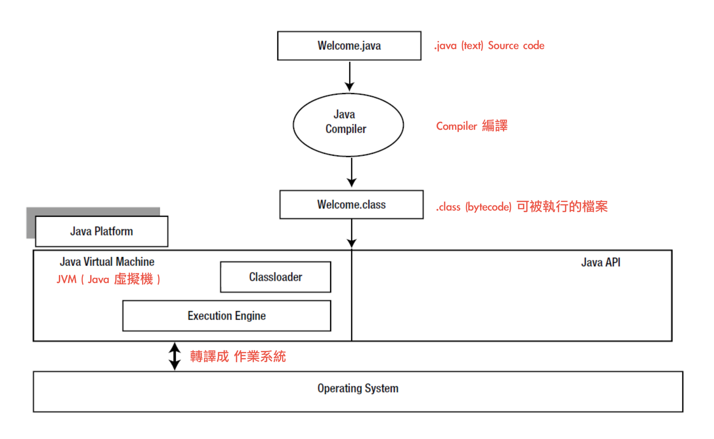
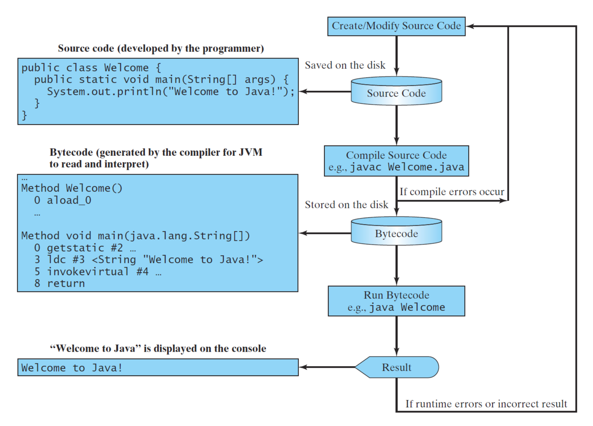

# Lecture_1: 介紹
## 預備知識
  - 假設大家都沒有學過的情況下
  - 課堂中的範例，基本上都是高中數學
  - 課堂上的每個東西都是重要且基礎的

## 教學理念
  - 降低進入門檻
  - 盡可能提供更多資源
  - 會回答問題

## 學習技巧
  - 一開始只學一門語言，並掌握它。
  - 問很多問題，先Google
  - 熟能生巧，[leetcode](https://leetcode.com/)
  - 可能需要 10000 小時，或多或少，永遠不遲
  - 抓住基本面以獲得長期效益，從底層代碼開始。
  - 手寫代碼。

  > "Knowledge is of no value unless you put it into practice."
  > 除非你把它付諸實踐，否則知識是沒有價值的。
  > Anton Chekhov (1860-1904) 契訶夫

  > "Many roads lead to the path, but basically there are only two: reason and practice."
  > 許多道路通向道路，但基本上只有兩條：理性和實踐。
  > Bodhidharma

## 分級政策
  要獲得證書，您需要完成課程頁面中列出的實驗。
  [作業連結](https://www.csie.ntu.edu.tw/~d00922011/java.html#Programming-Labs)

## 目標
  - 編程是使用編程語言支持的計算模型為現實世界的問題提供解決方案。
  - 最終的解決方案是 編程。
  - 問題 -> 思考 -> 解決方案

## 程式
  - 程序是用人工語言編寫的指令的集合，用於執行由計算機執行的特定任務。
  - 它們幾乎無處不在，例如：
    - 視頻遊戲（例如 Pok ́emon Go、Travel Frog、...）；
    - 作業系統（例如 Linux，...）；
    - 交通工具（例如 紅綠燈、捷運、飛機……）；
    - 搜索引擎（例如 Google，……）；
    - 機器人技術；
    - 電腦病毒；
    - 和更多。

## 如何運行程序
  - 一旦程序被激活，數據和指令都會從磁盤加載到主內存中。
  - 我們現在稱它為進程，它是資源分配的最小單位。
  - 然後程序中的指令被CPU調度執行。
    - CPU 包含算術和邏輯單元 (ALU)、控制單元和寄存器。
  - 即時結果存儲回主內存，並在必要時進一步寫入磁盤。

  > - [TED: Inside your computer (在你的電腦裡)](https://ed.ted.com/lessons/inside-your-computer-bettina-bair)
  > - [TED: What's an algorithm? (什麼是演算法)](https://www.ted.com/talks/david_j_malan_what_s_an_algorithm/transcript)

## 程式語言
  - 程式語言是一種與機器通信的人工語言。
  - 程式語言的元素是語法和語義，用於控制機器的行為。
  - 可以在 [TIOBE](https://www.tiobe.com/) 中找到排名前20 位的編程語言。
  - 每種語言都源於某些原因。

## 簡史
  - 第一代：機器語言
  - 第二代：組合語言
  - 第三代：高階語言
    - 例如，Java。
  - 第四代
    - 例如，SQL。

## 第一代編程語言
  - 第一代程序語言是純機器代碼，即只有1 和0。
  - 每台機器都有自己的指令集。
  - 這意味著您可能不會在每台機器上都執行一個程序。
  - 更糟糕的是，機器語言對人類不友好。

## 第二代編程語言
  - 彙編語言使用助記符來表示指令而不是機器代碼。
  - 因此，這些代碼更易於人類閱讀和書寫。
  - 然後彙編代碼被轉換為機器代碼。
  - 請注意，它呈現的執行模型非常接近機器。

## 第三代編程語言
  - 高級語言通過使用類似英語的單詞、數學符號和標點符號來編寫程序，從而更接近人類語言。
  - 例如，C、C++ 和 Java。

## 一個程序能做什麼？
  - 程序是以特定編程語言表達的 `演算法` 的實現。
  - 現實世界的問題 -> 數學建模 -> 演算法 -> 程序

## 演算法簡述
  - 演算法是一種定義明確的計算過程，它將必要的信息作為輸入並產生正確的答案作為輸出。
  - 簡而言之，演算法是解決特定類別問題的過程，例如食譜或食譜。
  - 演算法 具有如下屬性：
    - `確定性`：所有步驟都被精確定義。
    - `時效性`：對於任何輸入，演算法必須在有限的步數（時間）。
    - `有效性`：演算法足夠基本（例如 + − × ÷），能夠在有限的步驟中準確地完成。
  - 請注意，演算法不僅可以用編程語言表示，還可以用人類語言、流程圖和偽代碼表示。

## 範例：最大數
  - 設 A 儲存一堆數字
  - 例如：考慮 A = {1, 7, 9, -2, 4}
  - 很明顯答案是 9
  - 現在提出一種算法，該算法可以找到任何數字列表中的最大元素。
    ```
    Input：A
    Output：在A中的最大值
    ```
  - 用您的母語嘗試自上而下的方法？

## 最優解
  - 設定 A(1) 為第一個元素，依此類推。
  - 符號 '<-' 是從右到左的複製運算符。
    ```java
    max <− A(1) // 初步猜測，不失一般性！
    for i <− 2  ̃ n
      if A(i) > max
        max <− A(i)
      end
    end
    return max
    ```
  - 第一行，為什麼不使用 `max <- 0`，而使用 `max <- A(1)` ?
    以第一筆資料為基準點。
  - 您可以將此解決方案擴展到更多問題：
    - 最小值？
    - 最大值的位置？

  > "Computers are good at following instructions, but not at reading your mind."
  > 計算機善於遵循指令，但不善於讀懂你的想法。
  > - Donald Knuth (1938-) (唐納德高德納)

  > "There are two ways of constructing a software design: One way is to make it so simple that there are obviously no deficiencies, and the other way is to make it so complicated that there are no obvious deficiencies. The first method is far more difficult."
  > 有兩種構建軟件設計的方法：一種是簡單到沒有明顯缺陷的程度，另一種是複雜到沒有明顯缺陷的方法。第一種方法要困難得多。
  > – Tony Hoare (1934-) (托尼霍爾)

## 艾倫·圖靈
  - 使用圖靈機 提供了算法和計算概念的形式化，可以將其視為通用計算機的模型。
  - 提出了著名的問題："機器能思考嗎？"
    - 眾所周知的圖靈測試。
  - [圖靈獎](https://amturing.acm.org/) 被公認為計算機科學領域的最高榮譽，被譽為 "計算界的諾貝爾獎"。
  - 你可以看看 [模仿遊戲](https://www.imdb.com/title/tt2084970/) (2014)
  - 英國的 50 英鎊鈔票將紀念計算機先驅艾倫·圖靈。

## 關於 Java
  - Java是通用編程語言之一，支持 物件導向編程（OOP）。
  - Java 平台的第一個版本於 1995 年由 Sun Microsystems 發布，從 2010 年起現在由 Oracle Corporation 所有。
  - 它旨在讓應用程序開發人員編寫一次，隨處運行 (WORA)。

## Java Virtual Machine (JVM)
  - Java 虛擬機 (JVM) 用於根據主機平台將 Java 字節碼翻譯成機器碼。
  - 顯然，JVM 是一個軟件程序，而不是一台物理機器。
  - 為了增強安全性，程序被執行前，JVM 會先驗證所有字節碼。
  - 沒有用戶程序可以使主機崩潰。

## 編譯 與 運行 Java 程式
  

## 安裝軟體
  - 首先，需要安裝 Java Development Kit 8 ([JDK 8](https://www.oracle.com/technetwork/java/javase/downloads/jdk8-downloads-2133151.html))
    - `JDK` 每半年會釋出一個版本，
    - 目前業界穩定版 為 `JDK8`、`JDK11`或`JDK17`
  - 第二步，我們需要一個集成開發環境 (IDE)，它提供全面的設施，比如代碼完成、調試器和構建自動化工具。
    - 本課程中使用 [Eclipse](https://www.eclipse.org/downloads/)。
    - 您可以嘗試其他 IDE，例如 NetBeans、IntelliJ IDEA、或帶有適當包的 Visual Studio Code。
  - [mac版本參考安裝方式](https://ithelp.ithome.com.tw/articles/10290631)
    - [查看macOS 版本](https://support.apple.com/zh-tw/HT201260)

## 第一個編程：Hello, World
  ```java
  public class HelloJavaDemo {
    public static void main(String[] args) {
      // Print "Hello, Java." on the screen.
      System.out.println("Hello, Java.");
    }
  }
  ```
  - `class`: 聲明一個新類，跟一個不同的類名。
  - `public`: 可以被任何其他類訪問。
  - `static`: 可以在沒有任何對象的情況下被調用。
  - `void`: 沒有返回值。

  > 1. 開啟 `Eclipse`，設定 `workspace` 位置
  > 2. 新建一個 new Java Project，並設定 `Project name`，且`JRE` 選擇 `JavaSE-1.8`
    >> - 若無此項目，請 確認 `Window / perspective / open Perspective / other`，選擇 `Java`
  > 3. 選擇左側 `src 資料夾`，右鍵 `new / class`，設定 `class Name`。

  - `class` 是Java 程序的實體。
  - 該 `class` 可能有一個名為 `main()` 的特殊方法，作為程序的入口點。
  - `System.out` 指的是標準輸出設備，如：螢幕。
  - `println()` 方法用於將字符串輸出到 螢幕。
  - 每個語句都以 `分號(;)` 結尾。

## Public Classes
  - 關鍵字 `public` 是一種訪問修飾符，允許工程師控制 `Class` 和成員的可見性。
  - `public class` 的名稱與文件名相同。
  - 一個文件中最多只能有一個 `public class`。

## 如何運行一個 Java 程式
  

## 特殊字符表
| 符號 | 名稱            | 說明                  |
|:----:|---------------|---------------------|
| { }  | 打開/關閉大括號 | 表示一個包含語句的塊。 |
| ( )  | 打開/關閉括弧   | 主要與方法一起使用。   |
| [ ]  | 打開/關閉方括號 | 表示一個陣列。         |
|  //  | 雙斜線          | 在註釋行之前。         |
| " "  | 打開/關閉引號   | 附上一個字符串。       |
|  ;   | 分號            | 標記語句的結束。       |

## Bugs
  - `Bugs` 是計算機程序或系統中的錯誤、瑕疵、故障或缺失，會產生不正確或意外的結果，或者以意想不到的方式出現。
    - `Compile-time error (編譯時錯誤)`：大部分是語法錯誤。
    - `Runtime error (運行時錯誤)`：發生在 Java 程序運行時，例如 1/0。
    - `Logic error (邏輯錯誤)`：通過實現功能引入要求不正確。
  - 請注意，邏輯（語義）錯誤是最隱蔽的，因為它們很難被發現。

  > "If debugging is the process of removing software bugs, then programming must be the process of putting them in."
  > 如果 `調試` 是去除軟件錯誤的過程，那麼 `編程` 一定是把它們放進去的過程。
  > - Edsger W. Dijkstra (1930–2002)

  > "我們為什麼會倒下？這樣我們就可以學會振作起來。"
  > - Alfred Pennyworth, Batman Begins (2005)

## 編程風格
  - 良好的編程風格使 程式 易於閱讀並幫助工程師防止錯誤。
    - 例如，[Google Java Style](https://google.github.io/styleguide/javaguide.html)。
  - 特別是，我們使用縮進來增強 視覺結構關係。
  - 在整個編程中保持一致！

## 相關連結
  - [計算機科學地圖](https://www.youtube.com/watch?v=SzJ46YA_RaA), 科學領域
  - 技術樹：https://roadmap.sh/
  - DeepMind：[AlphaGo](https://www.youtube.com/watch?v=WXuK6gekU1Y&ab_channel=DeepMind)，2017
  - 關於計算機科學（或 AI）的電影：[這裡](https://www.csie.ntu.edu.tw/~d00922011/java/cs_films.pdf)
  - 現代人工智能服務現已推出：[Lawerence Lin, 2023 AI 工具大集合 — 50+ 個人智慧軟件應用整合](https://limitpress.com/posts/2023-ai-%E5%B7%A5%E5%85%B7%E5%A4%A7%E9%9B%86%E5%90%88-%E8%B6%85%E9%81%8E-50-%E5%80%8B%E4%BA%BA%E5%B7%A5%E6%99%BA%E6%85%A7%E8%BB%9F%E9%AB%94%E6%87%89%E7%94%A8%E6%95%B4%E7%90%86/), 2023.1.29
  - [孩子們編碼](https://www.google.com/doodles/celebrating-50-years-of-kids-coding?hl=zh-TW)