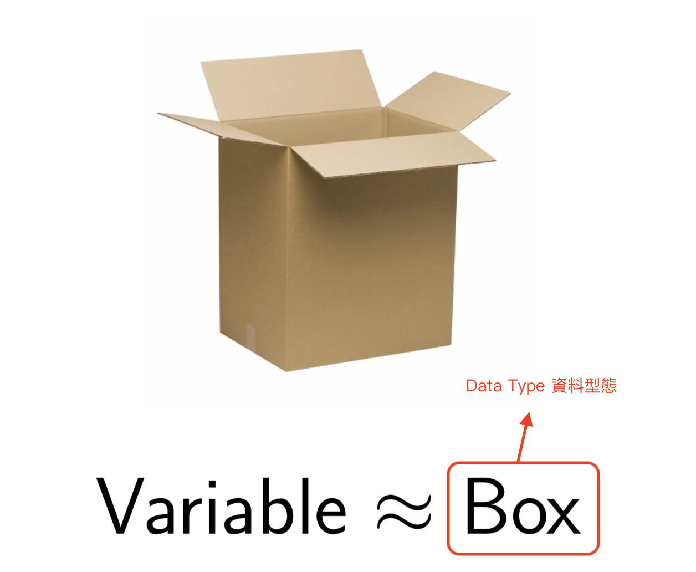
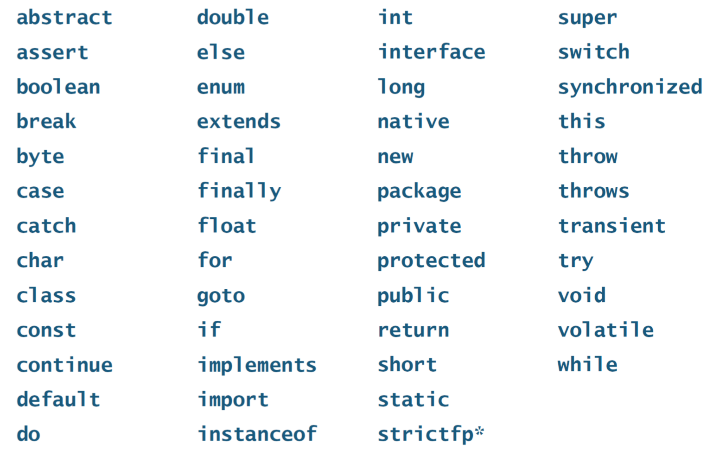
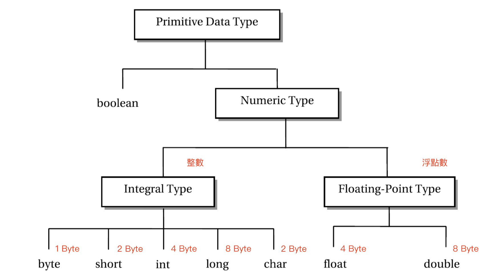
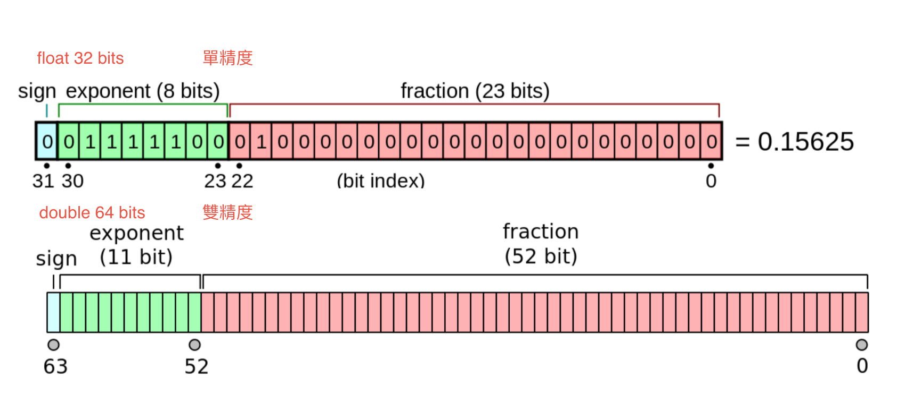
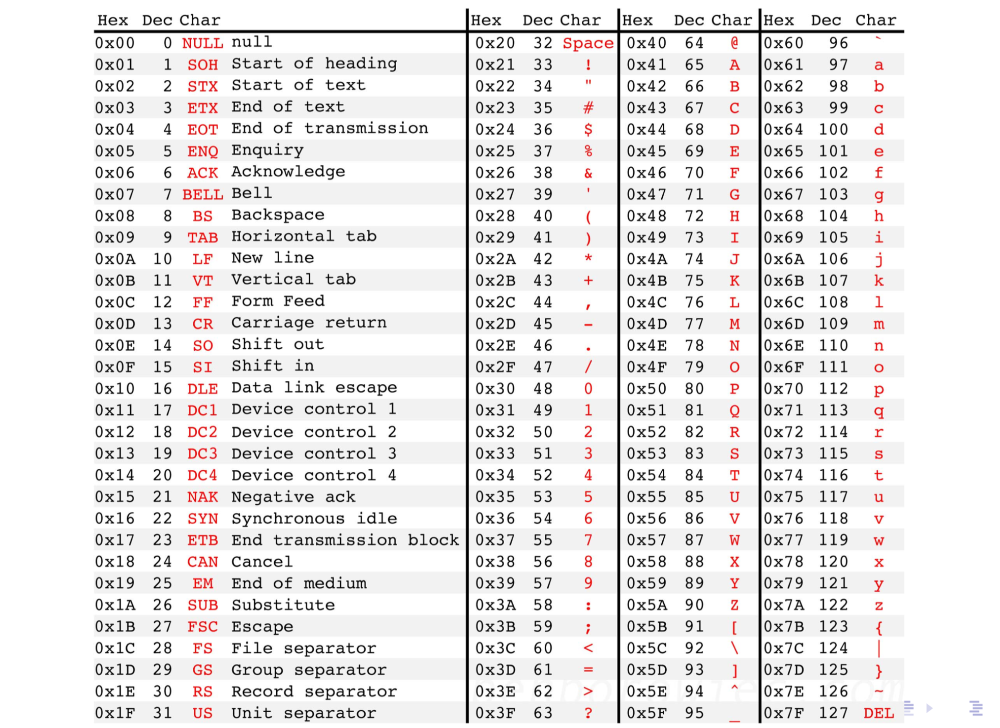
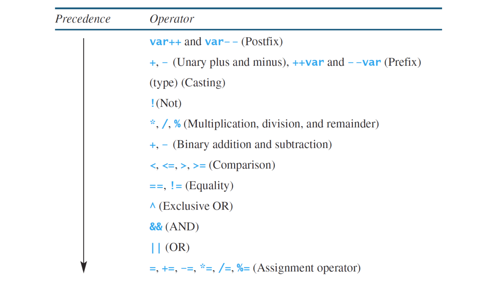
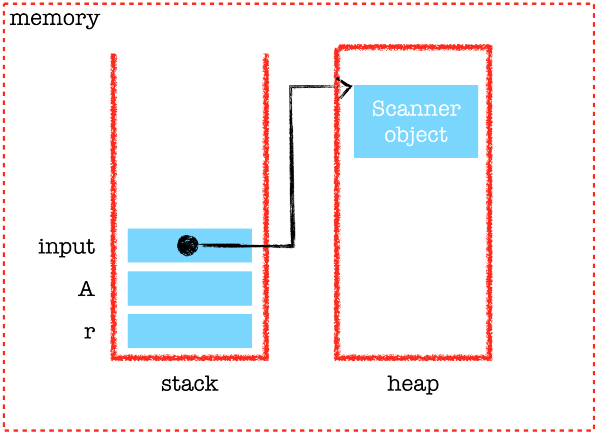
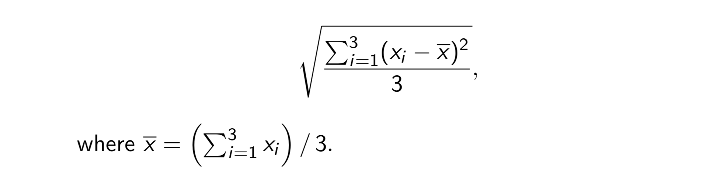

# Lecture_2 數據類型、變數和運算符
  ```java
  class Lecture2 {
    "Data types, Variables, and Operators"
  }
  // Keywords:
  byte, short, int, long, char, float, double, boolean, true, false, import, new
  ```

## 範例
  - 給一個圓的半徑，比如 10，求得面積。
    - 輸入：如何存儲數據？
    - 算法：如何計算面積？
    - 輸出：如何顯示結果？

    ```java
    public class ComputeAreaDemo {
      public static void main(String[] args) {
        // Input
        int r = 10;

        // Algorithm
        double A = r * r * 3.14;

        // Output
        System.out.println(A);
      }
    }
    ```

    這裡我們使用了兩種原始數據類型：`int`、`double`。

    

## 變數宣告
  - 首先，我們將變數命名為 `x`。
  - 然後我們需要為 `x`，確定一個合適的類型
  - 例如：
    ```java
    int x; // x 是一個 整數型態 的 變數宣告.
    ```

## 命名規則
  - 命名規則不包括以下情況：
    - 不能以 `數字 開頭`。
    - 不能是任何 `保留字`。
    - 字母之間不能有任何 `空格`。
    - 不能包含運算符，如 `+`、`-`、`*`、`/`。
  - 請注意，Java 區分大小寫。
  - 這些規則也適用於 方法(methods)、類別(classes)...等。

## 保留字 (JDK8)
  
  - 本課程 覆蓋率：44 / 50 = 88%。

## 變數宣告 背後做的事情
  - 變數宣告 實際上是要求編譯器為變數分配一個記憶體空間。
  - 特別是，它的數據類型決定了內存分配的大小。
  - 大小以 `bits` 或 `bytes` 為單位進行量化。
    - 1 個 `bit`，表示一個二進制數字。
    - 1 個 `byte`，等於 8 bits。
  - 例如：1 個 int 值 分配 32 bits (or 4 byts)

## 變數 在 記憶體位置中的別名
  
  - 記憶體位置 是以 0x 文字開頭的 十六進制 (hex) 整數。
  - 十六進制數被廣泛用於表示，比如：內存地址和顏色。

## 數據類型
  - 每一個變數 都需要一個型態。
  - 此外，每個語句（或表達式）都有一個型態。
  - 數據型態的概念對編程語言至關重要。
    - 我要說的是，數據型態的概念就像自然法則。
  - Java 是一種靜態型態的語言。
    - 變數在宣告型態後才可用。
  - 我們現在繼續介紹兩類數據型態：`primitive types` ( 原始型態 ) 和 `reference types` ( 參考型別 )。

## Primitive Types ( 原始型態 )
  

  原始型態 共 9 種型態：
  - `void`
  - `boolean`
  - 數字型態
    - 整數型態
      - `byte`
      - `short`
      - `int`
      - `long`
      - `char`
    - 浮點數型態
      - `float`
      - `double`

## 番外篇：二進制
  - 我們熟悉十進制。 （為什麼？）
  - 對於計算機，採用二進制系統是因為它的性質：只有兩種狀態，開和關。
  - 然而，兩者是等價的，只是它們在表示上有所不同。
  - 例如：
    - 999₁₀ = 9 x 10² + 9 x 10¹ + 9 x 10⁰
  - 相似地：
    - 111₂ = 1 x 2² + 1x 2¹ + 1 x 2⁰ = 7₁₀
  - 不需要用二進制寫代碼，因為我們正在使用高階語言。

## Integers ( 整數 )
  |Name    | Bits |                                       Range | Approx. Range|
  |--------|-----:|--------------------------------------------:|-------------:|
  |`byte`  |    8 |                                    0 to 255 |        <= 255|
  |`short` |   16 |                             -32768 to 32767 |      ±3 x 10⁴|
  |`int`   |   32 |                   -2147483648 to 2147483647 |      ±2 x 10⁹|
  |`long`  |   64 | −9223372036854775808 to 9223372036854775807 |     ±9 x 10¹⁸|

  - 最常用的整數型態是 `int`。
  - 請注意，範圍僅限於其有限的存儲大小。
  - 如果數字超出類型的可行範圍，則會發生溢出。

## Float-Point ( 浮點數 )
  |Name     | Bits |        Approx. Range|
  |---------|-----:|--------------------:|
  |`float`  |   32 | 1.4e₋₀₄₅ to 3.4e₊₀₃₈|
  |`double` |   64 | 4.9e₋₃₂₄ to 1.8e₊₃₀₈|

  - 符號 e（或在某些情況下為 E）表示基於 10 的科學記數法。
    - 例如： 1e₂ = 100 和 −1.8e₋₃ = −0.0018。
  - 計算需要小數精度的表達式時使用浮點數。
    - 例如：sin()、cos() 和sqrt()。
  - 如果是這樣，那麼整數就顯得多餘了！
  - 然而，浮點系統只能逼近實數運算！ （為什麼？）

## 機器錯誤
  ```java
  public class MachineEpsilonDemo {
    public static void main(String[] args) {
      System.out.println(0.5 - 0.1 - 0.1 - 0.1 - 0.1 - 0.1);
      // 2.7755575615628914E-17

      System.out.println(0.1 + 0.2);
      // 0.30000000000000004
    }
  }
  ```

  - 你能解釋為什麼嗎？  (電腦使用有限空間來存放 浮點數)
  - 然後我們設計 算法來縮小 機器錯誤。
  - 更重要的是，我們避免在關鍵應用程序中使用浮點數，而是使用整數。

## 另一個例子
  ```java
  ...
    System.out.println(3.14 + 1e20 - 1e20);   // 0.0
    System.out.println(3.14 + (1e20 - 1e20)); // 3.14
  ...
  ```

  - 浮點算術 (FP) 是使用實數的公式表示，作為近似值以支持範圍和精度之間的權衡的算術。
  - 您還可以閱讀這篇文章[《每位計算機科學家都應了解的浮點運算知識》](https://docs.oracle.com/cd/E19957-01/806-3568/ncg_goldberg.html)。

## IEEE 浮點表示
  ```java
  // IEEE 754
  x = (−1)ˢ × M × 2ᴱ
  ```

  - 符號位s決定數是否為負數 (s = 1) 或正數 (s = 0)。
  - 尾數 M 是一個小數二進制數，範圍是在 1 和 2−ε 之間，或者在 0 和 1−ε 之間。
  - 指數 E 通過 a（可能為負）對值進行加權2的冪。

## 示意圖
  
  
  - 這就是我們稱之為雙精度值的原因。
  - 雙精度值至少有16 位有效數字！

## 作業
  - 賦值語句為變數指定一個值。
    ```java
    int x; // 宣告變數.
    ...
    x = 1; // 賦值.
    ```
  - `等號(=)` 用作賦值運算符。
    - 例如，表達式 `x = x + 1` 是否正確？ ( 正確，表示 x + 1 之後 再賦值給 x )
    - 方向：從右手邊到左手邊
  - 要為變數賦值，必須將變數名放在賦值運算符的左側。
    - 例如，1 = x 是錯誤的。
    - 1 無法解析為內存空間。

## 兩個 Before 規則
  - 變數 `必須先宣告`，然後才能賦值。
    - 實際上，除非需要，否則不要宣告變數。
  - 宣告的變數 `必須先賦值` 才能使用。

## 相關連結
  - T-Universitetet i København 的 [計算機算法](http://www.itu.dk/people/sestoft/papers/computernumbers.pdf)
  - [二進制到十進制轉換器](https://www.rapidtables.com/convert/number/binary-to-decimal.html)
  - Jserv，[軟件故障](https://hackmd.io/@sysprog/software-failure)
  - [加速AI深度學習　BF16浮點格式應運而生](https://www.eettaiwan.com/20200304NT02-ai-gets-its-own-system-of-numbers/)

## 算術運算符
  | 算式 | 操作 |      範例 | 結果 |
  |:----:|----|----------:|-----:|
  |  +   | 加法 |   12 + 34 |   46 |
  |  -   | 減法 |   56 - 78 |  -22 |
  |  *   | 乘法 |   90 * 12 | 1080 |
  |  /   | 除法 | 3.0 / 2.0 |  1.5 |
  |  %   | 取餘 |    20 % 3 |    2 |

  - 如果是 3/2 ? (1，因為左右兩邊都是 int(整數))
  - 請注意，運算符取決於所涉及的操作數。

## 概念確認
  ```java
  ...
    double x = 1 / 2;
    System.out.println(x); // Output?
  ...
  ```

  - 輸出是什麼？
    - 0.0
  - 你能解釋這個結果嗎？
    - `double x` 宣告 x型態，編譯時執行。
    - `x = 1 / 2` 決定 x 的值，運行時執行。

## 型態轉換和兼容性
  - 如果一種類型與另一種類型兼容，則編譯器將隱式執行轉換。
    - 例如，整數 1 兼容雙精度值 1.0。
    - 因此，Java 是一種弱類型語言。
  - 但是，沒有從 `double` 到 `int` 的自動轉換。 （為什麼？）
    - 例如，1.2 無法使用 1 來表示。
  - 為此，您必須使用執行顯式轉換的強制轉換。
  - 同樣，`long` 值與 `int` 不兼容。

## 轉型
  ```java
  ...
    int x = 1;
    double y = x; // 可以轉換，是相容的; 隱式轉換。

    x = y;        // 不允許，除非轉型。
    // or
    x = (int) y;  // Succeeded!! 強制轉型
  ...
  ```

  - 請注意，Java 編譯器只進行 `型態檢查`，而不會在編譯前真正執行。
  - 換句話說，x 和 y 的值在真正執行之前是未知的。

## 類型轉換和兼容性（續）
  - Small-size types ⇒ large-size types.
    - 如： int(32) ⇒ long(64) 
  - Small-size types ⇍ large-size types (需要轉型).
    - 如： int(32) ⇍ long(64) (需要轉型)
  
  - Simple types ⇒ complicated types.
    - 如： int(32) ⇒ double(64) 
  - Simple types ⇍ complicated types (need a cast).
    - 如： int(32) ⇍ double(64) 

## 文本：Character 和 String
  - 每個字符都以 0 和 1 的序列編碼。
    - 例如，ASCII。（見下一頁。）
  - Java 使用 Unicode 來表示由 char 表示的 `Character`，char 是一個 16-bit 無符號值。
  - 但是，我們經常使用 `String` 來表示文本，如前所示。
  - 作為類比，分子（String）由原子（characters）組成。

## ASCII (7-bit version)
  

## 範例
  ```java
  ...
    char c = 'a';                       // A char value should be single−quoted.
    System.out.println(c + 1);          // Output 98!! (why?) 
    System.out.println((char)(c + 1));  // Output b.

    String s = "Java";                  // A string should be double−quoted.
    System.out.println(s + 326);        // Output Java326. 
  ...
  ```

  - 為什麼要對字符應用算術運算符，例如第 4 行？
    - 通常用在 加密技巧上
  - 在第 7 行中，將 + 運算符應用於 String 的結果與第 3 和 4 行完全不同。（為什麼？）
    - `char` + `int` => `int`
      - `char` 為 2 byte，`int` 為 4 byte，所以 會隱式轉型為 `int`
    - `string` + `int` => `string`
      - `int` 會被強制轉型

## Boolean Values
  - 該程序可以自行做出決策，例如 自動駕駛汽車。
  - 為此，Java 具有 `boolean` 型態的流程控制（分支和迴圈）。
  - 這種類型只有兩個可能的值，`true` 和 `false`。
  - 請注意，`boolean` 不能轉換為另一種類型的值，也不能將另一種類型的值轉換為 `boolean`。 （為什麼？）
    - 避免語法上的錯誤，如 ： `1 < x < 3`， 會先執行 `1 < x`，若能運行的情況下，當判斷成功後，只會得到 0 或 1 的結果( true or false)。

## 關係運算符
  | java Operator | Mathematics Symbol | Name                     |
  |:-------------:|:------------------:|:-------------------------|
  |       <       |         <          | less then                |
  |      <=       |         ≤          | less than or equal to    |
  |       >       |         >          | greater than             |
  |      >=       |         ≥          | greater than or equal to |
  |      ==       |         =          | equal to                 |
  |      !=       |         ≠          | not equal to             |

  - 關係運算符接受兩個操作數並返回一個 `boolean`。
  - 請注意，數學相等運算符是 `==`，而不是 `=`。

## 範例
  ```java
  ...
    int x = 2;
    System.out.println(x > 1);        // Output true.
    System.out.println(x < 1);        // Output false.
    System.out.println(x == 1);       // Output false.
    System.out.println(x != 1);       // Output true.
    System.out.println(1 < x < 3);    // Sorry?
  ...
  ```

  - `1 < x < 3` 是 語法錯誤
  - 你需要將一個複雜的語句拆分成幾個基本的語句，並通過邏輯運算符將它們連接起來。
  - 範例中， 1 < x < 3 應該寫成 `1 < x` && `x < 3` , 『 `&&` 』是 And 運算符。

## 邏輯運算符
  | 運算子 | 名稱 |
  |:------:|:-----|
  |  `!`   | NOT  |
  |  `&&`  | AND  |
  |  `||`  | OR   |
  |  `^`   | XOR  |

  - 我們使用 XOR 來表示 `互斥或` 運算符。

## 真值表
  - 令 X 和 Y 為兩個 布林變數。
  - 那麼邏輯運算符的 真值表 如下：
    | X | Y | !X | X&&Y | X∥Y | X∧Y |
    |:-:|:-:|:--:|:----:|:---:|:---:|
    | T | T | F  |  T   |  T  |  F  |
    | T | F | F  |  F   |  T  |  T  |
    | F | T | T  |  F   |  T  |  T  |
    | F | F | T  |  F   |  F  |  F  |
  - 值得一提的是，算術運算符等計算機的基本指令是由布林邏輯實現的。
    - 例如，1-bit 加法器可以使用XOR 運算符實現。
    - 你能想像這些非常基本的元素（0、1、AND、OR、NOT）與跳躍的組合產生了在 2016 年擊敗人類的 [AlphaGo](https://en.wikipedia.org/wiki/AlphaGo)。

> "Logic is the anatomy of thought."
> "邏輯是思想的解剖。"
> – John Locke (1632–1704)

> "This sentence is false."
> "這句話是錯的。"
> – anonymous

> "I know that I know nothing."
> 我知道我一無所知
> – Plato

## 算術複合賦值運算符
  - 請注意，這些速記運算符在 Matlab 和 R 等語言中不可用。

  | 運算子 | 名稱          |
  |:------:|-------------|
  |   ++   | 遞增 (by one) |
  |   +=   | 加法賦值      |
  |   −=   | 減法賦值      |
  |   *=   | 乘法賦值      |
  |   /=   | 除法賦值      |
  |   %=   | 餘數賦值      |
  |   −−   | 遞減 (by one) |

## 範例
  ```java
  ...
    int x = 1;
    System.out.println(x);  // Output 1.
    x = x + 1;
    System.out.println(x);  // Output 2.
    x += 2;
    System.out.println(x);  // Output 4.
    x++;                    // 與 x += 1 和 x = x + 1 同樣意思.
    System.out.println(x);  // Output 5.
  ...
  ```

  - 複合賦值運算符對於 char 值也很有用。 23
  - 例如：
    ```java
    ...
      char s = 'a';
      System.out.println(s);    // Output a.
      s += 1;
      System.out.println(s);    // Output b.
      s++;
      System.out.println(s);    // Output c.
    ...
    ```

## ++x vs. x++
  ```java
  ...
    int x = 1;
    int y = ++x;
    System.out.println(y);      // Output 2.
    System.out.println(x);      // Output 2.

    int w = 1;
    int z = w++;
    System.out.println(z);      // Output 1.
    System.out.println(w);      // Output 2.
  ...
  ```

  - 表達式 `++x` 首先遞增 `x` 的值，然後返回 `x`。
  - 相反，`x++` 首先返回 `x` 的值，然後 `自增`。
  - 我們將經常使用這些符號。

    |   | ++x | x++ |
    |---|-----|-----|
    | x | 2   | 2   |
    | y | 2   | 1   |

    > y = x++;
    > -- 可拆解如下：
    > y = x;
    > x = x + 1;

    > y = ++x;
    > -- 可拆解如下：
    > x = x + 1;
    > y = x;

## 運算符優先級
  

  - 帶有賦值運算的 通通都是最後執行

## 使用括號
  - 括號用於表達式中以更改運算符之間的自然優先級順序。
  - 人們總是首先計算括號內的表達式。

## 記憶體模型 Scanner 物件
  - 修改源代碼並為不同的半徑重新編譯它是不方便的。
  - 從控制台讀取使程序能夠接收來自用戶的輸入。
  - Scanner 對象提供一些輸入方法，例如從鍵盤或文件接收的輸入。
  - Java 使用`System.in` 來引用標準輸入設備，默認情況下是鍵盤。

## 範例：從控制台讀取輸入
  ```java
    import java.util.Scanner;
    ...
      // Create Scanner object to receive data from keyboard.
      Scanner input = new Scanner(System.in);

      // INPUT
      System.out.println("Enter r?");
      // Assign an integer from the keyboard to r.
      int r = input.nextInt();

      // ALGORITHM
      double A = r * r * 3.14;

      // OUTPUT
      System.out.println(A);
      input.close(); // Cleanup: reclaim the resource.
    ...
  ```

  - `input` 是使用 `new` 運算符創建一個 `Scanner` 對像作為鍵盤和程序之間的代理。
  - 值得注意的是，所有對像都是動態創建的，並駐留在 `heap` 記憶體中的。 （請參見下一頁中的圖。）
  - 為了操作這個對象，然後將其 `記憶體位址` 分配給變數 `input`，它被分配在 `stack` 記憶體中。
  - 然後 `input` 稱為對 `Scanner` 對象的 `參考(reference)`。
  - 由此看來，記憶包含人類數據，也包含了 `參考(reference)`（即記憶體位址）。

## 簡化內存模型
  

  - `new` 動作的時候 才會 在 `heap` 出現。
  - 而 `input` 儲存的 只是 記憶體位置。

  - [Java面試 - JVM 的 Stack 和 Heap 差異](https://blog.marklee.tw/java-interview-jvm-stack-heap/)

## 掃描儀提供的方法
  | 方法         | 說明                                         |
  |:-------------|:-------------------------------------------|
  | nextByte()   | 讀取 Byte type 的整數。                       |
  | nextShort()  | 讀取 short type 的整數。                      |
  | nextInt()    | 讀取 int type 的整數。                        |
  | nextLong()   | 讀取 long type 的整數。                       |
  | nextFloat()  | 讀取 float type 的數字。                      |
  | nextDouble() | 讀取 double type 的數字。                     |
  | next()       | 讀取在 shitespace 字符之前結束的字符串。      |
  | nextLine()   | 讀取一行文本（即以按下 Enter 鍵結尾的字符串）。 |

## 範例 身體質量指數 (BMI)
  編寫一個程序，輸入用戶名、身高（cm）、體重（kgw），輸出用戶名和BMI，即
  `BMI = weight(kgw) / height²(m²)`

  > 注意單位換算！

  ```java
  ...
    Scanner input = new Scanner(System.in);
    
    // INPUT
    System.out.println("Enter your name?");
    String name = input.nextLine();

    System.out.println("Enter your height (cm)?");
    double height = input.nextDouble();

    System.out.println("Enter your weight (kgw)?");
    double weight = input.nextDouble();

    // ALGORITHM
    double bmi = 10000 * weight / height / height;
    
    // OUTPUT: name (bmi)
    System.out.println(name + " (" + bmi + ")");
  ...
  ```

## 練習：兩個簡單的描述性統計
  編寫一個程序，將 3 個數字作為用戶輸入，併計算平均值和標準差。

  - 請注意，這三項的標準差由下式給出
    

  - 下面列出了兩種數學方法：
    - Math.pow(double x , double y) for xy。
    - Math.sqrt(double x) 用於√x。

  ```java
  ...
    // INPUT
    Scanner input = new Scanner(System.in);
    System.out.println("a = ?");
    double a = input.nextDouble();
    System.out.println("b = ?");
    double b = input.nextDouble();
    System.out.println("c = ?");
    double c = input.nextDouble();
    input.close();

    // ALGORITHM
    doublemean=(a+b+c)/3;
    double std = Math.sqrt((Math.pow(a − mean, 2) +
    Math.pow(b − mean, 2) +
    Math.pow(c − mean, 2)) / 3);

    // OUTPUT
    System.out.println("Mean = " + mean);
    System.out.println("Std = " + std);
  ...
  ```