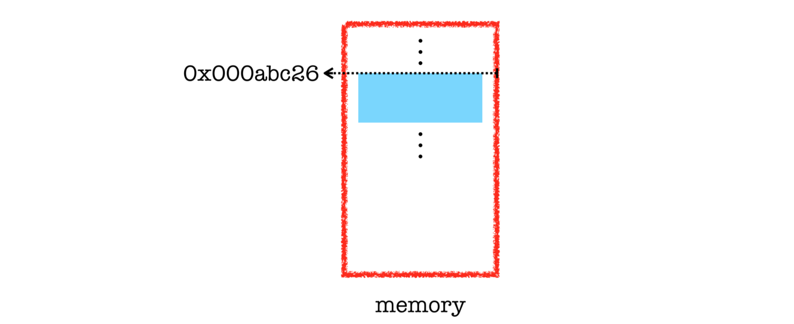

# Lecture_2 數據類型、變數和運算符
  ```java
  class Lecture2 {
    "Data types, Variables, and Operators"
  }
  // Keywords:
  byte, short, int, long, char, float, double, boolean, true, false, import, new
  ```

## 範例
  - 給一個圓的半徑，比如 10，求得面積。
    - 輸入：如何存儲數據？
    - 算法：如何計算面積？
    - 輸出：如何顯示結果？

    ```java
    public class ComputeAreaDemo {
      public static void main(String[] args) {
        // Input
        int r = 10;

        // Algorithm
        double A = r * r * 3.14;

        // Output
        System.out.println(A);
      }
    }
    ```

    這裡我們使用了兩種原始數據類型：`int`、`double`。

    

## 變數宣告
  - 首先，我們將變數命名為 `x`。
  - 然後我們需要為 `x`，確定一個合適的類型
  - 例如：
    ```java
    int x; // x 是一個 整數型態 的 變數宣告.
    ```

## 命名規則
  - 命名規則不包括以下情況：
    - 不能以 `數字 開頭`。
    - 不能是任何 `保留字`。
    - 字母之間不能有任何 `空格`。
    - 不能包含運算符，如 `+`、`-`、`*`、`/`。
  - 請注意，Java 區分大小寫。
  - 這些規則也適用於 方法(methods)、類別(classes)...等。

## 保留字 (JDK8)
  
  - 本課程 覆蓋率：44 / 50 = 88%。

## 變數宣告 背後做的事情
  - 變數宣告 實際上是要求編譯器為變數分配一個記憶體空間。
  - 特別是，它的數據類型決定了內存分配的大小。
  - 大小以 `bits` 或 `bytes` 為單位進行量化。
    - 1 個 `bit`，表示一個二進制數字。
    - 1 個 `byte`，等於 8 bits。
  - 例如：1 個 int 值 分配 32 bits (or 4 byts)

## 變數 在 記憶體位置中的別名
  
  - 記憶體位置 是以 0x 文字開頭的 十六進制 (hex) 整數。
  - 十六進制數被廣泛用於表示，比如：內存地址和顏色。

## 數據類型
  - 每一個變數 都需要一個型態。
  - 此外，每個語句（或表達式）都有一個型態。
  - 數據型態的概念對編程語言至關重要。
    - 我要說的是，數據型態的概念就像自然法則。
  - Java 是一種靜態型態的語言。
    - 變數在宣告型態後才可用。
  - 我們現在繼續介紹兩類數據型態：`primitive types` ( 原始型態 ) 和 `reference types` ( 參考型別 )。

## Primitive Types ( 原始型態 )
  

  原始型態 共 9 種型態：
  - `void`
  - `boolean`
  - 數字型態
    - 整數型態
      - `byte`
      - `short`
      - `int`
      - `long`
      - `char`
    - 浮點數型態
      - `float`
      - `double`

## 番外篇：二進制
  - 我們熟悉十進制。 （為什麼？）
  - 對於計算機，採用二進制系統是因為它的性質：只有兩種狀態，開和關。
  - 然而，兩者是等價的，只是它們在表示上有所不同。
  - 例如：
    - 999₁₀ = 9 x 10² + 9 x 10¹ + 9 x 10⁰
  - 相似地：
    - 111₂ = 1 x 2² + 1x 2¹ + 1 x 2⁰ = 7₁₀
  - 不需要用二進制寫代碼，因為我們正在使用高階語言。

## Integers ( 整數 )
  |Name   |Bits|Range                                      |Approx. Range|
  |-------|---:|------------------------------------------:|------------:|
  |`byte` |8   |0 to 255                                   | <= 255      |
  |`short`|16  |-32768 to 32767                            | ±3 x 10⁴    |
  |`int`  |32  |-2147483648 to 2147483647                  | ±2 x 10⁹    |
  |`long` |64  |−9223372036854775808 to 9223372036854775807|±9 x 10¹⁸    |

  - 最常用的整數型態是 `int`。
  - 請注意，範圍僅限於其有限的存儲大小。
  - 如果數字超出類型的可行範圍，則會發生溢出。

## Float-Point ( 浮點數 )
  |Name    |Bits|Approx. Range         |
  |--------|---:|---------------------:|
  |`float` |32  | 1.4e₋₀₄₅ to 3.4e₊₀₃₈ |
  |`double`|64  | 4.9e₋₃₂₄ to 1.8e₊₃₀₈ |

  - 符號 e（或在某些情況下為 E）表示基於 10 的科學記數法。
    - 例如： 1e₂ = 100 和 −1.8e₋₃ = −0.0018。
  - 計算需要小數精度的表達式時使用浮點數。
    - 例如：sin()、cos() 和sqrt()。
  - 如果是這樣，那麼整數就顯得多餘了！
  - 然而，浮點系統只能逼近實數運算！ （為什麼？）

## 機器小量
  ```java
  public class MachineEpsilonDemo {
    public static void main(String[] args) {
      System.out.println(0.5 − 0.1 − 0.1 − 0.1 − 0.1 − 0.1);
      // Output? Why?
    }
  }
  ```

  - 你能解釋為什麼嗎？
  - 然後我們設計 算法來縮寫 機器小量。
  - 更重要的是，我們避免在關鍵應用程序中使用浮點數，而是使用整數。

## 另一個例子
  ```java
  ...
    System.out.println(3.14 + 1e20 − 1e20);   // Output?
    System.out.println(3.14 + (1e20 − 1e20)); // Output?
  ...
  ```

  - 浮點算術 (FP) 是使用實數的公式表示，作為近似值以支持範圍和精度之間的權衡的算術。
  - 您還可以閱讀這篇文章[《每位計算機科學家都應了解的浮點運算知識》](https://docs.oracle.com/cd/E19957-01/806-3568/ncg_goldberg.html)。

## IEEE 浮點表示
  ```java
  x = (−1)ˢ × M × 2ᴱ
  ```

  -  符號位s決定數是否為負數 (s = 1) 或正數 (s = 0)。
  - 尾數 M 是一個小數二進制數，範圍是在 1 和 2−ε 之間，或者在 0 和 1−ε 之間。
  - 指數 E 通過 a（可能為負）對值進行加權2的冪。

## 插圖
  
  
  - 這就是我們稱之為雙精度值的原因。
  - 雙精度值至少有16 位有效數字！

## 作業
  - 賦值語句為變數指定一個值。
    ```java
    int x; // Variable declaration.
    ...
    x = 1; //Assign1tox.
    ```
  - 等號(=) 用作賦值運算符。
    - 例如，表達式 x = x + 1 是否正確？
    - 方向：從右手邊到左手邊
  - 要為變數賦值，必須將變數名放在賦值運算符的左側。
    - 例如，1 = x 是錯誤的。
    - 1 無法解析為內存空間。

## 兩個 Before 規則
  - 變數必須先宣告，然後才能賦值。
    - 實際上，除非需要，否則不要宣告變數。
  - 宣告的變數必須先賦值才能使用。

## 算術運算符


## 概念檢查


## 型態轉換和兼容性
  