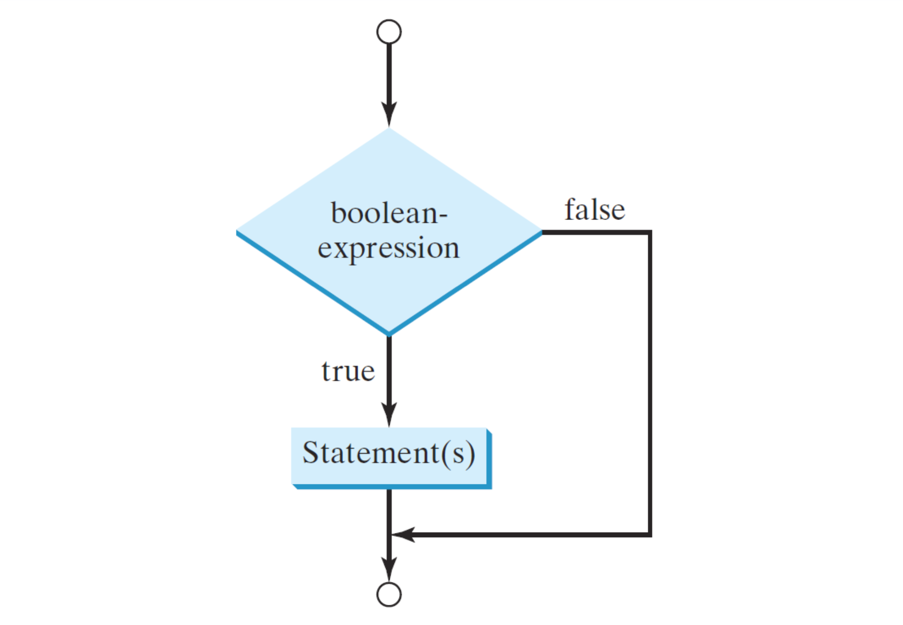
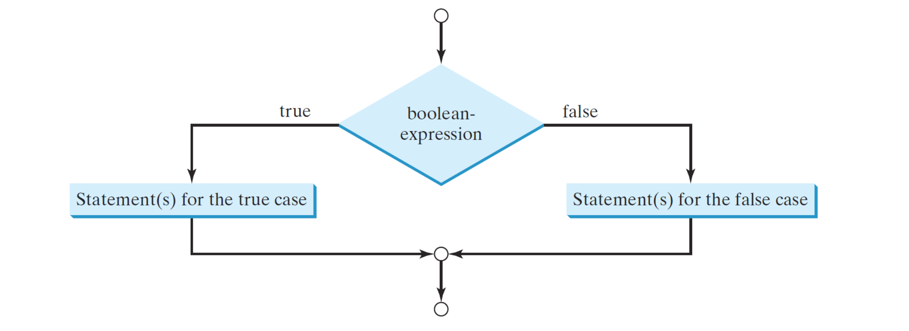

# Lecture_3 分支
  ```java
  class Lecture3 {
    "流程控制：有條件的控制"
  }
  // Keywords:
  if, else, switch, case, default, break
  ```

## 流程控制
  - 我們繼續介紹算法的構建塊如下。
  - 首先，大多數語句是按順序執行的。
  - 如果已知分支（選擇）規則，程序可以處理多種情況。
  - 此外，程序可以在必要時重複操作。
  - 例如，還記得如何在輸入列表中找到最大值嗎？

## 分支的表示
  - `if-else` 的條件語句。
  - `switch-case-break-default` 的條件語句。
  - 條件運算符。

## 分支語句：if
  - 語法簡單，如下所示。
    ```java
    ...
      if(/* 條件：一個布林表達式 */) {
        // 選擇主體：條件語句。
      }
    ...
    ```
  - 如果條件被評估為 `true`，則條件語句將被執行一次。
  - 如果為 `false`，則選擇主體將被忽略（或者我們說程序跳轉到下一個段落）。
  - 請注意，如果正文僅包含單個語句，則可以省略大括號。

  

## 範例：圓形面積（重新訪問）
  編寫一個程序，接收一個正數作為圓的半徑並輸出結果面積。

  ```java
  ...
    if (r > 0) {
      double A = r * r * 3.14;
      System.out.println(A);
    }
  ...
  ```

  `false` 的情況下怎麼辦？

## if-else 語句
  ```java
  ...
    if (/* 條件：一個布林表達式 */) {
      // Body for the true case.
    } else {
      // Body for the false case.
    }
  ...
  ```

  

## 範例：圓形面積（重新訪問）
  現在為 `false` 情況添加條件語句。

  ```java
  ...
    if (r > 0) {
      double A = r * r * 3.14;
      System.out.println(A);
    } else {
      System.out.println("Not a circle.");
    }
  ...
  ```

## 巢狀條件語句 範例
  編寫一個程序，將百分比成績轉換為字母成績。

  ```java
  ...
    if (score >= 90)
      System.out.println("A");
    else {
      if (score >= 80)
        System.out.println("B");
      else {
        if (score >= 70)
          System.out.println("C");
        else {
          if (score >= 60)
            System.out.println("D");
          else
            System.out.println("F");
        }
      }
    }
  ...
  ```

## 多個分支
  ```java
  ...
    if (score >= 90)
      System.out.println("A");
    else if (score >= 80)
      System.out.println("B");
    else if (score >= 70)
      System.out.println("C");
    else if (score >= 60)
      System.out.println("D");
    else
      System.out.println("F");
  ...
  ```

  - 更容易閱讀！
  - 我們應該避免深縮排。

  ### 先前程序的替代方案如下所示：
  ```java
  ...
    if (score >= 90 && score <= 100)
      System.out.println("A");
    else if (score >= 80 && score < 90)
      System.out.println("B");
    else if (score >= 70 && score < 80)
      ...
  ...
  ```

  - 但是，條件的順序可能是相關的。（為什麼？）
    - 撰寫條件的上下界線
  - 性能可能會因條件順序而降低。（為什麼？）
    - 判斷多久才得出答案

## 常見錯誤
  ```java
  ...
    if (r > 0);
      double A = r * r * 3.14;
      System.out.println(A);
  ...
  ```

  - 不要在條件後方添加分號。
  - 如果您這樣做，則此語句無效（無用）if條件 到分號就結束了。
  - 多個條件語句應該用大括號 `{}` 分組。

## 不確定的範例
  編寫一個程序，首先顯示一個數學問題，比如 0 到 9 之間的兩個隨機整數之和，然後要求用戶鍵入答案。
  - 例如，程序顯示 `2 + 5 =？`
  - 如果用戶鍵入 `7`，則程序報告 "正確"。
  - 否則，程序報告 "錯誤答案。正確答案是 7。"
  - 您可以使用 `Math.random()` 獲取0.0 和1.0 之間的隨機值，不包括它們自己。
  
## 題外話：隨機數生成（RNG）
  - `Math.random()` 只產生 0.0 和 1.0 之間的數字，不包括在內。
  - 要生成 0 到 9 之間的任何整數，我們可以執行
    `(int) (Math.random() × 10)`
    ，因為有 10 種可能的狀態：0, 1, 2,. . . , 9.
  - 通常，您可以使用以下命令生成 L 和 U 之間的任何整數
    `(int) (Math.random() × (U − L + 1)) + L`。（為什麼？）
    - U：上界
    - L：下界、平移數。
    - 如：10~20(包含)，20 - 10 + 1，共 11個數字
    - 加上 平移數，表示 亂數取整 0~10之後，再平移到 10~20
  
  ```java
  ...
    // (1) Generate two random integers.
    int x = (int) (Math.random() * 10);
    int y = (int) (Math.random() * 10);

    // (2) Display the math question.
    System.out.println(x + " + " + y + " = ?");

    // (3) Ask the user to type his/her answer.
    Scanner input = new Scanner(System.in);
    int z = input.nextInt();
    input.close();

    // (4) Judge the input.
    if(z==x+y){
      System.out.println("Correct.");
    }else{
      System.out.println("Wrong.");
      System.out.println("It is " + (x + y) + ".");
    }
  ...
  ```

  - 你能為所有算術運算符 (+ − × ÷) 擴展這個程序嗎？

  > "Exploring the unknown requires tolerating uncertainty."
  > "探索未知需要容忍不確定性。"
  > – Brian Greene

  > "I can live with doubt, and uncertainty, and not knowing. I think it is much more interesting to live not knowing than have answers which might be wrong."
  > 我可以忍受懷疑、不確定和無知。我認為不知道的生活比有可能是錯誤的答案要有趣得多。
  > – Richard Feynman

## 鍛煉
  編寫一個程序，輸出從 −50 到 50 之間的 3 個隨機整數中的最大值。
  - 回憶一下我們班上的第一個算法例子。

  ```java
  ...
    int x = (int) (Math.random() * 101) − 50;
    int y = (int) (Math.random() * 101) − 50;
    int z = (int) (Math.random() * 101) − 50;

    int max = x;
    if (y > max) max = y;
    if (z > max) max = z;
    System.out.println("max = " + max);
  ...
  ```

  - 該程序受數據數量限制。
  - 要開發可重用的解決方案，我們需要 `array數組`和 `loops循環`。

## switch-case-break-default 語句
  ```java
  ...
    switch (target) {
      case v1:
        // 條件語句.
        break; // Leaving:
      case v2:
      .
      .
      .
      case vk:
        // 條件語句.
        break; // Leaving
      default:
        // 默認語句.
    }
  ...
  ```

  - 該結構適用於 `有限` 和 `離散` 條件。
  - 變量目標必須是 `char`、`byte`、`short`、`int`、或 `String` type。不能使用 `Boolean`。
  - v1 的類型，。 . ., 和 vk 必須與目標相同。
  - 可能需要使用 `break` 語句才能離開構造。
  - `default` case 用於在沒有 case 匹配目標時執行默認操作。
    - 這類似於 `else` 語句。

## 範例
  ```java
  ...
    // 我們定義紅綠燈如下：
    // RED: 0
    // YELLOW: 1
    // GREEN: 2

    int trafficLight = (int) (Math.random() * 3);
    switch (trafficLight) {
      case 0:
        System.out.println("Stop!!!");
        break;
      case 1:
        System.out.println("Slow down!!");
        break;
      case 2:
        System.out.println("Go!");
    }
  ...
  ```

## 條件運算符 範例
  ```java
  ...
    if (num1 > num2)
      max = num1;
    else
      max = num2;
      // 上面的語句等價於下面的語句：(三元運算式)
      max = num1 > num2 ? num1 : num2;
  ...
  ```

  - if `num1 > num2`，則執行 `max = num1`.
  - 相反地，執行 `max = num2`.

  > "We must all face the choice between what is right and what is easy."
  > 我們都必須在正確和容易之間做出選擇。
  > – Prof. Albus Dumbledore, Harry Potter and the Goblet of Fire, J.K. Rowling

  > "To be or not to be, that is the question."
  > 存在還是不存在，這是個問題。
  > – Prince Hamlet, Hamlet, William Shakespeare