# Lecture_4 迴圈
  ```java
  class Lecture4 {
    "流程控制：Loops 迴圈"
  }
  // Keywords:
  while, do, for, break, continue
  ```

  迴圈有 2 種 type：
    - `while loop`
    - `for loop`

## Loops 的本質
  循環可用於 `重複` 語句而無需編寫類似的語句。
  - 例如，輸出 100 次 "Hello, Java."。
  
  ```java
  ...
    System.out.println("Hello, Java.");
    System.out.println("Hello, Java.");
    .
    . // Copy and paste for 97 times.
    .
    System.out.println("Hello, Java.");
  ...
  ```

  ```java
  ...
    int cnt = 0;
    while (cnt < 100) {
      System.out.println("Hello, Java.");
      cnt++;
    }
  ...
  ```
  - 這是一個演示 迴圈 功能的玩具範例。
  - 在實踐中，任何重複數次的例程都可以通過將它們放進 `Loop` 來完成。

## 成也迴圈，敗也迴圈
  - Loop 提供強大的  `計算能力`。
  - Loop 帶來了一種 `高效` 的編程方式。
  - Loop 可能會消耗大量時間。
    - 我們將很快介紹 `演算法` 的分析。

## `while` Loops
  while 循環在條件為 `true` 時，重複執行語句。

  ```java
  ...
    while (/* 條件：布林表達式 */) {
      // Loop body.
    }
  ...
  ```

  - 如果條件被評估為 `true`，則執行一次循環體並重新檢查條件。
  - 一旦條件被評估為 `false`，Loop 就不再繼續。

  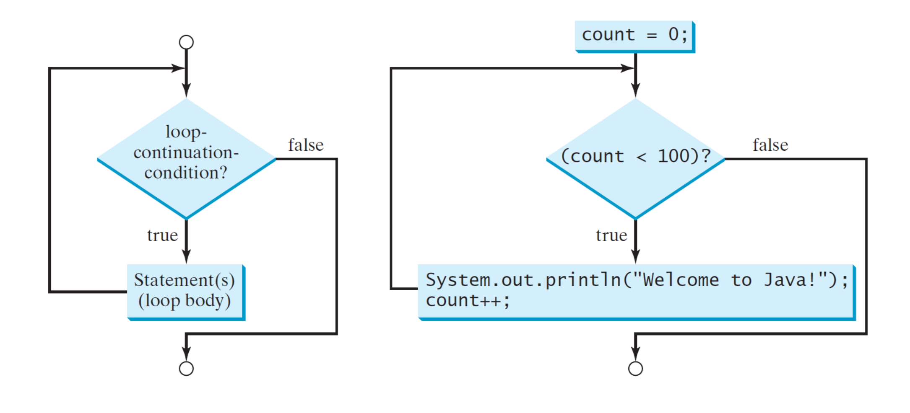

## 範例
  編寫一個程序，對 1 到 100 的所有整數 加總
  - 在數學上，總和 = 1 + 2 + · · · + 100。
  - 有人可能會問為什麼不是 (1 + 100) × 100/2 ？
    - 對於等差級數的加總可以這樣做，但沒有規則的計算，則無法。
  - 以上公式只適用於等差級數！
  - 我們不假設數據是算術級數。 （為什麼？）
    - 增加未來程式可用性
  - 相反，我們通過將方程分解為幾個語句來重寫方程式。

  ```java
  ...
    // 拆解問題
    int sum = 0;
    sum = sum + 1;
    sum = sum + 2;
    .
    .
    .
    sum = sum + 100;
  ...
  ```

  - 如您所見，存在許多類似的語句要被 `loop` 包裹！
  - 使用 `while loop`，程序可以重新排列如下：

  ```java
  ...
    int sum = 0;
    int i = 1;
    while (i <= 100) {
      sum = sum + i;
      ++i;
    }
  ...
  ```

  - 您應該保證 `loop` 將按預期終止。
  - 實際上，循環步驟（迭代）的數量是 `未知` 的，直到 輸入數據。

## Loops 故障
  很容易形成 無窮迴圈。

  ```java
  ...
    while (true);
  ...
  ```

  ### loop 的常見錯誤如下：
  - 永遠沒有 start;
  - 永遠沒有 stop;
  - 不完整；
  - 超過預期的迭代次數；
  - （越來越多。）

## 範例（重新訪問）
  編寫一個程序，允許用戶重複輸入兩個隨機整數之和的新答案，直到正確為止。

  ```java
  ...
    while (z != x + y) {
      System.out.println("Wrong. Try again?");
      z = input.nextInt();
    }
    System.out.println("Correct.");
  ...
  ```

## loop 設計策略
  1. 找出需要 `重複` 的語句。
  2. 用適當的循環(`while`、`for`)包裝這些語句。
  3. 設置 `繼續` 條件。

## 哨兵控制的 loops
  另一種控制loop 的常用技術是在讀取和處理一組值時，指定一個 `特殊值`。

  - 這個特殊的輸入值稱為 `標記值`，表示循環結束。
    - while(btn != `"shutdown"`){ ... }
  - 例如，操作系統 和 GUI 應用程序。

## 範例：收銀員問題
  編寫一個程序，對連續輸入的正整數求和，然後在輸入為非正數時輸出 總和。
  
  ```java
  ...
    int total = 0, price = 0;
    Scanner input = new Scanner(System.in);

    System.out.println("Enter price?");
    price = input.nextInt();
    while (price > 0) {
      total += price;
      System.out.println("Enter price?");
      price = input.nextInt();
      // 上面這兩行重複了？
      // 因為無論如何都必須讓他先詢問一次
    }

    System.out.println("Total = " + total);
    input.close();
  ...
  ```

## `do-while` Loops
  `do-while` Loop 類似於 `while` Loop，不同之處在於`do-while` 首先執行 Loop body，然後才檢查loop條件。

  ```java
  ...
    do {
      // Loop body.
    } while (/* 條件：布林表達式 */);
  ...
  ```

  - 不要忘了 `do-while` loop結尾的分號。
  - `do-while` loop 也稱為 `後測試循環`，與 while loop 相反，`while` loop是 `前測試循環`。

  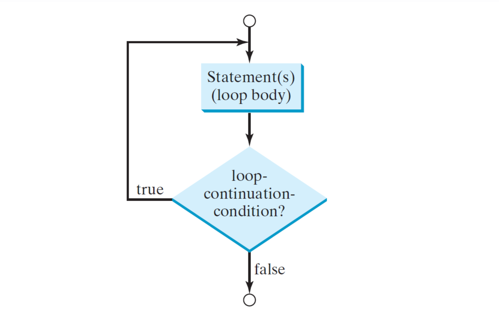

## 範例（修訂）
  編寫一個程序，對連續輸入的正整數求和，然後在輸入為非正數時輸出和。
  
  ```java
  ...
    int total = 0, price = 0;
    Scanner input = new Scanner(System.in);

    do {
      total += price;
      System.out.println("Enter price?");
      price = input.nextInt();
    } while (price > 0);

    System.out.println("Total = " + total);
    input.close();
  ...
  ```

## `for` Loops
  for loop 使用整數計數器來控制主體執行的次數。

  ```java
  ...
    for (init action; condition; increment) {
      // Loop body.
    }
  ...
  ```

  - `init action (初始化動作)`：聲明並初始化一個計數器。
  - `condition (條件)`：loop繼續。
  - `increment (增量)`：每次迭代後計數器如何變化。

## 範例
  編寫一個從 1 到 100 求和的程序。

  ```java
  ...
    int sum = 0;
    int i = 1;
    while (i <= 100) {
      sum = sum + i;
      ++i;
    }
  ...
  ```

  ```java
  ...
    int sum = 0;
    for (int i = 1; i <= 100; ++i)
      sum = sum + i;
  ...
  ```

  - 請注意，while loop 中的 `int i = 1`，僅執行一次。
  - 確保您清楚for loop 的執行過程！

  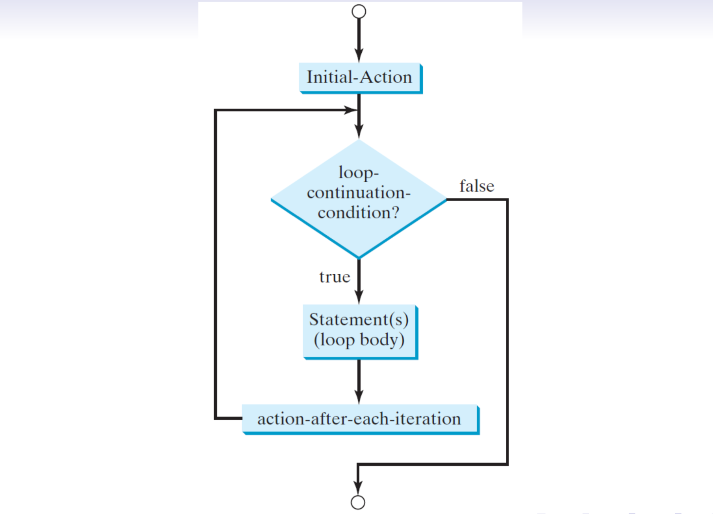

## 鍛煉
  編寫一個程序，顯示 1 到 100 之間的所有偶數。
  - 您可以使用模塊化運算符 (%)。
    
    ```java
    ...
      for (int i = 1; i <= 100; i++) { // Good?
        if (i % 2 == 0) System.out.println(i);
      }
    ...
    ```

  - 也可以考慮以下替代方案：
    
    ```java
    ...
      for (int i = 2; i <= 100; i += 2) { // Which is better?
        System.out.println(i);
      }
    ...
    ```

    以效率來看的話，i += 2 較快，因為只要執行 50 次。
    但是一般性來說，i ++ 的做法，可以處理未知的陣列，而不是已知的 1 到 100。

## 更多練習
  - 編寫一個程序來計算 N ≥ 0 的[階乘](https://en.wikipedia.org/wiki/Factorial)
    - 例如，10！ = 3628800。 (10 * 9 * 8 *.... * 2 * 1)
    ```java
    // 自行練習
    Scanner input = new Scanner(System.in);
  
    System.out.println("Enter factorial num?");
    int factorialNum = input.nextInt(), total = factorialNum;
    input.close();
    for(int i = factorialNum - 1; i > 0; i--) {
      total *= i;
    }
    System.out.println("Total = " + total);
    ```

    ```java
    // 老師解答
    int s1 = 1;
    for(int i = 1; i<= 10; i++){
      s1 = s1 * i;
    }
    System.out.println("10! = " + s1);
    ```
  
  - 編寫程序計算xⁿ，其中 xⁿ 是雙精度值，n 是整數。
    - 例如，2.0¹⁰ = 1024.0。
    ```java
    // 自行練習
    Scanner input = new Scanner(System.in);
  
    System.out.println("Enter X ?");
    double x = input.nextInt();
    System.out.println("Enter n 次方 ?");
    int n = input.nextInt();
    input.close();
    double total = x;
    for(int i = n - 1; i > 0; i--) {
      total *= x;
    }
    System.out.println("Total = " + total);
    ```

    ```java
    // 老師解答
    int s2 = 1;
    for(int i = 1; i<= 10; i++){
      s2 = s2 * 2;
    }
    System.out.println("2^10 = " + s2);
    ```
  
  - 編寫一個程序來計算
    

    - 例如，程序輸出3.141492，N = 10000。
    - 在數學中, p → π as N → ∞。
    - 與數學交朋友。

    ```java
    // 自行練習
    Scanner input = new Scanner(System.in);
		  
    System.out.println("Enter N");
    int N = input.nextInt();
    input.close();
    double total = 0;
    for(int i = 0; i <= N; i++) {
      int numPow = (int) Math.pow(-1, i);
      total += (double) numPow / (2 * i + 1);
    }
    System.out.println("Total = " + (4 * total));
    ```

    ```java
    // 老師解答
    double s3 = 0;
    for(int i = 0; i<= 10000; i++){
      s3 = s3 + Math.pow(-1, i) / (2 * i + 1);
    }
    s3 = s3 * 4;
    System.out.println("pi ~ " + s3);
    ```

## 數值 範例：蒙特卡羅模擬
  - let n 為樣本點總數，m 為落在四分之一圓內的樣本點數（如下頁所示）。
    - 只需使用 `Math.random()` 繪製一個點。
  - 編寫程序通過計算來估計 π
    

    根據大數定律 (LLN)，其中 π^ → π as n → ∞。

    

    ```java
    ...
      public class MonteCarloDemo {
        public static void main(String[] args) {
          int N = 100000;
          int m = 0;

          for(int i=1; i <= N; i++){
            double x = Math.random();
            double y = Math.random();
            // 落在 1/4 圓內
            if (x * x + y * y < 1) m++;
          }

          System.out.println("pi = " + 4.0 * m / N);
          // Why 4.0 but not 4?
          // 因為結果 需要 double型態，避免轉型
        }
      }
    ...
    ```
    - [蒙地卡羅方法](https://zh.wikipedia.org/wiki/%E8%92%99%E5%9C%B0%E5%8D%A1%E7%BE%85%E6%96%B9%E6%B3%95)
    - [AlphaGo Zero 中的蒙特卡羅樹搜索 (MCTS)](https://jonathan-hui.medium.com/monte-carlo-tree-search-mcts-in-alphago-zero-8a403588276a)

## 數值 範例：二分法求根
  - 考慮多項式 x³ − x − 2。
  - 現在我們繼續尋找根x′ 使得 x′³ − x′ − 2 = 0。
  - 首先選擇 a = 1 和 b = 2 作為初始猜測。
  - 利用二分法，將搜索區間反复劃分為兩個子區間，並決定下一個搜索區間是哪個子區間。
  - 由於浮點數的精度有限，我們通過設置誤差容限（例如ε = 1e − 9）提前終止算法，以在效率和準確性之間取得平衡。

  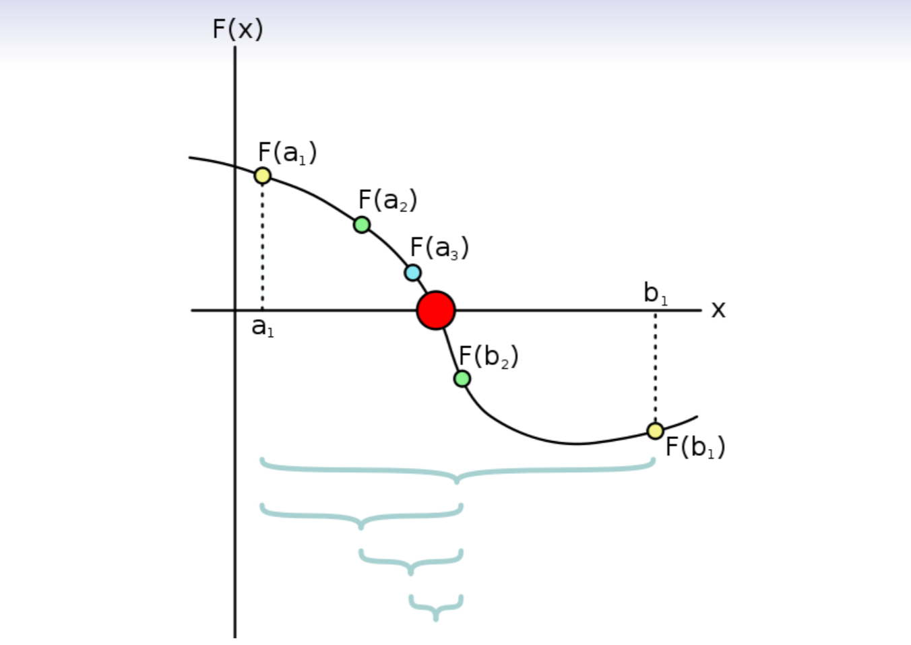

  ```java
  ...
    double a = 1, b = 2, c = 0, eps = 1e−9;
    while(b − a > eps){
      c = (a + b) / 2; // Find the middle point.
      double fa = a * a * a − a − 2;
      double fc = c * c * c − c − 2;
      // c 是否跟 a 不同邊，不是的情況下，表示值 在 c 與 a 中間，所以 將 b 點 移動到 c 上
      if (fa * fc < 0) {
        b = c;
      } else {
        a = c;
      }
    }

    System.out.println("Root = " + c);
    double residual = c * c * c − c − 2;
    System.out.println("Residual = " + residual);
  ...
  ```

## 跳轉語句
  語句 `break` 和 `continue` 通常用於重複結構中以提供額外的控制。
  - loop 在執行 `break` 語句後，立即終止。
  - loop 在執行 `continue` 語句後，立即跳過本次迭代。
  - 在實踐中，`跳轉語句` 應該是有條件的。

## 範例：質數測試
  編寫一個程序，判斷輸入的整數是否為 [`質數`](https://en.wikipedia.org/wiki/Primality_test#Pseudocode)。

  - 令 x > 1 為任何自然數。
  - 如果 x 沒有正約數，則 x 是質數大於 1 和它自己。
  - 將 x 除以所有更小的自然數很簡單比 x。
  - 為了加速，您可以僅將 x 除以小於√X。 （為什麼？）
    - 只要檢查半邊就好了，有約數的時候，會是√X以下的數 乘上 √X以上的數字。如 21 = 3 * 7。

  ```java
  ...
    Scanner input = new Scanner(System.in);
    System.out.println("Enter x > 2?");
    int x = input.nextInt();
    boolean isPrime = true;
    input.close();

    for (int y = 2; y <= Math.sqrt(x); y++) {
      if (x % y == 0) {
        isPrime = false;
        break;
      }
    }
    if (isPrime) {
      System.out.println("Prime");
    } else {
      System.out.println("Composite");
    }
  ...
  ```

## 練習
<!-- TODO: -->
  - 通過擴展上一頁中的程序，編寫一個程序列出所有小於 100000 的質數。
    - 有 9592 個小於 100000 的質數。
    - 9592 個質數中最大的一個是 99991。
  - 通過檢查是否有質數來改進質數測試整數 m 從 2 到√n
    - 如何存儲已知的質數？
  - 通過使用簡單的 6k ± 1 改進質數測試優化，比測試所有 m 快 3 倍

## 另一個例子：收銀員問題（重訪）
  - 使用帶有 `break` 語句的 `無窮迴圈` 重做收銀員問題。

  ```java
  ...
    while (true) {
      System.out.println("Enter price?");
      price = input.nextInt();
      if (price <= 0) break; // Stop criteria.
      total += price;
    }
    System.out.println("Total = " + total);
  ...
  ```

## 等價：while 和 for loop
  如果預先知道 重複 `次數`，則可以使用 `for loop`；
  否則，最好使用 `while loop`。
  - 人們總是可以將 `for loop` 轉換為 `while loop`，反之亦然。

## 範例：複利
  編寫一個程序來確定投資價值翻倍的持有年限。

  - 令 `balance` 為當前金額，
  `goal` 為本次投資的目標，
  `r` 為年利率(%)。
  - 我們可以使用複合公式
      `balance = balance × (1 + r / 100.0)`。
  - 然後輸出 `持有年份 n` 和 `最終餘額`。

  ```java
  ...
    int r = 18; // 百分比.
    int balance = 100;
    int goal = 200;

    int years = 0;
    while (balance < goal) {
      balance *= (1 + r / 100.0);
      years++;
    }
    System.out.println("Holding years = " + years);
    System.out.println("Balance = " + balance);
  ...
  ```

  - 如果按月支付利息，您可以堅持幾個月才能達到目標？

  以下使用 for loop 實作
  ```java
  // 錯誤用法
    for (int years = 0; balance < goal; years++) {
      balance *= (1 + r / 100.0);
    }
    ...
    // scope issue. years 是 for 的區域變數
    System.out.println("Holding years = " + years);

  // 應該將 years 改寫成
  ...
    int years = 0; // years 應該在這宣告; 
    for (; balance < goal; years++) {
      balance *= (1 + r / 100.0);
    }
  ...
  ```

  ```java
  ...
    int years = 1; // Why?
    for (; ; years++) {
      balance *= (1 + r / 100.0);
      if (balance > goal) break;
    }
  ...
  ```

  - `for (; ; years++)`，將條件（中間語句）留空假定為 true。

## 嵌套循環範例
  編寫一個程序來顯示一個 9 × 9 乘法表。

  |1 |2 |3 |4 |5 |6 |7 |8 |9|
  |--|--|--|--|--|--|--|--|--|
  |2 |4 |6 |8 |10 |12 |14 |16 |18|
  |3 |6 |9 |12 |15 |18 |21 |24 |27|
  |4 |8 |12 |16 |20 |24 |28 |32 |36|
  |5 |10 |15 |20 |25 |30 |35 |40 |45|
  |6 |12 |18 |24 |30 |36 |42 |48 |54|
  |7 |14 |21 |28 |35 |42 |49 |56 |63|
  |8 |16 |24 |32 |40 |48 |56 |64 |72|
  |9 |18 |27 |36 |45 |54 |63 |72 |81|

  ```java
  ...
    public static void main(String[] args) {
      for (int i = 1; i <= 9; ++i) {
        
        // In row i, output each j.
        for (int j = 1; j <= 9; ++j) {
          System.out.printf("%3d", i * j);
        }
        System.out.println(); // 換行
      }
    }
  ...
  ```

  > `println` 是 line 的意思，會在最後增加 `/n` (new line);

  > `printf("%d", i)`， %d 是字串裡的變數
  > `%3d`，3 代表的是 欄位寬
  > `%d`：int (整數)
  > `%f`：float (浮點數)
  > `%s`：string (字串)

  - For each，內部迴圈 從 j=1 到 j=9。
  - 作為模擬，i 就像時鐘的時針，而 j 就像時鐘的分針一樣。

## 題外話：輸出格式
  - 使用System.out.printf() 顯示格式化輸出。
  - 例如，

    ```java
    ...
      System.out.printf("Pi = %4.2f", 3.1415926);
      // Output 3.14.
    ...
    ```

    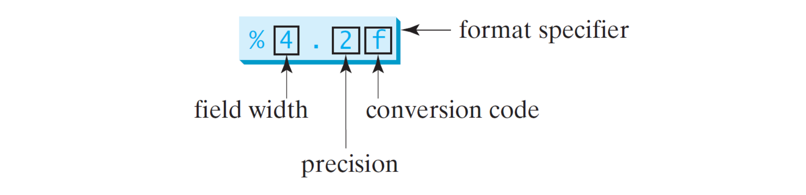

  - 不指定寬度，只顯示小數點後6位。

    | 格式說明符   | 對應類型       | 範例          |
    |------------|:-------------:|:------------:|
    | %b         | boolean       | true, false  |
    | %c         | char          | a            |
    | %d         | int           | 123          |
    | %f         | float, double | 3.141592     |
    | %e         | float, double | 6.626070e−34 |
    | %s         | String        | NTU          |

    - 默認情況下，輸出是右對齊的。
    - 如果值需要的空格多於指定的寬度，則寬度會自動增加。
    - 可以嘗試各種參數，例如格式說明符中間的加號(+)、減號(-) 和0。
    - 說 % + 8.2f、% − 8.2f 和 %08.2f。

## 具有多個項目的格式化輸出
  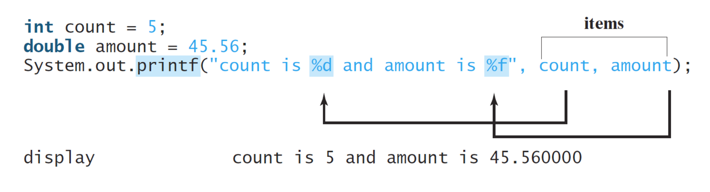

  - 所有項目都必須按 `順序`、`數量` 和 `確切類型` 匹配格式說明符。

## 範例 三角形
  <!-- TODO: -->
  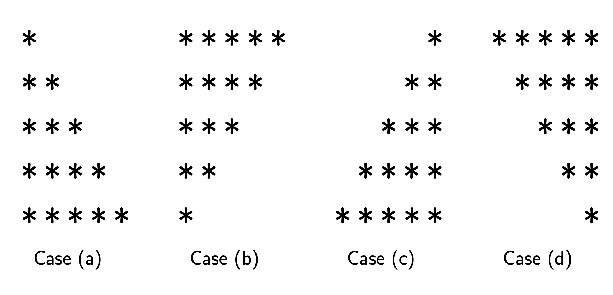

  ```java
  ...
    // Case (a)
    System.out.println("CASE (A)");
    for(int i=1; i<=5; i++){
      for (int j = 1; j <= i; j++) {
        System.out.printf("*");
      }
      System.out.println();
    }

    // Case (b)
    // Your work here.
    System.out.println("CASE (B)");
    for(int i=5; i>=1; i--){
      for (int j = 1; j <= i; j++) {
        System.out.printf("*");
      }
      System.out.println();
    }

    // Case (c)
    // Your work here.
    System.out.println("CASE (C)");
    for(int i=1; i<=5; i++){
      for (int j = 1; j <= 5 - i; j++) {
        System.out.printf(" ");
      }
      for (int j = 1; j <= i; j++) {
        System.out.printf("*");
      }
      System.out.println();
    }

    // Case (d)
    // Your work here.
    System.out.println("CASE (D)");
    for(int i=5; i>=1; i--){
      for (int j = 1; j <= 5 - i; j++) {
        System.out.printf(" ");
      }
      for (int j = 1; j <= i; j++) {
        System.out.printf("*");
      }
      System.out.println();
    }
  ...
  ```

## 練習：畢達哥拉斯三元組
  - 設a < b < c ≤ 20 為三個不同的正整數。
  - 編寫程序找出所有滿足a² + b² = c² 的三元組。

  ```java
  ...
    for (int a = 1; a <= 20; a++) {
      for (int b = a + 1; b <= 20; b++) {
        for (int c = b + 1; c <= 20; c++) {
          if (a * a + b * b == c * c) {
            System.out.printf("%d %d %d\n", a, b, c);
          }
        }
      }
    }
  ...
  ```

## 演算法分析
  - 同一個問題可能存在多種算法。
  - 然後我們通過測量它們的效率來比較這些算法。
  - 為此，我們根據輸入大小 n 估計運行時間的增長率。
  - 我們繼續介紹 `時間複雜度` 的概念。
  - 與 `時間複雜度` 類似，我們稍後會轉向 `空間複雜度` 的概念。

## 範例：總和
  ```java
  ...
    int sum = 0, i = 1;     // Assign −> 2.
    while (i <= n) {        // Compare −> n + 1. (1為loop停止的次數)
      sum = sum + i;        // Add and assign −> 2n.
      ++i;                  // Increase by 1 −> n.
    }
  ...
  ```

  - 令 n 為任何正數。
  - 回想一下，所有的聲明都是在編譯時完成的。
  - 因此我們不計算它們。
  - 總操作數為 `4n + 3` ∈ `O(n)`。

## 練習：三角形
  ```java
  ...
    for (int i = 1; i <= n; i++) {
      for (int j = 1; j <= i; j++)
        System.out.printf("*");
      System.out.println();
    }
  ...
  ```

  - 我想，在算之前，可能是 cn²+···加上一些c。
  - 操作次數是多少？ （嘗試。） ∈ `O(n²)`

## Big-O 表示法
  - 我們定義
      f(n) ∈ O(g(n)) 當 n → ∞
    如果存在常數 c > 0 和一些 n0 使得
      f(n)≤c×g(n) ∀n≥n0.
  - 請注意，f(n) ∈ O(g(n)) 等同於說 f(n) 是 O(g(n)) 的一個實例。

  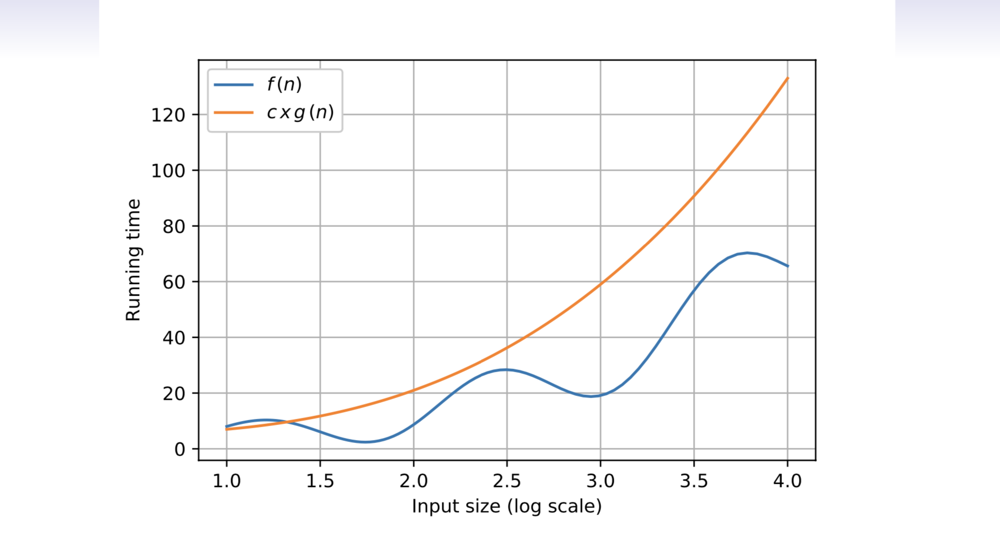

  - f(n) ∈ O(g(n)) 表示 f(n) 的漸近上界。
  - 換句話說，`big-O` 描述了該算法的最壞情況。

## 討論（1/3)
  - 例如，考慮 8n² − 3n + 4。
  - 對於足夠大的 n，忽略最後兩項。 （為什麼？）
    - 不足以影響
  - 很容易找到一個常數 c > 0，比如 c = 9。
  - 所以我們有 8n² − 3n + 4 ∈ `O(n²)`。
  - 確定時間複雜度順序的快捷方式如下：
    - 只保留前導詞。
    - 降低係數。
  - 看？ 8`n²` − 3n + 4 ∈ O(`n²`)。

## 討論（2/3)
  - 你能確定前兩個例子的時間複雜度順序嗎？
    - 總和：O(n)。
    - 三角形：O(n²)。
  - 作為經驗法則，`k 級loop` 的運行時間為 `O(nᴷ)`。

## 你會選擇哪種算法
  基準
  | Size | O(n)  | O(n²)   | O(n³)     |
  |------|-------|---------|-----------|
  | 1    | c₁    | c₂      | c₃        |
  | 10   | 10c₁  | 100c₂   | 1000c₃    |
  | 100  | 100c₁ | 10000c₂ | 1000000c₃ |

  - 理論上，`階數越小，算法越快`。

## 討論（3/3)
  - 值得注意的是
    8n² − 3n + 4 ∈/ O(n) ,
    和
    8n² − 3n + 4 ∈ O(n³)
  - 然而，當談到算法的分類時，我們應該說 8n² − 3n + 4 ∈ O(n²)。 （為什麼？）

## 增長率的順序
  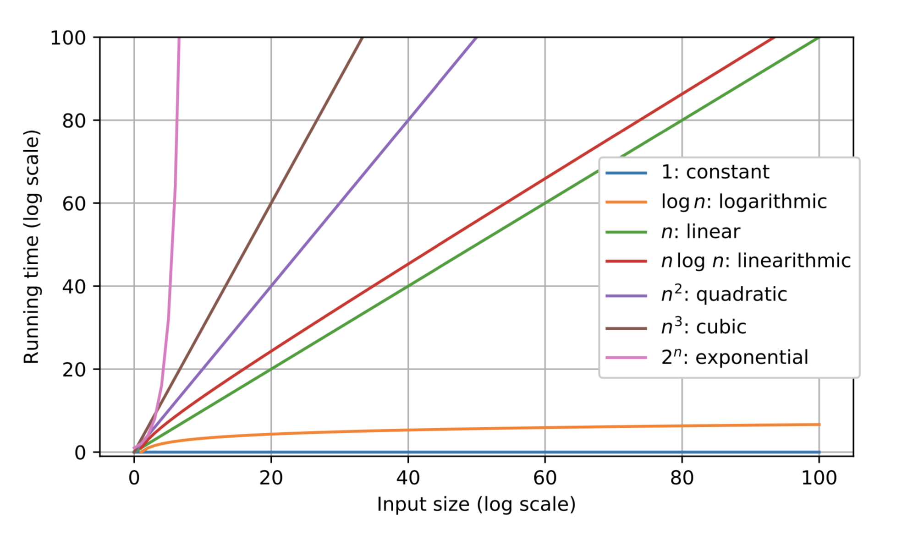

## Table of Big-O
| 生長順序   | 說明                 | 範例              |
|------------|--------------------|-------------------|
| O(1)       | 跟 n 無關            | x=y+z             |
| O(log n)   | 分成兩半             | 二進制 搜尋       |
| O(n)       | 一層 loop            | 尋找 最大值       |
| O(n log n) | 分而治之             | 合併 排序         |
| O(n²)      | 兩層 loop            | 檢查所有的 點     |
| O(n³)      | 三層 loop            | 檢查所有的 三元組 |
| O(2ⁿ)      | 指數演算法, 詳盡搜尋 | 檢查所有的 子集   |

## 恆定時間算法
  - 基本指令在 O(1) 時間內運行。（為什麼？）
    - `+ - * /`， 因為 int size 都是相同的
  - 然而，並非每個語句都在 O(1) 時間內運行。
    - 例如，調用 Arrays.sort() 並不意味著排序很便宜。
    - 排序 在底層 也有調用迴圈方式。
  - 一些算法的運行時間也是 O(1)，例如算術公式。 （為什麼？）
    - 例如：((上底 + 下底) ＊ 高) / 2
  - 然而，天下沒有免費的午餐。
  - 應在 `通用性 (一般性)` 和 `效率` 之間進行權衡來取得平衡。
    - 做了假設 就沒 `通用性`
    - 有了 `通用性`，再來追求 `效率`

## 指數時間演算法 和 可計算性
  - 我們實際上被許多棘手的問題壓得喘不過氣來。
    - 例如，旅行銷售員問題 (TSP)。
    - `n! >> 2ⁿ` (n階 遠大於 2ⁿ)
  - 玩好遊戲更難。
    - 查看 AlphaGo (圍棋) 和 AlphaStar.
  - 此外，還存在計算機無法解決的問題。
    - Turing (1936) 證明了第一個 電腦無法解決的問題，稱為停機問題。

## 來説說 `對數` 演算
  ### 舉例說明：
  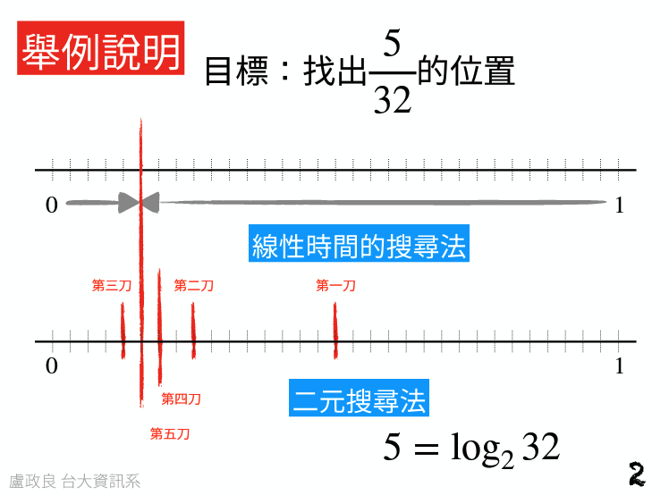
  - #### 線性時間搜尋法
    一個一個查找，可從左開始 或 右邊開始找。
  - #### 二元搜尋法
    以二分法方式 搜尋。
    以題目為例，5/32，需要切 `5` 次，
    5(次數) = log₂ 32
    32 = 2⁵，所以切 `5` 次。

  ### 二元搜尋法求根
  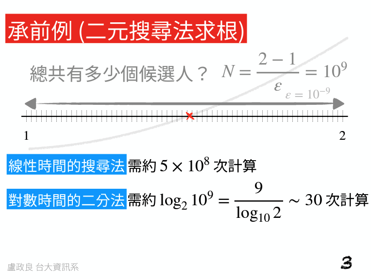

  ### 當 ε = 10⁻¹⁰
  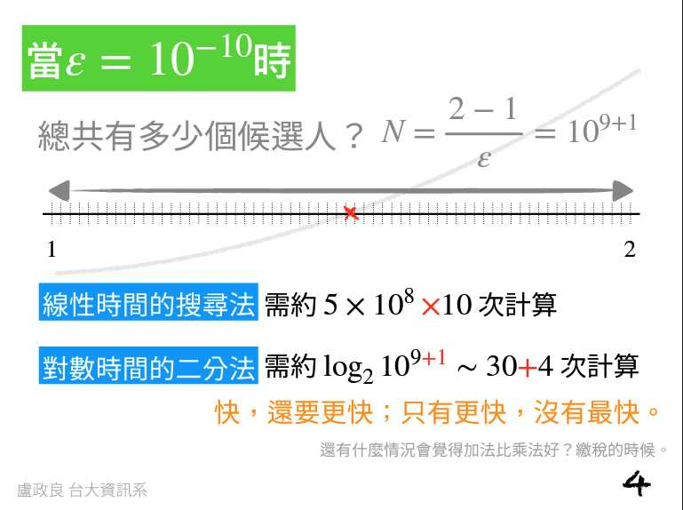

## 對數時間演算法
  - 我們已經學習了一種對數時間算法。（哪個？）
    - 二分演算法
    - 例如：
      ```java
      double a = 1, b = 2, c = 0, eps = 1e−9;
      while(b − a > eps){
        c = (a + b) / 2; // Find the middle point.
        double fa = a * a * a − a − 2;
        double fc = c * c * c − c − 2;
        // c 是否跟 a 同邊，不是的情況下，b = c，再繼續算
        if (fa * fc < 0) {
          b = c;
        } else {
          a = c;
        }
      }
      ```

## 突出的理論問題
  
  
  - 通俗地說，`P` 就是 “在多項式時間內 求解 和 驗證” 的問題集 
    - 簡單的問題
    - `O(nᴷ)`。
  - `NP` 是“在多項式時間內被 驗證 但在 指數時間 內求解”的問題集。
    - 困難的問題
    - 驗證的時候是很快的
    - 求解時 是 指數時間計算
  - 例如，身份驗證比破解帳戶更容易。
  - 可以說 `P` 比 `NP` 更容易。
  - `P` =？ `NP` 是在問 `NP` 問題 是否由 `P` 解決。
  - 我們還沒有任何嚴格的證據。
  - 這也是千年獎難題之一。
  
## 相關連結
  - [對數演算法](https://www.csie.ntu.edu.tw/~d00922011/java/log-time_algorithm.pdf)、[本地檔案](./data/log-time_algorithm.pdf)
  - [資料結構演算法](https://algs4.cs.princeton.edu/lectures/keynote/14AnalysisOfAlgorithms.pdf)、[本地檔案](./data/14AnalysisOfAlgorithms.pdf)

