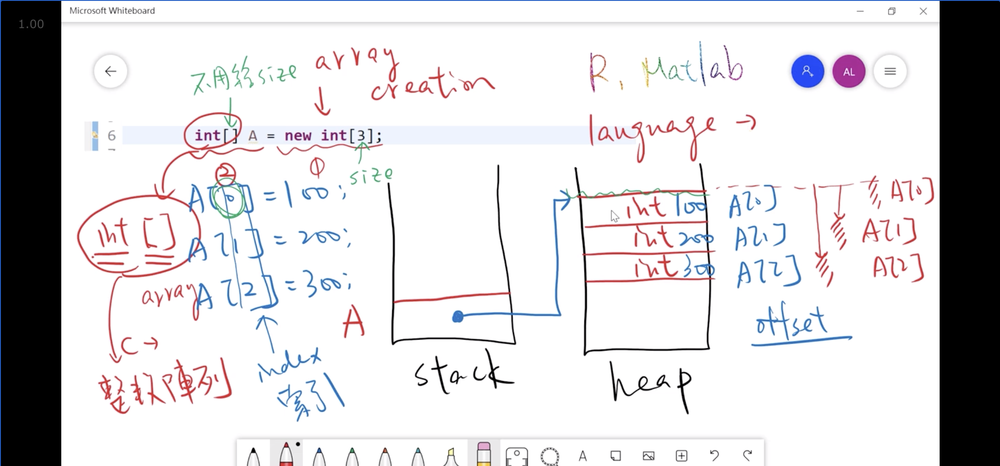
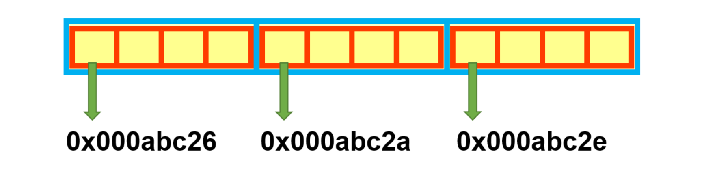
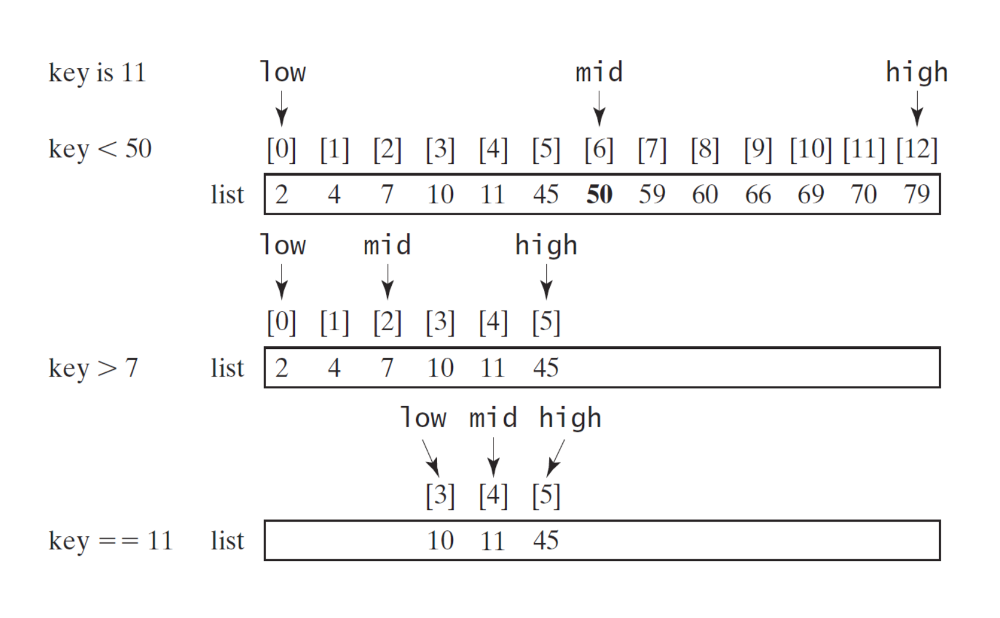
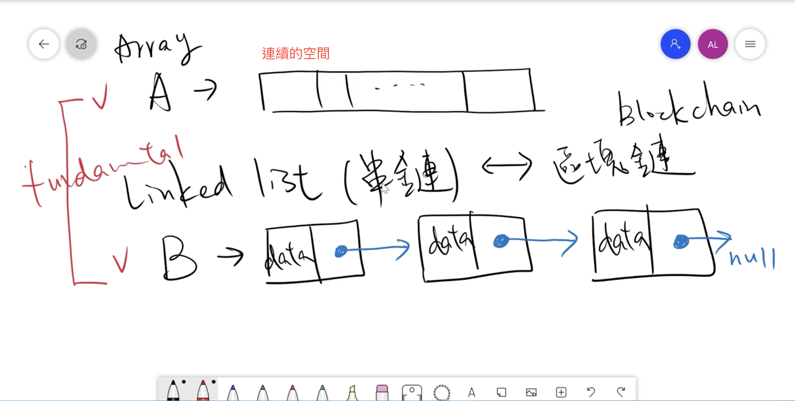
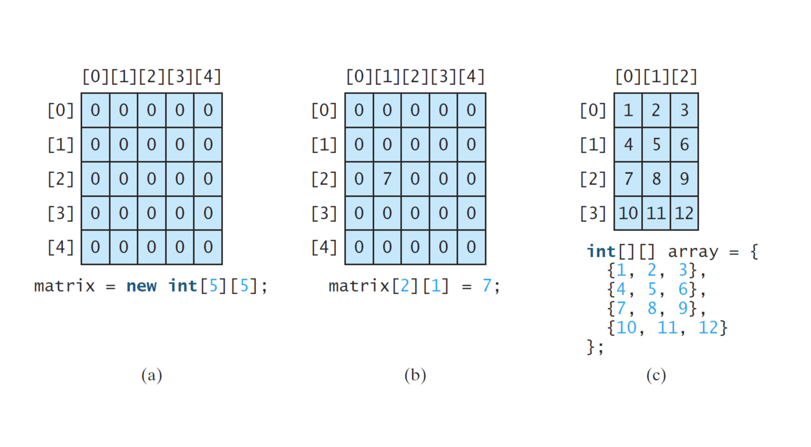
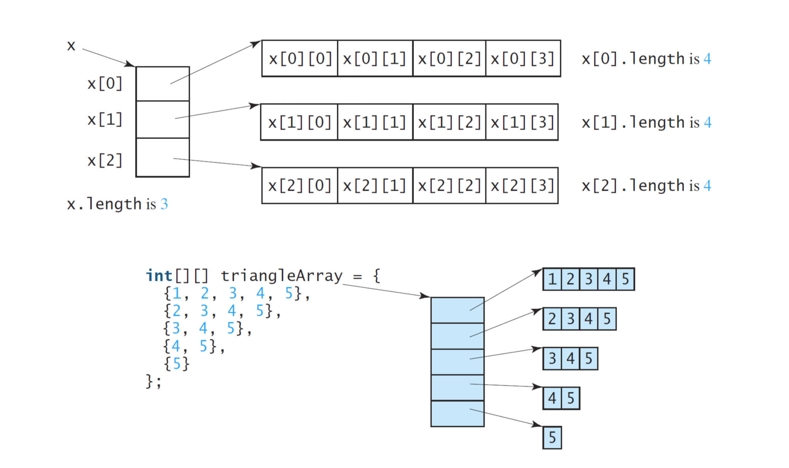

# Lecture 5 陣列和更多數據結構
  ```java
  class Lecture5 {
    "Arrays and More Data Structures"
  }
  // Keywords:
  while, do, for, break, continue
  ```

## Arrays
  陣列儲存大量 `相同` 類型的數據。

  ```java
  ...
    // 假設大小已知。
    T[] A = new T[size];
    // A是T型陣列的參考點。 
  ...
  ```
  - 請注意，`T` 可以是任何類型。
  - 變數 `size` 必須是非負整數。
  - 分 兩階段來看 `T[] A = new T[size];`

## 第一階段：創造
  - 首先我們關注 `T[] A = new T[size];` 的 RHS(從右邊的變數上取值)。
  - 通過調用 `new` 運算符後，跟 `T` 和 `[ ]` 包圍一個整數作為其大小，在`heap` 堆中分配一個數組。
    
    - `T[] A`，儲存在 `stack`
    - `new T[size]`，儲存在 `heap`
    - 兩者使用 引用的方式串連
  - 請注意，大小在分配後無法更改。
    - 滿了時候怎麼辦？
  - 最後，與該 `Array` 關聯的一個內存地址是返回並應緩存。

## 第二階段：參考
  - 我們為 `Array` 聲明一個 `T[ ]` 的引用，比如 `A`。
  - 強烈強調 `A 不是 Array`。
  - 要正確理解類型，應 從右向左 閱讀類型。(A 參考一個陣列，陣列中每個元素都是整數)
  - 例如，A 是 對元素為 T 類型的 Array（用[ ] 表示）的引用。

## 從零開始 的 Array 索引
  - 每個 Array 都從 0 開始，不是 1。
  - 例如，第一個元素是 `A[0]`，第二個元素是 `A[1]`，第三個元素是 `A[2]`，依此類推。
  - 請注意，Array 的最後一個索引是 `size - 1`。
    - 如果 索引超過 size −1，會出現 ArrayIndexOutOfBoundsException (超過邊界)錯誤。
  - 這種約定在主流語言中很常見！ 為什麼？）

## 陣列的內存分配
  - Array 在內存中 `連續分配`。
  - 事實上，我們可以將整個 記憶體 視為一個 `一維的Array`。
  - 例如，

  ```java
    ...
      int[] A = new int[3];
    ...
  ```

  

## 從零開始的 Array 索引（結束）
  - 要獲取第二個元素，
    跳轉到 A 存儲的地址，
    並移動 1 個int 單位大小，
    用 `A[1]` 表示。
  - 現在您可以解釋，為什麼第一個元素用 `A[0]` 表示。
  - Array 索引，顯然充當Array開頭的 `偏移量`！

## 數組初始化
  - 每個 Array 在創建後都會被隱式初始化。
  - 默認值如下所列：
    - `0` 代表所有 數字類型；
    - `\u0000` 用於 字符類型；
    - `false` 用於 布林類型；
    - `null` 用於 引用類型;
  - 也可以通過 `列舉` 所有元素，而不使用 `new 運算符` 來創建 Array，例如，
    ```java
    int[] A = {10, 20, 30};   // 語法糖.
    ```

## 處理數組
  我們經常使用 `for loop` 來處理 `Array` 元素。
  原因：
  - `Array` 有一個名為 `length` 的屬性，即數組的容量。
    - 例如，`A.length`。
  - 因此很自然地使用 `for loop` 來操作 `Array`。

## 範例
  ```java
  ...
    // 創建一個大小為 5 的整數Array。
    int[] A = new int[5];

    // 生成 5 個從 0 到 99 的隨機整數。
    for (int i = 0; i < A.length; ++i) {
      A[i] = (int) (Math.random() * 100);
    }
    // 顯示 A 的所有元素：O(n)。
    for (int i = 0; i < A.length; ++i) {
      System.out.printf("%d ", A[i]);
    }
    System.out.println();
  ...
  ```

  ```java
  ...
    // 找出 A 的 最大值 和 最小值：O(n)。
    int max = A[0];
    int min = A[0];
    for (int i = 1; i < A.length; ++i) {
      if (max < A[i]) max = A[i];
      if (min > A[i]) min = A[i];
    }
  ...
  ```
  - ##### 極值的位置如何取得 ？
    ```java
    ...
      int loc = 0;
      for( int i = 1 ; i < A.length; i++) {
        if(A[i] > A[loc]) {
          loc = i;
        }
      }
    ...
    ```
  <!-- TODO: -->
  - ##### 你能找到A 的第二個最大值嗎？

  <!-- TODO: -->
  - ##### 你能保持A 的 前k大 最大值嗎？

  ```java
  ...
    // Sum of A: O(n).
    int sum = 0;
    for (int i = 0; i < A.length; ++i) {
      sum += A[i];
    }
  ...
  ```

  <!-- TODO: -->
  - ##### 計算 A 的平均值。

  <!-- TODO: -->
  - ##### 計算A 的方差。

  <!-- TODO: -->
  - ##### 計算A 的標準差。

## 洗牌算法
  ```java
  ...
    for (int i = 0; i < A.length; ++i) {
      // 選擇一個隨機整數 j
      int j = (int) (Math.random() * A.length);
      // 交換 A[i] and A[j].
      int tmp = A[i];   // 備份
      A[i] = A[j];
      A[j] = tmp;       // 回填
    }
  ```
  - [然而，這個樸素的算法被打破了！](https://blog.codinghorror.com/the-danger-of-naivete/)
    - 必須解決重複排列的問題 (有些交換過後，又重複交換)。
    - 例如 123，必須像 3! = 6，而不是 3 * 3 * 3 = 27種。
    - 必須改為 不重複排列(取後不放回)
  - 如何使用 異或（即∧）交換？

## 練習
  編寫一個程序來處理一副 52 張洗好的牌中的前 5 張牌。
  - 如您所見，`RNG` 僅生成隨機數。
  - 如何打亂非數值對象？
  - 只需用0,1,...,51 標記 52 張卡片。
  - 隨機 洗牌 這些數字！

  ```java
    String[] suits = {"Club", "Diamond", "Heart", "Spade"};
    String[] ranks = {"3", "4", "5", "6", "7", "8", "9","10", "J", "Q", "K", "A", "2"};

    int size = 52;
    int[] deck = new int[size];
    for (int i = 0; i < deck.length; i++)
      deck[i] = i;

    // 洗牌算法：正確版本。
    for(int i = 0; i < size − 1; i++){
      int j = (int) (Math.random() * (size − i)) + i;
      int z = deck[i];
      deck[i] = deck[j];
      deck[j] = z;
    }
    for(int i = 0; i < 5; i++) {
      String suit = suits[deck[i] / 13];
      String rank = ranks[deck[i] % 13];
      System.out.printf("%−3s%8s\n", rank, suit);
    }
    ...
  ```

  - #### 累加的方法
  ```java
    // 從 0 開始到 size - 1，累加
    for(int i = 0; i < size − 1; i++){
      int j = (int) (Math.random() * (size − i)) + i;
      // `random()*(size - i)` 縮小範圍後，再加上 `i` 做平移。
      int z = deck[i];
      deck[i] = deck[j];
      deck[j] = z;
    }
  ```

  - #### 遞減的方法
  ```java
  // 從 size - 1 開始到 0，遞減
  for (int i = cards.Length - 1; i > 0; i--){
    int n = rand.Next(i + 1);
    // `random()*(size + i)` 縮小範圍。
    Swap(ref cards[i], ref cards[n]);
  }
  ```

## 排序問題
  - 在計算機科學中，排序算法是一種將列表元素按特定順序排列的算法。
  - 例如，
  
  ```java
    import java.util.Arrays;
    ...
      int[] A = {5, 2, 8};
      Arrays.sort(A); // Becomes 2 5 8.

      String[] B = {"www", "csie", "ntu", "edu", "tw"};
      Arrays.sort(B); // Result? 會按照字典順序做排序
    ...
  ```

## 練習：冒泡排序 (Bubble Sort)
  ```java
  ...
    // Bubble sort: O(nˆ2).
    boolean swapped;
    do {
      swapped = false;
      for (int i = 0; i < A.length − 1; i++) {
        if (A[i] > A[i + 1]) {
          int tmp = A[i];
          A[i] = A[i + 1];
          A[i + 1] = tmp;
          swapped = true;
        }
      }
    } while (swapped);

    // 一開始 swapped 設為 false，當有執行交換動作時，表示尚未排序完成，
    // swapped 改為 true，會再執行 while 迴圈。
  ```
  <!-- TODO: -->
  - 嘗試實現 選擇排序(SELECTION SORT) 和 插入排序(INSERTION SORT)
  - [ 參考 ](https://visualgo.net/en/sorting)

## 搜尋問題
  - 為了找到給定鍵的位置，`線性搜索` 按順序將鍵與所有元素進行比較。

  ```java
  ...
    // Linear search: O(n).
    int[] A = {...};
    int founds = 0;
    for (int i = 0; i < A.length; i++) {
      if (A[i] == key) {
        System.out.printf("%d ", i);
          founds++;
      }
    }
    System.out.println("\nFounds: " + founds);
  ```
  - 我們能做得更好嗎？

## 備選方案：二元搜尋法（重新訪問）
  

  ```java
  ...
    int idx = −1; // Why?
    int high = A.length − 1,
        low = 0,
        mid;
    while(high > low && idx < 0){
      mid = low + (high − low) / 2; // Why?
      if (A[mid] < key)
        low = mid + 1;
      else if (A[mid] > key)
        high = mid − 1;
      else
        idx = mid;
    }
    if (idx > −1)
      System.out.printf("%d: %d\n", key, idx);
    else
      System.out.printf("%d: not found\n", key);
  ...
  ```
  
  - 但是，二分尋找 只有在 `數據排序後` 才起作用！

## 討論
  - 如果數據是不可變動的(唯讀的)，對所有數據進行一次排序，然後進行二分查找。
  - 如果數據可能一直在變化怎麼辦？

    | 場景/操作         |  插入   |   搜尋    |
    |------------------|:------:|:--------:|
    | 不可變的未排序數組  |  N/A   |   O(n)   |
    | 不可變排序數組     |  N/A   | O(log n) |
    | 可變未排序數組     | O (1)∗ |   O(n)   |
    | 可變排序數組       |  O(n)  | O(log n) |

    ∗：通過附加在陣列後面插入。

  - 請注意，big-O 是累加的，只需保留最 主導詞。
  - 例如，O(n) + O(log n) = O(n)。

## 數據結構簡介
  - 數據結構 是在程序中組織數據，以使其高效執行的一種特殊方式，
    [複雜度](http://bigocheatsheet.com/)。
  - 數據結構的 選擇 取決於 應用程序。
  - 作為 `Array` 的替代品，[linked lists](https://en.wikipedia.org/wiki/Linked_list) 用於以不同於數組的方式存儲數據。 

    

  - 未來您可能會看到 [大量數據結構](https://en.wikipedia.org/wiki/Java_collections_framework)。
    - 例如，`priority queues`、`trees`、`graphs`、`table`。
  -   [LeetCode](https://leetcode.com/) 上找到很多關於數據結構的問題

## 特刊：for-each Loops
  - for-each loop 旨在以嚴格順序的方式從頭到尾 `迭代` 一組對象，
  例如：Array 和 其他數據結構。

  ```java
    T[] A = { ... };
    for (T element: A) {
      // Loop body.
    }
  ```

## 範例
  ```java
  int s = 0;
  for (int i = 0; i < A.length; ++i) {
    s += A[i];
  }
  ```

  ```java
  int s = 0;
  for (int item: A) {
    s += item;
  }
  ```

  - 簡短而甜美！
  - 當需要迭代 所有元素 且 迭代順序無關緊要，可以考慮使用 `for-each` loop。

## 鍛煉
  ```java
  ...
    String[] letters = {"A", "B", "C", "D", "E"};
    for (String letter: letters) {
      System.out.printf("%s ", letter);
    }
    System.out.println();
  ...
  ```

## 特刊：Cloning 陣列
  - 在實踐中，人們可能出於某種目的複制一個 Array。
  - 例如，
    ```java
    ...
      int x = 1;
      int y = x; // You can say that y copies the value of x.
      x = 2;
      System.out.println(y); // Output 1.

      int[] A = {10, ...}; // Ignore the rest of elements.
      int[] B = A;
      A[0] = 100;
      System.out.println(B[0]); // Output? 100
    ...
    ```

  - 這稱為 `淺拷貝`。
  - 如您所見，結果與我們的預期不同。（為什麼？）
    - B 複製的是 `heap 資料位置`。

  - 要 Clone 一個數組，您應該創建一個新數組並使用循環逐個複制每個元素。
    ```java
    ...
      // Let A be an array to be copied.
      int[] B = new int[A.length];
      for (int i = 0; i < A.length; ++i) {
        B[i] = A[i];
      }
    ...
    ```
    - 這稱為 `深拷貝`。

## 超越一維數組
  - 二維 或 更高維的陣列廣泛用於各種應用。
    - 例如，RGB 圖像存儲為 3D 數組。
  - 我們可以簡單地通過添加一個 [ ] 來創建二維 `T-type array`。
  - 例如，
    ```java
    ...
      int rows = 4; // Row size.
      int cols = 3; // Column size.
      T[][] M = new T[rows][cols];
    ...
    ```

    

## 現實：二維數組的內存分配
  

## 範例：二維 Array 和 loop
  ```java
  ...
    int[][] A = {{10, 20, 30}, {40, 50}, {60}};

    // Conventional for loop.
    for(int i = 0; i < A.length; i++){
      for(int j = 0; j < A[i].length; j++)
        System.out.printf("%3d", A[i][j]);
        System.out.println();
    }

    // For−each loop.
    for (int[] row: A) {
      for (int item: row)
        System.out.printf("%3d", item);
        System.out.println();
    }
  ```

## 練習：矩陣乘法
  令 Am×n 和 Bn×q 為兩個矩陣，其中 m, n, q ∈ N。編寫程序計算 C = A × B。


• 讓aik 和bkj 分別是A 和B 的元素。
• 對於 k = 1,2,...,n，使用公式

對於 i = 1,2,...,m 和對於 j = 1,2,...,q。
• 它需要O(n3) 的時間。 （為什麼？）

## (Native) 數組 vs.數組列表
```java
 int[] A = new int[3]; // The size should be preset. A[0] = 100; A[1] = 200; A[2] = 300;
for (int item: A) System.out.printf("%d ", item); System.out.println();
ArrayList<Integer> B = new ArrayList<>(); // Size? B.add(100); B.add(200); B.add(300); System.out.println(B); // Short and sweet!
```
• 本機數組是最基本的數據結構，但不方便。
• 如何調整已滿數組的大小？
• 實際上，您應該使用 ArrayList<E>，其中 E 是
用戶給定的類型。 12

這稱為泛型。請繼續關注 Java Programming 2。

## 案例研究：倒車陣列

• 編寫一個程序，將數組倒序排列。
• 令A 為原始數組。
• 第一次嘗試是創建另一個具有相同大小的數組並將每個元素從A 複製到B，這是對新數組的引用。
```java
int[] A = {1, 2, 3, 4, 5};
int[] B = new int[A.length];
for (int i = 0; i < A.length; i++) {
    B[A.length − 1 − i] = A[i];
}
A = B; // Why?
```

## 另一個嘗試
```java
int[] A = {1, 2, 3, 4, 5};
for (int i = 0; i < A.length / 2; i++) {
int j = A.length − 1 − i; int tmp = A[i];
A[i] = A[j];
A[j] = tmp;
}
```

| 方法        | 時間複雜度   | 空間複雜度  |
|------------|------------|------------|
| First try  | O(n)       | O(n)       |
| Second try | O(n)       | O (1)      |


• 第二次嘗試在時間13 和空間上都更好。 • 它被稱為就地算法。

實際上，第二次嘗試只用了第一次嘗試的一半時間。


## 相關連結
  - [正確的洗牌詳解](https://blog.codinghorror.com/the-danger-of-naivete/)
  - [visualgo - 排序動畫演示](https://visualgo.net/en/sorting)
  - [複雜度](http://bigocheatsheet.com/)
  - [演算法 進階班](https://hackmd.io/@arthurzllu/SkZBc7GoI)