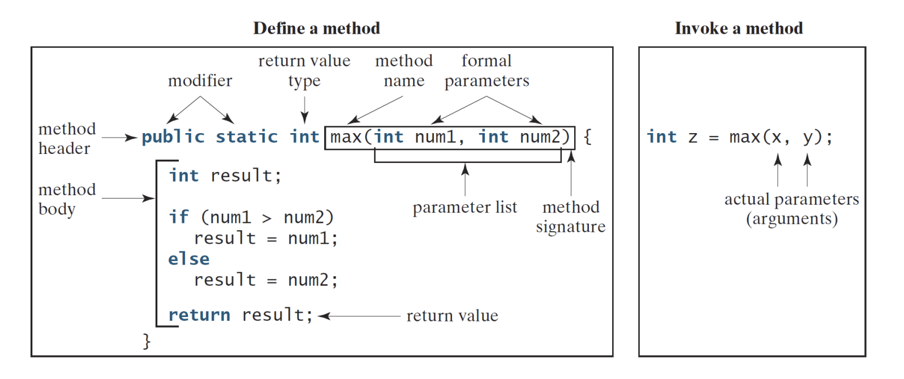
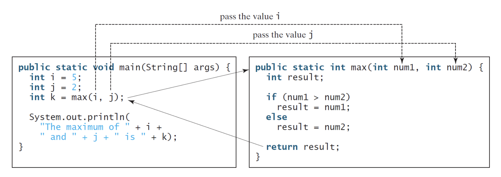
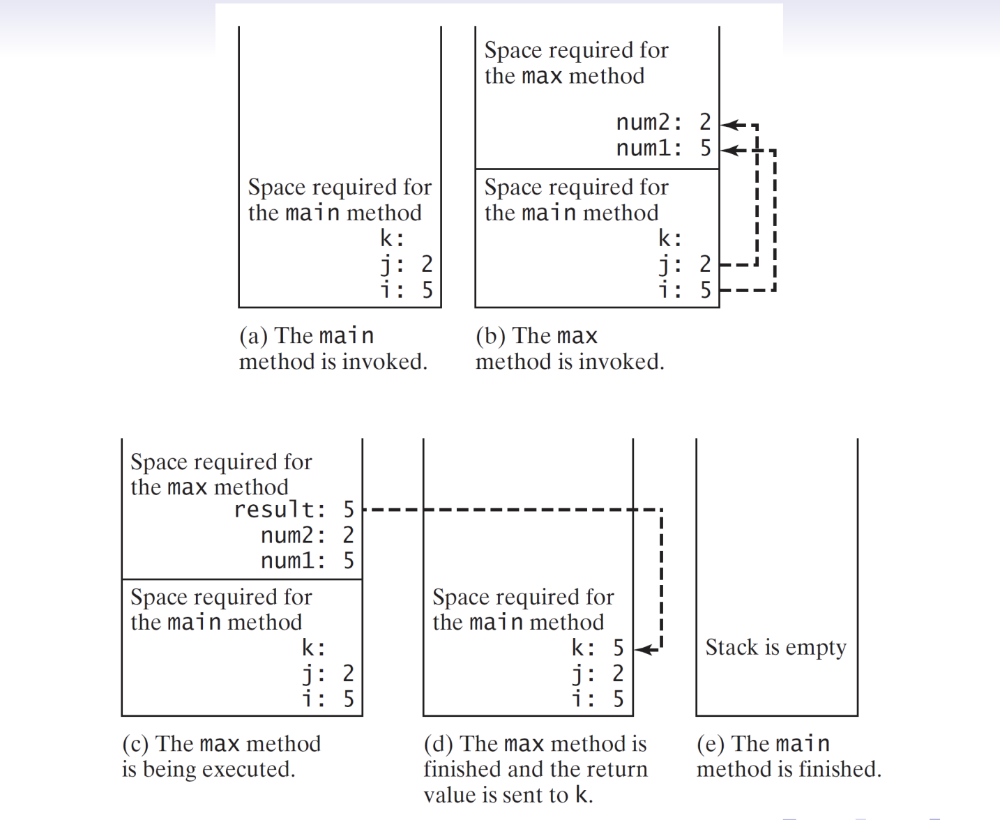
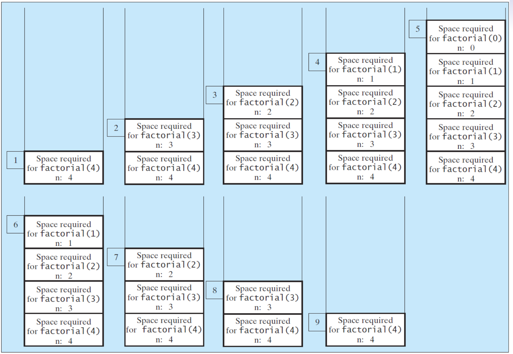
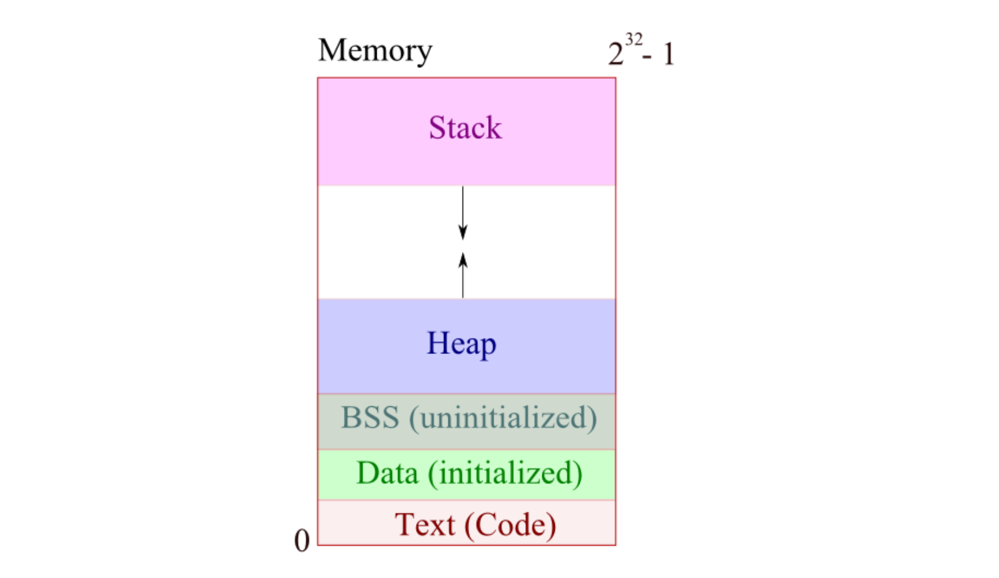
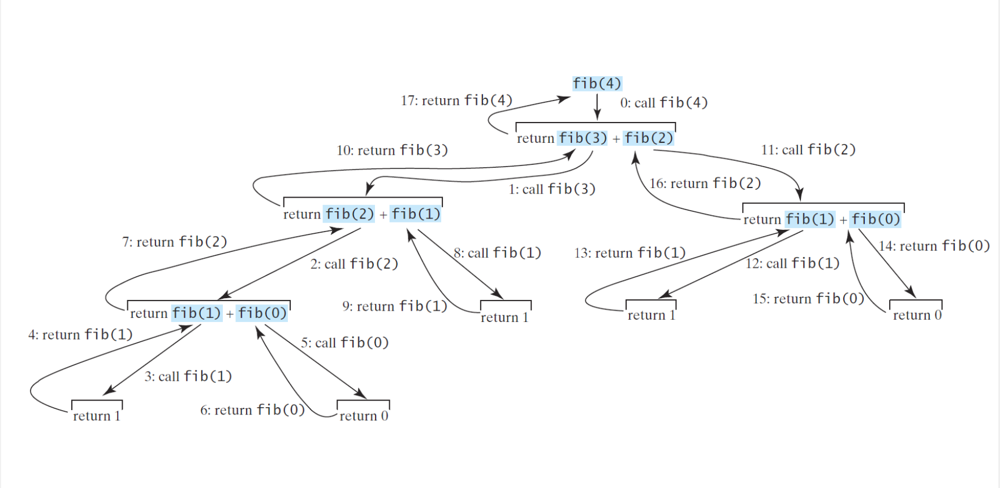
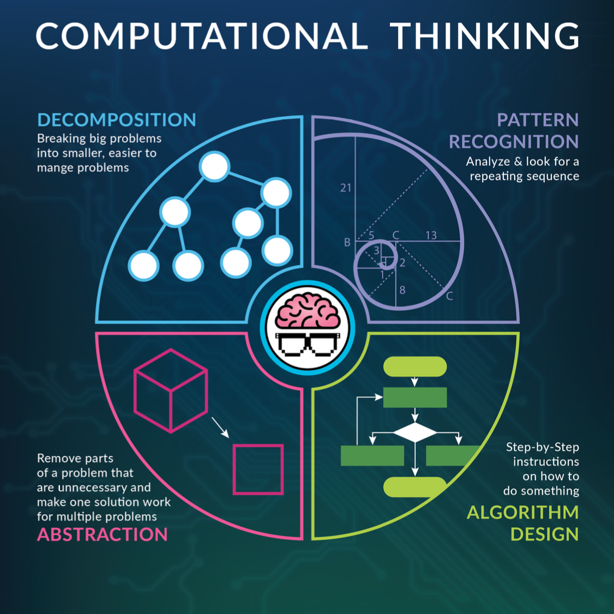
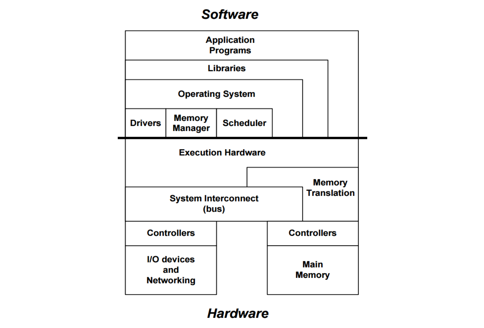
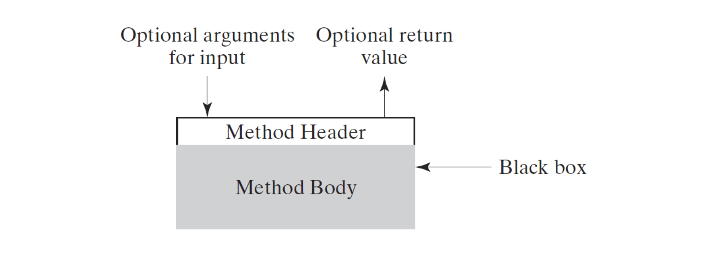

# Lecture 6: 方法 與 遞迴
  ```java
  class Lecture6 {
    "Methods"
  }
  // Keywords:
  return
  ```

## Methods (又名 `程序` 和 `子程序`)
  - 方法（或函數）可以用來定義 `可重用` 的代碼，從而可以 `組織` 和 `簡化` 代碼。
  - 方法/函數的概念源自數學，例如 `f(x, y)`。
    其中 x 和 y 表示兩個輸入參數。
  - 在計算機科學中，每個輸入參數都應聲明為特定類型。
  - 此外，應該為函數分配 `返回類型`！

## 範例：max
  

  - 函數名和參數列表一起稱為 `函數簽章`。
    `函數重載` 取決於 簽章。

## 備選方案？
  ```java
  ...
    public static int max(int num1, int num2) {
      if (num1 > num2) {
        return num1;
      } else {
        return num2;
      }
    }
  ...
  ```

  ```java
  ...
    public static int max(int num1, int num2) {
      return num1 > num2 ? num1 : num2;
    }
  ...
  ```

  > "All roads lead to Rome."
  > 條條大路通羅馬
  > – Anonymous

  > "但如你根本並無招式，敵人如何來破你的招式？"
  > – 風清揚，笑傲江湖。第十回。傳劍

## 關於 return
  - `return` 語句用於結束函數。
  - 我們說 `被調用者` 是 `調用者` 調用的函數。
  - `調用者` 有義務向 `被調用者` 提供輸入並期望返回值。
  - `被調用者` 應保證返回一個值。
  - 建立了兩者之間的關係（ `權利` / `義務` ）。
  - 一旦指定了返回類型（ `void` 除外 ），此方法 `應` 保證返回該類型的值。

## 陷阱
  以下兩種方法是不正確的。
  ```java
  ...
    public static int foo1() {
      while (true);  // 無窮迴圈
      return 0; // 不會執行的 code
    }

    public static int foo2(int x) {
      if (x > 0)
        return x; // What if x <= 0?
    }
  ...
  ```

## 更多範例
  ```java
  ...
    // Method w/o return.
    public static void display(int[] A) {
      for (int i = 0; i < A.length; i++)
        System.out.printf("%d ", A[i]);
        System.out.println();
    }
    // Method returning array (reference)!
    public static int[] arrayGen(int size, int low, int high) {
      int[] A = new int[size];
      int numOfStates = high − low + 1;
      int offset = low;
      for (int i = 0; i < A.length; i++)
        A[i] = (int) (Math.random() * numOfStates) + offset;
        return A;
    }
  ...
  ```

## 方法調用
  

  - 請注意，輸入參數是在函數中聲明為 `佔位符` 的變數。
  - 調用函數時，調用者有義務按照函數簽章中的定義提供 `順序`、`數量` 和 `兼容類型`的參數。

  - 在 Java 中，函數調用使用按​​值傳遞(`pass-by-value`)。
  - 當被調用者被調用時，`程序控制權` 從調用者轉移到被調用者。
  - 對於每個函數調用，JVM 都會推送一個 `frame`，該 `frame` 在調用堆 `stack` 中存儲必要的信息。
  - 一旦被調用者完成其例程，調用者就恢復其工作。

  

## 變數範圍 (可視範圍)
  - 變數 `作用域` 是指變數可以被引用的區域。
  - 一對平衡的大括號定義了變數範圍。
  - 通常，變數可以在 `類級別`、`函數級別` 或 `迴圈級別` 聲明。
  - 如果一個 `區域變數(local varable)` 的標識符與類變數相同，則區域變數 優先於 類變數（即忽略後者）。
    - 這稱為 `遮蔽效應`。

## 範例
  ```java
  ...
    public class ScopeDemo {
      public static int x = 10; // Class level; global variable.
      public static void main(String[] args) {
        System.out.println(x); // Output 10.
        int x = 100; // Method level, aka local variable.
        x++;
        System.out.println(x); // Output 101.
        addOne();
        System.out.println(x); // Output ? 101
      }

      public static void addOne() {
        x = x + 1;
        System.out.println(x); // Output ? 11
      }
    }
  ...
  ```

## Math 工具箱：Math Class
  - Math 類，提供基本的 數學函數 和 兩個常量 `Math.PI(3.1415)` 和 `Math.E(2.7183)`。
  - 所有方法都是 `public` 和 `static`。
  - 你可以在參考 Math 的[官方手冊](https://docs.oracle.com/javase/8/docs/api/java/lang/Math.html)。
  - 作為一名專業的工程師，你應該能夠閱讀手冊！
    - 您可能聽說過 [RTFM](https://en.wikipedia.org/wiki/RTFM)

## 特刊：函數多載
  - 名稱衝突沒問題。
  - 具有相同名稱的方法可以共存，並通過 `函數簽章` 來標識。
  - 這可以使程序更清晰、更易讀。

  ```java
  ...
    public static int max(int x, int y) { ... }
    
    // Different types.
    public static double max(double x, double y) { ... }

    // Different numbers of inputs.
    public static int max(int x, int y, int z) { ... }
  ...
  ```

## 特刊：Varargs (可變的 args)
  - JDK5 為支持一種類型的任意數量參數的方法提供了簡寫「...」。

  ```java
  ...
    /* You don’t need to do these.
    public static int max(int n1, int n2) { ... }
    public static int max(int n1, int n2, int n3) { ... } */

    public static int max(int... nums) { ... }
    // Equivalent to public static int max(int[] nums) { ... }

    public static void main(String[] args) {
      int x = max(100, 200, 300);
      int y = max(100, 200, 300, 400);
    }
  ...
  ```

## 特刊：main(String[] args)
  - 我現在可以解釋自己了：程序通過調用方法 `main()` 以及一個 `字符串陣列` 作為程式參數來開始工作。

  - `String[]` 是型態。
  - `args` 是 java 執行 檔案時，傳入的檔名及參數

  ```java
  ...
    public static void main(String[] args) {
      for (String arg: args) {
        System.out.println(arg);
      }
    }
  ...
  ```

  - 在 `Eclipse` 中，您可以通過將 `${string prompt}` 作為程式參數添加到 JVM 來打開輸入對話框。 (綠色 run 右邊下拉箭頭展開，選擇`Run configurations...`，在上面頁籤選擇 `Arguments`的 `Program arguments`，新增 `Variables`，找到 `string_prompt` 儲存後，重新 run)

## 遞迴 (遞迴是自然界中常見的一種模式。)
  遞迴是根據自身定義某物的過程。

  - 調用自身的方法被稱為 `遞迴的`。
  - 遞迴是流量控制的另一種形式。
  - 它是沒有任何循環的重複。

  
  - Try [Fractal](https://en.wikipedia.org/wiki/Fractal).

## 範例：階乘（重新訪問）
  - 例如，
    ```java
    4! = 4 × 3 × 2 × 1  // (從loop角度來看)
       = 4 × 3！        // (從loop角度來看)
       = 4 ×（3 × 2！）
       = 4 × (3 × (2 × 1!))
       = 4 × (3 × (2 × (1 × 0!)))
       = 4 × (3 × (2 × (1 × 1)))
       = 24。
    ```
  - 找到模式？

  編寫一個程序來確定 n!通過遞迴。

  ```java
  ...
    public static int factorial(int n) {
      if (n < 2)
        return 1; // Base case.
      else
        return n * factorial(n − 1);
    }
  ...
  ```

  - 記住在遞迴中設置 `基本情況`。 （為什麼？）
  - 時間複雜度 是多少？

  

  ```java
  ...
    int s = 1;
    for (int i = n; i > 1; i++) {
      s *= i;
    }
  ...
  ```

  - 兩者都在 `O(n)` 時間內運行。
  - 一個有趣的問題是，`我們能否始終將遞迴方法轉換為它的 loop 版本？`
  - 肯定的。
  - [Church 和 Turing](http://plato.stanford.edu/entries/church-turing/) 證明了 loop 和遞迴是等價的。

## 評論
  - 遞迴承擔大量開銷(記憶體開銷)。
  - 因此，遞迴算法的執行速度可能 比 等效的迭代算法 慢一點。
  - 此外，深度遞迴會耗盡有限的調用堆棧，並導致 `堆棧溢出 (stack overflow)` 錯誤。
    - 堆棧溢出 (stack overflow)參考：https://stackoverflow.com/、https://www.oreilly.com/、https://www.quora.com/ 
    - 從 堆棧溢出 (stack overflow) 中 讀取複製和粘貼會讓你變得更好嗎

## 內存佈局
  

## 練習：求和（重溫）
  編寫一個函數，通過遞迴計算從 1 到 n 的和。
  - 例如，n = 100 所以我們有
    ```java
    sum(100) = 100 + sum(99)
             = 100 + 99 + sum(98)
             = 100 + 99 + 98 + sum(97)
             .
             .
             .
             = 100 + 99 + 98 + · · · + 1。
    ```
  - 你能找到遞迴關係嗎？

    ```java
    ...
      public static int sum(int n) {
        if (n == 1)
          return 1;
        else
          return n + sum(n − 1);
      }
    ...
    ```

    ```java
    ...
      public static int sum(int n) {
        return n == 1 ? 1 : n + sum(n − 1);
      }
    ...
    ```

  - 時間複雜度？ `O(n)`

## 練習：最大公因數 (GCD)
  令 a 和 b 為兩個正整數。通過遞迴計算 GCD(a, b)。
  - 我們繼續實施 [歐幾里德算法](https://en.wikipedia.org/wiki/Euclidean_algorithm)，又名「 `輾轉相除法` 」。
    - A 除以 B 不整除時，換 B 除以 上一輪的餘數，不整除時，繼續以此類推，算出零時，就是兩者的最大公因數。

  - 例如，
    ```java
    GCD(54, 32) = GCD(32, 22)
                = GCD(22, 10)
                = GCD(10, 2)
                = 2。
    ```

  - 遞迴 方式
    ```java
    ...
      public static int gcd by recursion(int a, int b) {
        int r = a % b;
        if (r == 0)
          return b;
        return gcd_by_recursion(b, r); // Straightforward?!
      }
    ...
    ```

  - loop 方式
    ```java
    ...
      public static int gcd by loop(int a, int b) {
        int r = a % b;
        while (r > 0) {
          a = b;
          b = r;
          r = a % b;
        }
        return b;
      }
    ...
    ```

## 範例：斐波那契數列
  令 n ≥ 0 為整數。計算第n個斐波那契數Fn
  
  - 設置 F0 = 0 和 F1 = 1。
  - 對於 n > 1，斐波那契數列可以通過
    `Fn = Fn−1 + Fn−2`。
  - 前 10 個數字如下：0、1、1、2、3、5、8、13、21、34。
  - 可參考 https://www.mathsisfun.com/numbers/fibonacci-sequence.html 、 https://en.wikipedia.org/wiki/Fibonacci_number

  ```java
  ...
    public static int fib(int n) {
      if (n < 2) {
        return n;
      } else {
        return fib(n − 1) + fib(n − 2);
      }
    }
  ...
  ```

  - 簡短明了！
  - 但是，該算法的性能很差！！
  - 時間複雜度：O(2ⁿ)。 （為什麼！！！）
    - 每個節點都要算 2 次，2ⁿ。

  

  ```java
  ...
    public static double fib2(int n) {
      if (n < 2) return n;
      
      int x = 0, y = 1;
      for (int i = 2; i <= n; i++) {
        int z = x + y;
        x = y;
        y = z;
      }
      return y; // Why not z?
    }
  ...
  ```

  - 所以它可以在 `O(n)` 時間內完成！
  - 前一個（通過遞迴）在時間上不是最優的。
  - 你能找到斐波那契數列的 `線性遞迴` 嗎？
  - 事實上，這道題可以在 `O(log n)` 時間內完成！

## 分而治之
  - 我們經常使用分而治之的策略(又名逐步細化)，將原始問題 `分解` 為更 `易於管理` 的子問題。
    - 例如，冒泡排序。
  - 這對程式開發有以下好處：更易於編寫、重用、調試、修改、維護，也更好地促進團隊合作。

  

## 概念：抽象化
  - 抽象過程就是決定哪些細節我們需要突出顯示，哪些細節我們可以忽略。
  - `抽象無處不在`
    - 算法是對接受輸入和產生輸出的逐步過程的抽象。
    - 編程語言是一組字符串的抽象，每個字符串都被解釋為某種計算。
    - 和更多。
  - 抽象過程還引入了 `層次`。
  - 層與層之間定義明確的 `接口`，使我們能夠構建大型複雜系統。

## 範例：電腦系統
  

## 範例：圖形用戶界面 (GUI)
  
  - 你對電磁理論和通信系統一無所知；您知道如何使用手機，因為您熟悉界面！

## 範例：應用程序編程接口 (API)
  
  - 在構建應用程序時，API 通過抽象底層實現並僅公開開發人員需要的對像或操作來 `簡化` 編程。

## 概念：抽象（已結束）
  - 正如我們所見，方法/函數是 `控制抽象`。
  - 此外，像 `ArrayList` 這樣的數據結構是 `數據抽象`。
  - 人們可以將 `Object` 的概念視為一種結合數據和操作抽象的方式。
  - `Objects` 無處不在。
  - 例如，描述您的手機。
    - 屬性：電池狀態、4G 信號、電話簿、專輯、音樂庫、剪輯等。
    - 功能？你可以給它起名字。


## 相關連結
  - [是什麼讓 OOP 變得“好”？](https://softwareengineering.stackexchange.com/questions/120019/whats-the-benefit-of-object-oriented-programming-over-procedural-programming)
  - (FYR) 另見伊利諾伊大學香檳分校的 [Recursion](https://courses.engr.illinois.edu/cs374/sp2018/A/notes/01-recursion.pdf)、[本地檔案](./data/log-time_algorithm.pdf)
  - (FYR)之前的AP 計算機科學[考試](https://apcs.csie.ntnu.edu.tw/index.php/questionstypes/previousexam/)