# Lecture 7: 物件導向程式設計 (OOP)
  ```java
  class Lecture7 {
    // 物件導向編程 (OOP)
  }
  // Keywords:
  class, new, this, static, null, extends, super, final, abstract, interface, implements, protected, package, import, enum
  ```

## Object & Class
  • 對像在字段（屬性）中保存自己的狀態，並通過關聯的方法公開其行為。
  • 為了創建這些對象，我們收集所有與函數關聯的屬性並將它們放在一個新類中。
  • 類是創建實例（也稱為運行時對象）的藍圖。
  • 類充當派生類型。
  • 類是Java 中的構建塊。

## 示例：點
  • 我們定義一個新類如下：
    • 給出一個首字母大寫的類名，通過
    習俗;
    • 在類主體中聲明數據和函數成員。

  ```java
  ...
    public class Point {
      // Data members.
      double x, y;
    }
  ...
  ```

  - 現在我們使用這個類來創建一些點。

  ```java
  ...
    public class PointDemo {
      public static void main(String[] args) {
        Point p1 = new Point(); p1.x = 1;
        p1.y = 2;
        Point p2 = new Point(); p2.x = 3;
        p2.y = 4;
        System.out.printf("(%.2f, %.2f)\n", p1.x, p1.y); System.out.printf("(%.2f, %.2f)\n", p2.x, p2.y);
      }
    }
  ...
  ```
    你能畫出內存分配的當前狀態嗎？

## 封裝
• 每個成員都可以有一個訪問修飾符，比如public 和private。
• public：所有類都可以訪問。
• private：只能在它自己的類中訪問。
• 在OOP 中，我們隱藏內部狀態並公開對這些字段執行操作的方法。
• 因此所有字段都應聲明為私有。
• 但是，此私有修飾符不保證任何信息安全。1
• 什麼私有有利於可維護性和模塊化。2

1 感謝 2017 年 1 月 23 日的熱烈討論。
2 Read http://stackoverflow.com/questions/9201603/ are-private-members-really-more-secure-in-java.

## 函數成員
• 如前所述，字段是隱藏的。
• 因此，如有必要，我們為對象提供 getter 和 setter：
• getter：返回對象的狀態。
• setter：為對象的狀態設置一個值。
• 例如，getX() 和getY() 是getter； setX() 和 setY() 是 Point 類中的設置器。

## 示例：點（封裝）
```java
...
public class Point {
  // Data members: fields or attributes
  private double x, y;
  
  // Function members: methods
  public double getX() { return x; }
  public double getY() { return y; }
  public void setX(double a) { x = a; }
  public void setY(double b) { y = b; }
}
...
```

## 構造函數
• 構造函數跟在new 運算符之後，其作用與其他方法一樣。
• 但是，它的名稱應該與類的名稱相同，並且沒有返回類型。
• 如果需要，一個類可以有多個構造函數。 • 調用方法重載。
• 注意構造函數屬於類而不是對象。
• 換句話說，構造函數不能被任何對象調用。
• 如果您沒有定義任何顯式構造函數，Java 會為您假定一個默認構造函數。
• 此外，添加任何顯式構造函數都會禁用默認構造函數。

## 參數化構造函數
• 您可以在對象就緒時初始化該對象。
• 例如，
  ```java
  ...
    public class Point {
      ...
      // Default constructor
      public Point() {
        // Do something in common.
      }

      // Parameterized constructor
      public Point(double a, double b) {
        x = a;
        y = b;
      }
      ...
    }
  ...
  ```

## 自參考
• 您可以使用this 在方法和構造函數中引用當前對象的任何（實例）成員。
• 使用this 關鍵字的最常見原因是字段被方法參數遮蔽。
• 回顧變量作用域。
• 您也可以使用它來調用同一個構造函數中的另一個構造函數
類，說這個（）。

## 示例：點（重新訪問）
```java
...
  public class Point {
    ...
    public Point(double x, double y) {
      this.x = x;
      this.y = y;
    }
    ...
  }
...
```
但是，不能在靜態方法中使用 this 運算符。

## 實例成員
• 請注意，在本講中數據成員和函數成員聲明為w/o static。
• 它們被稱為實例成員，只有在創建一個對像後才可用。
• 從語義上講，每個對像都有自己的狀態，這些狀態與應用的附屬方法相關聯。
• 例如，可以在指定特定點對象時調用getX()。

## 示例：點之間的距離測量
```java
...
  public class Point {
    /* Ignore the previous part. */
    public double getDistanceFrom(Point that) {
      return Math.sqrt(Math.pow(this.x − that.x, 2) + Math.pow(this.y − that.y, 2));
    }
  }
...
```
• 在 OOP 設計中，明確各種類型的對象之間的責任非常重要，即單一責任原則。 3
• 高內聚、低耦合。
• 好萊塢原則：不要打電話給我們，我們會打電話給你。

Also see https://en.wikipedia.org/wiki/SOLID_(object-oriented_design).

## 靜態成員
• 一旦類被加載，靜態成員就準備好了。 • 例如，main()。
• 您可以嘗試靜態初始化塊。4
• 這些成員可以在沒有任何實例的情況下通過類名直接調用。
• 例如，Math.PI。
• 特別是，靜態方法執行算法。
• 例如，Math.random() 和Arrays.sort()。
• 請注意，靜態方法可以訪問其他靜態成員。
（瑣碎的。）
• 但是，靜態方法不能直接訪問實例成員。 （為什麼？）

4 See https://docs.oracle.com/javase/tutorial/java/javaOO/initial.html.

## 例子
```java
...
  public class Point {
    /* Ignore the previous part. */
    public static double measure(Point first, Point second) {
      // You cannot use this in static context.
      return Math.sqrt(Math.pow(first.x − second.x, 2) + Math.pow(first.y − second.y, 2));
    }
  }
...
```

```java
...
  public class PointDemo {
    public static void main(String[] args) {
      /* Ignore the previous part. */
      System.out.println(Point.measure(p1, p2));
    }
  }
...
```

## 另一個例子：單例模式
• 單例模式是設計模式之一。5
• 在某些情況下，您只需要一個此類對象
系統。
```java
...
  public class Singleton {
    // Do not allow to invoke the constructor by others.
    private Singleton() {}

    // Will be ready as soon as the class is loaded.
    private static Singleton instance = new Singleton();
    
    // Only way to obtain this singleton by the outside world.
    public static Singleton getInstance() {
      return instance;
    }
  }
...
```
5設計模式是針對軟件設計中給定上下文中常見問題的高度可重用解決方案的集合。 “設計模式”一詞由 Erich Gamma、Richard Helm、Ralph Johnson 和 John Vlissides 命名，通常被稱為四人幫 (GoF)。

## 對象消除：垃圾收集 (GC)6
  • Java 通過GC 處理對象釋放。
  • 時間：預設時間段或出現記憶壓力時。
  • GC 是一個守護線程，它搜索那些未引用的對象。
  • 當一個對像不再被程序的任何部分引用時，它就被取消引用。 （如何？）
  • 要使對像不被引用，只需將null 分配給引用變量即可。
  • 請注意，您可以調用System.gc() 來執行釋放過程。
  • 然而，頻繁調用GC 非常耗時。

  6 http://www.oracle.com/webfolder/technetwork/tutorials/obe/ java/gc01/index.html


## 統一建模語言7
• 統一建模語言 (UML) 是一種用於指定、可視化、構建和記錄軟件系統工件以及業務建模和其他非軟件系統的工具。
• 免費軟件：
• http://staruml.io/（適用於所有平台）
7See http://www.tutorialspoint.com/uml/ and http://www.mitchellsoftwareengineering.com/IntroToUML.pdf.

## 示例：Point 的類圖
  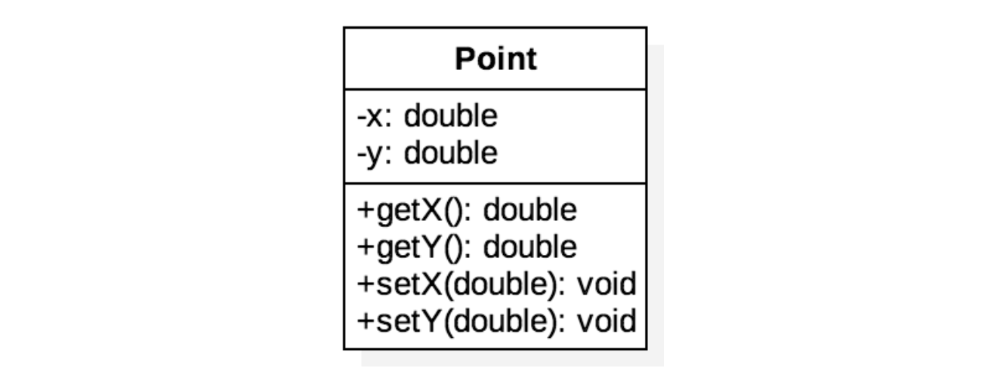
• + 指公共。
• − 指私人。

## HAS-A 關係
• 關聯是一種弱關係，其中所有對像都有自己的生命週期並且沒有所有權。
• 例如，老師↔ 學生；醫生↔病人。
• 如果A 使用B，則它是一個集合，說明B 獨立於A 存在。
• 例如，騎士↔ 劍；公司↔員工。
• 如果 A 擁有 B，則它是一個組合，這意味著 B 在沒有 A 的系統中沒有任何意義或目的。（我們稍後會看到這一點。）
• 例如，房子↔ 房間。

## 示例：線（聚合）
  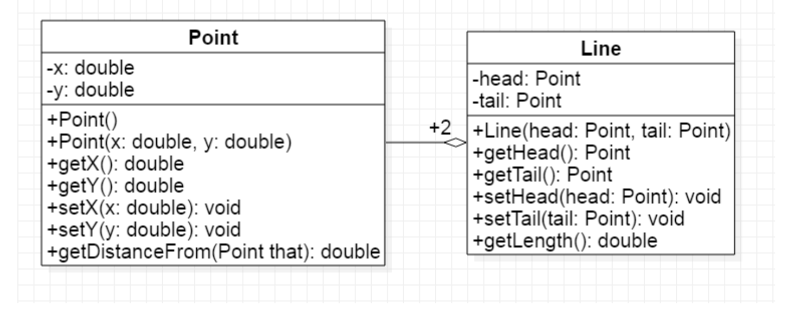
  • +2：在一個線對像中使用兩個點對象。

  ```java
  ...
    public class Line {
      private Point head, tail;
      public Line(Point p1, Point p2) {
        head = p1;
        tail = p2;
      }

      /* Ignore some methods. */
      public double getLength() {
        return head.getDistanceFrom(tail);
      }
    }
  ...
  ```

## 練習：圓圈
```java
...
  public class Circle {
    private Point center;
    private double radius;

    public Circle(Point c, double r) {
      center = c;
      radius = r;
    }

    public double getArea() {
      return radius * radius * Math.PI;
    }

    public boolean isOverlapped(Circle that) {
      return this.radius + that.radius > this.center.getDistanceFrom(that.center);
    }
  }
...
```

## 第一個 IS-A 關係：類繼承
• 我們可以通過繼承預定義類（即原型）中常用的狀態和行為來定義新類。
• 類是某個類的子類，通過使用extends 關鍵字稱為超類。
• 例如，
```java
...
  // Superclass (or parent class)
  class A {
    void doAction() {} // A can run doAction().
  }

  // Subclass (or child class)
  class B extends A {} // B can also run doAction().
...
```

## 示例：人與狗


## 使用繼承之前
```java
...
  public class Human {
    public void eat() {}
    public void exercise() {}
    public void writeCode() {}
  }
...
```

```java
...
public class Dog {
  public void eat() {}
  public void exercise() {}
  public void wag() {}
}
...
```

## 使用繼承之後
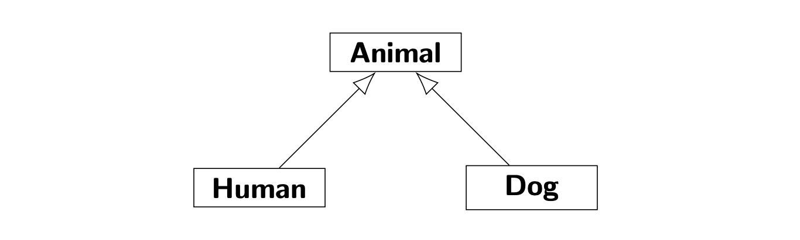
將 Human 和 Dog 之間的公共部分移動到另一個類，例如 Animal，作為超類。

```java
...
public class Animal { // extends Object; implicitly.
  public void eat() {}
  public void exercise() {}
}
...
```
```java
...
public class Human extends Animal {
  public void writeCode() {}
}
...
```
```java
...
public class Dog extends Animal {
  public void wag() {}
}
...
```

## 練習：將 Cat 添加到 Animal Hierarchy8
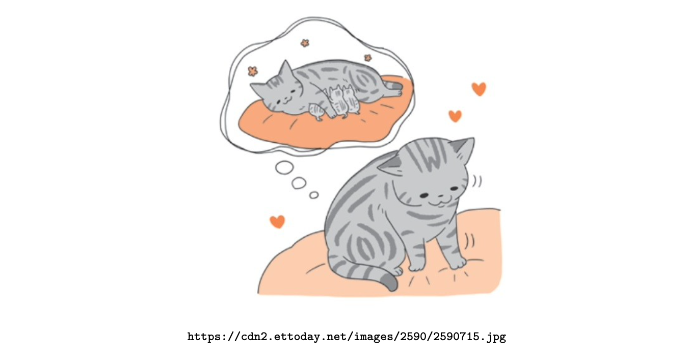
8See https://petsmao.nownews.com/20170124-10587.

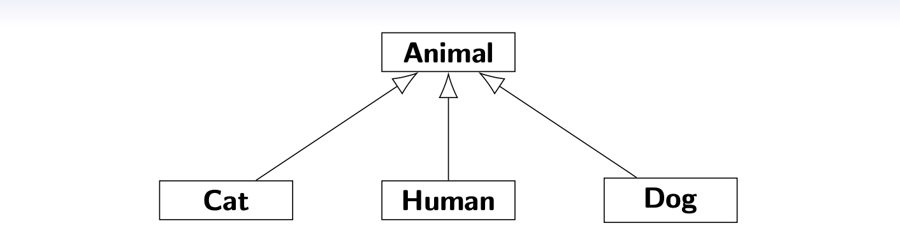

```java
...
public class Cat extends Animal {
  public void stepping() {}
}
...
```
• 您可以通過擴展Animal 添加更多種類的動物！ • 同樣，代碼重用。

## 構造函數鏈

• 一旦子類的構造函數被調用，JVM 將遞歸地調用其超類的構造函數。
• 因此，您可能會認為將調用一整條構造函數鏈，一直返回到 Object 類的構造函數，這是 Java 中的最頂層類。
• 在這個意義上，我們可以說每個類都是Object 的直接或遠距離子類。

## 類層次結構的插圖9
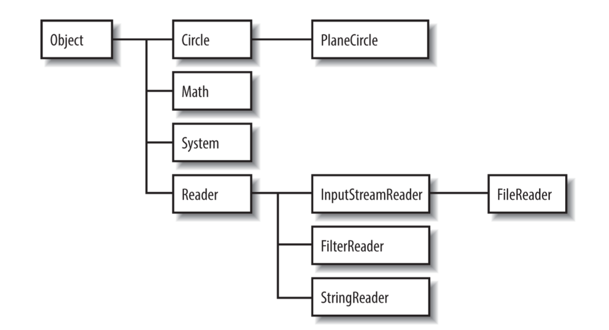
9參見第 3-1 頁的圖 3-1。埃文斯和弗拉納根的 113。

## 超級運營商

• 回想一下，this 用於引用對象本身。
• 您可以使用 super 來引用（非私有）成員
超類。
• 請注意，super() 可用於調用其構造函數
超類，類似於 this()。

## 方法覆蓋
• 子類應該重新實現從其超類繼承的方法。
• 方法覆蓋要求如下：
• 方法簽名與其超類之一相同；
• 相同的返回類型；
• 相對於其超類之一的可見度未降低。10
• 請注意，您不能覆蓋靜態方法。
• 您應該使用註釋11 @Override 來幫助您。

```java
...
class B extends A {
  @Override
  void doAction() { /* New impl. w/o changing API. */ }
}
...
```

10例如，您不能將可見性從公共降低為私有。
11 請參閱 https://docs.oracle.com/javase/tutorial/java/annotations/。

## Example


## 示例：覆蓋 toString()

• Object 提供了 toString() 方法，它被特意設計為由 System.out.println() 調用！
• 默認情況下，它返回一個哈希碼。12
• 它可以被覆蓋，以便它返回一個信息字符串。

```java
...
  public class Point {
    ...
    @Override
    public String toString() {
      return "(" + x + ", " + y + ")";
    }
    ...
  }
...
```
12See https://en.wikipedia.org/wiki/Java_hashCode().

## 另一個例子：ArrayList（重訪）
```java
...
  import java.util.Arrays;
  import java.util.ArrayList;
  
  public class ArrayListDemo2 {
    public static void main(String[] args) {
      String[] fx1 = {"TWD", "CAD", "JPY"};
      ArrayList<String> fx2 =
                        new ArrayList<>(Arrays.asList(fx1));
      System.out.println(fx2); // Output [TWD, CAD, JPY].
    }
  }
...
```

• 使用Arrays.asList() 將數組轉換為ArrayList 對象。
• 好多了！！！

## 亞型多態性14
• 多態這個詞的字面意思是“多種形式”。
• OOP 設計規則之一是將接口與實現和程序分離到抽象，而不是實現。 13
• 子類型多態性滿足這條規則。
• 如何為不同的實現創建一個“單一”接口？
• 使用這些類型的超類作為佔位符。

13GoF（1995 年）。最初的說法是“編程到接口，而不是實現”。
14另請閱讀 http://www.javaworld.com/article/3033445/learn-java/java-101-polymorphism-in-java.html。

## 示例：依賴減少（解耦）
```java
...
class HighSchoolStudent {
  void doHomework() {}
}
class CollegeStudent {
  void writeFinalReports() {}
}
...
```
• 現在讓這兩種學生去學習。

```java
public class PolymorphismDemo {
  public static void main(String[] args) {
    HighSchoolStudent Emma = new HighSchoolStudent();
    goStudy(Emma);

    CollegeStudent Richard = new CollegeStudent();
    goStudy(Richard);
  }

  public static void goStudy(HighSchoolStudent student) {
    student.doHomework();
  }

  public static void goStudy(CollegeStudent student) {
    student.writeFinalReports();
  }

  // What if the 3rd kind of students comes into the system?
}
```

## 使用繼承和子類型多態性
```java
class Student {
  void doMyJob() { /* Do not know the detail yet. */}
}

class HighSchoolStudent extends Student {
  void doHomework() {}
  @Override
  void doMyJob() { doHomework(); }
}

class CollegeStudent extends Student {
  void writeFinalReports() {}
  @Override
  void doMyJob() { writeFinalReports(); }
}
```

```java
public class PolymorphismDemo {
  public static void main(String[] args) {
    Student Emma = new HighSchoolStudent();
    goStudy(Emma);
    
    Student Richard = new CollegeStudent();
    goStudy(Richard);
  }
  // We can handle all kinds of students in this way!!!
  public static void goStudy(Student student) {
    student.doMyJob();
  }
}
```

• 這個例子說明了toString() 和println() 之間的機制。

## 為什麼是 OOP？15

• OOP 是現代（大型）軟件設計的堅實基礎。
• 特別是，偉大的重用機制和抽像是通過這三個概念實現的：
• 封裝將內部（私有成員）與外部隔離，實現抽象並提供足夠的可訪問性（公共方法）；
• 繼承提供方法重寫而不改變方法簽名；
• 多態性利用超類作為佔位符來操縱實現（子類型對象）。
• 我們使用PIE 作為這三個概念的簡寫。
15See https://en.wikipedia.org/wiki/Programming_paradigm

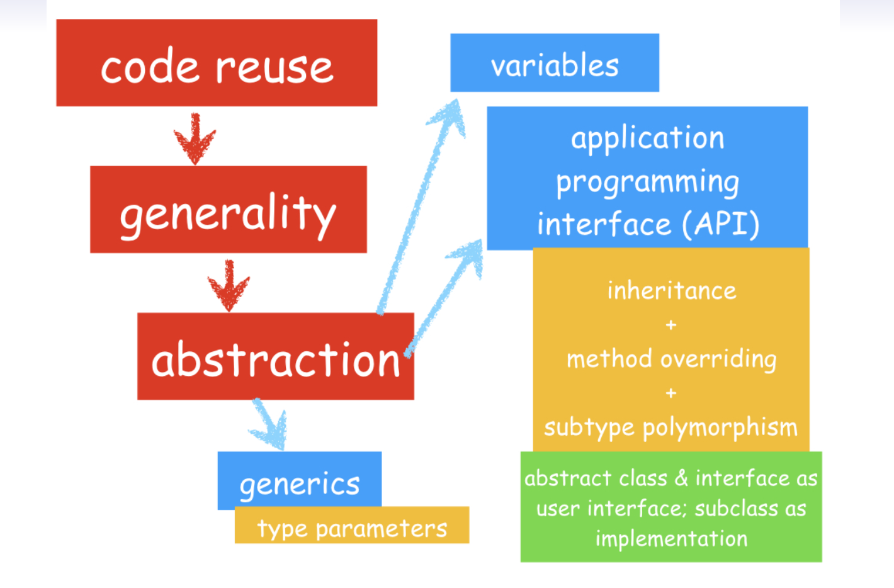

• 這導致了框架16 的產生，它實際上完成了大部分工作，讓（應用程序）程序員只需要用業務邏輯規則進行定制並提供掛鉤的工作。
• 這大大減少了編程時間並使創建越來越大的系統成為可能。
• 在模擬中，我們經常在抽象層次上操作對象；我們在使用它們時不需要知道細節。
• 例如，使用電腦和手機、駕駛汽車等。

16See https://spring.io/.

## 另一個例子
```java
class Animal {
  /* Ignore the previous part. */
  void speak() {}
}

class Dog extends Animal {
  @Override
  void speak() { System.out.println("Woof! Woof!"); }
}

class Cat extends Animal {
  @Override
  void speak() { System.out.println("Meow ̃"); }
}

class Bird extends Animal {
  @Override
  void speak() { System.out.println("Tweet!"); }
}
```

```java
public class PolymorphismDemo2 {
  public static void main(String[] args) {
    Animal[] animals = {new Dog(), new Cat(), new Bird()};
    for (Animal animal: animals) {
      animal.speak();
    }
  }
}
```
• 同樣，Animal 是其三個子類型的佔位符。

## 里氏替換原則17
• 為方便起見，設U 為T 的子類型。
• 我們通過引用操作對象（右側）
（左手邊）！
• Liskov 指出，T 型對象可以用 U 型對象替換，而不會改變 T 的任何理想屬性（正確性、執行的任務等）。
17 See https://en.wikipedia.org/wiki/Liskov_substitution_principle.

## 鑄件
• Upcasting18 是將U 對象/變量轉換為T 變量。
```java
U u1 = new U(); // Trivial.
T t1 = u1; // OK.
T t2 = new U(); // OK.
```
• Downcasting19 是將T 變量轉換為U 變量。
```java
U u2 = (U) t2; // 好的，但是很危險。為什麼？
U u3 = new T(); // 錯誤！為什麼？
```

18 A加寬轉換；向後兼容性。
19 A窄轉換；向前推進。

## 解決方案：instanceof
• 需要並始終允許向上轉型。 （為什麼？）
• 但是，向下轉型並不總是正確的，即使您使用轉型運算符也是如此。
  • 事實上，如果使用任何轉換運算符，編譯時的類型檢查就會變得不可靠。 （為什麼？）
• 更糟糕的是，一個T 型變量可以指向所有U 型變量。
  • 回想一下，T 型變量用作佔位符。
• 需要運行時類型信息 (RTTI) 來解析
錯誤：ClassCastException。
• 我們可以使用instanceof 來檢查引用的對像是否屬於
運行時的目標類型。

## 例子
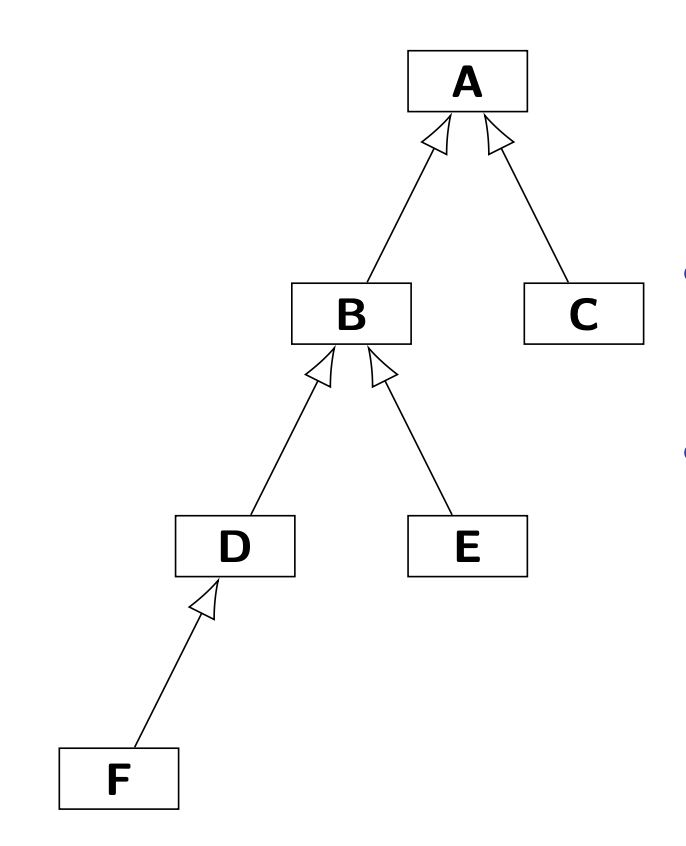
- 類繼承可以用有向圖（directed graph）來表示。
- 例如，D 是 A 和 B 的子類型，它們都可以從有向圖上的 D 到達。

```java
class A {}
class B extends A {}
class C extends A {}
class D extends B {}
class E extends B {}
class F extends D {}

public class InstanceofDemo {
  public static void main(String[] args) {
    Object o = new D();
    System.out.println(o instanceof A); // Output true.
    System.out.println(o instanceof B); // Output true.
    System.out.println(o instanceof C); // Output false.
    System.out.println(o instanceof D); // Output true.
    System.out.println(o instanceof E); // Output false.
    System.out.println(o instanceof F); // Output false.
  }
}

```

## 抽像類
• 抽像類是聲明為抽象的類。
• 通常，抽像類位於類層次結構的頂部，充當佔位符。 20
• 抽像類可能有一些方法沒有實現21 並聲明為抽象。
• 它們是抽象方法。
• 如果一個類有一個或多個抽象方法，則該類
本身必須聲明為抽象的。
• 不能實例化所有抽像類。
• 當繼承一個抽像類時，編輯器可以幫助您調用每一個抽象方法。

20 例如，抽象工廠模式。
21 方法聲明時不帶大括號，後面跟一個分號。

## 例子
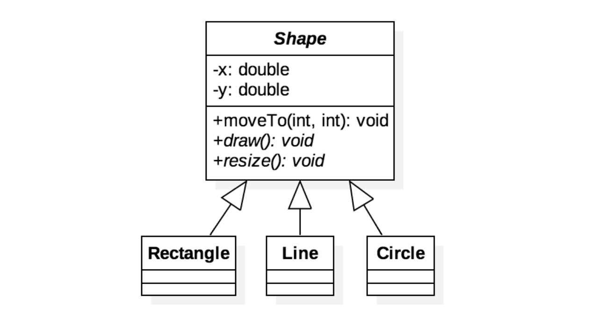
• 在UML 中，抽象方法和類用斜體表示。
• draw() 和 resize() 方法可以在以下情況下實現
具體形狀已知。

## 最後的關鍵詞22
• final 變量是可以初始化一次並且以後不能更改的變量。
• 編譯器確保您只能執行一次。
• final 變量通常使用 static 關鍵字聲明，並且
被視為常量，例如 Math.PI。
• final 方法是一種不能被子類覆蓋的方法。
• 如果一個方法具有不應更改的實現並且它對對象的一致狀態至關重要，則您可能希望將其設為最終方法。
• 不能繼承聲明為final 的類。 • 例如，數學。

22在Java中，關鍵字const是保留的。

## 另一種 IS-A 關係：接口繼承
• 不同類型的對象應該在沒有適當垂直關係的情況下一起工作。
• 例如，考慮從 Animal 繼承的 Bird 和從 Transportation 繼承的 Airplane。
• Bird 和Airplane 都可以在天空中飛行，比如通過調用fly() 方法。
• 在語義上，方法fly() 不能在它們的超類中定義。 （為什麼？）

• 我們希望那些可以飛行的物體通過調用一個API 來飛行，就像Student 的方式一樣。
• 回想一下，Object 是一切的超類。
• 那麼，使用對像作為佔位符怎麼樣？
• 並不真地。 （為什麼？）
• 顯然，我們需要一種橫向關係：界面。
```java
public interface Flyable {
  void fly(); // Implicitly public and abstract.
}
```

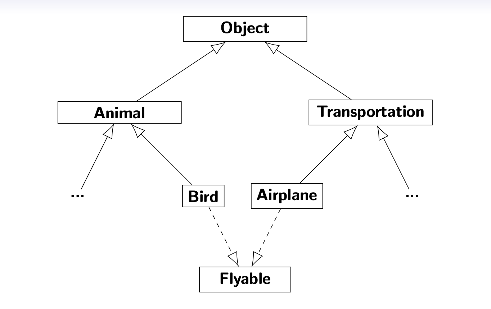

```java
class Animal {}
class Bird extends Animal implements Flyable {
  void flyByFlappingWings() {
    System.out.println("Flapping wings!");
  }

  @Override
  public void fly() { flyByFlappingWings(); }
}
class Transportation {}
class Airplane extends Transportation implements Flyable {
  void flyByCastingMagic() {
    System.out.println("#$%@$ˆ@!#$!");
  }
  @Override
  public void fly() { flyByCastingMagic();}
}
```

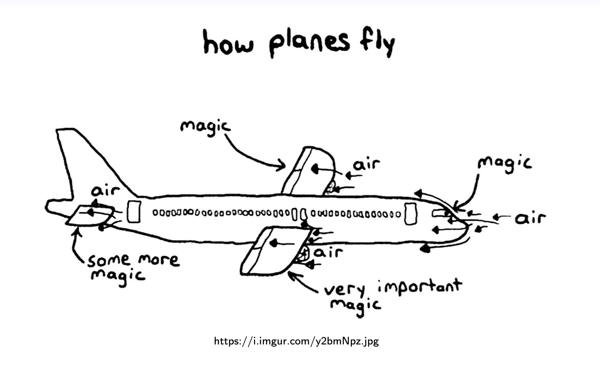

```java
public class InterfaceDemo {
  public static void main(String[] args) {
    Bird owl = new Bird();
    goFly(owl);

    Airplane a380 = new Airplane();
    goFly(a380);
  }
  public static void goFly(Flyable flyableObj) {
    flyableObj.fly();
  }
}
```

• 同樣，具有多種實現的統一接口！

## 深入探討接口
• 接口是對象和客戶端之間的契約。
• 如圖所示，接口是一種引用類型，就像類一樣。
• 與類不同，接口用於定義沒有實現的方法，因此它們不能（直接）實例化。
• 此外，接口是無狀態的。
• 一個類可以通過提供實現多個接口
每個預定義簽名的方法體。

• 請注意，一個接口可以擴展另一個接口！ • 在某種意義上，就像合同的集合。
• 例如，Runnable、Callable23、Serializable24 和 Comparable。
• 在JDK8 中，我們有如下新特性：
  • 我們可以聲明final static 非空白字段和​​方法；
  • 我們還可以定義已經存在的默認方法
  實施的;
  • Java 為廣泛使用的 lambda 定義了功能接口
  在 Stream 框架中使用。 （敬請關注 Java Programming 2！）

23兩者都與 Java 多線程有關。
24 用於可以表示為字節序列的對象。這稱為對象序列化。

## 接口和抽像類的時機
• 如果你想考慮使用抽像類：
  • 在幾個密切相關的類之間共享代碼，並且
  • 聲明非靜態或非最終字段。
• 考慮在以下任何情況下使用接口：
  • 不相關的類將實現您的接口；
  • 指定特定數據類型的行為，但不
  關注誰實施其行為；
  • 利用多重繼承。

## 練習：RPG
  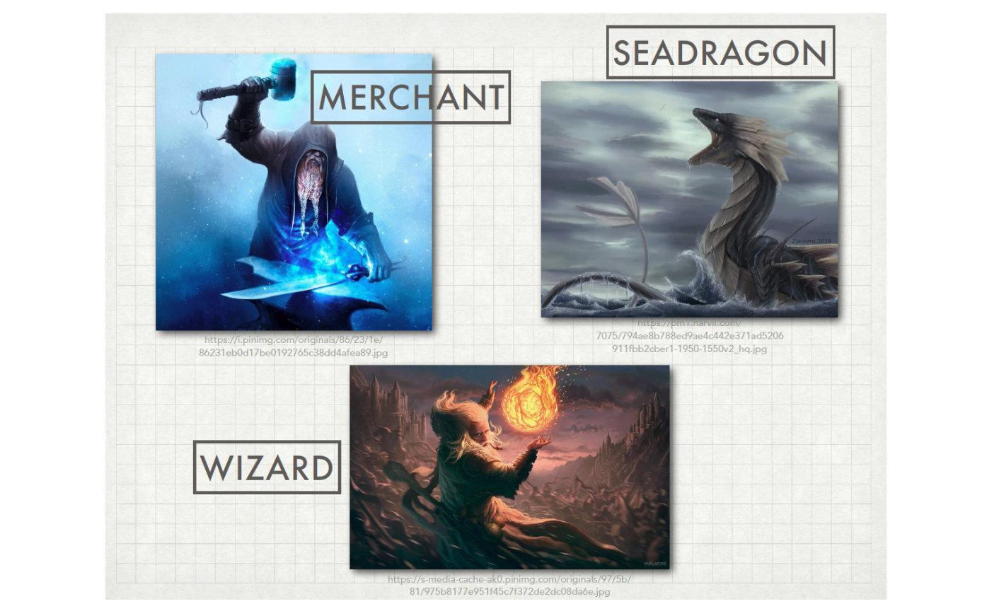

  • 首先，Wizard、SeaDragon 和Merchant 是三個角色。
  • 特別是，Wizard 通過調用attack() 與SeaDragon 戰鬥。
  • Wizard 通過調用buyAndSell() 與Merchant 買賣東西。
  • 但是，SeaDragon 不能買賣東西；商人不能攻擊他人。

  

  ```java
  abstract public class Character {}
  ```
  ```java
  public interface Combat {
    void attack(Combat enemy);
  }
  ```
  ```java
  public interface Trade {
    void buyAndSell(Trade counterpart);
  }
  ```

  ```java
  public class Wizard extends Character implements Combat, Trade {
    @Override
    public void attack(Combat enemy) {}
    @Override
    public void buyAndSell(Trade counterpart) {}
  }
  ```
  ```java
  public class SeaDragon extends Character implements Combat {
    @Override
    public void attack(Combat enemy) {}
  }
  ```
  ```java
  public class Merchant extends Character implements Trade {
    @Override
    public void buyAndSell(Trade counterpart) {}
  }
  ```

## HAS-A（委託）與 IS-A（繼承）
• 類繼承是實現代碼重用的一種強大方式。
• 然而，類繼承違反了封裝！
• 這是因為子類的正確功能取決於其超類的實現細節。
• 為解決這個問題，我們贊成委派而不是繼承。25

25GoF (1995);另請參閱 Bloch (2018) 中的第 18 項。

## 示例：策略模式
• 此模式通過封裝每個算法並使它們可互換來定義一系列算法。
• 它涉及以下OO 設計原則：
  • 封裝變化；
  • 接口代碼；
  • 使用委派。

## 特刊：包裝類
  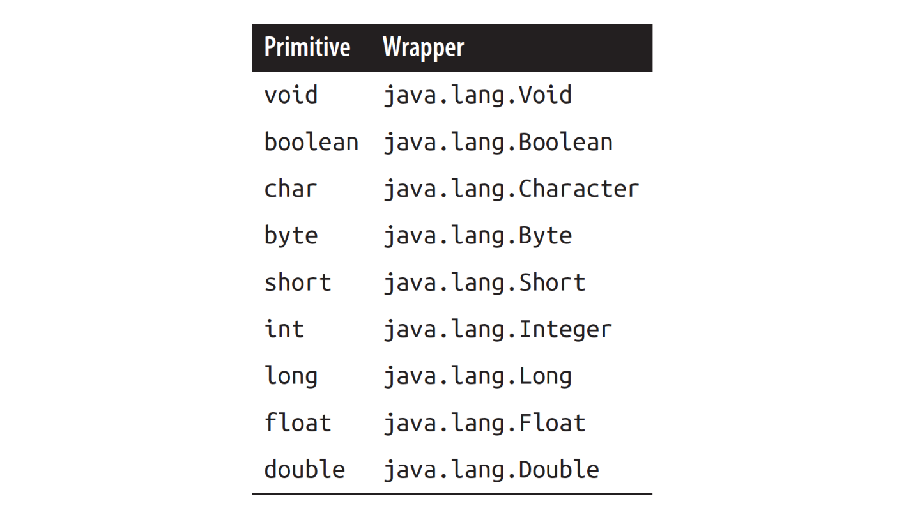

## 基元的自動裝箱和拆箱

Java 編譯器自動將基元包裝在相應的類型中，並在適當的地方解開它們。
```java
...
Integer i = 1; // Autoboxing.
Integer j = 2;
Integer k = i + 1; // Autounboxing and then autoboxing.
System.out.println(k); // Output 2.
System.out.println(k == j); // Output true.
Integer m = new Integer(i);
System.out.println(m == i); // Output false? System.out.println(m.equals(i)); // Output true!? ...
```

## 不可變對象
• 如果一個對像在構造後其狀態不能改變，則該對像被認為是不可變的。
• 通常用於值對象。
• 假設有一個存放不可變對象的池。
• 首次創建值對像後，如果需要，將重用該值對象。
• 這意味著當我們對不可變對象進行操作時會創建另一個對象。
• 另一個例子是字符串對象。26
• 使用不可變對像是一種很好的做法
並發編程.27

26請注意，StringBuffer 是 String 對象的可變版本。
27 請參閱 http://www.javapractices.com/topic/TopicAction.do?Id=29。

  

```java
...
String str1 = "NTU";
String str2 = "ntu";
System.out.println("str1 = " + str1.toLowerCase());
System.out.println("str1 = " + str1);
str1 = str1.toLowerCase();
System.out.println("str1 = " + str1);
System.out.println(str1 == str2); // False?!
System.out.println(str1.equals(str2)); // True!
System.out.println(str1.intern() == str2); // True!!
...
```


• 您可以使用equals() 來檢查文本是否與其他文本相同。
• 您可以使用 intern() 來檢查包含文本與另一個相同的字符串對象的字符串池。 28

28 請參閱 GoF 中的實習模式 (1995)。

## 特刊：枚舉
- 枚舉類型是一組預定義選項的特殊類型。
• 您可以使用靜態方法values() 來枚舉所有選項。
• 這種機制增強了類型安全並使源代碼更具可讀性！

## 示例：顏色
```java
public enum Color {
  RED, BLUE, GREEN;
  public static Color random() {
    Color[] colors = values();
    return colors[(int) (Math.random() * colors.length)];
  }
}
```

• Color 確實是 Enum 的子類，具有三個對 Color 對象的最終和靜態引用，對應於枚舉值。
• 我們還可以為枚舉類型配備靜態方法。

```java
public class EnumDemo {
  public static void main(String[] args) {
    Color crayon color = Color.RED;
    Color tshirt color = Color.random();
    System.out.println(crayon color == tshirt color);
  }
}
```

## 鍛煉
```java
public class PowerMachine {
  private PowerState state;
  public void setState(PowerState state) {
    this.state = state;
  }

  public PowerState getState() { return state; }
}

enum PowerState {
  ON("The power is on."), OFF("The power is off."),
  SUSPEND("The power is low.");
  private String status;
  private PowerState(String str) { status = str; }
}
```

## 枚舉背後？
```java
public enum Action {PLAY, WORK, SLEEP, EAT}
```

```java
public class Action {
  public final static Action PLAY = new Action("PLAY");
  public final static Action WORK = new Action("WORK");
  public final static Action SLEEP = new Action("SLEEP");
  public final static Action EAT = new Action("EAT");

  private final String text;

  public static Action[] values() {
    return new Action[] {PLAY, WORK, SLEEP, EAT};
  }
  private Action(String str) { text = str;}
  // Some functionalities are not listed explicitly.
  // Check java.lang.Enum.
}
```

## 特刊：包、導入和訪問控制
• Java 源文件中的第一條語句（註釋除外）必須是包聲明（如果存在）。
• 包是一組提供訪問保護（如下所示）和命名空間管理的相關類型。

| 範圍\修飾符  | private | (package) | protected | public |
|------------|:-------:|:---------:|:---------:|:------:|
| class內     |    ✓    |     ✓     |     ✓     |   ✓    |
| package內   |    ✕    |     ✓     |     ✓     |   ✓    |
| 繼承class   |    ✕    |     ✕     |     ✓     |   ✓    |
| package外   |    ✕    |     ✕     |     ✕     |   ✓    |

## 例子
```java
package www.csie.ntu.edu.tw;

public class Util {
  void doAction1() {}
  public void doAction2() {}
  protected void doAction3() {}
  public static void doAction4() {}
}
```


• 使用package 表示該類所屬的包。
• 包由文件夾實現。

```java
import www.csie.ntu.edu.tw.Greeting;
public class ImportDemo {
  public static void main(String[] args) {
    Util util = new Util();
    util.doAction1(); // Error!
    util.doAction2(); // OK!
    util.doAction3(); // Error!!
    Util.doAction4(); // OK!!
  }
}
```

• 如您所見，doAction1() 不可見。 （為什麼？）
• 請注意，受保護的成員在繼承下是可見的，
即使分開在不同的包中。

## 示例：有關導入的更多信息
```java
import www.csie.ntu.edu.tw.*; // Import all classes.
import static www.csie.ntu.edu.tw.Util.doAction4;

public class GreetingDemo {
  public static void main(String[] args) {
    Util util = new Util();
    util.doAction2(); // ok!
    Util.doAction4(); // ok!!
    doAction4(); // No need to indicate the class name.
  }
}
```

• 使用通配符(*) 導入包中的所有類。
• 我們也可以只在包中導入靜態成員。

## 特刊：嵌套類
• 嵌套類是其封閉類的成員。
• 嵌套類增加了封裝性，也導致了更多
可讀和可維護的代碼。
• 特別是，密封只在一個地方使用的類是一種很好的做法。

## 嵌套類家族
  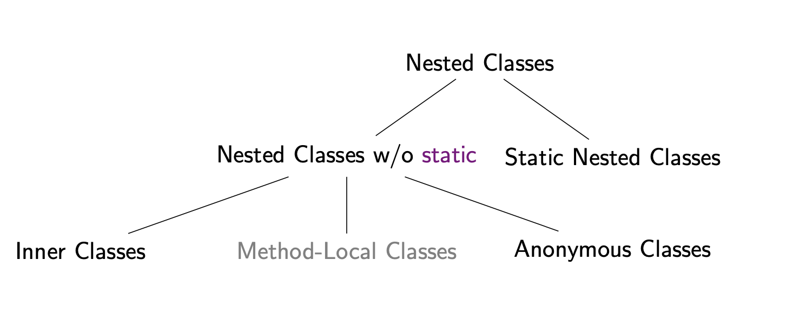

## 示例：按鍊錶堆疊
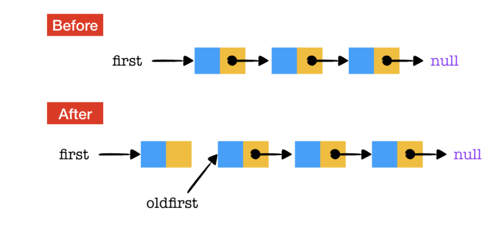

```java
public class LinkedListStack {
  private Node first; // Trait of linked list!

  private class Node {
    String item;
    Node next;
  }

  public String pop() {
    String item = first.item;
    first = first.next; // Deja vu?
    return item;
  }

  public void push(String item) {
    oldfirst = first;
    first = new Node();
    first.item = item;
    first.next = oldfirst;
  }
}
```

```java
public class LinkedListStackDemo {
  public static void main(String[] args) {
    LinkedListStack langs = new LinkedListStack();
    langs.push("Java");
    langs.push("C++");
    langs.push("Python");
    System.out.println(langs.pop()); // Output Python.
    System.out.println(langs.pop()); // Output C++.
    System.out.println(langs.pop()); // Output Java.
  }
}
```
• 請注意方法push() 和pop() 的運行時間為O(1)！
• 輸出顯示 FILO（先進後出）屬性
堆。

## 練習：房子和房間
  

```java
import java.util.ArrayList;
public class House {
  private ArrayList<Room> rooms = new ArrayList<>();
  private class Room {
    String name;
    
    @Override
    public String toString() { return name; }
  }

  public void add(String name) {
    Room room = new Room();
    room.name = name;
    rooms.add(room);
  }

  @Override
  public String toString() { return rooms.toString(); }
}
```

```java
public class HouseDemo {
  public static void main(String[] args) {
    House home = new House();
    home.add("Living room");
    home.add("Bedroom");
    home.add("Bathroom");
    home.add("Kitchen");
    home.add("Storeroom");
    System.out.println(home);
  }
}
```

## 匿名類
• 匿名類使您能夠同時聲明和實例化類。
• 除了沒有名稱外，它們類似於內部類。
• 如果您只需要一個實例，請使用匿名類
內部類。

## 示例：按鈕
```java
abstract class Button {
  abstract void onClicked();
}
public class AnonymousClassDemo1 {
  public static void main(String[] args) {
    Button btnOK = new Button() {
      @Override
      public void onClicked() {
        System.out.println("OK");
      }
    };
    btnOK.onClicked();
  }
}
```

## 練習：再飛一次
```java
public class AnonymousClassDemo2 {
  public static void main(String[] args) {
    Flyable butterfly = new Flyable() {
      @Override
      public void fly() { /* ... */ }
    };
    butterfly.fly();
  }
}
```
• 我們可以使用匿名類為一個接口實例化對象。

## 特刊：迭代器模式
• 迭代器是一種簡單且標準的接口，用於枚舉數據結構中的元素。
• 在 Java 中，我們現在繼續揭示 for-each 循環的機制：
• 一個實現接口Iterable 的類應該提供方法iterator() 的細節。
• 方法iterator() 應該返回一個由接口Iterator 定義的迭代器，它有兩個未實現的方法：hasNext() 和next()。
• 現在您的數據結構可以與for-each 循環兼容！

## 例子
```java
import java.util.Iterator;
class Box implements Iterable<String> {
  String[] items = {"Java", "C++", "Python"};
  public Iterator<String> iterator() {
    return new Iterator<String>() {
      private int ptr = 0;
      public boolean hasNext() { return ptr < items.length; }
      public String next() { return items[ptr++]; }
    };
  }
}
```

```java
public class IteratorDemo {
  public static void main(String[] args) {
    Box books = new Box();
    // for−each loop
    /*
    for (String book: books) {
                System.out.println(book);
    }
    */
    Iterator iter = books.iterator();
    while (iter.hasNext())
      System.out.println(iter.next());
  }
}
```

## 靜態嵌套類
• 靜態嵌套類是聲明為靜態的封閉類。
• 請注意，只有嵌套類可以是靜態的。
• 作為靜態成員，它可以訪問其他靜態成員而無需實例化封閉類。
• 特別是，可以直接實例化靜態嵌套類，而無需先實例化封閉類對象；它就像一個迷你包。

## 例子
```java
public class StaticClassDemo {
  public static class Greeting {
    @Override
    public String toString() {
      return "This is a static class.";
    }
  }
  public static void main(String[] args) {
    System.out.println(new StaticClassDemo.Greeting());
  }
}
```