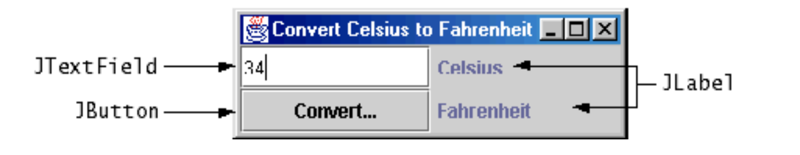
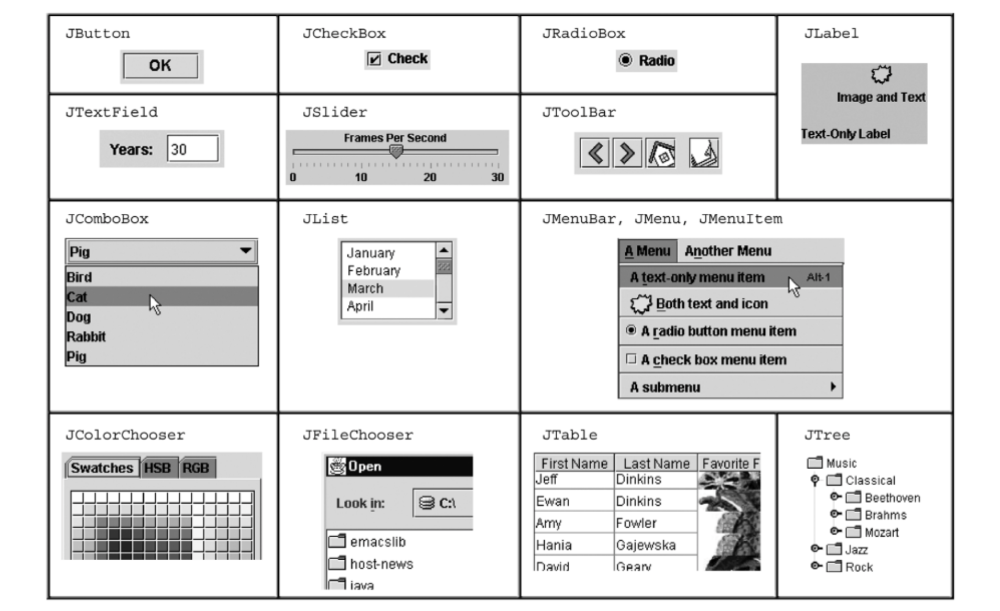
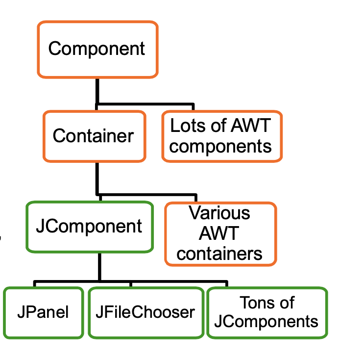
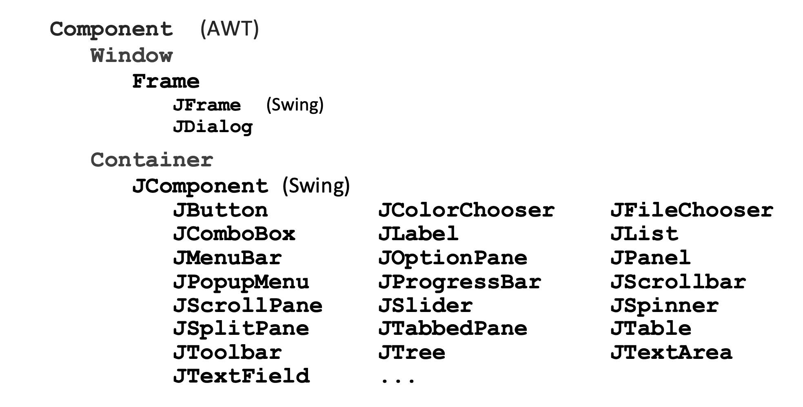
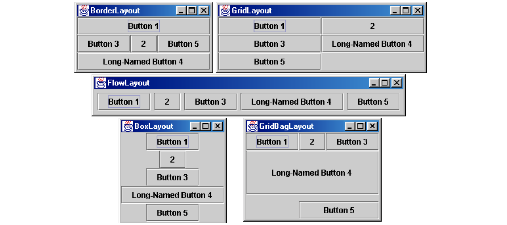
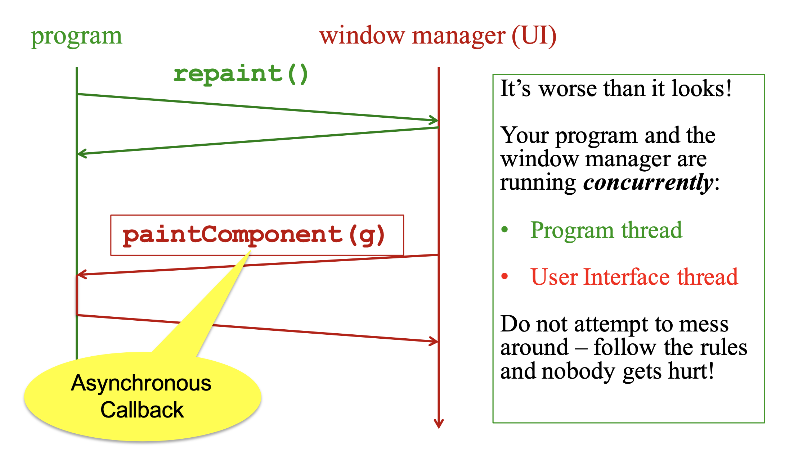
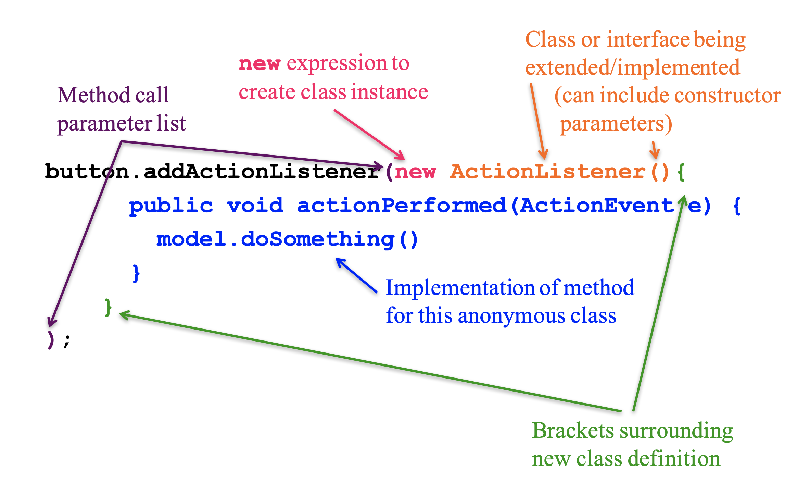
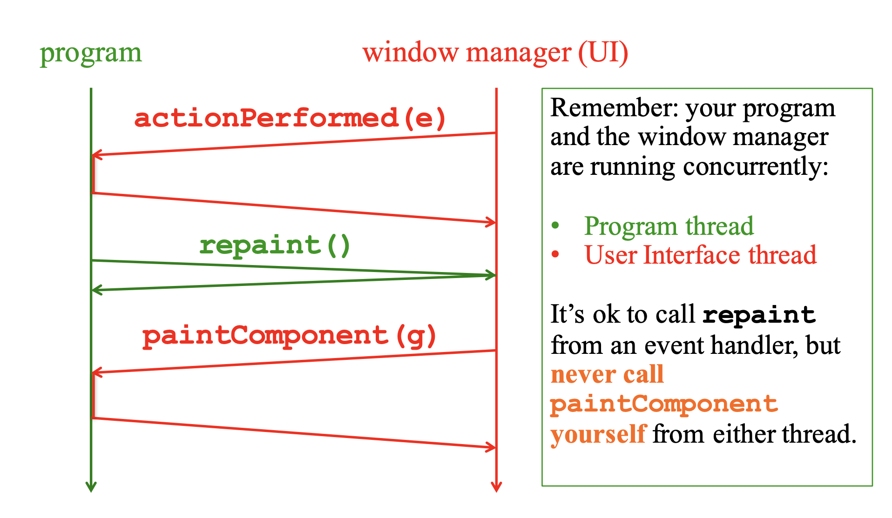

# Lecture 9: 使用 Swing 進行 GUI 設計

# Java 圖形和 GUI
## 計劃
今天：介紹 Java 圖形和 Swing/AWT 庫

然後：事件驅動編程和用戶交互

這些都不是全面的——只是一個概述和指南，說明你應該在那裡看到什麼
  – 一些標準術語和觀點

學分：取自許多地方的材料；包括 Ernst、Hotan、Mercer、Notkin、Perkins、Stepp 的幻燈片和材料；雷吉斯； Sun/Oracle 文檔和教程；霍斯特曼；維基百科；其他，民間傳說，...

## 參考
非常有用的開始：Sun/Oracle Java 教程
  – http://docs.oracle.com/javase/tutorial/uiswing/index.html

Mike Hoton 的幻燈片/範例代碼來自 CSE 331 Sp12（第 23 課，
24 個更廣泛的小部件範例）
  – http://courses.cs.washington.edu/courses/cse331/12sp/lectures/lect23-GUI.pdf
  – http://courses.cs.washington.edu/courses/cse331/12sp/lectures/lect24-Graphics.pdf
  – http://courses.cs.washington.edu/courses/cse331/12sp/lectures/lect23-GUI-code.zip
  – http://courses.cs.washington.edu/courses/cse331/12sp/lectures/lect24-Graphics-code.zip

涵蓋此內容（以及更多內容）的好書：Core Java vol.我由霍斯特曼和康奈爾
  – 還有其他不錯的 Java 書籍

## 為什麼要研究 GUI？
• 呃，因為圖形用戶界面很常見（duh J）——而且很有趣！
• 使用繼承來組織大型類庫的經典範例
– OOP 優勢的最佳（？）範例
• 使用龐大的 API – 並學習如何（不）處理所有這些問題
• 許多核心設計模式出現：回調、監聽器、事件驅動程序、裝飾器、外觀

## 什麼不該做...
• 不要試圖學習整個庫：太多了
• 不要死記硬背——需要的時候查一下
• 不要錯過主要思想、基本概念
• 不要陷入實施視覺糖果的困境

## 學習的主要課題
AWT/Swing 庫的組織
  – 基本小部件/組件的名稱

圖形和繪圖
  – 重繪回調、佈局管理器等。

處理用戶事件

構建 GUI 應用程序
  – MVC、用戶事件、更新……

## 很短的歷史（1)
Java 的標準庫從一開始就支持 GUI
原始 Java GUI：AWT（抽象窗口工具包）
– 有限的用戶界面元素集（小部件）
– 將 Java UI 映射到主機系統 UI 小部件
– 最小公分母
– “一次編寫，到處調試”

## 很短的歷史（二）
Swing：較新的 GUI 庫，隨 Java 2 (1998) 引入
基本思想：底層系統只提供一個空白窗口——Swing直接繪製所有UI組件
– 不使用底層系統小部件
不是 AWT 的完全替代品：Swing 是在核心 AWT 類之上實現的，並且兩者仍然共存
使用 Swing，但在必須時處理 AWT

## 圖形用戶界面術語
窗口：圖形桌面的一等公民——也稱為頂級容器
– 範例：框架、對話框、小程序
組件：駐留在窗口中的 GUI 小部件——在許多其他語言中稱為控件
– 範例：按鈕、文本框、標籤
容器：承載（持有）組件的組件——範例：框架、小程序、面板、框

## 一些組件...

## 組件和容器類
• 每個 GUI 相關的類都派生自 Component，其中包含許多基本方法和字段
  – 例子：getBounds, isVisible, setForeground, ...• 每個 GUI 相關的類都派生自 Component，其中包含許多基本方法和字段
• “原子”組件：標籤、文本字段、按鈕、複選框、圖標、菜單項……
• 許多組件都是容器——比如可以容納嵌套子組件的面板 (JPanel)

## Swing/AWT 繼承層次結構

## 組件屬性

數以億計。每個都有一個 get(oris)accessorandset 修飾符。範例：getColor、setFont、isVisible、...

| 名稱                                 | 類型      | 描述                                    |
|-------------------------------------|-----------|----------------------------------------|
| background                          | Color     | 組件後面的背景顏色                        |
| border                              | Border    | 組件周圍的邊界線                          |
| enabled                             | boolean   | 是否可以交互                             |
| focusabled                          | boolean   | 是否可以在上面輸入關鍵文本                 |
| font                                | Font      | 組件中文本使用的字體                      |
| foreground                          | Color     | 組件的前景色                             |
| height,width                        | int       | 組件的當前大小（以像素為單位）              |
| visible                             | boolean   | 組件是否可見                             |
| tooltip text                        | String    | 鼠標懸停時顯示的文字                      |
| size,minimum/maximun/preferred size | Dimension | 組件可能採用的各種尺寸、尺寸限製或所需尺寸    |

## 容器類型
• 頂級容器：JFrame、JDialog、...
  – 常對應OSwindows
  – 通常是其他組件的“主機”
  – 位於 UI 層次結構的頂部，不嵌套在其他任何東西中
• 中層容器：面板、滾動窗格、工具欄
  – 有時包含其他容器，有時不包含
  – JPanel 是一個通用組件，用於繪製或託管其他 UI 元素（按鈕等）
• 專用容器：菜單、列錶框……
• 從技術上講，所有 JComponent 都是容器

## JFrame——頂層窗口
• 屏幕上的圖形窗口
• 通常擁有（託管）其他組件
• 常用方法：
  – JFrame(String title)：構造函數，標題可選
  – setDefaultCloseOperation(int what)
    • 窗口關閉時做什麼
    • JFrame.EXIT_ON_CLOSE 終止應用程序
  – setSize(int width, int height)：設置大小
  – add(Component c): 添加組件到窗口
  – setVisible(boolean b)：使窗口可見或不可見

## Example
  SimpleFrameMain.java

## JPanel——通用容器
• 通常用作放置圖形或收藏的地方
按鈕、標籤等
• 需要添加到窗口或其他容器：
frame.add(新的 JPanel(...))
• JPanels 可以嵌套到任意深度
• 許多方法/字段與 JFrame 相同（因為兩者都繼承自 Component）
  – 建議：找不到方法/字段？檢查超類
一個特別有用的方法：
  – setPreferredSize（維度 d）

## 容器和佈局
• 如果我們向容器中添加多個組件會怎樣？
  – 它們之間的相對位置如何？
• 答案：每個容器都有一個佈局管理器

## 佈局管理器
種類：
  – FlowLayout（從左到右[可變]，從上到下）
    • DefaultforJPanel
    • 每行水平居中[可變]
  – BorderLayout (“center”, “north”, “south”, “east”, “west”)
    • Default for JFrame
    • 5 個區域中的每個區域不超過一個組件
    • （當然組件本身也可以是容器）
  – GridLayout（常規二維網格）
  – 其他...（有些非常複雜）
FlowLayout 和 BorderLayout 現在應該足夠好了......

## pack()
  一旦所有組件都添加到它們的容器中，執行此操作以使窗口可見：
    pack();
    setVisible(true)；
  pack()計算出所有組件的大小並調用容器的佈局管理器來設置容器中的位置
    – （根據需要遞歸）
  如果你的窗口看起來不對，你可能忘記了 pack()

## Example
  SimpleLayoutMain.java

## 圖形和繪圖
  到目前為止一切順利——而且非常無聊……

  如果我們真的想畫點東西怎麼辦？
  – 一張地圖、一幅圖像、一條路徑……？

  答：覆蓋方法 paintComponent
    – 像 JLabel 這樣的組件提供了合適的 paintComponent
    那個（在 JLabel 的例子中）繪製標籤文本
    – 其他組件如JPanel一般繼承empty
    paintComponent 並且可以覆蓋它來繪製東西
  注意：正如我們將看到的，我們覆蓋了 paintComponent 但我們沒有調用它

## Example
  SimplePaintMain.java

## 圖形方法
  繪製各種線條、形狀等的方法很多，...
  
  還可以繪製圖像（圖片等）：
    – 在程序中（notinpaintComponent）：
       • 使用 AWT 的“工具包”加載圖像：
        Image pic = Toolkit.getDefaultToolkit()
          .getImage（文件名（帶路徑））；
    – 然後在 paintComponent 中：
      g.drawImage(pic, ...);

## Graphics 與 Graphics2D
  類 Graphics 是原始 Java AWT 的一部分
    有一個程序接口：
    g.drawRect(...), g.fillOval(...), ...
    
  Swing 引入 Graphics2D
    – 添加了一個對象接口——創建像 Line2D、Rectangle2D 等形狀的實例，並將它們添加到 Graphics2D 對象

  paintComponent 的實際參數始終是 Graphics2D
    – 始終可以將此參數從 Graphics 轉換為圖形二維
    – Graphics2D 支持兩組圖形方法
    – 使用任何你喜歡的 CSE 331

## 那麼誰調用了 paintComponent 呢？什麼時候？？
  • 答案：窗口管理器在需要時調用paintComponent！ （回調！）
    – 當窗口首次可見時，以及此後需要重新繪製部分或全部窗口時
  • 推論：無論其他情況如何，paintComponent 必須始終準備好重新繪製
    – 您無法控制何時或多久
    – 您必須存儲足夠的信息以按需重繪
  • 如果“你”想重繪一個窗口，從程序中調用 repaint()（而不是從 paintComponent 中）
    – 告訴窗口管理器安排重新繪製
    – 窗口管理器在決定重繪時將調用 paintComponent（很快，但可能不會馬上）
    – 窗口管理器可以組合幾個快速重繪（）請求並只調用一次 paintComponent（）

## Example
  FaceMain.java

## 重繪是如何發生的

## 繪畫的重要規則
• 如果要在組件上繪製，請始終重寫 paintComponent(g)
• 始終先調用 super.paintComponent(g)
• 永遠、永遠、永遠自己調用 paintComponent
• 始終從頭開始繪製整個畫面
• 使用 paintComponent 的 Graphics 參數進行所有繪圖。只為此使用它。
不要復制它、嘗試替換它或弄亂它。它很快就會生氣。
• 不要創建新的 Graphics 或 Graphics2D 對象

細則：一旦您成為經過認證的 TM 嚮導，您可能會找到以不同方式做事的理由，但這需要對 GUI 庫的結構和規範有更深入的了解

## 接下來是什麼——而不是
下一課的主要話題是如何處理用戶交互
– 我們已經知道核心思想：它是觀察者模式的重要用途
除此之外，您還可以自行探索 Swing/AWT 中所有精彩的小部件。
- 玩得開心！！
–（但不要花大量時間在花眼上）

# GUI Events

## 計劃
用戶事件和回調
  — 事件對象
  – 事件監聽器
  – 註冊監聽器來處理事件
匿名內部類和 lambda
UI 和程序線程之間的正確交互

## 事件驅動編程
  許多應用程序是事件驅動程序（大多數 GUI！）：
    – 程序初始化自身，然後進入事件循環
    – 抽像地：
      do {
          e = getNextEvent();
          process event e;
      } while (e != quit);

對比應用程序或算法驅動的控制，其中程序期望以特定順序輸入數據
  – 典型的大型非 GUI 應用程序，如網絡爬蟲、工資單、模擬……

## GUI 事件的種類
GUI 程序處理的典型事件：
– 鼠標移動/拖動/單擊、按鈕按下、按鈕釋放
– 鍵盤：按鍵按下或釋放，有時帶有 shift/control/alt/等修飾符。
– 用手指輕敲或在觸摸屏上拖動
– 操縱桿、繪圖板、其他設備輸入
– 窗口調整大小/最小化/恢復/關閉
– 網絡活動或文件 I/O（開始、完成、錯誤）
– 定時器中斷（包括動畫）

## Java AWT/Swing 中的事件
許多（大多數？）GUI 小部件可以生成事件（按鈕點擊、菜單選擇、按鍵等）

使用觀察者模式處理：
  – 希望處理事件的對象向生成它們的對象註冊為觀察者
  – 當事件發生時，調用每個觀察者中的適當方法
  – 正如預期的那樣，多個觀察者可以觀察並收到對像生成的事件的通知

## 事件對象
Java GUI 事件由事件對象表示—
  — 超類是 AWTEvent
  – 一些子類：
    ActionEvent – GUI 按鈕按下
    KeyEvent——鍵盤
    MouseEvent – 鼠標移動/拖動/點擊/按鈕
事件對象包含有關事件的信息
  – 觸發事件的 UI 對象
  – 其他信息取決於事件。例子：
    ActionEvent – 來自按鈕的文本字符串
    MouseEvent – 鼠標坐標

## 事件監聽器
事件偵聽器必須實現正確的接口：KeyListener、ActionListener、MouseListener（按鈕）、MouseMotionListener（移動/拖動）……
  – 或者擴展適當的庫抽像類，提供接口方法的空實現

當事件發生時，調用接口中指定的適當方法：actionPerformed、keyPressed、
  mouseClicked, mouseDragged, ...

事件對像作為參數傳遞給事件偵聽器方法

## 範例：按鈕
創建一個 JButton 並將其添加到窗口
創建一個實現 ActionListener 的對象
  – （包含一個actionPerformedmethod）
  
將監聽器對象添加到按鈕的監聽器
                 ButtonDemo1.java

## 哪個按鈕是哪個？
  問：單個按鈕偵聽器對象通常會處理多個按鈕。如何判斷哪個按鈕產生了事件？
  
  A：ActionEvent 有一個 getActionCommand 方法，它返回（對於按鈕）“action command”字符串
    – 默認為按鈕名稱（文本），但通常最好將其設置為某個字符串，即使 UI 更改或按鈕名稱已翻譯，該字符串也將在程序代碼中保持不變。請參見按鈕範例。

  解碼其他事件的類似機制

## 偵聽器類
ButtonDemo1.java 定義了一個只使用一次的類來為單個按鈕創建監聽器
  – 可能是一個頂級類，但在這個例子中它是一個內部類，因為它在其他地方不需要
  – 但是，當我們只想創建一個在單擊按鈕後調用的方法時，為什麼要使用一個完整的類呢？
    • 唉，Java 8 之前沒有 lambda（函數閉包）
    
  更方便的捷徑：匿名內部類

## 匿名內部類
思路：直接在創建（新）匿名內部類對象的new表達式中定義一個新類
  – 指定要擴展的超類或要實現的接口
  – 覆蓋或實現匿名類實例中所需的方法
  – 可以有方法、字段等，但不能有構造函數
  – 但如果它開始變得複雜，為了清晰起見，使用普通類（如果合適，嵌套內部類）

警告：前方可怕的語法

## Example

## Example
  ButtonDemo2.java

## 程序線程和UI線程
回想一下，程序和用戶界面是在獨立的並發線程中運行的

所有 UI 操作都發生在 UI 線程中——包括代碼中定義的回調，如 actionListener 或 paintComponent 等

在事件處理和相關工作之後，如果 paintComponent() 需要運行，則調用 repaint()。不要試圖從事件處理程序本身內部繪製任何東西（因為你不能這樣做！！！）

  記住 paintComponent 必須能夠通過讀取窗口管理器調用它時可用的數據來完成它的工作

## 事件處理和重繪

記住：你的程序和窗口管理器是同時運行的：
  • 程序線程
  • 用戶界麵線程
從事件處理程序調用重繪是可以的，但是
從不打電話
paint組件
你自己從任何一個線程。

## 在 UI 線程中工作
事件處理程序不應該做很多工作
  – 如果事件處理程序進行大量計算，用戶界面將出現凍結
    • （為什麼？）
  – 如果有很多事情要做，事件處理程序應該設置一個程序線程會注意到的位。在程序線程中完成繁重的工作。
    •（別擔心——在 UI 線程中找到校園地圖的路徑應該足夠快）

## 同步問題？
是的，可能存在同步問題——（參見 CSE332、CSE451，……）
在行為良好的程序中通常不是問題，但可能會發生一些建議：
  – 保持事件處理簡短
  – 在數據準備就緒時調用重繪，而不是部分準備好時更新
  – 不要同時在 UI 和程序線程中更新數據（特別是對於復雜數據）
  – 從不直接調用 paintComponent
    •（我們有沒有提到你永遠不應該打電話給
      油漆組件？也不要創建新的 Graphics 對象。）

如果您正在構建工業級 UI，請了解有關線程和 Swing 的更多信息以及如何避免潛在問題

## 更大的例子——彈跳球
手工製作的 MVC 應用程序。起源在 CSE142/3 迷霧中的某個地方。說明如何使用一些 swing GUI 組件。
免責聲明：
– 不是最好的設計
– 不太可能直接適合您的項目
– 將它用於想法和靈感，如果它們真的適合，可以隨意竊取小塊
享受！