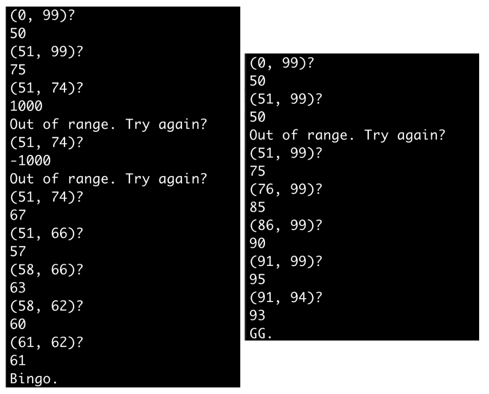
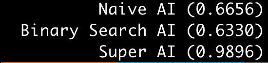
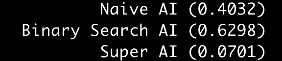
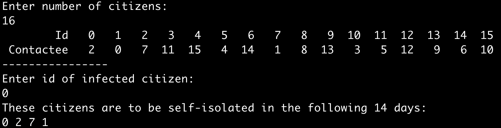
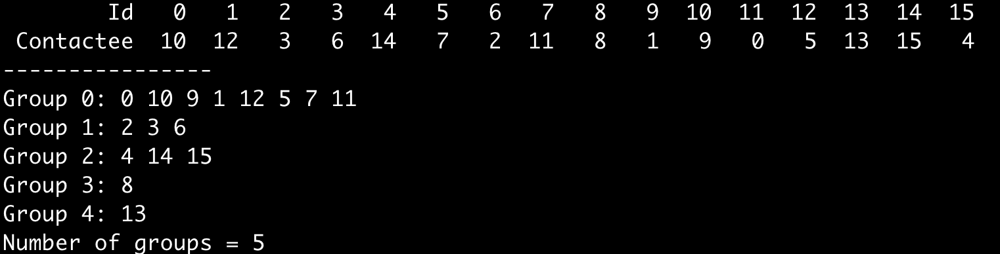
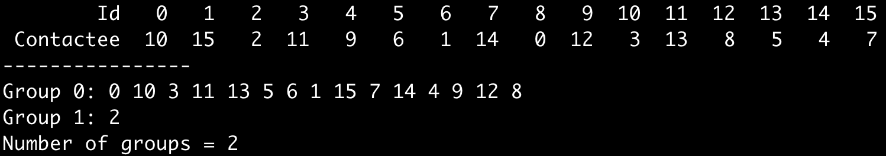
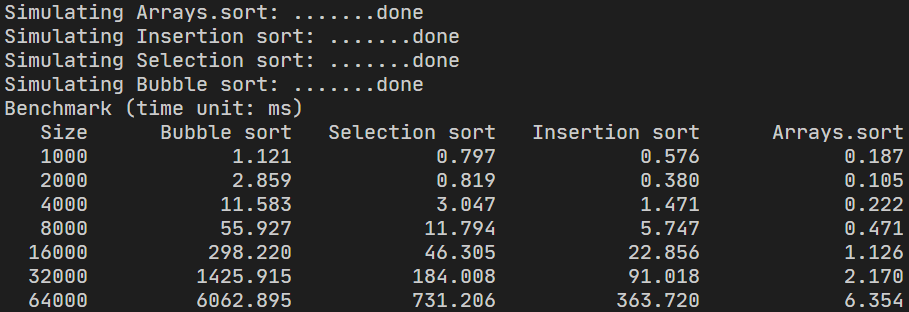
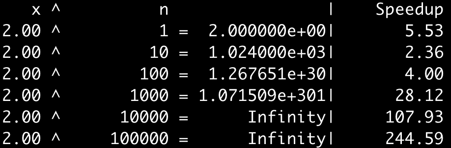

## Lab 1 Number-Guessing Game (猜數字)
  (Lecture_4)
  - 編寫一個猜數遊戲程序（沒玩過的可以參考[猜數字](https://www.funbrain.com/games/guess-the-number)）。
  - 該程序首先生成一個介於 0 和 99（含）之間的秘密數字。
  - 然後程序要求玩家猜一個數字。如果輸入值等於秘密數字，則玩家獲勝。如果不是，則根據輸入相應地更新範圍。
  - （例如，假設密碼是 42。如果玩家第一次輸入 50，則程序會在屏幕上顯示 (0, 49)。）當只剩下一個整數時，玩家輸掉遊戲。另外，確保玩家輸入的數字在可行範圍內；否則，要求用戶重做輸入。
  

  - #### 練習
    ```java
      import java.util.Scanner;
      public class Lab1_Number_Guessing {
        public static void main(String[] args) {
          int l = 0, r = 99;
          // 秘密數字
          int secret = (int)(Math.random() * 100);
          Scanner input = new Scanner(System.in);
          int userInput = 0;
          
          while(true){
            // 目前範圍在？
            System.out.println("(" + l + "," + r + ") ?");
            // System.out.println("秘密為" + secret);
            
            // 使用者輸入
            userInput = input.nextInt();
            
            // 超出範圍，再來一次
            if(userInput < l || userInput > r) {
              System.out.println("Out of range. Try again?");
              continue;
            }
            
            // 正確答案
            if(userInput == secret) {
              System.out.println("Bingo");
              break;
            }
            
            else if(userInput < secret){
              l = userInput + 1;
            }else {
              r = userInput - 1;
            }
            
            // 只剩下一個整數，失敗
            if( l >= r) {
              System.out.println("GG, answer is " + secret);
              break;
            }
          };
        }

      }

    ```

    <!-- TODO: -->
  - #### 實驗 1-1（可選）
    添加一些策略（AI？）來玩這個遊戲，並通過使用這些策略 1e5 次來計算每個勝率。例如，樸素的策略是隨機猜測一個數字，其結果在 66% 左右。令人驚訝的是，二分查找的勝率約為 63%，並沒有像預期的那樣擊敗 naive。為什麼？

    <!-- TODO: -->
  - #### 實驗 1-2（可選）
    找到擊敗前兩者的最佳策略。結果如下所示。如您所見，我的最優策略的勝率達到了 99%！
    

    <!-- TODO: -->
  - #### 實驗 1-3（可選）
    修改允許玩家最多猜測 7 次的遊戲循環（為什麼？）。還報告他們的表現如下：
    
    二分查找的性能保持在 63% 左右，而其他兩個則嚴重下降！

---

## Lab 2 Contagion Control (傳染控制)
  (Lecture_5)
  - [COVID-19](https://en.wikipedia.org/wiki/Coronavirus_disease_2019) 病毒通過與感染者的密切接觸傳播。
  現在你要設計一種算法來找到從一個人到另一個人的病毒鏈，識別並隔離這些人。
  為簡單起見，令 N 為公民的數量，每個公民用 0, 1, 2, ..., N − 1 表示。然後每個公民寫下他/她接觸過的公民。
  為避免手動輸入這些數字，請使用 `shuffling algorithm (混洗算法)` 生成隨機序列 0、1、2、...、N − 1 進行測試。
  請注意，所有元素都是不同的。例如，考慮 N = 16 並從第一個公民開始。可能的輸出如下所示。
  

  <!-- TODO: -->
  - #### 練習
    ```java
    import java.util.ArrayList;
    import java.util.Scanner;

    public class Lab2_ContagionControl {
      public static void main(String[] args) {
        Scanner input = new Scanner(System.in);
        System.out.println("Enter number of citizens:");
        
        int N = input.nextInt();
        
        // 生成 citizens
        ArrayList<Integer> idArr = new ArrayList<>();
        ArrayList<Integer> selfIsolated = new ArrayList<>();
        for(int i = 0; i < N; i++) {
          idArr.add(i);
        }
        
        // 隨機序列
        for(int i = idArr.size() - 1; i > 0; i--){
            int j = (int) (Math.random() * (i + 1));
            int z = idArr.get(i);
            idArr.set(i, idArr.get(j));
            idArr.set(j, z);
          }
        
        // 生成 Id index
        System.out.printf("%10s", "Id");
        for(int i = 0; i < N; i++) {
          System.out.printf("%4d", i);
        }
        
        // 生成 Contactee
        System.out.println();
        System.out.printf("%10s", "Contactee");
        for(int item : idArr) {
          System.out.printf("%4d", item);
        }
        System.out.println();
        
        System.out.println("----------------");
        System.out.println("Enter id of infected citizen: ");
        
        // 從哪一個公民開始查詢接觸過的人
        int from = input.nextInt();
        selfIsolated.add(from);
        int contact = from;
        while(true) {
          contact = idArr.get(contact);
          if(contact == from) break;
          selfIsolated.add(contact);
        }
        
        System.out.println("These citizens are to be self-isolated in the following 14 days");
        for(int item: selfIsolated) {
          System.out.printf("%3d", item);
        }
        input.close();
      }
    }
    ```

  <!-- TODO: -->
  - #### 實驗 2-1（可選）
    修改您的解決方案以顯示所有組成員併計算隨機序列中的組數。
    例如，假設 N = 16，輸出如下所示。

    
    

  <!-- TODO: -->
  - #### 實驗 2-2（可選）
    將本機數組替換為ArrayList.
    本實驗要求您了解 Java 泛型和泛型的用法ArrayList，本講不會全面介紹這些內容（參見 Java Programming 2）。

---

## Lab 3 Performance Benchmark for Sorting Algorithms (排序算法的性能基準)
  (Lecture_5)
  首先，實現課堂上提到的三種排序算法（`冒泡排序`、`選擇排序` 和 `插入排序`）。
  然後將這些排序算法的 `運行時間` 與 `Arrays.sort()` （[在此處](https://docs.oracle.com/javase/8/docs/api/java/util/Arrays.html#sort-int:A-) 查看其 API ）進行比較。
  由於這些基於比較的排序算法的性能對數據序列的順序很敏感，我建議你可以計算各種大小的 `平均運行時間` 並為這四種算法做一個基準（使用加倍假設），如下所示.

  

  您可以使用 `System.currentTimeMillis()` 或 `System.nanoTime()` 來製作時間戳（記住使用長變數）。
  請注意，由於運行時環境的不同，表中的實際數字可能與我的不同。供您參考，基準測試是在內存為 DDR4 3200 64GB 的 AMD Ryzen 9 3900X 上完成的。有興趣的可以看看這個15種排序算法的 [視頻](https://www.youtube.com/watch?v=kPRA0W1kECg)。

  - `System.currentTimeMillis()` 用法
    ```java
    ...
      long t0 = System.currentTimeMillis();
      Thread.sleep(1000);
      long t1 = System.currentTimeMillis();

      System.out.println("Duration = " + (t1 - t0) + " ms");
    ...
    ```

  <!-- TODO: -->
  - #### 練習

  <!-- TODO: -->
  - #### 實驗 3-1（可選）
    將每種排序算法的運行時間增長率與 big-O 的理論預測進行比較。
    回想一下，前三個排序算法的運行時間為 O(n^2)，而 Arrays.sort() 的運行時間為 O(n log n)。
  
  <!-- TODO: -->
  - #### 實驗 3-2（可選）
    實現運行時間為 O(n ^ 2) 的雞尾酒排序算法(cocktail sort)。您可以參考維基百科中的 [雞尾酒排序](https://en.wikipedia.org/wiki/Cocktail_shaker_sort)。

  <!-- TODO: -->
  - #### 實驗 3-3（可選）
    實現 Shell 的排序算法，運行時間為 O(n (log n) ^ 2)。可以參考維基百科的 [shell排序](https://en.wikipedia.org/wiki/Shellsort)，或者這篇 [文章](http://notepad.yehyeh.net/Content/Algorithm/Sort/Shell/Shell.php)。

  <!-- TODO: -->
  - #### 實驗 3-4（可選）
    實現在 O(n log n) 時間內運行的歸併排序算法。您可以參考維基百科中的 [歸併排序](https://en.wikipedia.org/wiki/Merge_sort)。

  <!-- TODO: -->
  - #### 實驗 3-5（可選）
    實現在 O(n log n) 時間內運行的快速排序算法。您可以參考維基百科中的 [快速排序](https://en.wikipedia.org/wiki/Quicksort)。

## Lab 4 Fast Power Using Recursion (使用遞迴的快速功率)
  (Lecture_6)
  令 x 為任何實數，n 為任何非負整數。編寫一個程式，通過 `遞迴` 計算 x^n。
  例如，2^10 = 1024。盡量讓你的程序在 `O(log n)` 時間內運行。
  請注意，您不得在解決方案中使用 `Math.pow()` 和 `任何 loop`。

  <!-- TODO: -->
  - #### 練習

  - #### 實驗 4-1（可選）
    將您的解決方案與原始方法（在 O(n) 時間內運行）進行比較。報告加速。
    

  - #### 實驗 4-2（可選）
    如您所見，當 exp 超過 1000 時會發生雙重溢出。要計算正確的數字，您可以對任意數字使用 BigDecimal。

  - #### 實驗 4-3（可選）
    修改負 n 的解決方案。

  - #### 實驗 4-4（可選）
    將遞歸版本轉換為循環版本。

  - #### 實驗 4-5（可選）
    在您的解決方案中引入按位運算符 (&) 和移位運算符 (>>)。

  - #### 實驗 4-6（可選）
    令 M 為任何正整數值。編寫一個函數來計算 n = 10000000 的 x^n mod M。您可以使用多項式餘數定理（參見[此處](https://en.wikipedia.org/wiki/Polynomial_remainder_theorem)）。