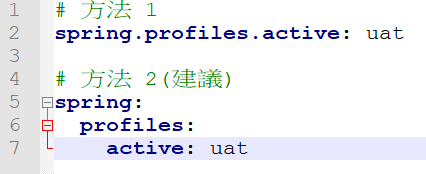
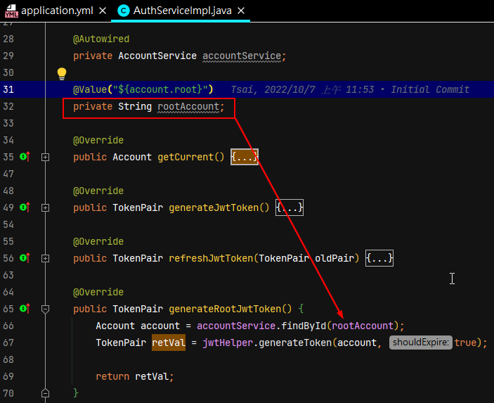

# 20221017 第一場 專案初始化
## 前置作業
  - 下載 IntelliJ IDEA Community、Git、TIBCO Jaspersoft Studio、Notepad++
  - [下載 官方 Maven](https://repo.maven.apache.org/maven2/org/apache/maven/apache-maven/3.6.3/)
    - 將ZIP檔案解壓縮並放置在 D:\development-tool\apache-maven-3.6.3
  - [下載 JDK](https://jdk.java.net/java-se-ri/8-MR4)
    - 將ZIP檔案解壓縮並放置在 D:\development-tool\java-se-8u42-ri

## 1. 設定環境變數
  - ### 設定環境變數
    - #### Win OS 篇
      - ##### 步驟一
        使用『 `搜尋` 』來尋找『 `您的帳戶的環境變數` 』
      - ##### 步驟二
        新增『 JAVA_HOME 』、『 M2_HOME 』
      - ##### 步驟三
        找到『 Path 』，點擊『 編輯 』，新增『 %JAVA_HOME%\bin 』、『 %M2_HOME%\bin 』
      - ##### 步驟四
        按下『 確定 』，儲存所有設定
    - #### Mac 篇

  - ### 查看 JDK、Maven 版本
    - ```sh
      java -version   # 這行指令非必要，單純看看公司預設安裝在 C 槽 的 Java 版本
      ```
    - ```sh
      javac -version  # 查看 SDK 版本
      ```
    - ```sh
      mvn -version  # 查看 Maven 版本
      ```
  
  - ### 將 Maven 的 Package Repository 改指向公司
    - 使用『 `搜尋` 』找到『 `檔案總管` 』，上面頁籤切換到『 `檢視` 』，將『 `副檔名` 』、『 `隱藏的項目` 』勾選。
    - 找到『 `本機 / C: / 使用者 / <公司AD 5 碼> / .m2` 』
      - 若無此資料夾，
        - 使用 cmd (命令提示字元)
          ```sh
          $ cd  C:\Users\${5碼職工編號} → cd C:\Users\B1384
          $ mkdir .m2
          ```
    - 底下新增 `settings.xml`
      - 範本如下：
        ```xml
        <?xml version="1.0" encoding="UTF-8"?>
          <settings xsi:schemaLocation="http://maven.apache.org/SETTINGS/1.1.0 http://maven.apache.org/xsd/settings-1.1.0.xsd" xmlns="http://maven.apache.org/SETTINGS/1.1.0"
              xmlns:xsi="http://www.w3.org/2001/XMLSchema-instance">
            <servers>
              <server>
                <username>此處填入小寫 AD 帳號</username>
                <password>此處填入加密密碼</password>
                <id>central</id>
              </server>
              <server>
                <username>此處填入小寫 AD 帳號</username>
                <password>此處填入加密密碼</password>
                <id>snapshots</id>
              </server>
            </servers>
            <profiles>
              <profile>
                <repositories>
                  <repository>
                    <snapshots>
                      <enabled>false</enabled>
                    </snapshots>
                    <id>central</id>
                    <name>libs-release</name>
                    <url>http://10.42.70.218/artifactory/libs-release</url>
                  </repository>
                  <repository>
                    <snapshots />
                    <id>snapshots</id>
                    <name>libs-snapshot</name>
                    <url>http://10.42.70.218/artifactory/libs-snapshot</url>
                  </repository>
                </repositories>
                <pluginRepositories>
                  <pluginRepository>
                    <snapshots>
                      <enabled>false</enabled>
                    </snapshots>
                    <id>central</id>
                    <name>libs-release</name>
                    <url>http://10.42.70.218/artifactory/libs-release</url>
                  </pluginRepository>
                  <pluginRepository>
                    <snapshots />
                    <id>snapshots</id>
                    <name>libs-snapshot</name>
                    <url>http://10.42.70.218/artifactory/libs-snapshot</url>
                  </pluginRepository>
                </pluginRepositories>
                <id>artifactory</id>
              </profile>
            </profiles>
            <activeProfiles>
              <activeProfile>artifactory</activeProfile>
            </activeProfiles>
          </settings>
        ```
      - 更改
        - `<username>此處填入小寫 AD 帳號</username>`
        - `<password>此處填入加密密碼</password>`
        - 取得加密密碼
          - AD 帳號（帳號英文部分為小寫）登入 [JFrog](http://10.42.70.218/ui/)
          - 點選右上角的個人帳號下拉選單，之後選擇 `Edit Profile`
          - 在 `Current Password` 內填入剛登入用的密碼，之後按下 [Unlock]
          - 利用網頁上的icon，複製 `Encrypted Password` 
        
## 2. 設定開發工具
  - ### 查看已安裝插件
    
    - 開啟『 `Intellij` 』軟體 設定，右上角選擇『 `Settings` 』(Mac 請選擇『 `Preferences` 』)
    - 左側側邊Menu，選擇『 `Plugins` 』，開啟 擴充工具
    - 上方頁籤，記得切換到『 `Marketplace` 』，查看未曾安裝過的插件。
    - 搜尋相關套件，並安裝

  - ### 建議安裝的插件
    - [Lombok](https://www.baeldung.com/lombok-ide)
    - [GitToolBox](https://www.gushiciku.cn/pl/gBnS/zh-tw)
    - [Maven Helper](https://www.gushiciku.cn/pl/gBnS/zh-tw)
    - [Rainbow brackets](https://www.gushiciku.cn/pl/gBnS/zh-tw)

  - ### 配置 Setting
    - #### maven 設定
      

    - #### 配置 Project Structure
      
    
    - #### 字型、字體
      
      

    - #### 工作目錄
      
    
    - #### 解除自動更新機制
      
    
    - #### 設定鍵盤快捷鍵
      
    
    - #### 自動整理 Java 檔案內的 import 語句
      
      

    - #### 其他設定
      - [IDEA 學習筆記（tw511教學網）](https://tw511.com/a/01/34525.html)

## 3. 制定開發規範
  - [Java程式結構摘要（VL908 系統支援四科）](https://km.fubonlife.com.tw/confluence/pages/viewpage.action?pageId=886148468)
  - ### Java Coding Standard
    - #### package
      - ##### 參考規則
        1. 根據系統或架構等名稱做識別。
        2. 名稱全部小寫，連續單字直接寫在一起。
      - ##### 舉例
        `com.fubonlife.mytest.common.model.productspec`

    - #### 檔案名稱
      | 用途                   | CLASS 種類  | 名稱(大寫駝峰式)         | package 語句                                              |
      |-----------------------|------------|------------------------|-----------------------------------------------------------|
      | `Rest API Controller` | class      | `後綴文字 Controller`   | `com . fubonlife . 系統名稱 . api . controller`            |
      | 配置文件               | class      | `後綴文字 Configuration` | `com . fubonlife . 專案名稱 . common . config`            |
      | 服務的介面             | interface  | `後綴文字 Service`       | `com . fubonlife . 系統名稱 . common . service`           |
      | 服務代理者             | class      | `後綴文字 Impl`          | `com . fubonlife . 專案名稱 . common . service . impl`    |
      | 常駐(static)工具集     | class      | `後綴文字 Util`          | `com . fubonlife . 專案名稱 . common . util`              |
      | 資料表的資料封裝        | class      | 資料表名稱               | `com . fubonlife . 專案名稱 . common. entity. 用途名稱`     |
      | 資料庫資料CRUD         | interface  | `後綴文字 Repository`    | `com . fubonlife . 專案名稱 . common. repository. 用途名稱` |
      | 傳輸型的資料封裝        | class      | `後綴文字 Dto`           | `com . fubonlife . 系統名稱 . common . model`             |
      | 特定畫面資料封裝        | class      | `後綴文字 Vo`            | `com . fubonlife . 系統名稱 . common . model`             |
      | 列舉                  | enum       | `後綴文字 Enum`          | `com . fubonlife . 專案名稱 . common. enums`              |
      | 過濾器                | class      | `後綴文字 Filter`        | `com . fubonlife . 專案名稱 . common . filter`            |
      | 自定義的共用元件        | class      | 自定義                  | `com . fubonlife . 專案名稱 . common . 功能名稱`            |
      | 定時排程              | class      | `後綴文字 Schedule`      | `com . fubonlife . 專案名稱 . batch . schedule`            |
      | 測試                  | class      | 後綴文字 Test            |                                                          |

      【補充說明】: 當程式內容有包含標記「`@Autowired`」，建議命名成 `XxxService`

    - #### Class 名稱、Interface 名稱、Enum 名稱
      1. 建議是 名詞 OR 動名詞。
      2. 避免用頭字語或是縮寫 (除非縮寫的形式被用的更廣泛例如 URL 或 HTML)
      - 例如：`ProductSpecService`
    
    - #### 基本型變數名稱
      1. 需命名成有意義的名稱
      2. 存取範圍應宣告為【private】
      - 應避免之示範：String a; int orz; boolean flag;
      - 較好的示範：String userAddress; boolean isFubonEmployee;
      - ※ 部門、科別編號變數命名：departmentCode、sectionCode

    - #### 常數型變數名稱
      1. 命名以全部大寫的英文字表示
      2. 單字與單字間使用底線【 _ 】分隔單字。
      3. 存取範圍應宣告為【`private`】
      - 例如：BATCH_SERVER 或 CHANNEL_CODE_AGENCY

    - #### 方法名稱前綴
      | 用途                           | 新增  | 單筆查詢  | 多筆查詢  | 修改    | 刪除    |
      |-------------------------------|------|----------|----------|--------|--------|
      | Rest API Controller、服務的介面 | add  | search   | list     | modify | remove |

    - #### 字串與字串變數 OR 字串與數字變數 結合
      1. 只有一個變數時，可直接使用【+】來進行串接。
      2. 超過一個變數時，改透過【 String.format 或 StringBuilder 】來串接。
      例如：
        ```java
        String message = String.format("Hello %s !!", "Samon.Tsai");

        StringBuilder content = new Stringbuilder();
        for(Object item : items){
          content.append(item);
        }
        ```

    - #### 變數的存取範圍
      1. 針對基本型 / 常數型變數，應特別指定為【private】
      2. 針對物件型變數名稱，應特別指定為【private】
        - 若需透過Spring容器依賴注入，其存取範圍建議不用特別指定

    - #### 變數的資料型態
      1. 若非特殊情況，宜選用 【boolean】而少用【Boolean】
      2. 若有要為型態為 BigDecimal 的變數賦值 0 或 1，需用 BigDecimal.ZERO 或 BigDecimal.ONE

  - ### 其他
    - #### IDE
      - ##### 自動排版功能
        1. 縮排（indentation）是把程式碼依照結構作整理，使其有更高的可讀性
        2. 若程式碼要進行縮排對齊，請用 4 格空白

        - (一) IntelliJ IDEA
          - For Windows :` CTRL` + `ALT` + `L`
          - For Mac : `COMMAND` + `OPTION` + `L`
            - 其他細部設定可參見 [Jetbrains官網](https://www.jetbrains.com/help/idea/reformat-and-rearrange-code.html)

        - (二) Eclipse

          - For Windows : `CTRL` + `SHIFT` + `F`
          - For Mac : `COMMAND` + `SHIFT` + `F`
            - 其他細部設定可參見 [Eclipse官網](http://www.eclipseonetips.com/2009/12/13/automatically-format-and-cleanup-code-every-time-you-save/)

    - #### 資料庫
      - ##### 主鍵的命名
        原生資料表名稱，續接【 _ID 】為後綴文字
        - 例如：原生資料表名稱【 RM_TIMECARD 】，
　　　          主鍵名稱建議為【 RM_TIMECARD_ID 】，會比純用【ID】更具意義

      - ##### CRUD語法
        在 JPQL 語法或 SQL 語法中，若需宣告資料表別名，建議用底線分隔且取字首來命名
        - 例如：原生資料表名稱【 RM_TIMECARD 】，對應的別名【 rt 】
      - ##### 方法名稱前綴
        
        | 用途 | 新增|查詢|修改|刪除|
        |---|---|---|---|---|
        |命名式|－|findBy|－|deleteBy|
        |舉例|－|`Account findByEmployeeId(String employeeId);`<br>`List<Department> findByDeletedfalse();`|－|`long deleteBySubRelMainIdAndUpdateUser(String subRelMainId, String updateUser);`|
        |聲明式（JPQL、SQL）|－|selectXXX<br>selectXXXByOOO|updateXXX<br>updateXXXByOOO|deleteXXX<br>deleteXXXByOOO|
        |舉例 JPQL|－|`@Query("select x from AccountAgent x where x.endDatetime <= :now and enabled = '1'")`<br>`List<AccountAgent> selectByEcpiredRecordforEndDatetime(LocalDateTime now);`|`@Modifying`<br>`@Query("update Department d set d.deleted = true where d.id in : ids")`<br>`void updateDeletedTrueById(Set<String> ids);`|`@Modifying`<br>`@Query(value = "delete from YapCoAuditTeam where yapId = :yapId")`<br>`void deleteByYapId(String yapId);`|
        |舉例 SQL|－|`@Query(value = "select COUNT(*) from QUARTER_PLAN_M", nativeQuery = true)`<br>`Integer countQuarterPlanMForHeadDpt();`|－|`@Modifying`<br>`@Query(value = "DELETE FROM APPENDIX WHERE CRAWLER_DATA_ID IN (:crawlerData)", nativeQuery = true)`<br>`void deleteAppendixData(List<String> crawlerData);`|

        【補充說明】: JPA 框架：Spring Data JPA 

    - #### URL
      - ##### 組成規則
        限全小寫英文、數字，以及特殊符號【 - 】組合而成
        - 例如：/human-resource

    - #### Git
      - ##### Branch
        - 1. 開發
          - 從Branch=dev，創建New Branch，命名為【 `/feature/AD帳號/功能` 】
          - 完成後，發PR合併到 `Branch=dev`

        - 2. 測試
          - 從Branch=dev，創建New Branch，命名為【 `/release-版號` 】

        - 3. 測試時除蟲
          - 從 `Branch=/release-版號`，創建 New Branch，命名為【 `/bugfix/AD帳號` 】
          - 只能修 bug，`不能` 偷渡埋入新功能
          - 完成後，發PR合併到 Branch=dev，以及 Branch=/release-版號

        - 4. 上線
          - 發PR，讓Branch=/release-版號能合併到Branch=master
      - ##### Commit Message
        - 1. 格式 [type][issue編號] message

        - 2. type 請選用下列清單 

          |   Type   | 說明                                 |
          |----------|--------------------------------------|
          | feature  | 新增OR修改功能                         |
          | fix      | 除蟲                                  |
          | amend    | 微調程式OR樣式（不影響程式碼執行的變動）    |
          | refactor | 重構功能                               |
          | optimize | 優化效能                               |
          | config   | 改變設定檔                             |
          | test     | 編修測試程式                           |
          | build    | 改變 build 程序OR工具                  |
          | 3rd      | 增加OR刪除第三方套件                    |
          | delete   | 刪除檔案                               |
          | add      | 增加檔案                               |

        - 3. 建議 message 不只記錄做了「什麼」異動，最好也能寫下「為什麼」要這樣作

        - 4. 若需前(後)端配合測試，請於 message 末端加註「待X端完成才可測試」

        - 5. 除蟲時，不應該一次 commit 所有異動，應該獨立 commit 每個不同意義的異動，這樣的資訊能讓日後進行維護人員更快進入狀況

  - ### Java程式結構摘要
    前言：描述一個 Java 實體檔案儲存路徑及組成分子

    - #### 儲存實體檔的預設根目錄
      

    - #### 檔案名稱
      檔案名稱會跟`最頂層`的 Class／Interface／Enum 命名完全相同，然後副檔名需為「 .java 」。

      ```java
      // Boss.java
      package ...
      public class Boss { // <--- top level class
        // ...more code here
      }
      ```

      若檔名是「package-info.java」，僅是用在描述 package 用途，所以可視為例外。

      ```java
      // 例：第三方開源套件 mybatis 的 package-info.java

      /**
       * Copyright 2009-2015 the original author or authors.
      *
      * Licensed under the Apache License, Version 2.0 (the "License");
      * you may not use this file except in compliance with the License. * You may obtain a copy of the License at
      *
      * http://www.apache.org/licenses/LICENSE-2.0
      *
      * Unless required by applicable law or agreed to in writing, software
      * distributed under the License is distributed on an "AS IS" BASIS,
      * WITHOUT WARRANTIES OR CONDITIONS OF ANY KIND, either express or implied.
      * See the License for the specific language governing permissions and
      * limitations under the License.
      */
      package org.apache.ibatis.parsing;
      ```

    - #### 檔案編碼與跳脫字符
      - 檔案內容為純文字格式且編碼格式為 UTF-8（完整支援 Unicode 字符集）。
      - 常見的跳脫字符。 [Escape Sequences](https://docs.oracle.com/javase/tutorial/java/data/characters.html)。

        | Escape Sequence | Description                                                |
        |-----------------|------------------------------------------------------------|
        | `\t`            | Insert a tab in the text at this point.                    |
        | `\r`            | Insert a carriage return in the text at this point.        |
        | `\n`            | Insert a newline in the text at this point.                |
        | `\\`            | Insert a backslash character in the text at this point.    |
        | `\'`            | Insert a single quote character in the text at this point. |
        | `\"`            | Insert a double quote character in the text at this point. |


    - #### 版權資訊
      如果檔案內容欲包含版權/許可證資訊，應當擺放在 package 語句的前面。
      ```java
      /**
       * Copyright Fubon Finanical All Rights Reserved.
      */
      package com.fubonlife.demo.api;
      ```

    - #### package 語句
      - 描述一 Java 檔案的儲存路徑。
      - package 語句 `全英文` 且 `小寫`。
      - package 語句的組成結構
        1. 以［公司域名］反向排列後的名稱作為開頭。
          - 例如：com.fubonlife
        2. 在網域名稱後，會接著所建置的［專案名稱］。
          - 例如：demo
        3. 在同一個專案內，能區分出一個至多個子專案，所以在專案名稱後，會接著［子專案名稱］。
          - 例如： api、batch、common
        4. 在同一個子專案內，能細分出一個至多個功能，所以在子專案名稱後，會接著［功能名稱］。
          - 例如： config、security、controller、service、schedule、repository、entity、model、utility
        5. 若有需要細分功能，可自定義［用途名稱］並接續在功能名稱之後。
          - 例如：primary

        ```java
        /* 此處註解非必要
        *
        * 域　名 com.fubonlife
        * 主專案 demo
        * 子專案 common
        * 功　能 entity
        * 用　途 primary
        */
        package com.fubonlife.demo.common.entity.primary;
        ```

        - 代表 Java 實體檔案儲存在 `src／main／java／com／fubonlife／demo／common／entity／primary` 資料夾底下

    - #### import 語句
      - 置於 package 語句下方。
      - 不建議使用通配符號［*］。
        ```java
        package com.fubonlife.demo.api.controller;
        import org.springframework.*; // 違反「不要使用通配符號」

        import static org.assertj.core.api.Assertions.*; // 違反「不要使用通配符號」
        import static java.lang.Math.PI;
        import static java.lang.System.out;
        ```

    - #### 類別／介面／列舉的宣告（Class／Interface／Enum）
      - 建議一個檔案只存在唯一的 Class 或 Interface 或 Enum 宣告。
      - 指定[存取範圍](https://openhome.cc/Gossip/JavaEssence/PackageAndModifier.html) `public`。

    - #### 類別變數的宣告（Class Variable）
      - 有用修飾詞 static 的變數，統一宣告在 Class 或 Interface 或 Enum 名稱的下方。
      - 欲同時套用多種修飾詞，請依照下列順序進行修飾詞排序。
        ```java
        // 參考 Google Java Code Style 4.8.7
        public  protected  private  abstract  default  static  final  transient  volatile  synchronized
        ```

    - #### 實例變數的宣告（Instance Variable）
      - 統一宣告在類別變數的下方。
      - 欲同時套用多種修飾詞，請參考 `八、類別變數的宣告` 之第二點來進行排序。

    - #### 建構子的宣告（Constructor）
      - 統一宣告在 Instance Variable 的下方，並且指定[存取範圍](https://openhome.cc/Gossip/JavaEssence/PackageAndModifier.html) `public`。
      - 若有需要特別宣告【`有`傳入參數的建構子】，務必事先宣告【`無`傳入參數的建構子】。

      ```java
      // Constructor Overloading
      package com.fubonlife.demo.common.model;
      import lombok.Setter;
      import lombok.Getter;

      /**
      * 員工資料
      *
      * @author 建立者(AD網域帳號)
      * @version 建立時間(yyyyMMdd)
      */
      @Setter @Getter
      public class EmployeeModel {
        private int id;
        private String name;
        private int age;
      
        /**
        * 預設的建構子(無傳入參數)
        */
        public EmployeeModel() {}
      
        /**
        * 自定義的建構子
        * @param employeeId 員工編號
        * @param employeeName 姓名
        */
        public EmployeeModel(int employeeId, String employeeName) {
          this(employeeId, employeeName, 0); // 透過 this(...) 呼叫其他建構子，以避免發生重複的程式碼
        }
      
        /**
        * 自定義的建構子
        * @param employeeId 員工編號
        * @param employeeName 姓名
        * @param employeeAge 年齡
        */
        public EmployeeModel(int employeeId, String employeeName, int employeeAge) {
          id = employeeId;
          name = employeeName;
          age = employeeAge;
        }
      
        // 宣告建構子後，底下就可開始宣告一些自定義方法
        // ...more code here
      }
      ```

    - #### 方法的宣告（Method）
      - 統一宣告在 Constructor 的底下。
      - 名稱的前綴文字為動詞。
      - 若有多個英文單字組成，採取 `小寫駝峰式` (lower camel case)。
      - 請將相似功能的方法集中整理，以利開發新方法時，提升相關功能的易找性。

      ```java
        // 例：宣告在 Interface 內的變數、方法，無需特別標示修飾詞
        package com.fubonlife.demo.common.service;
        
        /**
        * 提供操作 CaseData 資料的方法
        */
        public interface CaseDataService {
          CaseData create(CaseData caseData);
          CaseData update(String caseId, CaseData caseData);
          CaseData upload(CaseData caseData, String mime, InputStream is);
          CaseData upload(String caseId, String dataName, String creator, String mime, File file, boolean isTiff, boolean isDuplicate);
          long countByBatchNoAndDocNo(String batchNo, String docNo);
          CaseData findByCaseId(String caseId);
          List<CaseData> findByDataName(String dataName);
          Page<CaseDoc> findByMime(String mime, Pageable pageable);
          Page<CaseDoc> findByDataName(String dataName, Pageable pageable);
        }
      ```

      - [介面的預設](https://openhome.cc/Gossip/Java/InterfaceSyntax.html)

## 4. 使用後端框架產生器建立專案
  - ### 使用 spring-boot-starter-fbl-archetype 產生器建立後端專案
    [相關連結(富邦wiki)](https://km.fubonlife.com.tw/confluence/display/SN000SysFile/fbl-spring-boot-starter-archetype)
    [相關連結(jFrog)](http://sdtwvms00305/ui/packages?name=spring-boot-starter-fbl-archetype&type=packages)
    - #### 步驟一
      使用『 搜尋 』來尋找『 檔案總管 』

    - #### 步驟二
      進入 D槽 的 `workspace-IntelliJ` 資料夾

    - #### 步驟三
      在 編輯位址 的地方，重新輸入 `cmd`，就會自動打開 `命令提示字元`，並已經 cd 到 `workspace-IntelliJ` 該資料夾

    - #### 步驟四
      在 `命令提示字元` 輸入以下指令，請注意版本號
      ```sh
      mvn archetype:generate -DarchetypeGroupId=com.fubonlife -DarchetypeArtifactId=fbl-spring-boot-starter-archetype -DarchetypeVersion=1.1.3
      ```

      

  - ### 後端專案結構說明
    - #### 步驟一
      使用『 搜尋 』來尋找『 檔案總管 』

    - #### 步驟二
      進入 D槽 的 `workspace-IntelliJ` 資料夾

    - #### 步驟三
      進入 `workspace-IntelliJ` 的下一層資料夾 `mytest-backend` (依生成後的資料夾名稱為主)

    - #### 步驟四
      主專案 `mytest-backend`，底下包含三個子專案
      [02_後端框架說明 - S037 資訊架構管理科](https://km.fubonlife.com.tw/confluence/pages/viewpage.action?pageId=791222107)
      - 透過上述連結，瀏覽內文標題
      - 專案結構
        - XXX-api 專案目錄
        - XXX-common 專案目錄
        - XXX-batch 專案目錄

    - #### 主專案結構
      

    - #### 子專案：mytest-api
      

    - #### 子專案：mytest-batch
      

    - #### 子專案：mytest-common
      ```tree
      ├── src/                                                     # 原始碼目錄，主要都在這裡進行開發
      │   ├── main/                                                # maven的執行程式預設目錄
      │   │   ├── java/                                            # java程式預設目錄
      │   │   │   └── com.fubonlife.mytest.common/                 # Package根據maven generate的設定產生(groupId.code.api)
      │   │   │       │
      │   │   │       ├── config/                                  # @Configuration相關程式放置目錄
      │   │   │       │
      │   │   │       ├── entity/                                  # 放置ORM對應的實體類(通常透過generator產生)
      │   │   │       │ 
      │   │   │       ├── error/                                   # 放置一些自訂義Error相關處理程式
      │   │   │       │ 
      │   │   │       ├── external/                                # 放置一些呼叫外部API程式，如自動同步資料
      │   │   │       │  
      │   │   │       ├── model/                                   # 放置定義的DTO類，提供API呼叫時傳輸資料
      │   │   │       │ 
      │   │   │       ├── pia/                                     # 放置PIA log的相關實作程式
      │   │   │       │ 
      │   │   │       ├── reqlog/                                  # 放置Request log的程式
      │   │   │       │
      │   │   │       ├── repository/                              # 放置Jpa Repository的程式
      │   │   │       │   
      │   │   │       ├── service/                                 # 放置@Service Interface和implement實作程式目錄，提供前端API調用服務
      │   │   │       │   └── impl/                                # 放置Service implement實作程式目錄
      │   │   │       │   
      │   │   │       └── util/                                    # 放置Static程式目錄，提供Service調用服務
      │   │   │
      │   │   └── resources/                                       # 資源檔放置預設目錄
      │   │       │ 
      │   │       ├── config/                                      # 放置Springboot相關設定檔
      │   │       │
      │   │       ├── jasperreports/                               # 放置jasperreports報表相關定義檔
      │   │       │   
      │   │       ├── logback-spring.xml                           # spring的logback設定檔
      │   │       │  
      │   │       ├── schema-intra.sql                             # 測試DB的schema sql檔
      │   │       ├── schema-primary.sql                
      │   │       │       
      │   │       ├── data-intra.sql                               # 測試DB的data sql檔
      │   │       └── data-primary.sql                            
      │   │
      │   └── test/                                                # maven的測試程式預設目錄
      │       └── java/
      │           └── common/
      │               └── AbcTest.java                             # Junit測試程式
      └── pom.xml                                                  # 子專案MAVEN設定檔
      ```

  - ### 認識第一支程式
    - #### @SpringBootApplication
      是Sprnig Boot專案的核心註解，目的是開啟自動配置

      `鍵盤快捷鍵`

      同時按下 `<Ctrl> <Shift> <F>` 後，在輸入框內填入關鍵字「 `@SpringBootApplication` 」

      > 檔案位置 D:\workspace-IntelliJ\mytest-backend\mytest-api\src\main\java\com\fubonlife\mytest\api\app\Application.java

      


      > 檔案位置 D:\workspace-IntelliJ\mytest-backend\mytest-batch\src\main\java\com\fubonlife\mytest\batch\app\Application.java

      

    - #### @ComponentScan
      透過掃描 package，也包含 child package，去檢查有什麼 class 需要被註冊為 Spring 的 Bean
      1. 註冊為 Bean 的意思是 class 的實例化
      2. Bean 生命週期及注入等過程，交由Spring容器(Spring IoC Container)管理

  - ### Spring容器裡面的Bean
    - #### 實例化
      當 class 有包含以下標記時，才會被實例化
      - `@Configuration`（通常會跟 @Bean 搭配使用）
      - `@Service`
      - `@RestController`（通常會跟 @RequestMapping 搭配使用）
      - `@Repository`
      - `@Component`

      如何因應有多個相同 Class 類型的 Bean 要被實例化的情境

      為每一個 Bean 指定一個獨一無二的名子
      搭配使用標記 `@Primary`

    - #### 注入
      標記 `@Autowired`

      - 讓 Spring 自動依照所需的 Class 類型，把需要的 Bean 從容器中找出来，並注入给該變數。
      - 必須要能找到 Bean，不然就要改成 `@Autowired(required=false)` 來避免錯誤發生。
      - 若找到多個相同 Class 類型的 Bean，可能會發生 NoUniqueBeanDefinitionException，不然就要搭配 `@Qualifier( "Bean的名子" )` 來指定一個。

      - 同一個 Spring 容器內，每一個 Bean 預設只存在一個實例
        - 這對單執行緒的程式來說並不會有什麼問題，但對於多執行緒的程式，就必須注意到執行緒安全
        - 程式在設計時，必須確保 Bean 是 Stateless 的

      - 好文推薦
        - [Bean 不是 Stateless 的窘境](https://www.cnblogs.com/heyanan/p/12054840.html)
        - [Are Spring objects thread safe ?](https://stackoverflow.com/questions/15745140/are-spring-objects-thread-safe)


    - #### 初始化
      標記 `@PostConstruct`
      
      在這個Bean所有必要的屬性設定完成後才執行初始化的工作

      


    - #### 銷毀前
      標記 `@PreDestroy`

      在這個Bean所在的容器被銷毀時執行

      

## 5. 認識程式設計的參數化思維

  

  - ### 建置專案的預設參數
    即便是同一個專案，有時候我們也會希望可以傳遞一些不同的變數來當做此次的建置參數，這時就可修改 Spring Boot 原生的參數化設定值，來幫我們增加彈性

    > 專案啟動時，指定套用哪一種配置文件
    > `application-local.yml` 代表在`自己的電腦`內模擬 IT 的測試環境，然而此時搭配【 H2 記憶體型資料庫 】

    > `application-dev.yml` 代表專案被啟動在 `IT 的測試環境`，或者在自己的電腦內模擬 IT 的測試環境，然而此時搭配公司資料庫 

    > `application-uat.yml` 代表專案被啟動在 `USER 的測試環境`，或者在自己的電腦內模擬 USER 的測試環境，然而此時搭配公司資料庫 

    > `application-prod.yml` 代表專案被啟動在 USER 的`正式環境`，然而此時嚴禁在自己的電腦內模擬 USER 的正式環境，然而此時搭配公司資料庫

    

    - #### application.yml 
      > 檔案位置 D:\workspace-IntelliJ\mytest-backend\mytest-common\src\main\resources\config\application.yml

      - ##### 後端 API 包版資訊

        

      - ##### 上傳容量限制
      - ##### 指定套用哪一種配置文件
      - ##### 是否顯示資料庫 CRUD 的 SQL

        

      - [Open API (Swagger) 文件自動生成](http://sdtwlvx00098:7990/bitbucket/projects/VL901/repos/spring-boot-starter-fbl/browse/docs/swagger.md)
        - 預設不啟用 Swagger 來當作線上版 API 規格說明文件（文件位置 `http://<hostname or ip>:<port>/swagger-ui.html`）

        

      - ##### HTTP 請求與回應日誌
        - 使用第三方套件 Logbook 攔截 Request、Response，後續會在由 RequestLoggingHandler 將收集到的資訊紀錄在資料表 MYTEST_LOG_TRACE

        

    - #### application-local.yml 
      > 檔案位置 D:\workspace-IntelliJ\mytest-backend\mytest-common\src\main\resources\config\application-local.yml

      - ##### 在自己的電腦內模擬測試環境的 PORT

        

      - ##### 資料庫連線資訊（預設連線 2 個資料庫）

        

      - ##### [JSON Web Token (JWT) 身份驗證 ](http://sdtwlvx00098:7990/bitbucket/projects/VL901/repos/spring-boot-starter-fbl/browse/docs/jwt.md)
        - JWT 內容的驗證金鑰
        - JWT 過期時間
        - JWT 簽發者

        
      
      - ##### [Crowd SSO 身份驗證](http://sdtwlvx00098:7990/bitbucket/projects/VL901/repos/spring-boot-starter-fbl/browse/docs/crowd.md)

        

      - ##### 當spring.profiles.active 為【 local 】，啟用 Swagger 來當作線上版 API 規格說明文件（文件位置 `http://<hostname or ip>:<port>/swagger-ui.html`）

        

  - ### 讀取來自配置文件內的參數設定值
    - #### 方法一：@Value
      > 舉例說明
      
      - ##### 配置文件
        

      - ##### 讀取並使用
        


    - #### 方法二：`@ConfigurationProperties`
      > Configuration 檔案建議放在子專案 xxx-common\src\main\java\com\fubonlife\mytest\common\config\OOOConfiguration.java

      > 舉例說明－以【主要資料庫】連線設定值為例

      - ##### 配置文件
        

      - ##### 讀取並使用
        

      > 舉例說明－以【次要資料庫】連線設定值為例

      - ##### 配置文件
        

      - ##### 讀取並使用
        

      > 使用 H2 模擬 DBIntra 時，執行 SQL 腳本並建立模擬資料。
      > 不使用 H2 時，請務必刪除此 DataSourceInitializer !!

      > 舉例說明－客製化一個 DatasourceConnectionConfiguration 並註冊成 Bean

      - ##### 配置文件
        ```java
        spring.datasource.url=jdbc:mysql://127.0.0.1:7108/test?useUnicode=false&autoReconnect=true&characterEncoding=utf-8
        spring.datasource.username=sa
        spring.datasource.password=b1384
        spring.datasource.driver-class-name=com.microsoft.sqlserver.jdbc.SQLServerDriver
        ```

      - ##### 讀取
        ```java
        @Configuration
        @ConfigurationProperties(prefix = "spring.datasource")
        public class DatasourceConnectionConfiguration {
        
          private String url;
          private String username;
          private String password;
          private String driverClassName; // 因為配置文件中是 driver-class-name, 所以採用小寫駝峰式命名法
      
          public String getUrl() {
              return url;
          }
      
          public void setUrl(String url) {
              this.url = url;
          }
      
          public String getUsername() {
              return username;
          }
      
          public void setUsername(String username) {
              this.username = username;
          }
      
          public String getPassword() {
              return password;
          }
      
          public void setPassword(String password) {
              this.password = password;
          }
      
          public String getDriverClassName() {
              return driverClassName;
          }
      
          public void setDriverClassName(String driverClassName) {
              this.driverClassName = driverClassName;
          }
        }
        ```

      - ##### 透過 Spring 容器取得指定的 Configuration Bean  後，就能用了
        - ###### 使用
          ```java
          @RestController
          @RequestMapping(value = "/api/b1384")
          public class B1384Controller {
          
            @Autowired
            DatasourceConnectionConfiguration datasourceConnectionConfiguration;
        
            @PostMapping("/datasource-config/list")
            public Map<String, Object> listDatasourceConfigInB1384(){
        
              Map<String, Object> map = new HashMap<>();
              map.put("url", datasourceConnectionConfiguration.getUrl());
              map.put("userName", datasourceConnectionConfiguration.getUsername());
              map.put("password", datasourceConnectionConfiguration.getPassword());
              map.put("className", datasourceConnectionConfiguration.getDriverClassName());
      
              return map;
            }
          }
          ```

    - #### 方法三：`@ConditionalOnProperty`
      > 舉例說明

      - ##### 配置文件
        ```java
        demo.enabled=false
        ```

      - ##### 讀取並使用
        ```java
        @Configuration
        @ConditionalOnProperty(
          prefix = "demo",        // 參數名的前綴（不一定需要）
          name = {"enabled"},     // 表示下一層的參數名
          havingValue = "true",   // 當配置文件內指定的參數值完全等同於 havingValue 的值，才會讓TestConfiguration變成Bean
          matchIfMissing = true   // 若配置文件找不到此參數，是否要直接讓TestConfiguration變成Bean
        )
        public class TestConfiguration {
          // ....
        }
        ```