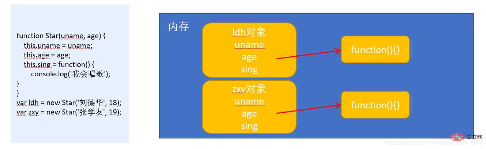
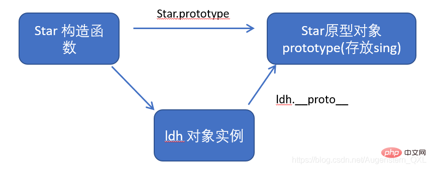
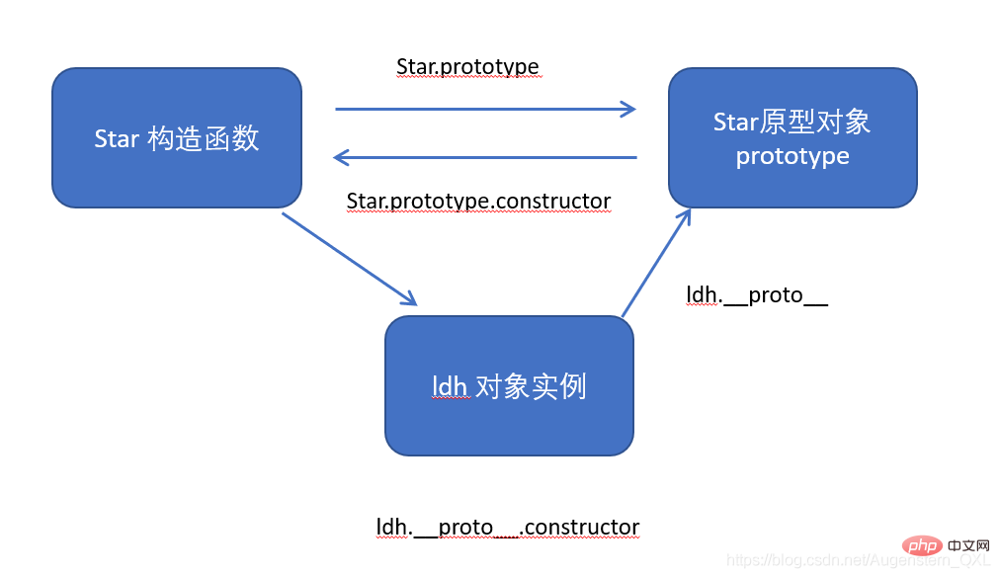
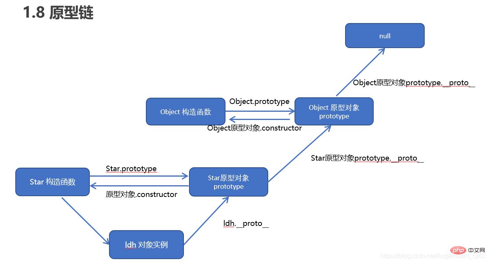
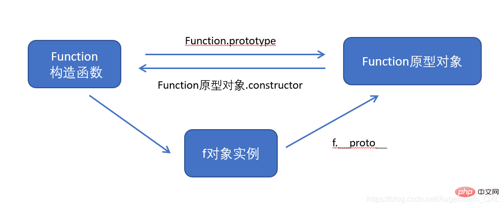

# JavaScript 物件導向

# 1、何謂物件導向
物件導向更貼近我們的實際生活, 可以使用物件導向描述現實世界事物。但是事物分為具體的事物和抽象的事物
  - 物件導向的思維特點：
    1. 抽取（抽象）物件共用的屬性和行為組織(封裝)成一個類(模板)。
    2. 對類進行實例化, 獲取類的物件。

## 1.1、物件 Object
在 JavaScript 中，`物件是一組無序的相關屬性和方法的集合`，所有的事物都是物件，例如字串、數值、陣列、函數等。

物件是由`屬性`和`方法`組成的
  - 屬性：事物的**特徵，在物件中用屬性**來表示
  - 方法：事物的**行為，在物件中用方法**來表示

## 1.2、類 Classs
在 ES6 中新增加了類的概念，可以使用 class 關鍵字宣告一個類，之後以這個類來實例化物件。
  - `類` 抽象了物件的公共部分，它泛指某一大類（class）
  - `物件` 特指某一個，通過類實例化一個具體的物件

  ### 1.2.1、建立類
  ```js
    class name {
      // class body
    }
  ```
  - 建立實例
    ```js
      let XX = new name();
    ```
    > 注意：類必須使用new 實例化物件

  ### 1.2.2、建構函式
  `constructor()` 方法是類別建構函式(預設方法)，用於傳遞引數，返回實例物件，
  通過 new 命令生成物件實例時，自動呼叫該方法。
  如果沒有顯示定義，類內部會自動建立一個constructor()。
  ```js
    // 1. 建立類 class 建立一個 明星類
    class Star {
      // constructor 建構函式
      constructor(uname, age) {
        this.uname = uname;
        this.age = age;
      }
    }

    // 2. 利用類建立物件實例
    let ldh = new Star('劉德華', 18);
    let zxy = new Star('張學友', 20);
    console.log(ldh);     // { "uname": "劉德華", "age": 18}
    console.log(zxy);     // { "uname": "張學友", "age": 20}
  ```
  - 通過 class 關鍵字建立類，類名習慣性定義首字母大寫。
  - 類裡面有個 `constructor` 函數，可以接收傳遞過來的引數，同時返回實例物件。
  - 只要 new 生成實例時，就會自動呼叫 `constructor` 函數，
    如果不寫這個函數，類也會自動生成這個函數。
  - 最後注意語法規範：
    - 建立類 ➡ 類名後面不要加小括號
    - 生成實例 ➡ 類名後面加小括號
    - 建構函式不需要加 function 關鍵字

  ### 1.2.3、類中新增方法
  語法：
  ```js
    class Person {
      constructor(name,age) {   
        // constructor 稱為構造器或者建構函式
        this.name = name;
        this.age = age;
      }
      say() {
        console.log(this.name + '你好');
      }
    }
    let ldh = new Person('劉德華', 18);
    ldh.say();      // 劉德華你好
  ```
  > 注意：方法之間不能加逗號分隔，同時方法不需要新增 function 關鍵字。

  ```js
    // 1. 建立類 class 建立一個 明星類
    class Star {
      // 類的共有屬性放到 constructor 裡面
      constructor(uname, age) {
        this.uname = uname;
        this.age = age;
      }
      sing(song) {
        console.log(this.uname + song);
      }
    }

    // 2. 利用類建立物件實例
    let ldh = new Star('劉德華', 18);
    let zxy = new Star('張學友', 20);
    // (1) 類裡面所有的函數不需要寫function 
    // (2) 多個函數方法之間不需要新增逗號分隔
    ldh.sing('冰雨');     // 劉德華冰雨
    zxy.sing('李香蘭');     // 張學友李香蘭
  ```
  - 類的共有屬性放到 `constructor` 裡面。
  - 類裡面的函數都不需要寫 `function` 關鍵字。

## 1.3、類的繼承
現實中的繼承：子承父業，比如我們都繼承了父親的姓。
程式中的繼承：子類可以繼承父類別的一些屬性和方法。

語法：
```js
  // 父類別
  class Father {
    ...
  }
  // 子類繼承父類別
  class Son extends Father {
    ...
  }
```

看一個實例：
```js
  // 父類別有加法方法
  class Father {
    constructor(x, y) {
      this.x = x;
      this.y = y;
    }
    sum() {
      console.log(this.x + this.y);
    }
  }
  // 子類繼承父類別加法方法，同時擴充套件減法方法
  class Son extends Father {
    constructor(x, y) {
      // 利用super 呼叫父類別的建構函式
      // super 必須在子類this之前呼叫
      super(x, y);
      this.x = x;
      this.y = y;
    }
    subtract() {
      console.log(this.x - this.y);
    }
  }
  let son = new Son(5, 3);
  son.subtract();     // 2
  son.sum();      // 8
```

## 1.4、super關鍵字
- `super` 關鍵字用於存取和呼叫物件父類別上的函數，
  `可以呼叫父類別的建構函式，也可以呼叫父類別的普通函數`。

  ### 1.4.1、呼叫父類別的建構函式
  語法：
  ```js
    // 父類別
    class Person {
      constructor(surname){
        this.surname = surname;
      }
    }
    // 子類繼承父類別
    class Student entends Person {
      constructor(surname,firstname) {
        super(surname);     //呼叫父類別的 constructor(surname)
        this.firstname = firstname;     //定義子類獨有的屬性
      }
    }
  ```
  > 注意：子類在建構函式中使用super,必須放到this前面（必須先呼叫父類別的構造方法，再使用子類構造方法）

  案例：
  ```js
    // 父類別
    class Father {
      constructor(surname){
        this.surname = surname;
      }
      saySurname() {
        console.log('我的姓是' + this.surname);
      }
    }
    // 子類繼承父類別
    class Son entends Father {
      constructor(surname,firstname) {
        super(surname);					//呼叫父類別的 constructor(surname)
        this.firstname = firstname;		//定義子類獨有的屬性
      }
      sayFirstname() {
        console.log('我的名字是:' + this.firstname);
      }
    }
    let damao = new Son('劉','德華');
    damao.saySurname();     // 我的姓是劉
    damao.sayFirstname();     // 我的名字是:德華
  ```

  ### 1.4.2、呼叫父類別的普通函數
  語法：
  ```js
    class Father {
      say() {
        return '我是爸爸';
      }
    }
    class Son extends Father {
      say(){
        // super.say() super呼叫父類別的方法
        return super.say() + '的兒子';
      }
    }
    let damao = new Son();
    console.log(damao.say());     // 我是爸爸的兒子
  ```
  - 多個方法之間不需要新增逗號分隔
  - 繼承中屬性和方法的查詢原則：`就近原則，先看子類，再看父類別`。

  ### 1.4.3、三個注意點
  - 在ES6中類沒有變數提升，所以必須先定義類，才能通過類實例物件
  - 類裡面的 `共有屬性和方法` 一定要加 `this` 使用
  - 類裡面的 `this` 指向：
    - constructor 裡面的 `this` 指向實例物件
    - 方法裡面的 `this` 指向這個方法的呼叫者

  ```html
    <body>
      <button>點選</button>
      <script>
        let that;
        let _that;
        class Star {
          constructor(uname, age) {
            // constructor 裡面的this 指向的是 建立的實例物件
            that = this;
            this.uname = uname;
            this.age = age;
            // this.sing();
            this.btn = document.querySelector('button');
            this.btn.onclick = this.sing;
          }
          sing() {
            // 這個sing方法裡面的this 指向的是 btn 這個按鈕,因為這個按鈕呼叫了這個函數
            console.log(that.uname); 
            // that裡面儲存的是constructor裡面的this
          }
          dance() {
            // 這個dance裡面的this 指向的是實例物件 ldh 因為ldh 呼叫了這個函數
            _that = this;
            console.log(this);
          }
        }
        let ldh = new Star('劉德華');
        console.log(that === ldh);      // true
        ldh.dance();      // { "uname": "劉德華", "btn": {}}
        console.log(_that === ldh);     // true
        // 1. 在 ES6 中類沒有變數提升，所以必須先定義類，才能通過類實例化物件
        // 2. 類裡面的共有的屬性和方法一定要加this使用.
      </script>
    </body>
  ```

# 2、建構函式和原型
## 2.1、概述
  在典型的 OOP 的語言中（如 Java），都存在類的概念，類就是物件的模板，物件就是類的實例，
  但在 ES6之前，JS 中並沒用引入類的概念。

  ES6，全稱 ECMAScript 6.0 ，2015.06 發版。但是目前瀏覽器的 JavaScript 是 ES5 版本，大多數高版本的瀏覽器也支援 ES6，不過只實現了 ES6 的部分特性和功能。

  在 ES6之前，物件不是基於類建立的，而是用一種稱為 `構建函數` 的特殊函數來定義物件和它們的特徵。

  - 建立物件有三種方式
    - **物件字面量**
    - **new Object()**
    - **自定義建構函式**

  ```js
    // 1. 利用 new Object() 建立物件
    let obj1 = new Object();
    // 2. 利用物件字面量建立物件
    let obj2 = {}；
    // 3.利用建構函式建立物件
    function Star(uname,age) {
      this.uname = uname;
      this.age = age;
      this.sing = function() {
        console.log('我會唱歌');
      }
    }
    let ldh = new Star('劉德華',18);
  ```
  > 注意：
    - 建構函式用於建立某一類物件，其 `首字母要大寫`。
    - 建構函式要和 `new` 一起使用才有意義。
  
## 2.2、建構函式
  - `建構函式` 是一種特殊的函數，主要用來初始化物件(為物件成員變數賦初始值)，它總與`new`一起使用。
  - 可以把物件中的一些公共的屬性和方法抽取出來，然後封裝到這個函數裡面。

**new 在執行時會做四件事**
  1. 在記憶體中建立一個新的空物件。
  2. 讓 this 指向這個新的物件。
  3. 執行建構函式裡面的程式碼，給這個新物件新增屬性和方法。
  4. 返回這個新物件（所以建構函式裡面不需要 return ）。

  ### 2.2.1、靜態成員和實例成員
  JavaScript 的建構函式中可以新增一些成員，可以在建構函式本身上新增，
  也可以在建構函式內部的 `this` 上新增。
  通過這兩種方式新增的成員，就分別稱為 `靜態成員` 和 `實例成員`。

  - 靜態成員：`在建構函式本身上新增的成員為靜態成員，只能由建構函式本身來存取`。
  - 實例成員：`在建構函式內部建立的物件成員稱為實例成員，只能由實例化的物件來存取`。

  ```js
    // 建構函式中的屬性和方法我們稱為成員，成員可以新增
    function Star(uname, age) {
      this.uname = uname;
      this.age = age;
      this.sing = function() {
        console.log('我會唱歌');
      }
    }
    let ldh = new Star('劉德華',18);

    // 實例成員就是建構函式內部通過this新增的成員  uname age sing  就是實例成員
    // 實例成員只能通過實例化的物件來存取
    ldh.sing();     // 我會唱歌
    console.log(Star.uname);     // undefined     不可以通過建構函式來存取實例成員

    // 靜態成員就是在建構函式本身上新增的成員 sex 就是靜態成員
    // 靜態成員只能通過建構函式來存取
    Star.sex = '男';
    console.log(Star.sex);     // 男
    console.log(ldh.sex);      // undefined  不能通過物件來存取
  ```

  ### 2.2.2、建構函式的問題
  建構函式方法很好用，但是存在浪費記憶體的問題。
  
  - 我們希望所有的物件使用同一個函數，這樣就比較節省記憶體

## 2.3、建構函式原型 prototype
  - 建構函式通過原型分配的函數是所有物件所共用的，這樣就解決了記憶體浪費問題
  - JavaScript 規定，每一個建構函式都有一個`prototype`屬性，指向另一個物件，注意這個`prototype`就是一個物件，這個物件的所有屬性和方法，都會被建構函式所擁有。
  - **可以把那些不變的方法，直接定義在 `prototype` 物件上，這樣所有物件的實例就可以共用這些方法**

  ```js
    // 1. 建構函式的問題. 
    function Star(uname, age) {
      // 公共屬性定義到建構函式裡面
      this.uname = uname;
      this.age = age;
      // this.sing = function() {
      //     console.log('我會唱歌');
      // }
    }

    // 2. 一般情況下，公共屬性定義到建構函式裡面，公共的方法放到原型物件身上
    // 公共的方法我們放到原型物件身上
    Star.prototype.sing = function() {
      console.log('我會唱歌');
    }
    let ldh = new Star('劉德華', 18);
    let zxy = new Star('張學友', 19);
    ldh.sing();     // 我會唱歌
    zxy.sing();     // 我會唱歌
  ```

  - **一般情況下,公共`屬性`定義到建構函式裡面, 公共的`方法`放到原型物件身上**
    - `原型`是一個物件，也稱為 prototype 為原型物件。
    - `原型的作用`是 共用方法。

## 2.4、物件原型 __ proto __
- 物件都會有一個屬性 `_proto_` 指向建構函式的`prototype`原型物件，之所以物件可以使用建構函式`prototype`原型物件的屬性和方法，就是因為物件有`_proto_`原型的存在。
- `_proto_`物件原型和原型物件 `prototype` 是等價的。
- `_proto_`物件原型的意義就在於為物件的查詢機制提供一個方向，或者說一條路線，但是它是一個非標準屬性，因此實際開發中，不可以使用這個屬性，它只是內部指向原型物件 `prototype`


- `Star.prototype 和 ldh._proto_` 指向相同

```js
  function Star(uname, age) {
    this.uname = uname;
    this.age = age;
  }
  Star.prototype.sing = function() {
    console.log('我會唱歌');
  }
  let ldh = new Star('劉德華', 18);
  let zxy = new Star('張學友', 19);
  ldh.sing();     // 我會唱歌
  console.log(ldh);     // { "uname": "劉德華", "age": 18}
  // 物件身上系統自己新增一個 __proto__ 指向我們建構函式的原型物件 prototype
  console.log(ldh.__proto__ === Star.prototype);        // true
  // 方法的查詢規則: 首先先看ldh 物件身上是否有 sing 方法,如果有就執行這個物件上的sing
  // 如果沒有sing 這個方法,因為有 __proto__ 的存在,就去建構函式原型物件prototype身上去查詢sing這個方法
```

## 2.5、constructor 建構函式
  - **物件原型(__ proto __)和建構函式(prototype)原型物件**裡面都有一個`constructor`屬性， constructor 我們稱為建構函式，因為它指回建構函式本身。

  - `constructor`主要用於記錄該物件參照於哪個建構函式，它可以讓原型物件重新指向原來的建構函式。

  - **一般情況下，物件的方法都在建構函式(prototype)的原型物件中設定。**

  - 如果有多個物件的方法，可以給原型物件`prototype`採取物件形式賦值，但是這樣會覆蓋建構函式原型物件原來的內容，這樣修改後的原型物件`constructor`就不再指向當前建構函式了。此時，我們可以在修改後的原型物件中，新增一個`constructor`指向原來的建構函式。

  **具體請看實例配合理解**
  ```js
    function Star(uname, age) {
      this.uname = uname;
      this.age = age;
    }
    // 很多情況下,我們需要手動的利用constructor 這個屬性指回 原來的建構函式
    // Star.prototype.sing = function() {
    //     console.log('我會唱歌');
    // };
    // Star.prototype.movie = function() {
    //     console.log('我會演電影');
    // }
    Star.prototype = {
      // 如果我們修改了原來的原型物件，給原型物件賦值的是一個物件，則必須手動的利用constructor指回原來的建構函式
      constructor: Star,
      sing: function() {
        console.log('我會唱歌');
      },
      movie: function() {
        console.log('我會演電影');
      }
    }
    let ldh = new Star('劉德華', 18);
    let zxy = new Star('張學友', 19);
  ```

## 2.6、建構函式、實例、原型物件三者關係


## 2.7、原型鏈查詢規則
  1. 當存取一個物件的屬性(包括方法)時，首先查詢這個物件自身有沒有該屬性。
  2. 如果沒有就查詢它的原型(也就是`_proto_`指向的`prototype原型物件`)。
  3. 如果還沒有就查詢原型物件的原型(**Object的原型物件**)
  4. 依次類推一直找到Object為止(null)
  5. __ proto __物件原型的意義就在於為物件成員查詢機制提供一個方向，或者說一條路線。
  

  ```js
    function Star(uname, age) {
      this.uname = uname;
      this.age = age;
    }
    Star.prototype.sing = function() {
      console.log('我會唱歌');
    }
    let ldh = new Star('劉德華', 18);
    // 1. 只要是物件就有__proto__ 原型, 指向原型物件
    console.log(Star.prototype);        // {}
    console.log(Star.prototype.__proto__ === Object.prototype);       // true
    // 2.我們Star原型物件裡面的__proto__原型指向的是 Object.prototype
    console.log(Object.prototype.__proto__);        // null
    // 3. 我們Object.prototype原型物件裡面的__proto__原型  指向為 null
  ```

## 2.8、原型物件this指向
  - 建構函式中的 `this`指向我們的實例物件
  - **原型物件**裡面放的是方法，這個方法**裡面**的`this`**指向**的是這個方法的呼叫者，也就是這個**實例物件**
  ```js
    function Star(uname, age) {
      this.uname = uname;
      this.age = age;
    }
    let that;
    Star.prototype.sing = function() {
      console.log('我會唱歌');
      that = this;
    }
    let ldh = new Star('劉德華', 18);
    // 1. 在建構函式中,裡面this指向的是物件實例 ldh
    ldh.sing();       // 我會唱歌
    console.log(that === ldh);        // true

    // 2.原型物件函數裡面的this 指向的是 實例物件 ldh
  ```

## 2.9、擴充套件內建物件
- 可以通過原型物件，對原來的內建物件進行擴充套件自定義的方法
- 比如給陣列增加自定義求偶數和的功能
  
  ```js
    // 原型物件的應用 擴充套件內建物件方法

    Array.prototype.sum = function() {
      let sum = 0;
      for (let i = 0; i < this.length; i++) {
        sum += this[i];
      }
      return sum;
    };
    // Array.prototype = {
    //     sum: function() {
    //         let sum = 0;
    //         for (let i = 0; i < this.length; i++) {
    //             sum += this[i];
    //         }
    //         return sum;
    //     }
    // }
    let arr = [1, 2, 3];
    console.log(arr.sum());       // 6
    console.log(Array.prototype);       // []
    let arr1 = new Array(11, 22, 33);
    console.log(arr1.sum());        // 66
  ```
  > 注意：
      - 陣列和字串內建物件不能給原型物件覆蓋操作`Array.prototype = {}`，只能是`Array.prototype.xxx = function(){}`的方式。

## 3、繼承
ES6 之前並沒有提供`extends`繼承
  - 可以通過`建構函式＋原型物件`模擬實現繼承，被稱為**組合繼承**。

## 3.1、call()
**呼叫這個函數，並且修改函數執行時的 this 指向**
  ```js
    fun.call(thisArg,arg1,arg2,......)
  ```
  - `thisArg`：當前呼叫函數 this 的指向物件。
  - `arg1,arg2`： 傳遞的其他引數。

  實例
  ```js
    // call 方法
    function fn(x, y) {
      console.log('我希望我的希望有希望');
      console.log(this);		// Object{...}
      console.log(x + y);		// 3
    }

    let o = {
      name: 'andy'
    };
    // fn();
    // 1. call() 可以呼叫函數
    // fn.call();
    // 2. call() 可以改變這個函數的this指向 此時這個函數的this 就指向了o這個物件
    fn.call(o, 1, 2);
    // 我希望我的希望有希望
    // { "name": "andy"}
    // 3
  ```

## 3.2、借用建構函式繼承父類別型屬性
核心原理: 通過 call() 把父類別型的 this 指向子型別的 this，這樣就可以實現子型別繼承父類別型的屬性
  ```js
    // 借用父建構函式繼承屬性
    // 1. 父建構函式
    function Father(uname, age) {
      // this 指向父建構函式的物件實例
      this.uname = uname;
      this.age = age;
    }
    // 2 .子建構函式 
    function Son(uname, age, score) {
      // this 指向子建構函式的物件實例
      Father.call(this, uname, age);
      this.score = score;
    }
    let son = new Son('劉德華', 18, 100);
    console.log(son);       // { "uname": "劉德華", "age": 18, "score": 100}
  ```

## 3.3、借用原型物件繼承父類別型方法
  - **一般情況下，物件的方法都在建構函式的原型物件中設定，通過建構函式無法繼承父類別方法**
  核心原理：
    1. 將子類所共用的方法提取出來，讓子類的 `prototype 原型物件 = new 父類別()`。
    2. 本質：子類原型物件等於是實例化父類別，因為父類別實例化之後另外開闢空間，就不會影響原來父類別原型物件。
    3. 將子類的`constructor`重新指向子類別建構函式

    ```js
      // 借用父建構函式繼承屬性
      // 1. 父建構函式
      function Father(uname, age) {
        // this 指向父建構函式的物件實例
        this.uname = uname;
        this.age = age;
      }
      Father.prototype.money = function() {
        console.log(100000);
      };
      // 2 .子建構函式 
      function Son(uname, age, score) {
        // this 指向子建構函式的物件實例
        Father.call(this, uname, age);
        this.score = score;
      }
      // Son.prototype = Father.prototype;  這樣直接賦值會有問題,如果修改了子原型物件,父原型物件也會跟著一起變化
      Son.prototype = new Father();
      // 如果利用物件的形式修改了原型物件,別忘了利用constructor 指回原來的建構函式
      Son.prototype.constructor = Son;
      // 這個是子建構函式專門的方法
      Son.prototype.exam = function() {
        console.log('孩子要考試');
      }
      let son = new Son('劉德華', 18, 100);
      console.log(son);       // { "uname": "劉德華", "age": 18, "score": 100}
      console.log(Father.prototype);        // {}
      console.log(Son.prototype.constructor);       // Son(uname, age, score) {
        // this 指向子建構函式的物件實例
        // Father.call(this, uname, age);
        // this.score = score;
      // }
    ```
## 3.4 類的本質
  1. class 本質還是 function
  2. 類的所有方法都定義在類的 `prototype` 屬性上
  3. 類建立的實例，裡面也有`_proto_`指向類的`prototype`原型物件
  4. 所以 ES6 的類它的絕大部分功能，ES5都可以做到，新的class寫法只是讓物件原型的寫法更加清晰、更像物件導向程式設計的語法而已。
  5. 所以 ES6 的類其實就是語法糖
  6. 語法糖：語法糖就是一種便捷寫法，簡單理解

# 4、ES5新增方法
  ES5 給我們新增了一些方法，可以很方便的運算元組或者字串
  - 陣列方法
  - 字串方法
  - 物件方法

## 4.1、陣列方法
  - 迭代(遍歷)方法：`foreach()`，`map()`，`filter()`，`some()`，`every()`;

  ### 4.1.1、forEach()
  ```js
  array.forEach(function(currentValue,index,arr))
  ```
    - **currentValue**：陣列當前項的值
    - **index**：陣列當前項的索引
    - **arr**：陣列物件本身

    ```js
      // forEach 迭代(遍歷) 陣列
      let arr = [1, 2, 3];
      let sum = 0;
      arr.forEach(function(value, index, array) {
          console.log('每個陣列元素' + value);
          console.log('每個陣列元素的索引號' + index);
          console.log('陣列本身' + array);
          sum += value;
      })
      console.log(sum);       // 6
    ```

  ### 4.1.2、filter()篩選陣列
  ```js
  array.filter(function(currentValue,index,arr))
  ```
    - `filter()`方法建立一個新的陣列，新陣列中的元素是通過檢查指定陣列中符合條件的所有元素，**主要用於篩選陣列**。
    - **注意它直接返回一個新陣列**

    ```js
      // filter 篩選陣列
      let arr = [12, 66, 4, 88, 3, 7];
      let newArr = arr.filter(function(value, index) {
          // return value >= 20;
          return value % 2 === 0;
      });
      console.log(newArr);        // [12, 66, 4, 88]
    ```

  ### 4.1.3、some()
    - `some()`方法用於檢測陣列中的元素是否滿足指定條件（查詢陣列中是否有滿足條件的元素）
    - **注意它返回的是布林值，如果查詢到這個元素，就返回true，如果查詢不到就返回false**
    - 如果找到第一個滿足條件的元素，則終止迴圈，不再繼續查詢

    ```js
      // some 查詢陣列中是否有滿足條件的元素 
      let arr1 = ['red', 'pink', 'blue'];
      let flag1 = arr1.some(function(value) {
          return value == 'pink';
      });
      console.log(flag1);       // true
      // 1. filter 也是查詢滿足條件的元素 返回的是一個陣列 而且是把所有滿足條件的元素返回回來
      // 2. some 也是查詢滿足條件的元素是否存在  返回的是一個布林值 如果查詢到第一個滿足條件的元素就終止迴圈
    ```

## 4.2、字串方法
  - `trim()`方法會從一個字串的兩端刪除空白字元。
  - `trim()`方法並不影響原字串本身，它返回的是一個新的字串。

  ```html
    <body>
      <input type="text"> <button>點選</button>
      <p></p>
      <script>
        // trim 方法去除字串兩側空格
        let str = '   an  dy   ';
        console.log(str);       //    an  dy   
        let str1 = str.trim();
        console.log(str1);        // an  dy
        let input = document.querySelector('input');
        let btn = document.querySelector('button');
        let p = document.querySelector('p');
        btn.onclick = function() {
          let str = input.value.trim();
          if (str === '') {
            alert('請輸入內容');
          } else {
            console.log(str);
            console.log(str.length);
            p.innerHTML = str;
          }
        }
      </script>
    </body>
  ```

## 4.3、物件方法
  ### 4.3.1、Object.keys()
  1. Object.keys()用於獲取物件自身所有的屬性
  2. 效果類似for...in
  3. 返回一個由屬性名組成的陣列
  ```js
    // 用於獲取物件自身所有的屬性
    let obj = {
      id: 1,
      pname: '小米',
      price: 1999,
      num: 2000
    };
    let arr = Object.keys(obj);
    console.log(arr);       // ['id', 'name', 'price', 'num']
    arr.forEach(function(value) {
      console.log(value);
      // id
      // pname
      // price
      // num
    })
  ```

  ### 4.3.2、Object.defineProperty()
  - `Object.defineProperty()` 定義物件中新屬性或修改原有的屬性(瞭解)
  ```js
  Object.defineProperty(obj,prop,descriptor)
  ```
  - obj : 目標物件
  - prop : 需定義或修改的屬性的名字
  - descriptor : 目標屬性所擁有的特性

  ```js
    // Object.defineProperty() 定義新屬性或修改原有的屬性
    let obj = {
      id: 1,
      pname: '小米',
      price: 1999
    };
    // 1. 以前的物件新增和修改屬性的方式
    // obj.num = 1000;
    // obj.price = 99;
    // console.log(obj);
    // 2. Object.defineProperty() 定義新屬性或修改原有的屬性
    Object.defineProperty(obj, 'num', {
      value: 1000,
      enumerable: true
    });
    console.log(obj);       // {"id": 1, "pname": "小米", "price": 1999, "num": 1000}
        
    Object.defineProperty(obj, 'price', {
      value: 9.9
    });
    console.log(obj);       // {"id": 1, "pname": "小米", "price": 9.9, "num": 1000}
        
    Object.defineProperty(obj, 'id', {
      // 如果值為false 不允許修改這個屬性值 預設值也是false
      writable: false,
    });
    obj.id = 2;
    console.log(obj);       // {"id": 1, "pname": "小米", "price": 9.9, "num": 1000}
    
    Object.defineProperty(obj, 'address', {
      value: '中國山東藍翔技校xx單元',
      // 如果只為false 不允許修改這個屬性值 預設值也是false
      writable: false,
      // enumerable 如果值為false 則不允許遍歷, 預設的值是 false
      enumerable: false,
      // configurable 如果為false 則不允許刪除這個屬性 不允許在修改第三個引數裡面的特性 預設為false
      configurable: false
    });
    console.log(obj);       // {"id": 1, "pname": "小米", "price": 9.9, "num": 1000}
    console.log(Object.keys(obj));        // ["id", "pname", "price", "num"]
        
    delete obj.address;
    console.log(obj);       // {"id": 1, "pname": "小米", "price": 9.9, "num": 1000}

    delete obj.pname;
    console.log(obj);       // {"id": 1, "price": 9.9, "num": 1000}
    
    Object.defineProperty(obj, 'address', {
      value: '中國山東藍翔技校xx單元',
      // 如果值為false 不允許修改這個屬性值 預設值也是false
      writable: true,
      // enumerable 如果值為false 則不允許遍歷, 預設的值是 false
      enumerable: true,
      // configurable 如果為false 則不允許刪除這個屬性 預設為false
      configurable: true
    });
    console.log(obj.address);       // Uncaught TypeError: Cannot redefine property: address
  ```
  
  - 第三個引數 descriptor 說明：`以物件形式{ }書寫`
  - `value`：設定屬性的值，預設為undefined
  - `writeable`： 值是否可以重寫 true | false 預設為false
  - `enumerable`： 目標屬性是否可以被列舉 true | false 預設為false
  - `configurable`： 目標屬性是否可以被刪除或是否可以再次修改特性 true | false 預設為false


# 5、函數進階
  ## 5.1、函數的定義方式
  1. 函數宣告方式 function 關鍵字(命名函數)
  2. 函數表示式(匿名函數)
  3. new Function()

  ```js
  let fn = new Function('引數1','引數2',.....,'函數體');
  ```
  - Function 裡面引數都必須是字串格式
  - 第三種方式執行效率低，也不方便書寫，因此較少使用
  - 所有函數都是 Function 的實例(物件)
  - 函數也屬於物件

  

  ```js
    //  函數的定義方式
    // 1. 自定義函數(命名函數) 
    function fn() {};

    // 2. 函數表示式 (匿名函數)
    let fun = function() {};

    // 3. 利用 new Function('引數1','引數2', '函數體');
    // Function 裡面引數都必須是字串格式，執行效率低，較少寫
    let f = new Function('a', 'b', 'console.log(a + b)');
    f(1, 2);        // 3
    // 4. 所有函數都是 Function 的實例(物件)
    console.dir(f);       
    // 5. 函數也屬於物件
    console.log(f instanceof Object);       // true
  ```

  ## 5.2、函數的呼叫方式
  1. 普通函數
  2. 物件的方法
  3. 建構函式
  4. 繫結事件函數
  5. 定時器函數
  6. 立即執行函數

  ```js
    // 函數的呼叫方式

    // 1. 普通函數
    function fn() {
      console.log('人生的巔峰');
    }
    // fn();   fn.call()

    // 2. 物件的方法
    let o = {
      sayHi: function() {
        console.log('人生的巔峰');
      }
    }
    o.sayHi();

    // 3. 建構函式
    function Star() {};
    new Star();
    
    // 4. 繫結事件函數
    // btn.onclick = function() {};   // 點選了按鈕就可以呼叫這個函數
    
    // 5. 定時器函數
    // setInterval(function() {}, 1000);  這個函數是定時器自動1秒鐘呼叫一次
    
    // 6. 立即執行函數
    (function() {
      console.log('人生的巔峰');
    })();
    // 立即執行函數是自動呼叫
  ```

  ## 5.3、函數內this的指向
  - `this`指向，是當我們呼叫函數的時候確定的，呼叫方式的不同決定了`this`的指向不同，一般我們指向我們的呼叫者

    | 呼叫方式 | this指向 |
    |---------|---------|
    | 普通函數呼叫 | window |
    | 建構函式呼叫 | 實例物件，原型物件裡面的方法也指向實例物件 |
    | 物件方法呼叫 | 該方法所屬物件 |
    | 事件繫結方法 | 繫結事件物件 |
    | 定時器函數 | window |
    | 立即執行函數 | window |

  ```html
    <body>
      <button>點選</button>
      <script>
        // 函數的不同呼叫方式決定了this 的指向不同
        // 1. 普通函數 this 指向window
        function fn() {
          console.log('普通函數的this' + this);       // 普通函數的this[object Window]
        }
        window.fn();

        // 2. 物件的方法 this指向的是物件 o
        let o = {
          sayHi: function() {
            console.log('物件方法的this:' + this);        // 物件方法的this:[object Object]
          }
        }
        o.sayHi();

        // 3. 建構函式 this 指向 ldh 這個實例物件 原型物件裡面的this 指向的也是 ldh這個實例物件
        function Star() {};
        Star.prototype.sing = function() {

        }
        let ldh = new Star();

        // 4. 繫結事件函數 this 指向的是函數的呼叫者 btn這個按鈕物件
        let btn = document.querySelector('button');
        btn.onclick = function() {
          console.log('繫結時間函數的this:' + this);        // 繫結時間函數的this:[object HTMLButtonElement]
        };

        // 5. 定時器函數 this 指向的也是window
        window.setTimeout(function() {
          console.log('定時器的this:' + this);        // 定時器的this:[object Window]
        }, 1000);

        // 6. 立即執行函數 this還是指向window
        (function() {
          console.log('立即執行函數的this' + this);       // 立即執行函數的this[object Window]
        })();
      </script>
    </body>
  ```

  ## 5.4、改變函數內部this指向
  - JavaScript 為我們專門提供了一些函數方法來幫我們處理常式內部 this 的指向問題，常用的有 `bind(),call(),apply()`三種方法

    ### 5.4.1、call() 方法
    - `call()`方法呼叫一個物件，簡單理解為呼叫函數的方式，但是它可以改變函數的`this`指向
    - `fun.call(thisArg,arg1,arg2,.....)`
    - `thisArg`： 在 fun 函數執行時指定的 this 值
    - `arg1,arg2`： 傳遞的其他引數
    - 返回值就是函數的返回值，因為它就是呼叫函數
    - **因此當我們想改變 this 指向，同時想呼叫這個函數的時候，可以使用 call，比如繼承**

    ```js
      // 改變函數內this指向  js提供了三種方法  call()  apply()  bind()

      // 1. call()
      let o = {
        name: 'andy'
      }

      function fn(a, b) {
        console.log(this);
        console.log(a + b);
      };
      fn.call(o, 1, 2);
      // call 第一個可以呼叫函數 第二個可以改變函數內的this 指向

      // call 的主要作用可以實現繼承
      function Father(uname, age, sex) {
        this.uname = uname;
        this.age = age;
        this.sex = sex;
      }

      function Son(uname, age, sex) {
        Father.call(this, uname, age, sex);
      }
      let son = new Son('劉德華', 18, '男');
      console.log(son);
    ```
    ### 5.4.2、apply()方法
    - `apply()`方法呼叫一個函數，簡單理解為呼叫函數的方式，但是它可以改變函數的 `this`指向
    - `fun.apply(thisArg,[argsArray])`
    - thisArg: 在 fun 函數執行時指定的 this 值
    - argsArray : 傳遞的值，必須包含在**陣列**裡面
    - 返回值就是函數的返回值，因為它就是呼叫函數
    - **因此 apply 主要跟陣列有關係，比如使用 Math.max() 求陣列的最大值**

    ```js
      // 改變函數內this指向  js提供了三種方法  call()  apply()  bind()

      // 2. apply()  應用 運用的意思
      let o = {
        name: 'andy'
      };

      function fn(arr) {
        console.log(this);
        console.log(arr);
      };
      fn.apply(o, ['pink']);    // {name: 'andy'} // pink
      // 1. 也是呼叫函數 第二個可以改變函數內部的this指向
      // 2. 但是他的引數必須是陣列(偽陣列)
      // 3. apply 的主要應用 比如說我們可以利用 apply 藉助於數學內建物件求陣列最大值 
      // Math.max();
      let arr = [1, 66, 3, 99, 4];
      let arr1 = ['red', 'pink'];
      // let max = Math.max.apply(null, arr);
      let max = Math.max.apply(Math, arr);
      let min = Math.min.apply(Math, arr);
      console.log(max, min);  // 99 1
    ```

    ### 5.4.3、bind()方法
    - `bind()`方法不會呼叫函數。但是能改變函數內部 this指向
    - `fun.bind(thisArg,arg1,arg2,....)`
    - 返回由指定的 `this`值和初始化引數改造的**原函數拷貝**
    - **因此當我們只是想改變 this 指向，並且不想呼叫這個函數的時候，可以使用bind**

    ```html
      <body>
        <button>點選</button>
        <button>點選</button>
        <button>點選</button>
        <script>
        // 改變函數內this指向  js提供了三種方法  call()  apply()  bind()

        // 3. bind()  繫結 捆綁的意思
        let o = {
          name: 'andy'
        };

        function fn(a, b) {
          console.log(this);
          console.log(a + b);
        };

        let f = fn.bind(o, 1, 2);
        f();        // {name: 'andy'}  // 3
        // 1. 不會呼叫原來的函數   可以改變原來函數內部的this 指向
        // 2. 返回的是原函數改變this之後產生的新函數
        // 3. 如果有的函數我們不需要立即呼叫,但是又想改變這個函數內部的this指向此時用bind
        // 4. 我們有一個按鈕,當我們點選了之後,就禁用這個按鈕,3秒鐘之後開啟這個按鈕
        // let btn1 = document.querySelector('button');
        // btn1.onclick = function() {
        //     this.disabled = true; // 這個this 指向的是 btn 這個按鈕
        //     // let that = this;
        //     setTimeout(function() {
        //         // that.disabled = false; // 定時器函數裡面的this 指向的是window
        //         this.disabled = false; // 此時定時器函數裡面的this 指向的是btn
        //     }.bind(this), 3000); // 這個this 指向的是btn 這個物件
        // }
        let btns = document.querySelectorAll('button');
        for (let i = 0; i < btns.length; i++) {
          btns[i].onclick = function() {
            this.disabled = true;
            setTimeout(function() {
              this.disabled = false;
            }.bind(this), 2000);
          }
        }
      </script>
    </body>
    ```

    ### 5.4.4、總結
      call apply bind 總結：
      - 相同點：
        - 都可以改變函數內部的 `this`指向

      - 區別點：
        - `call`和`apply`會呼叫函數，並且改變函數內部的`this`指向
        - `call`和`apply`傳遞的引數不一樣，call 傳遞引數，apply 必須陣列形式
        - `bind`不會呼叫函數，可以改變函數內部`this`指向

      - 主要應用場景
        - `call`經常做繼承
        - `apply`經常跟陣列有關係，比如藉助於數學對線實現陣列最大值與最小值
        - `bind`不呼叫函數，但是還想改變this指向，比如改變定時器內部的this指向