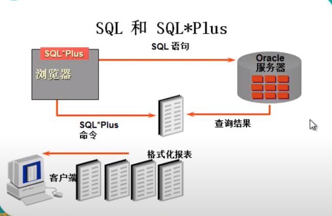
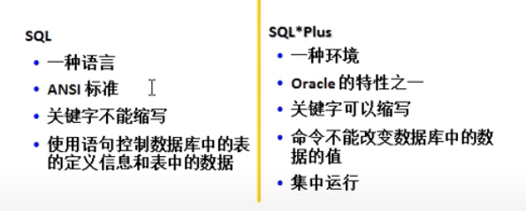

# 基本的 SQL SELECT語句
## 目標
  通過本章學習，您將可以
  - 列舉 SQL SELECT 語句的功能。
  - 執行簡單的選擇語句。
  - SQL 語言 和 SQL*Plus 命令的不同

## 基本 SELECT 語句
  ```SQL
  SELECT * | {[DISTINCT] COLUMN | EXPRESSION [alias], ...}
  FROM <table>;
  ```
  - `SELECT`：標示 選擇哪些列
  - `FROM`：標示從哪個表中選擇

## 選擇全部列
  ```SQL
  SELECT *
  FROM departments;
  ```

## 選擇特定的列
  ```SQL
  SELECT department_id, location_id
  FROM departments;
  ```

## 注意
  - `SQL` 語言 大小寫不敏感。
  - `SQL` 可以寫在 一行 或者 多行。
  - `關鍵字` 不能被縮寫也不能分行。
  - 各子句一般要分行寫。
  - 使用 `縮進` 提高語句的可讀性。

## 算術運算符
  數字和日期使用的算術運算符。
  | 操作符  | 描述 |
  |:------:|-----|
  | +      | 加   |
  | -      | 減   |
  | *      | 乘   |
  | /      | 除   |

## 使用
  ```SQL
  SELECT last_name, salary, salary + 300
  FROM employees;
  ```

## 操作符 優先級
  - `乘除` 的優先級高於 `加減`。
  - 同一優先級運算符，`從左向右` 執行。
  - `括號` 內的運算先執行。

  ```SQL
  SELECT last_name, salary, 12*salary+100
  FROM employees;
  ```

## 使用括號
  ```SQL
  SELECT last_name, salary, 12*(salary+100)
  FROM employees;
  ```

## 空義空值
  - 空值是無效的、未指定的、未知的 或 不可預知的值。
  - 空值不是 空格 或 0。
  ```SQL
  SELECT last_name, job_id, salary, commission_pct
  FROM employees;
  ```

  > 空值不同於0，凡是空值參與的運算，結果都為空(`NULL`)。

## 空值在數學運算中的使用
  包含空值的 數學表達式 的值都為空值
  ```SQL
  SELECT last_name, 12 * salary * commission_pct
  FROM employees;
  ```

## 列的別名
  - 重命名一個列。
  - 便於計算。
  - 緊跟列名，也可以在列名和別名之間加入關鍵字 "AS"。 (`Oracle` 可加可不加，但是其他 RDBMS 有些需要加，建議加，方便記憶)
  - 別名使用 `雙引號`，以便在別名中包含空格或特殊的字符並區分大小寫，不含空格或大小寫時，可省略雙引號。

## 使用別名
  ```SQL
  SELECT last_name AS name, commission_pct comm
  FROM employees;
  ```
   ```SQL
  SELECT last_name "Name", salary*12 "Annual Salary"
  FROM employees;
  ```

## 連接符
  - 把列與列，列與字符連接在一起。
  - 用 `||` 表示。
  - 可以用來 `合成` 列。

## 連接符應用舉例
  ```SQL
  SELECT last_name || job_id AS "Employees"
  FROM employees;
  ```

## 字符串
  - 字符串可以是 SELECT 列表中的一個字符、數字、日期。
  - 日期和字符只能在 `單引號` 中出現。
  - 每當返回一行時，字符串被輸出一次。
  
  ```SQL
  SELECT last_name || ' is a ' ||job_id 
  FROM employees;
  ```
  => Bear`s email is HBAER

## 重複行
  默認情況下，查詢會返回全部行，包括重複行。
  
## 排除重複行
  在 SELECT 子句中 使用關鍵字 `DISTINCT`，刪除重複行。
  ```SQL
  SELECT DISTINCT department_id
  FROM employees;
  ```

## SQL 和 SQL*Plus
  

## SQL 語句與 SQL*Plus 命令
  

## SQL*Plus
  使用 `SQL*Plus` 可以：
  - 描述表結構。
  - 編輯 SQL 語句。
  - 執行 SQL 語句。
  - 將 SQL 保存在文件中並將 SQL 語句執行結果保存在文件中。
  - 在保存的文件中執行語句。
  - 將文本文件裝入 `SQL*Plus` 編輯窗口。

## 顯示表結構
  使用 `DESCRIBE` 命令，表示表結構
  ```SQL
  DESC[RIBE] tableName;
  ```

  ```SQL
  DESCRIBE employees;
  ```

## 總結
  通過本課，您應該可以完成：
  - 書寫 SELECT 語句：
    - 返回表中的全部數據。
    - 返回表中指定列的數據。
    - 使用別名。

  - 使用 `SQL*Plus` 環境，書寫、保存和執行 SQL語句 和 `SQL*Plus` 命令。

  ```SQL
  SELECT * | {[DISTINCT] column | expression [alias], ...}
  FROM table;
  ```

## 測試
  - ### 1. SQL*Plus 命令可以控制數據庫嗎？
    - 不能！

  - ### 2. 下面的語句是否可以執行成功
    ```SQL
    SELECT last_name, job_id, salary as sal
    FROM employees;
    ```
    - 可以

  - ### 3. 下面的語句是否可以執行成功
    ```SQL
    SELECT *
    FROM employees;
    ```
    - 可以

  - ### 4. 找出下面語句中的錯誤
    ```SQL
    SELECT employee_id, last_name，
           salary*12 “ANNUAL SALARY”
    FROM employees;
    ```
    - 使用了無效字符，符號需要是英文格式。
    
  - ### 5. 顯示表 departments 的結構，並查詢其中的全部數據。
    - 練習
      ```SQL
      DESC departments;

      SELECT *
      FROM departments;
      ```

  - ### 6. 顯示出表 employees 中的全部 job_id (不能重複)
    - 練習
      ```SQL
      SELECT DISTINCT job_id
      FROM employees;
      ```
    
  - ### 7. 顯示出表 employees 的全部列，各個列之間用逗號連接，列頭顯示成 OUT_PUT
    - 練習
      ```SQL
      SELECT employees_id || ',' || last_name || ',' || salary "OUT_PUT"
      FROM employees;
      ```