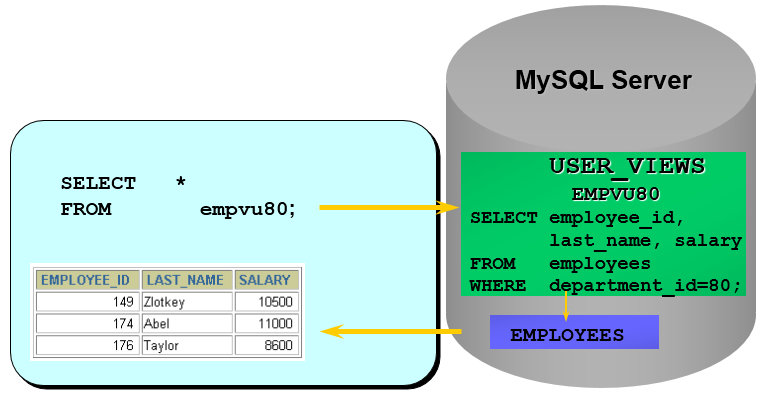

# Oracle 視圖 VIEW

## 目標
  通過本章學習，您將可以
  - 描述視圖
  - 創建和修改視圖的定義，刪除視圖
  - 從視圖中查詢數據
  - 通過視圖插入，修改和刪除數據
  - 使用 `Top-N` 分析

## 常見的數據庫對象
  | 對象   | 描述                            |
  |-------|---------------------------------|
  | 表     | 基本的數據存儲集合，由行和列組成。   |
  | 視圖   | 從表中抽出的邏輯上相關的數據集合。    |
  | 序列   | 提供有規律的數值。                 |
  | 索引   | 提高查詢的效率。                   |
  | 同義詞 | 給對象起別名。                     |

## 為什麼使用視圖？
  視圖一方面可以幫我們使用表的一部分而不是所有的表，另一方面也可以針對不同的用戶制定不同的查詢視圖。
  比如，針對一個公司的銷售人員，我們只想給他看部分數據，而某些特殊的數據，比如採購的價格，則不會提供給他。
  再比如，人員薪酬是個敏感的字段，那麼只給某個級別以上的人員開放，其他人的查詢視圖中則不提供這個字段。

  剛才講的只是視圖的一個使用場景，實際上視圖還有很多作用。最後，我們總結視圖的優點。

  - 控制數據訪問
  - 簡化查詢
  - 避免重複訪問相同的數據

## 視圖
  

  - 視圖是一種 `虛擬表`，本身是 `不具有數據` 的，佔用很少的內存空間，它是 SQL 中的一個重要概念。
  - `視圖建立在已有表的基礎上`，視圖賴以建立的這些表稱為`基表`。

  

  - 視圖的創建和刪除只影響視圖本身，不影響對應的基表。但是當對視圖中的 `數據` 進行增加、刪除和修改操作時，數據表中的數據會相應地發生變化，反之亦然。
  - 向視圖提供數據內容的語句為 `SELECT 語句`，可以將視圖理解為 `存儲起來的 SELECT 語句`。
  - 視圖，是向用戶提供基表數據的另一種表現形式。通常情況下，小型項目的數據庫可以不使用視圖，但是在大型項目中，以及數據表比較複雜的情況下，視圖的價值就凸顯出來了，它可以幫助我們把經常查詢的結果集放到虛擬表中，提升使用效率。理解和使用起來都非常方便。

## 簡單視圖 和 複雜視圖
  | 特性     | 簡單視圖 | 複雜視圖   |
  |---------|---------|-----------|
  | 表的數量 | 一個     | 一個或多個 |
  | 函數     | 沒有     | 有        |
  | 分組     | 沒有     | 有        |
  | DML操作  | 可以     | 有時可以   |

## 創建視圖
  - 在 `CREATE VIEW` 語句中嵌入子查詢
    ```SQL
    CREATE [OR REPLACE] 
    [ALGORITHM = {UNDEFINED | MERGE | TEMPTABLE}] 
    VIEW 視圖名稱 [(字段列表)]
    AS 查詢語句
    [WITH [CASCADED|LOCAL] CHECK OPTION]
    ```
    - 精簡版
      ```SQL
      CREATE VIEW 視圖名稱 
      AS 查詢語句
      ```

  - ### 創建單表視圖
    - 舉例：
      ```SQL
      CREATE VIEW empvu80
      AS 
      SELECT  employee_id, last_name, salary
      FROM    employees
      WHERE   department_id = 80;
      ```
    - 描述視圖結構
      ```SQL
      DESCRIBE empvu80
      ```
    - 查詢視圖：
      ```SQL
      SELECT *
      FROM	salvu80;
      ```
  
    

    - 舉例：
      ```SQL
      CREATE VIEW emp_year_salary (ename,year_salary)
      AS 
      SELECT ename,salary*12*(1+IFNULL(commission_pct,0))
      FROM t_employee;
      ```

    - 舉例：創建視圖時，在子查詢中給列定義別名
      ```SQL
      CREATE VIEW salvu50
      AS 
      SELECT  employee_id ID_NUMBER, last_name NAME, salary*12 ANN_SALARY
      FROM    employees
      WHERE   department_id = 50;
      ```
      > 在選擇視圖中的列時，應使用別名

    - 說明1：實際上就是我們在 SQL 查詢語句的基礎上封裝了`視圖VIEW`，這樣就會基於 SQL 語句的結果集形成一張虛擬表。

    - 說明2：在創建視圖時，沒有在視圖名後面指定字段列表，則視圖中字段列表默認和 SELECT語句 中的字段列表一致。如果 SELECT語句 中給字段取了別名，那麼視圖中的字段名和別名相同。

  - ### 創建多表聯合視圖
    - 舉例：
      ```SQL
      CREATE VIEW empview 
      AS 
      SELECT employee_id emp_id,last_name NAME,department_name
      FROM employees e,departments d
      WHERE e.department_id = d.department_id;
      ```
      ```SQL
      CREATE VIEW emp_dept
      AS 
      SELECT ename,dname
      FROM t_employee LEFT JOIN t_department
      ON t_employee.did = t_department.did;
      ```
      ```SQL
      CREATE VIEW	dept_sum_vu
      (name, minsal, maxsal, avgsal)
      AS 
      SELECT d.department_name, MIN(e.salary), MAX(e.salary),AVG(e.salary)
      FROM employees e, departments d
      WHERE e.department_id = d.department_id 
      GROUP BY  d.department_name;
      ```

    - #### 利用視圖對數據進行格式化
      我們經常需要輸出某個格式的內容，比如我們想輸出員工姓名和對應的部門名，對應格式為 `emp_name(department_name)`，就可以使用視圖來完成數據格式化的操作：
      ```SQL
      CREATE VIEW emp_depart
      AS
      SELECT CONCAT(last_name,'(',department_name,')') AS emp_dept
      FROM employees e JOIN departments d
      WHERE e.department_id = d.department_id
      ```

  - ### 基於視圖創建視圖
    當我們創建好一張視圖之後，還可以在它的基礎上繼續創建視圖。

    舉例：聯合 `emp_dept 視圖` 和 `emp_year_salary 視圖` 查詢員工姓名、部門名稱、年薪信息創建`emp_dept_ysalary 視圖`。
    ```SQL
    CREATE VIEW emp_dept_ysalary
    AS 
    SELECT emp_dept.ename,dname,year_salary
    FROM emp_dept INNER JOIN emp_year_salary
    ON emp_dept.ename = emp_year_salary.ename;
    ```

## 查看視圖
  - 語法1：查看數據庫的表對象、視圖對象
    ```SQL
    SHOW TABLES;
    ```
  - 語法2：查看視圖的結構
    ```SQL
    DESC / DESCRIBE 視圖名稱;
    ```
  - 語法3：查看視圖的屬性信息
    ```SQL
    -- 查看視圖信息（顯示數據表的存儲引擎、版本、數據行數和數據大小等）
    SHOW TABLE STATUS LIKE '視圖名稱'\G
    ```
  
  > 執行結果顯示，註釋 Comment 為 VIEW，說明該表為視圖，其他的信息為 `NULL`，說明這是一個虛表。

  - 語法4：查看視圖的詳細定義信息
    ```SQL
    SHOW CREATE VIEW 視圖名稱;
    ```

## 修改視圖
  - 使用 `CREATE OR REPLACE VIEW 子句` 修改視圖
    ```SQL
    CREATE OR REPLACE VIEW empvu80
      (id_number, name, sal, department_id)
    AS
    SELECT employee_id, first_name || ' ' || last_name, salary, department_id
    FROM employees
    WHERE department_id = 80;
    ```

  - `CREATE VIEW 子句` 中各列的別名應和子查詢中各列相對應。

## 試圖中使用 DML 的規定
  - 可以再簡單視圖中執行 `DML 操作`。
  - 當視圖定義中包含以下元素之一時，不能使用 `delete`：
    - 組函數
    - GROUP BY 子句
    - DISTINCT 關鍵字
    - ROWNUM 偽列
      ```SQL
      CREATE OR REPLACE VIEW sal_view
      AS
      SELECT AVG(salary) avg_sal
      FROM employees
      GROUP BY department_id;
      ```

  - 當視圖定義中包含以下元素之一時，不能使用 `update`：
    - 組函數
    - GROUP BY 子句
    - DISTINCT 關鍵字
    - ROWNUM 偽列
    - 列的定義為表達式

  - 當視圖定義中 包含以下元素之一時，不能使用 `insert`：
    - 組函數
    - GROUP BY 子句
    - DISTINCT 關鍵字
    - ROWNUM 偽列
    - 列的定義為表達式
    - 表中非空的列，在視圖定義中未包括

## 屏蔽 DML 操作
  - 可以使用 `WITH READ ONLY` 選項屏蔽對視圖的 DML 操作。
  - 任何 DML 操作，都會返回一個 `Oracle server` 錯誤。

  ```SQL
  CREATE OR REPLACE VIEW empvu10
    (employee_number, employee_name, job_title)
  AS
  SELECT employee_id, last_name, job_id
  FROM employees
  WHERE department_id = 10
  WITH READ ONLY;
  ```

## 刪除視圖
  刪除視圖只是刪除視圖的定義，並不會刪除基表的數據。
  ```SQL
  DROP VIEW view;
  ```
  ```SQL
  DROP VIEW empuv80;
  ```

## Top-N 分析
  - `Top-N` 分析查詢一個列中，最大或最小的 n 個值：
    - 銷售量最高的十種產品是什麼？
    - 銷售量最差的十種產品是什麼？
  - 最大和最小的值的集合是 `Top-N` 分析所關心的。

  - 查詢最大的幾個值的 `Top-N` 分析：
    ```SQL
    SELECT [column_list], ROWNUM
    FROM (SELECT [column_list]
          FROM table
          ORDER BY Top-N_column)
    WHERE ROWNUM <= N;
    ```

  - 注意：
    對 `ROWNUM` 只能使用 `<` 或 `<=`，而用 `=`、`>`、`>=` 都將不能返回任何數據。
  
  - 練習1：查詢員工表中，工資前 10 名的員工信息
    ```SQL
    SELECT ROWNUM as RANK, last_name, salary
    FROM (
      SELECT last_name, salary
      FROM employees
      ORDER BY salary DESC
    )
    WHERE ROWNUM <= 10
    ```
  - 練習2：查詢員工表中，工資排名在 10 - 20 之間的員工信息。
    ```SQL
    SELECT *
    FROM (
      SELECT ROWNUM rn, employee_id, salary
      FROM (
        SELECT employee_id, salary, last_name
        FROM employees
        ORDER BY salary DESC
      )
    )
    WHERE rn <= 50 AND rn > 40;
    ```

## 總結
  通過本章學習，您已經了解視圖的優點和基本應用：
  - 控制數據訪問
  - 簡化查詢
  - 數據獨立性
  - 刪除時不刪除數據
  - Top-N 分析

## 測試
  ### 1. 使用表 employees 創建視圖 employee_vu，其中包括 姓名(LAST_NAME)、員工號(EMPLOYEE_ID)、部門號(DEPARTMENT_ID)
    ```SQL
    CREATE OR REPLACE VIEW employee_vu
    AS
    SELECT last_name, employee_id, department_id
    FROM employees;
    ```

  ### 2. 顯示視圖的結構
    ```SQL
    DESC employee_vu;
    ```

  ### 3. 查詢視圖中的全部內容
    ```SQL
    SELECT *
    FROM employee_vu;
    ```

  ### 4. 將視圖中的數據限定在部門號是 80 的範圍內
    ```SQL
    CREATE OR REPLACE VIEW employee_vu
    AS
    SELECT last_name, employee_id, department_id
    FROM employees
    WHERE department_id = 80;
    ```

  ### 5. 將視圖改變成只讀視圖
    ```SQL
    CREATE OR REPLACE VIEW employee_vu
    AS
    SELECT last_name, employee_id, department_id
    FROM employees
    WHERE department_id = 80;
    WITH READ ONLY;
    ```