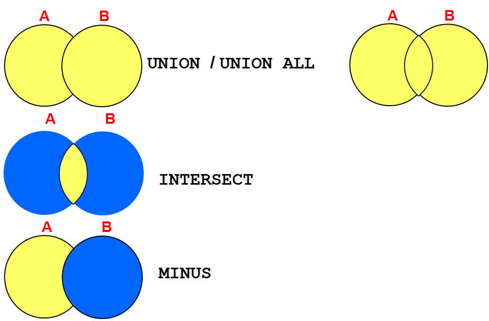
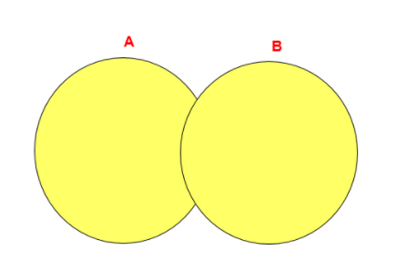
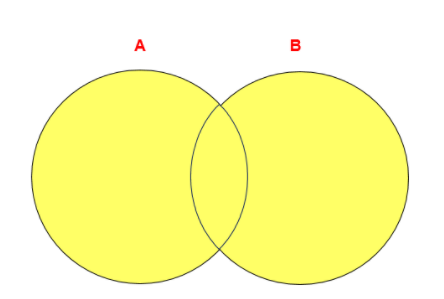
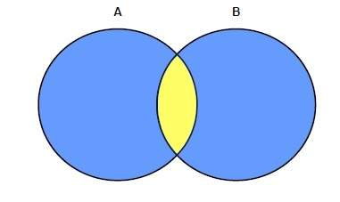
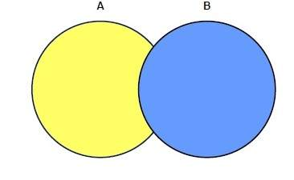

# Oracle SET運算符

## 目標
  通過本章學習，您將可以：
  - 描述 SET 操作符
  - 將多個查詢用 SET 操作符連接組成一個新的查詢
    - UNION / UNION ALL (並集)
    - INTEGSECT (取交集)
    - MINUS (減)
  - 排序：ORDER BY

## SET 操作符
  

## UNION 操作符
  
  `UNION 操作符` 返回兩個查詢的結果及的並集，去除重複紀錄。

## UNION 操作符舉例
  ```SQL
  SELECT employee_id, job_id
  FROM employees
  UNION
  SELECT employee_id, job_id
  FROM job_history;
  ```

## UNION ALL
  
  `UNION ALL操作符` 返回兩個查詢的結果集的並集。保留 對於兩個結果集的重複部分。

## UNION ALL 操作符舉例
  ```SQL
  SELECT employee_id, job_id, department_id
  FROM employees
  UNION ALL
  SELECT employee_id, job_id, department_id
  FROM job_history
  ORDER BY employee_id;
  ```

## INTERSECT 操作符
  
  `INTERSECT 操作符` 返回兩個結果集的交集。

## INTERSECT 操作符舉例
  ```SQL
  SELECT employee_id, job_id
  FROM employees
  INTERSECT
  SELECT employee_id, job_id
  FROM job_history;
  ```

## MINUS 操作符
  
  `MINUS 操作符` 返回兩個結果集的差集。

## MINUS 操作符舉例
  ```SQL
  SELECT employee_id, job_id
  FROM employees
  MINUS
  SELECT employee_id, job_id
  FROM job_history;
  ```

## 使用 SET 操作符 注意事項
  - 在 `SELECT` 列表中的列名 和 表達式在 `數量` 和 `數據類型` 上要相對應。
  - 括號可以改變執行的順序。
  - `ORDER BY 子句`：
    - 只能在語句的最後出現。
    - 可以使用第一個查詢中的列名、別名 或 相對位置。

## SET 操作符
  - 除 `UNION ALL` 之外，系統會自動將重複的紀錄刪除。
  - 系統將第一個查詢的列名顯示在輸出中。
  - 除 `UNION ALL` 之外，系統自動按照第一個查詢中的第一個列的升序排列。

## 匹配各 SELECT 語句舉列
  ```SQL
  SELECT department_id, TO_NUMBER(null) location, hire_date
  FROM employees
  UNION
  SELECT department_id, location_id, TO_DATE(null)
  FROM departments;
  ```

## 使用相對位置排序舉例
  ```SQL
  COLUMN a_dummy NOPRINT
  SELECT 'sing' AS 'My dream', 3 a_dummy
  FROM dual
  UNION
  SELECT 'I`d like to teach', 1
  FROM dual
  UNION
  SELECT 'the world to', 2
  FROM dual
  ORDER BY 2;
  ```

## 總結
  通過本章學習，您已經可以：
  - 使用 UNION 操作符
  - 使用 UNION ALL 操作符
  - 使用 INTERSECT 操作符
  - 使用 MINUS 操作符
  - 使用 ORDER BY 對結果集排序

## 測試
  ### 1. 查詢部門的部門號，其中不包括 job_id 是 "ST_CLERK" 的部門號。
  - 方法一
    ```SQL
    SELECT department_id
    FROM departments
    WHERE department_id not in (
      SELECT distinct department_id
      FROM employees
      WHERE job_id = 'ST_CLERK'
    )
    ```
  - 方法二
    ```SQL
    SELECT department_id
    FROM departments
    MINUS
    SELECT department_id
    FROM employees
    WHERE job_id = 'ST_CLERK'
    ```

  ### 2. 查詢 10、50、20 號部門的 job_id、department_id 並且 department_id 按 10、50、20 的順序排列。
    ```SQL
    column a_dummy noprint;   -- 設定用來排序的自定義欄位 不顯示
    ```
    
    ```SQL
    SELECT job_id, department_id, 1 a_dummy
    FROM employees
    WHERE department_id = 10
    UNION
    SELECT job_id, department_id, 2
    FROM employees
    WHERE department_id = 50
    UNION
    SELECT job_id, department_id, 3
    FROM employees
    WHERE department_id = 20

    ORDER BY 3 ASC
    ```

  ### 3. 查詢所有員工的 last_name、department_id 和 department_name
    ```SQL
    SELECT last_name, department_id, to_char(null)
    FROM employees
    UNION
    SELECT to_char(null), department_id, department_name
    FROM departments
    ```
