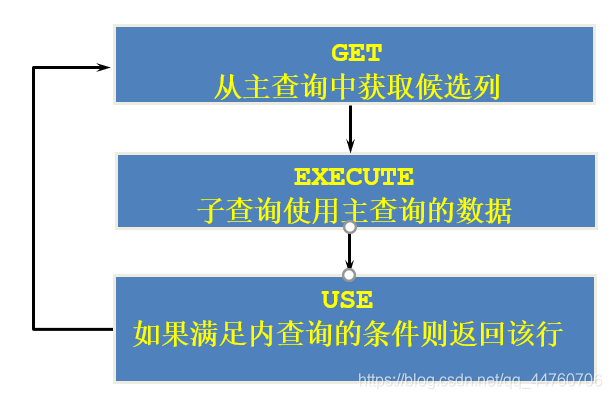

# Oracle 高級子查詢

## 目標
  通過本章學習，您將可以：
  - 書寫多列子查詢
  - 在 FROM 子句中使用子查詢
  - 在 SQL 中使用單列子查詢
  - 書寫相關子查詢
  - 使用 `EXISTS` 和 `NOT EXISTS` 操作符
  - 使用 子查詢更新 和 刪除數據
  - 使用 WITH 子句

## 子查詢
  子查詢是嵌套在 SQL 語句中的另一個 SELECT 語句
  

  ```SQL
  SELECT select_list
  FROM table
  WHERE expr operator (
    SELECT select_list
    FROM table
  );
  ```

  - 子查詢 (內查詢) 在 主查詢執行之前執行。
  - 主查詢 (外查詢) 使用子查詢的結果。

  - 範例：
    查詢 last_name 為 Chen 的 manager 的信息
    ```SQL
    SELECT employee_id, last_name
    FROM employees
    WHERE employee_id = (
      SELECT manager_id
      FROM employees
      WHERE last_name = 'Chen'
    )
    ```

## 子查詢應用舉例
  問題：查詢工資大於 149 號員工工資的員工的信息
  ```SQL
  SELECT last_name
  FROM employees
  WHERE salary > (
    SELECT salary
    FROM employees
    WHERE employee_id = 149
  );
  ```

## 一、多列子查詢
  
  主查詢 與 子查詢 返回的 `多個列` 進行比較。

## 列比較
  多列子查詢中的比較 分為兩種：
  - 成對比較
  - 不成對比較

## 成對比較舉例
  問題：查詢與 `141 號` 或 `174 號` 員工的 `manager_id` 和 `department_id` 相同的其他員工的 `employee_id`, `manager_id`, `department_id`

  ```SQL
  SELECT employee_id, manager_id, department_id
  FROM employees
  WHERE (manager_id, department_id) IN (
    SELECT manager_id, department_id
    FROM employees
    WHERE employee_id IN (144, 174)
  )
  AND employee_id NOT IN(141, 174);
  ```

## 不成對比較舉例
  ```SQL
  SELECT employee_id, manager_id, department_id
  FROM employees
  WHERE manager_id IN
    (
      SELECT manager_id
      FROM employees
      WHERE employee_id IN (144, 174)
    )
  AND department_id IN
    (
      SELECT department_id
      FROM employees
      WHERE employee_id IN (144, 174)
    )
  AND employee_id NOT IN(141, 174);
  ```

## 二、在 FROM 子句中使用子查詢
  問題：返回比本部門平均工資高的員工的 last_name、department_id、salary 及 平均工資。

  - 方法一
    ```SQL
    SELECT last_name, department_id, salary, (
      SELECT AVG(salary)
      FROM employees e3
      WHERE e1.department_id = e3.department_id
      GROUP BY department_id
    ) avg_salary
    FROM employees e1
    WHERE salary > (
      SELECT AVG(salary)
      FROM employees e2
      WHERE e1.department_id = e2.department_id
      GROUP BY department_id
    )
    ```

  - 方法二
    ```SQL
    SELECT a.last_name, a.salary, a.department_id, b.salavg
    FROM employees a, (
      SELECT department_id, AVG(salary) salavg
      FROM employees
      GROUP BY department_id
    ) b
    WHERE a.department_id = b.department_id
    AND a.salary > b.salavg;
    ```

## 三、單列子查詢表達式
  - 單列子查詢表達式，是在一行中，只返回一列的子查詢
  - `Oracle 8i` 只在下列情況下，可以使用，例如：
    - SELECT 語句 (FROM 和 WHERE 子句)。
    - INSERT 語句中的 VALUES 列表中。
  - `Oracle 9i` 中，單列子查詢表達式，可在下列情況下使用：
    - DECODE 和 CASE。
    - SELECT 中除 GROUP BY 子句以外的所有子句中。

## 單列子查詢應用實例
  在 `CASE 表達式` 中，使用單列子查詢
  問題： 顯式員工的 `employee_id`, `last_name` 和 `location`。
  其中，若員工 `department_id` 與 `location_id` 為 1800 的 `department_id` 相同，則 `location` 為 `Canada`，其餘則為 `USA`。
  ```SQL
  SELECT employee_id, last_name, (
    CASE WHEN department_id = (
      SELECT department_id
      FROM departments
      WHERE location_id = 1800
    )
      THEN 'Canada' ELSE 'USA'
    END
  ) location
  FROM employees;
  ```

## 單列子查詢應用舉例
  在 ORDER BY 子句中使用單列子查詢
  問題：查詢員工的 employee_id、last_name 要求按照員工的 department_name 排序。
  ```SQL
  SELECT employee_id, last_name
  FROM employees e
  ORDER BY (
    SELECT department_name
    FROM departments d
    WHERE e.department_id = d.department_id
  );
  ```

## 四、相關子查詢
  相關子查詢按照一行接一行的順序執行，`主查詢的每一行都執行一次子查詢`。
  

## 相關子查詢
  ```SQL
  SELECT column1, column2, ...
  FROM table1 outer
  WHERE column1 operator (
    SELECT column1, column2
    FROM table2
    WHERE expr1 = outer.expr2
  );
  ```
  子查詢中使用主查詢中的列

## 相關子查詢舉例
  - 問題：查詢員工中工資大於本部門平均工資的員工的 `last_name`, `salary` 和 `department_id`
    ```SQL
    SELECT last_name, salary, department_id
    FROM employees outer
    WHERE salary > (
      SELECT AVG(salary)
      FROM employees
      WHERE department_id = outer.department_id
    );
    ```

  - 問題：若 employees 表中 employee_id 與 job_history 表中 employee_id 相同的數目不小於 2，輸出這些相同id的員工的 employee_id, last_name 和 job_id。
    ```SQL
    SELECT e.employee_id, last_name, e.job_id
    FROM employees e
    WHERE 2 <= (
      SELECT COUNT(*)
      FROM job_history
      WHERE employee_id = e.employee_id
    );
    ```

## 五、EXISTS 操作符
  - EXISTS 操作符檢查在子查詢中，是否存在滿足條件的行。
  - 如果在子查詢中存在滿足條件的行：
    - 不在子查詢中繼續查找
    - 條件返回 `TRUE`
  - 如果在子查詢中不存在滿足條件的行：
    - 條件返回 `FALSE`
    - 繼續在子查詢中查找

## EXISTS 操作符應用舉例
  問題：查詢公司管理者的 employee_id, last_name, job_id, department_id 信息。
  ```SQL
  SELECT employee_id, last_name, job_id, department_id
  FROM employees outer
  WHERE EXISTS (
    SELECT 'X'
    FROM employees
    WHERE manager_id = outer.employee_id
  );
  ```

## NOT EXISTS 操作符應用舉例
  問題：查詢 departments 表中，不存在於 employees 表中的部門的 deartment_id 和 department_name。
  ```SQL
  SELECT department_id, department_name
  FROM departments d
  WHERE NOT EXISTS (
    SELECT 'X'
    FROM employees
    WHERE department_id = d.department_id
  );
  ```

## 六、相關更新
  ```SQL
  UPDATE table1 alias1
  SET column = (
    SELECT expression
    FROM table2 alias2
    WHERE alias1.column = alias2.column
  );
  ```
  使用相關子查詢依據一個表中的數據更新另一個表的數據。

## 相關更新應用舉例
  - 1. 
    ```SQL
    ALTER TABLE employees
    ADD (department_name VARCHAR2(14));
    ```

  - 2. 
    ```SQL
    UPDATE employees e
    SET department_name = (
      SELECT department_name
      FROM departments d
      WHERE e.department_id = d.department_id
    );
    ```

## 相關刪除
  ```SQL
  DELETE FROM table1 alias1
  WHERE column operator (
    SELECT expression
    FROM table2 alias2
    WHERE alias1.column = alias2.column
  );
  ```
  使用相關子查詢依據一個表中的數據刪除另一個表的數據。

## 相關刪除應用舉例
  問題：刪除表 employees 中，其與 emp_history 表皆有的數據。
  ```SQL
  DELETE FROM employees E
  WHERE employee_id = (
    SELECT employee_id
    FROM emp_history
    WHERE employee_id = E.employee_id
  );
  ```

## 七、WITH 子句
  - 使用 `WITH 子句`，可以避免在 `SELECT 語句` 中，重複書寫相同的語句塊。
  - `WITH 子句`，將該子句中的語句塊，執行一次並存儲到用戶的臨時表空間中。
  - 使用 `WITH 子句` 可以提高查詢效率。

## WITH 子句應用舉例
  - 問題：查詢公司中各部門的總工資大於公司中各部門的平均總工資的部門信息。
    ```SQL
    WITH
    dept_costs AS (
      SELECT d.department_name, SUM(e.salary) AS dept_total
      FROM employees e, departments d
      WHERE e.department_id = d.department_id
      GROUP BY d.department_name
    ),
    avg_cost AS (
      SELECT SUM(dept_total)/COUNT(*) AS dept_avg
      FROM dept_costs
    )
    SELECT *
    FROM dept_costs
    WHERE dept_total > (
      SELECT dept_avg
      FROM avg_cost
    )
    ORDER BY department_name;
    ```

  - 問題：查詢公司中工資比 Abel 高的員工的信息
    - 一般解法
      ```SQL
      SELECT employee_id, salary
      FROM employees
      WHERE salary > (
        SELECT salary
        FROM employees
        WHERE last_name = 'Abel'
      );
      ```
    - WITH 子句
      ```SQL
      WITH Abel_sal AS (
        SELECT salary
        FROM employees
        WHERE last_name = 'Abel'
      )
      SELECT employee_id, salary
      FROM employees
      WHERE salary > (
        SELECT salary
        FROM Abel_sal
      )
      ```

## 總結
  通過本章學習，您已經可以
  - 使用多列子查詢
  - 多列子查詢埊成對和非成對比較
  - 單列子查詢
  - 相關子查詢
  - EXISTS 和 NOT EXISTS 操作符
  - 相關更新 和 相關刪除
  - WITH 子句

## 測試
  ### 1. 查詢員工的 last_name, department_id, salary 其中員工的 salary, department_id 與有獎金的任何一個員工的 salary, department_id 相同即可。
  ```SQL
  SELECT last_name, department_id, salary
  FROM employees
  WHERE (salary, department_id) in (
    SELECT salary, department_id
    FROM employees
    WHERE commission_pct is not null
  )
  ```

  ### 2. 選擇工資大於所有 JOB_ID = 'SA_MAN' 的員工的工資的員工的 last_name, job_id, salary。
  ```SQL
  SELECT last_name, job_id, salary
  FROM employees
  WHRER salary > all(
    SELECT salary
    FROM employees
    WHERE job_id = 'SA_MAN'
  );
  ```

  ### 3. 選擇所有沒有管理者的員工的 last_name。
  - 方法一
    ```SQL
    SELECT last_name
    FROM employees
    WHERE manager_id is null;
    ```

  - 方法二
    ```SQL
    SELECT last_name
    FROM employees e1
    WHERE NOT EXISTS (
      SELECT 'A'
      FROM employees e2
      WHERE e1.manager_id = e2.employee_id
    )
    ```