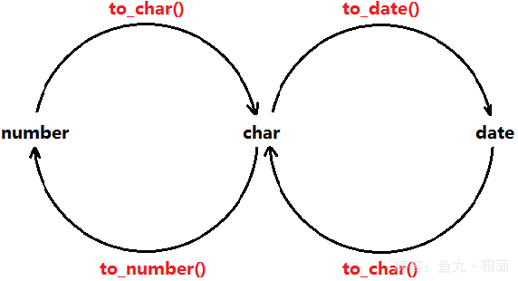

# Oracle 單行函數
## 目標
  通過本章學習，您將可以
  - SQL中 不同類型的函數
  - 在 `SELECT` 語句中，使用字符、數字、日期和 `轉換函數`
  - 使用 `條件表達式`

## 單行函數
  - 換作數據對象
  - 接受參數返回一個結果
  - `只對一行進行變換`
  - `每行返回一個結果`
  - 可以轉換數據類型
  - 可以嵌套
  - 參數可以是一列或一個值

    ```java
    function name [(arg1, arg2, ...)]
    ```

  - 五種類型
    - 字符
    - 數值
    - 日期
    - 轉換
    - 通用

## 字符函數
  - ### 大小寫控制函數
    - `LOWER`：轉換為小寫。
    - `UPPER`：轉換為大寫。
    - `INITCAP`：首字字母大寫，其餘轉成小寫。
  - ### 字符控制函數
    - `CONCAT`：`(a, b)` 連接字符串。
    - `SUBSTR`：`(a, 1, 5)` 從第一個字符位置開始，取 5 位的字符串。
    - `LENGTH`：`(a)` 計算字符串的長度
    - `INSTER`：`(a, W)` 計算 W 出現的位數
    - `LPAD(a, 10, '*')`、`RPAD(a, 10, '*')` 左邊/右邊 使用 `*` 填滿字元 至 10 碼
    - `TRIM(a FROM b)`：把 b 的首尾部去掉字符 a
    - `REPLACE(a, b, c)`：把 a 字符串的所有的 b 換成 c

## 數字函數
  - ### ROUND：四捨五入
    `ROUND(45.926, 2)` --> `45.93`
  - ### TRUNC：截斷
    `TRUNC(45.926, 2)`  --> `45.92`
  - ### MOD：求餘
    `MOD(1600, 300)` --> `100`

## 日期
  - `Oracle` 中的日期型數據，實際含有兩個值：`日期` 和 `時間`。
  - 函數 `SYSDATE` 返回：
    - `日期`
    - `時間`

  - ### 日期的數學運算
    - 在日期上 加上或減去 一個 `數字` 結果仍為日期。
    - 兩個日期相減返回`日期之間相差`的 `天數`
      - 日期不允許做加法運算，無意義
    - 可以用數字除 24 來向日期中加上或減去天數。

  - ### 日期函數
    |函數|簡述|
    |---|---|
    |`MONTHS_BETWEEN(f, s)`|兩個日期相差的月數|
    |`ADD_MONTHS(d, n)`|向指定日期中加上若干月數|
    |`NEXT_DAT(d, day_of_week)`|指定日期的下一個星期 對應的日期|
    |`LAST_DAT(S)`|本月的最後一天|
    |`ROUND(d, c)`|日期四捨五入|
    |`TRUNC(d, c)`|日期截斷|

## 轉換函數
  - ### 隱式數據類型轉換
    Oracle 自動完成下列轉換：
    |源數據類型|目標數據類型|
    |---|---|
    |`VARCHAR2 or CHAR`|`NUMBER`|
    |`VARCHAR2 or CHAR`|`DATE`|
    |`NUMBER`|`VARCHAR2`|
    |`DATE`|`VARCHAR2`|

  - ### 顯式數據類型轉換
    

  - ### TO_CHAR 函數對日期的轉換
    ```sql
    TO_CHAR(date, "fromat_model")
    ```
    - #### 格式
      - 必須包含在單引號中，而且大小寫敏感
      - 可以包涵熱議的有效的日期格式。
      - 日期之間用逗號隔開
    
    ```SQL
    SELECT TO_CHAR(sysdate, 'yyyy-mm-dd hh:mm:ss') FROM dual;
    ```

  - ###  日期格式的元素
    | YYYY  | 2004                  |
    |-------|-----------------------|
    | YEAR  | TWO THOUSAND AND FOUR |
    | MM    | 02                    |
    | MONTH | JULY                  |
    | MON   | JUL                   |
    | DY    | MON                   |
    | DAY   | MONDAY                |
    | DD    | 02                    |

  - ### 日期格式的元素
    - 時間格式
      |HH24:MI:SS AM| 15:45:32 PM|
      |---|---|

    - 使用雙引號向日期中添加字符
      |DD "of" MONTH|12 or OCTOBER|
      |---|---|

  - ### TO_CHAR 函數對日期的轉換
    ```sql
    SELECT Last_name,
           TO_CHAR(hire_date, 'DD Month YYYY')
           AS HIREDATE
    FROM employees;
    ```

  - ### TO_DATE 函數對 字符的轉換
    - 使用 `TO_DATE`：
      ```sql
      TO_DATE(char[, 'format_model'])
      ```
    - 使用 `TO_DATE` 函數，將字符轉換成數字：
      ```sql
      TO_DATE('2012年10月29日 08:10:21', 'yyyy "年" mm "月" dd "日" hh:mi:ss')
      ```

  - ### TO_CHAR 函數對 數字 的轉換
    ```sql
    TO_CHAR(namber, "format_model")
    ```
    下面是在 `TO_CHAR` 函數中經常使用的幾種格式：
    | `9` | 數字         |
    |:---:|-------------|
    | `0` | 零           |
    | `$` | 美元符       |
    | `L` | 本地貨幣符號  |
    | `.` | 小樹點       |
    | `,` | 千位符       |