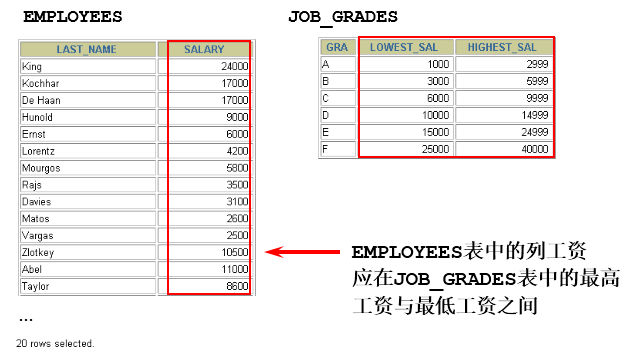

# Oracle 多表查詢

## 目標
  通過本章學習，您將可以
  - 使用 `等值` 和 `不等值` 連接在 `SELECT` 語句中，查詢多個表中的數據。
  - 使用 `自連接`。
  - 使用 `外連接` 查詢不滿足連接條件的數據。

## 從多個表中獲取數據
  

## 笛卡爾積
  - 演示笛卡爾積的錯誤情況
  
    ```sql
    SELECT COUNT(employee_id) FROM employees;
    -- 假設輸出 107 行
    SELECT COUNT(department_id) FROM departments;
    -- 假設輸出 27 行
    SELECT 107 * 27 FROM dual;
    -- 得到 107 * 27 => 2889 筆資料
    ```

  

  - 笛卡爾積會在下面條件下產生：
    - 省略連接條件
    - 連接條件無效
    - 所有表中的所有行互相連接

  - 為了避免笛卡爾積，可以在 `WHERE` 加入 `有效` 的連接條件。

## 等值連接
  

  ```sql
  SELECT e.employee_id, e.last_name, 
        e.department_id, d.department_id,
        d.location_id
  FROM   employees e, departments d
  WHERE  e.department_id = d.department_id;
  ```

  

## 多個連接條件與 AND 操作符
  

## 區分重複的列名
  - 使用表名前綴，在多個表中區分相同的列。
  - 在不同表中，具有相同列名的列，可以用 `表的別名` 加以區分。

## 表的別名
  - 使用別名可以簡化查詢。
  - 使用表名前綴，可以提高執行效率。
    ```sql
    SELECT e.employee_id, e.last_name, e.department_idk
    d.department_id, d.location_id
    FROM employees e, departments d
    WHERE e.department_id = d.department_id;
    ```

## 連接多個表
  
  - 連接 n 個表，至少需要 n - 1 個連接條件，例如：連接三個表，至少需要兩個連接條件。
  > 練習：查詢出公司員工的 last_name, department_name, city

## 非等值連接
  

  ```sql
  SELECT e.last_name, e.salary, j.grade_level
  FROM   employees e, job_grades j
  WHERE  e.salary BETWEEN j.lowest_sal AND j.highest_sal;
  ```

  

## 外連接
  

## 內連接和外連接
  - 內連接：合併具有同一列的兩個以上的表的行，結果集中不包含一個表與另一個表不匹配的行。
  - 外連接：兩個表在連接過程中除了返回滿足連接條件的行以外 `還返回左（或右）表中不滿足條件的行`，`這種連接稱為左（或右）外連接`。沒有匹配的行時, 結果表中相應的列為空(NULL)。外連接的 `WHERE` 子句條件類似於內部連接，但連接條件中沒有匹配行的表的列，後面要加外連接運算符，即用圓括號括起來的加號(`+`)。

  - ### SQL92：使用(+)創建連接
    - 在 SQL92 中採用（+）代表從表所在的位置。即左或右外連接中，(+) 表示哪個是從表。

    - Oracle 對 SQL92 支持較好，而 MySQL 則不支持 SQL92 的外連接。

    ```sql
    -- 左外连接
    SELECT last_name,department_name
    FROM employees ,departments
    WHERE employees.department_id = departments.department_id(+);

    -- 右外连接
    SELECT last_name,department_name
    FROM employees ,departments
    WHERE employees.department_id(+) = departments.department_id;
    ```

  - ### SQL99 語法實現多表查詢
    - #### 基本語法
      - 使用JOIN...ON子句創建連接的語法結構
        ```sql
        SELECT table1.column, table2.column,table3.column
        FROM table1
        JOIN table2 ON table1 和 table2 的連接條件
        JOIN table3 ON table2 和 table3 的連接條件
        ```
        它的嵌套邏輯類似我們使用的FOR 循環：
        ```java
        for t1 in table1:
          for t2 in table2:
            if condition1:
                for t3 in table3:
                    if condition2:
                        output t1 + t2 + t3
        ```
      - 語法說明：
        - 可以使用 ON 子句指定額外的連接條件。
        - 這個連接條件是與其它條件分開的。
        - ON 子句使語句具有更高的易讀性。
        - 關鍵字JOIN、INNER JOIN、CROSS JOIN 的含義是一樣的，都表示內連接
    - #### 內連接(INNER JOIN)的實現
      - 語法：
        ```sql
        SELECT 字段列表
        FROM A表 INNER JOIN B表
        ON 關聯條件
        WHERE 等其他子句;
        ```
        ```sql
        SELECT e.employee_id, e.last_name, e.department_id,  d.department_id, d.location_id
        FROM   employees e JOIN departments d
        ON     (e.department_id = d.department_id);

        ```

    - #### 外連接(OUTER JOIN)的實現
      - ##### 左外連接(LEFT OUTER JOIN)
        - 語法：
          ```sql
          -- 實現查詢結果是A
          SELECT 字段列表
          FROM A表 LEFT JOIN B表
          ON 關聯條件
          WHERE 等其他子句;
          ```
          ```sql
          SELECT e.last_name, e.department_id, d.department_name
          FROM   employees e
          LEFT OUTER JOIN departments d
          ON   (e.department_id = d.department_id) ;
          ```
      - ##### 右外連接(RIGHT OUTER JOIN)
        - 語法：
          ```sql
          -- 實現查詢結果是B
          SELECT 字段列表
          FROM A表 RIGHT JOIN B表
          ON 關聯條件
          WHERE 等其他子句;
          ```
          ```sql
          SELECT e.last_name, e.department_id, d.department_name
          FROM   employees e
          RIGHT OUTER JOIN departments d
          ON    (e.department_id = d.department_id) ;
          ```

      - ##### 滿外連接(FULL OUTER JOIN)
        - 滿外連接的結果= 左右表匹配的數據+ 左表沒有匹配到的數據+ 右表沒有匹配到的數據。
        - SQL99是支持滿外連接的。使用FULL JOIN 或FULL OUTER JOIN來實現。
        - 需要注意的是，MySQL不支持FULL JOIN，但是可以用LEFT JOIN UNION RIGHT join代替。