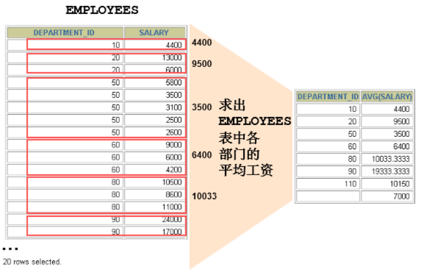
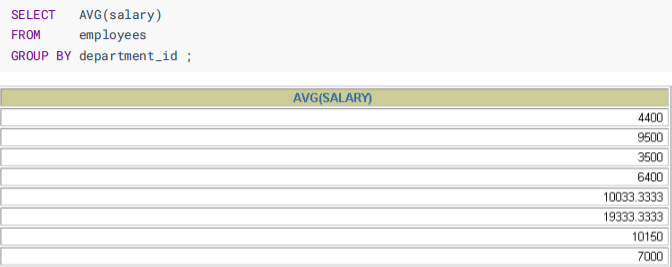
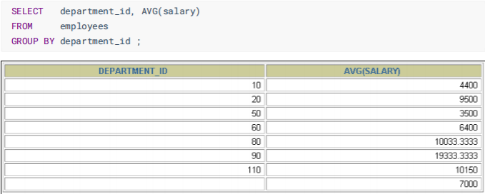
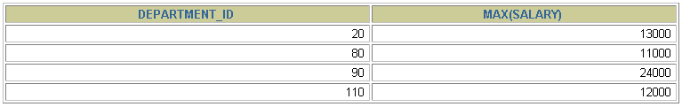

# Oracle 分組函數 (聚合函數、多行函數)

## 目標
  通過本章學習，您將可以
  - 了解 組函數。
  - 描述 組函數 的用途。
  - 使用 `GROUP BY 子句` 對數據分組。
  - 使用 `HAVING 子句` 過濾分組結果集。

## 什麼是 分組函數
  分組函數作用於一組數據，並對一組數據返回一個值。
  

## 組函數類型
  - ### AVG
  - ### COUNT
  - ### MAX
  - ### MIN
  - ### STDDEV
  - ### SUM

## AVG (平均值) 和 SUM (合計) 函數
  可以對 `數值型數據` 使用 AVG 和 SUM 函數。

  ```sql
  SELECT AVG(salary), MAX(salary),
        MIN(salary), SUM(salary)
  FROM employees
  WHERE job_id LIKE '%REP%';
  ```

  | AVG(salary) | MAX(salary) | MIN(salary) | SUM(salary) |
  |------------:|------------:|------------:|------------:|
  |        8150 |       11000 |        6000 |       32600 |

## MIN (最小值) 和 MAX (最大值) 函數
  可以對 `任意數據類型` 的數據使用 `MIN` 和 `MAX` 函數
  
  ```sql
  SELECT MIN(hire_date), MAX(hire_date)
  FROM employees;
  ```

  |MIN(hire_date)|MAX(hire_date)|
  |---|---|
  |17-JUN-87|29-JAN-00|

## COUNT (計數) 函数
  `COUNT(*)` 返回表中記錄總數，適用於 `任意數據類型`。

  ```sql
  SELECT COUNT(*)
  FROM employees
  WHERE department_id = 50;
  ```

  | COUNT(*) |
  |---------:|
  |        5 |

  - `COUNT(expr)` 返回 `expr` 不為空的紀錄總數。
    ```sql
    SELECT COUNT(commission_pct)
    FROM employees
    WHERE department_id = 50;   -- 忽略了 Null 值
    ```


## 組函數與空值
  組函數 `忽略空值`

  ```sql
  SELECT AVG(commission_pct)
  FROM employees
  ```

  |AVG(commission_pct)|
  |---:|
  ||

  例如：
  ```sql
  SELECT AVG(commission_pct), SUM(commission_pct) / 107, SUM(commission_pct) / COUNT(commission_pct)
  FROM employees;
  ```
  查看結果的不同。

## 在組函數中使用 `NVL` 函數
  `NVL 函數 使分組函數無法忽略空值`。

  ```sql
  SELECT AVG(NVL(commission_pct, 0))    -- 將 NULL 的值，替換成 0
  FROM employees;
  ```

  |AVG(NVL(commission_pct, 0)) |
  |---:|
  ||

## DISTINCT 關鍵字
  - COUNT(DISTINCT expr) 返回 `expr 非空，且不重複` 的紀錄總數

  ```sql
  SELECT COUNT(DISTINCT department_id)
  FROM employees;
  ```

  | COUNT(DISTINCT department_id) |
  |------------------------------:|
  |                             7 |

## 分組數據
  

## GROUP BY 子句
  包含在 `GROUP BY 子句` 中的列，不必包含在 `SELECT` 列表中。

  ```SQL
  SELECT AVG(salary)
  FROM employees
  GROUP BY department_id;
  ```

  

  在 `SELECT` 列表中所有未包含在組函數中的列，都應該包含在 `GROUP BY 子句` 中。
  
  ```sql
  SELECT department_id, AVG(salary)
  FROM employees
  GROUP BY department_id;
  ```

  

## 在 GROUP BY 子句 中包含多個列
  ```sql
  SELECT department_id dept_id, job_id, SUM(salary)
  FROM employees
  GROUP BY department_id, job_id
  ```

## 非法使用組函數
  所有包含於 `SELECT` 列表中，而未包含於組函數中的列，都必須包含於 `GROUP BY` 子句中。

  ```sql
  SELECT department_id, COUNT(last_name)
  FROM employees;
  ```

  ```sql
  SELECT department_id, COUNT(last_name)
  *
  ERROR at line 1:
  ORA-00937: not a aingle-group group function
  ```

  `GROUP BY` 子句中缺少列

  - 不能在 `WHERE` 子句中，使用組函數
  - 可以在 `HAVING` 子句中，使用組函數

  ```sql
  SELECT department_idm, AVG(salary)
  FROM employees
  WHERE AVG(salary) > 8000
  GROUP BY department.id;
  ```

  ```sql
  WHERE AVG(salary) > 8000
        *
  ERROR at line 3:
  ORA-00934; group function is not allowed here
  ```

  `WHERE` 子句中，不能使用組函數。

## 過濾分組
  

## 過濾分組：HAVING 子句
  使用 `HAVING` 過濾分組：
  - 1. 行已經被分組
  - 2. 使用了組函數
  - 3. 滿足 `HAVING` 子句中，條件的分組將被顯示。

  

## HAVING 子句
  ```sql
  SELECT   department_id, MAX(salary)
  FROM     employees
  GROUP BY department_id
  HAVING   MAX(salary)>10000 ;
  ```

  

## 嵌套組函數
  顯示各部門平均工資的最大值

  ```sql
  SELECT MAX(AVG(salary))
  FROM employees
  GROUP BY department_id
  ```

  |MAX(AVG(salary))|
  |---:|
  |19333.3333333333|

## 總結
  通過本章學習，您已經學會
  - 使用組函數：`AVG()`、`SUM()`、`MAX()`、`MIN()`、`COUNT()`
  - 在查詢中使用 `GROUP BY` 子句。
  - 在查詢中使用 `HAVING` 子句。

  

## 測試
  - ### 1. 組函數處理多行返回一行嗎？
    是
  - ### 2. 組函數不計算空值嗎？
    是
  - ### 3. WHERE 子句 可否使用組函數進行過濾？
    不可以，用 HAVING 替代
  - ### 4. 查詢公司員工工資的最大值、最小值、平均值、總和
    ```sql
    SELECT MAX(salary), MIN(salary), AVG(salary), SUM(salary)
    FROM employees
    ```

  - ### 5. 查詢各 job_id 的員工工資的最大值、最小值、平均值、總和
    ```sql
    SELECT job_id, MAX(salary), MIN(salary), AVG(salary), SUM(salary)
    FROM employees
    GROUP BY job_id
    ```

  - ### 6. 選擇具有各個 job_id 的員工人數
    ```sql
    SELECT job_id, COUNT(employee_id)
    FROM employees
    GROUP BY job_id
    ```

  - ### 7. 查詢員工最高工資和最低工資的差距 (DIFFERENCE)
    ```sql
    SELECT MAX(salary), MIN(salary), MAX(salary) - MIN(salary) "DIFFERENCE"
    FROM employees
    ```

  - ### 8. 查詢各個管理者手下員工的最低工資，其中最低工資不能低於 6000，沒有管理者的員工不計算在內。
    ```sql
    SELECT manager_id, MIN(salary)
    FROM employees
    -- WHERE manager_id IS NOT NULL
    GROUP BY manager_id
    HAVING MIN(salary) >= 6000 AND manger_id IS NOT NULL
    ```

  - ### 9. 查詢所有部門的名字、location_id、員工數量和工資平均值。
    ```sql
    SELECT department_name, location_id, COUNT(employee_id), AVG(salary)
    FROM employees e right outer join departments d
    ON e.department_id = d.department_id
    GROUP BY department_name, location_id;
    ```

  - ### 10. 查詢公司在 1995 - 1998 年之間，每年雇用的人數，結果類似下面的格式
    | total | 1995 | 1996 | 1997 | 1998 |
    |-------|------|------|------|------|
    | 20    | 3    | 4    | 6    | 7    |


    ```sql
    SELECT COUNT(*) "total",
            COUNT(decode(to_char(hire_date, 'yyyy'), '1995', 1, null)) '1995',
            COUNT(decode(to_char(hire_date, 'yyyy'), '1996', 1, null)) '1996',
            COUNT(decode(to_char(hire_date, 'yyyy'), '1997', 1, null)) '1997',
            COUNT(decode(to_char(hire_date, 'yyyy'), '1998', 1, null)) '1998',
    FROM employees
    WHERE to_char(hire_date, 'yyyy') in ('1995', '1996', '1997', '1998');
    ```