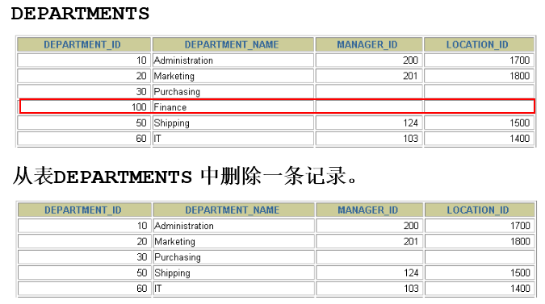
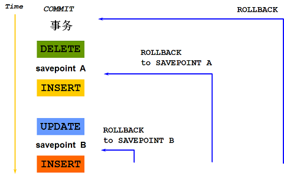

# Oracle 數據處理

## 目標
  通過本章學習，您將可以
  - 使用 DML 語句。
  - 向表中插入數據。
  - 更新表中數據。
  - 從表中刪除數據。
  - 控制事務

## 數據操縱語言
  - `DML (Data Manipulation Language - 數據操縱語言)`，可以在下列條件下執行：
    - 向表中 `插入` 數據
    - `修改` 現存數據
    - `刪除` 現存數據
  - 事務是由完成若干項工作的 `DML 語言` 組成的

## 插入數據
  

## INSERT 語句語法
  - 使用 `INSERT` 語句，向表中插入數據。
    ```SQL
    INSERT INTO table [(column [, column...])]
    VALUES (value1 [, value....]);
    ```

    - 方法一
      ```SQL
      INSERT INTO departments
      VALUES (70, 'Pub', 100, 1700);
      ```
    - 方法二
      ```SQL
      INSERT INTO departments(department_id, department_name)
      VALUES (80, 'IT');
      ```
    - 方法三
      ```SQL
      INSERT INTO table_name 
      VALUES 
      (value1 [,value2, …, valuen]),
      (value1 [,value2, …, valuen]),
      ……
      (value1 [,value2, …, valuen]);
      ```

  - 使用這種語法一次只能向表中插入 `一條`數據。

## 插入數據
  - 為每一列添加一個新值。
  - 按列的默認順序列出各個列的值。
  - 在 `INSERT 子句` 中，隨意列出列名和值。
  - `字符` 和 `日期型數據`，應包含在 `單引號` 中。
    ```SQL
    INSERT INTO departments(department_id, department_name, manager_id, location_id)
    VALUES (70, 'Public Relations', 100, 1700);
    ```

    ```SQL
    INSERT INTO employees(employee_id, last_name, email, hire_date, job_id)
    VALUES (300, 'Tom', 'tom@126.com', to_date('2012-3-21', 'yyyy-mm-dd'), 'SA_RAP');
    ```

## 向表中插入空值
  - 隱式方式：在列名表中省略該列的值。
    ```SQL
    INSERT INTO departments(department_id, department_name)
    VALUES (30, 'Purchasing');
    ```

  - 顯式方式：在 `VALUES` 子句中指定空值。
    ```SQL
    INSERT INTO departments
    VALUES (100, 'Finance', NULL, NULL);
    ```

## 插入指定的值
  `SYSDATE` 紀錄當前系統的日期和時間。
  ```SQL
  INSERT INTO employees(employee_id, first_name, last_name, email, phone_number, hire_date, job_id, salary, commission_pct, manager_id, departmant_id)
  VALUES (113, 'Louis', 'Popp', 'LPOPP', '515.124.4567', SYSDATE, 'AC_ACCOUNT', 6900, NULL, 205, 100);
  ```

  - 加入新員工
    ```SQL
    INSERT INTO employees
    VALUES (114, 'Den', 'Raphealy', 'DRAPHEAL', '515.127.4561', TO_DATE('FEB 3, 1999', 'MON DD, YYYY'),
    'AC_ACCOUNT', 11000, NULL, 100, 30);
    ```
  
  - 檢查插入的數據

## 創建腳本
  - 在 SQL 語句中，使用 `& 變量` 指定列值。
  - `& 變量` 放在 `VALUES 子句` 中。
    ```SQL
    INSERT INTO departments(department_id, departmant_name, location_id)
    VALUES (&departmant_id, '&department_name', &location);
    ```

## 以其他表中拷貝數據
  - 在 `INSERT 語句` 中，加入子查詢。
    ```SQL
    INSERT INTO emp2
    SELECT *
    FROM employees
    WHERE department_id = 90;
    ```

    ```SQL
    INSERT INTO sales reps(id, name, salary, commission_pct)
    SELECT employee_id, last_name, salary, commission_pct
    FROM employees
    WHERE job_id LIKE '%REP%';
    ```
  
  - 不必書寫 `VALUES 子句`。
  - 子查詢中的值列表，應為 `INSERT 子句` 中的列名對應。

## 更新數據
  

## UPDATE 語句語法
  - 使用 `UPDATE` 語句更新數據。
    ```SQL
    UPDATE table
    SET column = value [, column = value, ...]
    [WHERE condition];
    ```
  
  - 可以一次更新 `多條` 數據。

## 更新數據
  - 使用 `WHERE 子句` 指定需要更新的數據。
    ```SQL
    UPDATE employees
    SET department_id = 70
    WHERE employee_id = 113;
    ```

  - 如果省略 `WHERE 子句`，則表中的所有數據都將被更新。
    ```SQL
    UPDATE copy_emp
    SET department_id = 110;
    ```

## 在 UPDATE 語句中使用子查詢
  - 題目：更新 114 號員工的工作和工資，使其與205號員工相同。
    ```SQL
    UPDATE employees
    SET job_id = (SELECT job_id
                  FROM employees
                  WHERE employees_id = 205),
        salary = (SELECT salary
                  FROM employees
                  WHERE employees_id = 205),
    WHERE employee_id = 114;
    ```

  在 `UPDATE` 中，使用子查詢，使更新基於另一個表中的數據。
  - 題目：調整與 `employee_id` 為 200 的員工 `job_id` 相同的員工的 `department_id` 為 `employee_id` 為 100 的員工的 `department_id`。
    ```SQL
    UPDATE copy_emp
    SET department_id = (SELECT department_id
                         FROM employees
                         WHERE employee_id = 100)
    WHERE job_id = (SELECT job_id
                    FROM employees
                    WHERE employee_id = 200);
    ```

## 更新中的數據完整性錯誤
  ```SQL
  UPDATE employees
  SET department_id = 55
  WHERE department_id = 110;
  ```

  ```SQL
  UPDATE employees
         *
  ERROR at line 1;
  ORA-02291: integrity constraint (HR.EMP_DEPT_FK)
  violated = parent key not found
  ```
  > 不存在 55 號部門

## 刪除數據
  

## DELETE 語句
  使用 `DELECT 語句` 從表中刪除數據。
  ```SQL
  DELETE FROM table
  [WHERE condition];
  ```

## 刪除數據
  - 使用 `WHERE 子句` 刪除指定的紀錄。
    ```SQL
    DELETE FROM departments
    WHERE department_name = 'Finance';
    ```

  - 如果省略 `WHERE 子句`，則表中的全部數據將被刪除。
    ```SQL
    DELETE FROM copy_emp;
    ```

## 在 DELETE 中使用子查詢
  在 `DELETE` 中，使用子查詢，使刪除基於另一個表中的數據。
  - 題目：從 `employees1` 表中，刪除 `dept1` 部門名稱中，含 `public` 字符的部門 `id`
    ```SQL
    DELETE FROM employees1
    WHERE department_id = (SELECT department_id
                           FROM dept1
                           WHERE department_name LIKE '%Public%');
    ```

## 刪除中的數據完整性錯誤
  ```SQL
  DELETE FROM departments
  WHERE department_id = 60;
  ```
  ```SQL
  DELETE FROM departments
              *
  ERROR at line 1:
  ORA-02292: integrity constraint (HR.EMP_DEPT_FK)
  violated = child record found
  ```
  > 有子紀錄的資料，不能刪除

## 數據庫事務
  - ### 事務：
    一組邏輯操作單元，使數據從一種狀態變換到另一種狀態。
  - ### 數據庫事務由以下的部分組成：
    - 一個或多個 `DML 語句`。
    - 一個 `DDL (Data Definition Language - 數據定義語言)` 語句。
    - 一個 `DCL (Data Control Language - 數據控制語言)` 語句。
    - 以第一個 `DML 語句` 的執行作為開始。
    - 以下面的其中之一做為結束：
      - `COMMIT` 或 `ROLLBACK` 語句
      - `DDL 語句` (自動提交)
      - 用戶會話正常結束
      - 系統異常終止
## COMMIT 和 ROLLBACK 語句的優點
  使用 `COMMIT` 和 `ROLLBACK` 語句，我們可以：
  - 確保數據完整性。
  - 數據改變被提交之前預覽。
  - 將邏輯上相關的操作分組。

## 控制事務
  

## 回滾到保留點
  - 使用 `SAVEPOINT 語句`，在當前事務中，創建保存點。
  - 使用 `ROLLBACK TO SAVEPOINT 語句`，回滾到創建的保存點。
    ```SQL
    UPDATE ...
    SAVEPOINT update_done;
    Savepoint created.

    INSERT...
    
    ROLLBACK TO update_done;
    Rollback complete.
    ```

## 事務進程
  - 自動提交在以下情況中執行：
    - `DDL 語句`。
    - `DCL 語句`。
    - 不使用 `COMMIT` 或 `ROLLBACK` 語句提交或回滾，正常結束會話。
  - 會話異常結束或系統異常會導致自動回滾。

## 提交或回滾前的數據狀態
  - 改變前的數據狀態是可以恢復的。
  - 執行 `DML` 操作的用戶，可以通過 `SELECT 語句` 查詢之前的修正。
  - 其他用戶不能看到當前用戶所做的改變，直到當前用戶結束事務。
  - `DML 語句` 所涉及到的行被鎖定，其他用戶不能操作。

## 提交後的數據狀態
  - 數據的改變已經被保存到數據庫中。
  - 改變前的數據已經丟失。
  - 所有用戶可以看到結果。
  - 鎖被釋放，其他用戶可以操作涉及到的數據。
  - 所有保存點被釋放。

## 提交數據
  - 改變數據
    ```SQL
    DELETE FROM employees
    WHERE employee_id = 99999;
    1 row deleted.

    INSERT INTO departments
    VALUE (290, 'Corporate Tax', NULL, 1700);
    1 row inserted.
    ```

  - 提交改變
    ```SQL
    COMMIT;
    Commit complete.
    ```

## 數據回滾後的狀態
  使用 `ROLLBACK 語句`，可使數據變化失效：
  - 數據改變被取消。
  - 修改前的數據狀態被恢復。
  - 鎖被釋放。
  ```SQL
  DELETE FROM copy_emp;
  22 row deleted.

  ROLLBACK;
  Rollback complete.
  ```

## 總結
  通過本章學習，您應學會如何使用 `DML 語句` 改變數據和事務控制。
  | 語句         | 功能   |
  |-------------|-------|
  | `INSERT`    | 插入   |
  | `UPDATE`    | 修正   |
  | `DELETE`    | 刪除   |
  | `COMMIT`    | 提交   |
  | `SAVEPOINT` | 保存點 |
  | `ROLLBACK`  | 回滾   |

## 測試
  ### 1. 運行以下腳本創建表 my_employees
    ```SQL
    CREATE TABLE my_employees (
      id number(3),
      First_name varchar2(10),
      Last_name varchar2(10),
      User_name varchar2(10),
      Salary number(5),
      )
    ```

  ### 2. 顯示表 my_employees 的結構
    ```SQL
    DESC my employees;
    ```

  ### 3. 向表中插入下列數據
  | ID | FIRST_NAME | LAST_NAME | USERID   | SALARY |
  |----|------------|-----------|----------|--------|
  | 1  | patel      | Ralph     | Rpatel   | 895    |
  | 2  | Dancs      | Betty     | Bdancs   | 860    |
  | 3  | Biri       | Ben       | Bbiri    | 1100   |
  | 4  | Newman     | Chad      | Cnewman  | 750    |
  | 5  | Ropeburn   | Audrey    | Aropebur | 1550   |

  - 練習
    ```SQL
    INSERT INTO my_employees
    VALUES (1, 'patel', 'Ralph', 'Rpatel', 895);
    ...
    ```

  ### 4. 提交
  - 練習
    ```SQL
    COMMIT
    ```

  ### 5. 將 3 號員工的 last_name 修改為 "drelxer"
  - 練習
    ```SQL
    UPDATE my_employees
    SET last_name = 'drelxer'
    WHERE id = 3;
    ```

  ### 6. 將所有工資少於 900 的員工的工資修改為 1000
  - 練習
    ```SQL
    UPDATE my_employees
    SET salary = 1000
    WHERE salary < 900;
    ```

  ### 7. 檢查所做的修正
  - 練習
    ```SQL
    SELECT * FROM my_employees
    WHERE salary < 900;
    ```

  ### 8. 提交
  - 練習
    ```SQL
    COMMIT
    ```

  ### 9. 刪除所有數據
  - 練習
    ```SQL
    DELETE FROM my_employees;
    ```

  ### 10. 檢查所做的修正
  - 練習
    ```SQL
    SELECT * FROM my_employees;
    ```

  ### 11. 回滾
  - 練習
    ```SQL
    ROLLBACK;
    ```

  ### 12. 清空表 my_employees
  - 練習
    ```SQL
    TRUNCATE TABLE my_employees;
    ```