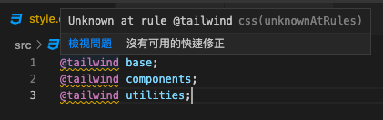

# Vue3 + TailwindCSS (課後筆記)

#### 切版技術再升級！一課覆蓋 TailwindCSS + Vue3｜打造後台管理頁面 UI

#### 課程連結
- [Hiskio 課程介紹](https://hiskio.com/courses/620/about) fubonco50 / fbit22
- [Github](https://github.com/ycs77lucasv/lucas-press)

#### 相關連結
- [TailwindCSS 中文文檔](https://www.tailwindcss.cn/docs)
- [TailwindCSS 英文官網](https://tailwindcss.com/)

## 第1章 行前準備
### 單元 3 - Vite - 快速啟動的本地開發工具
[Vite 中文官網](https://cn.vitejs.dev/)、[Vite 英文官網](https://vitejs.dev/)、[簡報](https://lucas-hiskio-2021-tailwindcss-slide.vercel.app/vite/1) (左右鍵切換)
  #### Vite 介紹
  - 現代瀏覽器原生支援ESM
  - 原生支援 HMR (熱更新)
  - 使用 esbuild 預編譯依賴套件，和處理 TS、JSX
  - 兼容 Rollup 插件
  - 生產環境：提供基於 Rollup 的 打包工具
  - vite v2 不綁定框架，React 也能用
  
  

  #### Vite 插件
  - vite-plugin-pages 檔案驅動的 Vite 路由套件
  - unplugin-vue-components 自動加載 Vue 組件
  - unplugin-icons 快速使用100+套icon套件庫 & Heroicons 介紹
  Awesome Vite 列表 (其他好用plugin可在此尋找)：https://github.com/vitejs/awesome-vite

  #### 建立 Vite 專案
  ```sh
    npm init vite

    // 或

    yarn create vite
  ```
  [npm vs yarn 指令比較表](https://www.digitalocean.com/community/tutorials/nodejs-npm-yarn-cheatsheet)


### 單元 4 - 安裝 Tailwind CSS
[安裝 Tailwind CSS with Vue3 and Vite](https://tailwindcss.com/docs/guides/vite#vue)

  - #### 安裝 Tailwind CSS
    ```sh
      npm install -D tailwindcss postcss autoprefixer
    ```

  - #### 產生 Tailwind CSS、PostCSS 兩支config 檔案
    ```sh
      npx tailwindcss init -p
    ```

  - #### 修改 tailwind.config.js
    設定其編譯的匹配範圍
    ```js
      module.exports = {
        content: [
          "./index.html",
          "./src/**/*.{vue,js,ts,jsx,tsx}",
        ],
        theme: {
          extend: {},
        },
        plugins: [],
      }
    ```

  - #### 將 Tailwind 指令到 自定義CSS中
    新增CSS檔案，並加入3個預設指令。`./src/style.css`
    ```css
      @tailwind base;
      @tailwind components;
      @tailwind utilities;
    ```
    > 當出現 黃色波浪時，可安裝『 [PostCSS Language Support](https://marketplace.visualstudio.com/items?itemName=csstools.postcss) 』擴充套件
    > 


  - #### 將 自定義CSS 引入 main.js
    ```js
      import { createApp } from 'vue'
      import App from './App.vue'
      import './style.css'      // 將 自定義CSS 引入

      const app = createApp(App)
      app.mount('#app')
    ```

  - #### 在 VScode 使用 Tailwind 提示建議
    搜尋擴充套件 『 [Tailwind CSS IntelliSense](https://marketplace.visualstudio.com/items?itemName=bradlc.vscode-tailwindcss) 』
    > 快速 重啟VScode ( Ctrl + Shift + P，輸入 'reload Window' ) 

  - #### 若之前使用 Tailwindcss v2.x ，想升級 v3.x，可參考[此篇](https://tailwindcss.com/docs/upgrade-guide)
  

### 單元 6 - 安裝 Tailwind CSS 相關套件
  - #### 固定元素長寬比 ( [@tailwindcss/aspect-ratio](https://github.com/tailwindlabs/tailwindcss-aspect-ratio) )
    可用於 `<iframe>`，設定長寬比，也可設定斷點。
    - ##### 安裝
      ```sh
        npm i -D @tailwindcss/aspect-ratio
      ```
    - ##### 設定 `tailwind.config.js`
      先禁用 `aspectRatio` 核心插件，避免衝突。
      ```js
        // tailwind.config.js
        module.exports = {
          theme: {
            // ...
          },
          corePlugins: {
            aspectRatio: false,
          },
          plugins: [
            require('@tailwindcss/aspect-ratio'),
            // ...
          ],
        }
      ```
    - ##### 用法
      ```html
        <div class="aspect-w-16 aspect-h-9">
          <iframe src="https://www.youtube.com/embed/dQw4w9WgXcQ" frameborder="0" allow="accelerometer; autoplay; clipboard-write; encrypted-media; gyroscope; picture-in-picture" allowfullscreen></iframe>
        </div>
      ```

  - #### Forms 統一樣式 ( [@tailwindcss/forms](https://github.com/tailwindlabs/tailwindcss-forms) )
    - [Demo](https://tailwindcss-forms.vercel.app/)
    - ##### 安裝
      ```sh
        npm install -D @tailwindcss/forms
      ```
    - ##### 設定 `tailwind.config.js`
      ```js
        // tailwind.config.js
        module.exports = {
          theme: {
            // ...
          },
          plugins: [
            require('@tailwindcss/forms'),
            // ...
          ],
        }
      ```

  - #### markdown 保留樣式 ( [@tailwindcss-typography](https://github.com/tailwindlabs/tailwindcss-typography)、[官方文件](https://tailwindcss.com/docs/typography-plugin) )
    - ##### 安裝
      ```sh
        npm install -D @tailwindcss/typography
      ```
    - ##### 設定 `tailwind.config.js`
      ```js
        // tailwind.config.js
        module.exports = {
          theme: {
            // ...
          },
          plugins: [
            require('@tailwindcss/typography'),
            // ...
          ],
        }
      ```


### 單元 7 - postcss-import - CSS檔案模組化
  - #### [官方文檔](https://tailwindcss.com/docs/using-with-preprocessors#build-time-imports)
### 單元 8 - 專案設定
### 單元 9 - vite-plugin-pages - 檔案驅動的 Vite 路由套件