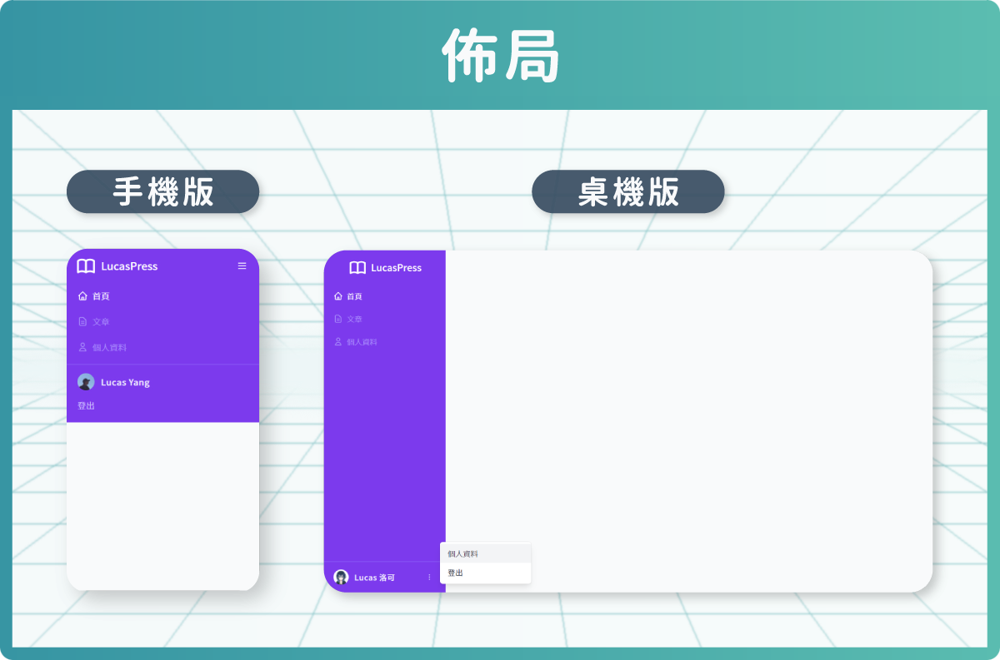

# Vue3 + TailwindCSS (課後筆記)

#### 切版技術再升級！一課覆蓋 TailwindCSS + Vue3｜打造後台管理頁面 UI

#### 課程連結
- [Hiskio 課程介紹](https://hiskio.com/courses/620/about) fubonco50 / fbit22
- [Github](https://github.com/ycs77lucasv/lucas-press)

#### 相關連結
- [TailwindCSS 中文文檔](https://www.tailwindcss.cn/docs)
- [TailwindCSS 英文官網](https://tailwindcss.com/)

-----

## 第1章 行前準備
### 單元 3 - Vite - 快速啟動的本地開發工具
[Vite 中文官網](https://cn.vitejs.dev/)、[Vite 英文官網](https://vitejs.dev/)、[簡報](https://lucas-hiskio-2021-tailwindcss-slide.vercel.app/vite/1) (左右鍵切換)
  #### Vite 介紹
  - 現代瀏覽器原生支援ESM
  - 原生支援 HMR (熱更新)
  - 使用 esbuild 預編譯依賴套件，和處理 TS、JSX
  - 兼容 Rollup 插件
  - 生產環境：提供基於 Rollup 的 打包工具
  - vite v2 不綁定框架，React 也能用
  
  

  #### Vite 插件
  - vite-plugin-pages 檔案驅動的 Vite 路由套件
  - unplugin-vue-components 自動加載 Vue 組件
  - unplugin-icons 快速使用100+套icon套件庫 & Heroicons 介紹
  Awesome Vite 列表 (其他好用plugin可在此尋找)：https://github.com/vitejs/awesome-vite

  #### 建立 Vite 專案
  ```sh
    npm init vite

    // 或

    yarn create vite
  ```
  [npm vs yarn 指令比較表](https://www.digitalocean.com/community/tutorials/nodejs-npm-yarn-cheatsheet)

### 單元 4 - 安裝 Tailwind CSS
[安裝 Tailwind CSS with Vue3 and Vite](https://tailwindcss.com/docs/guides/vite#vue)

  - #### 安裝 Tailwind CSS
    ```sh
      npm install -D tailwindcss postcss autoprefixer
    ```

  - #### 產生 Tailwind CSS、PostCSS 兩支config 檔案
    ```sh
      npx tailwindcss init -p
    ```

  - #### 修改 tailwind.config.js
    設定其編譯的匹配範圍
    ```js
      module.exports = {
        content: [
          "./index.html",
          "./src/**/*.{vue,js,ts,jsx,tsx}",
        ],
        theme: {
          extend: {},
        },
        plugins: [],
      }
    ```

  - #### 將 Tailwind 指令到 自定義CSS中
    新增CSS檔案，並加入3個預設指令。`./src/style.css`
    ```css
      @tailwind base;
      @tailwind components;
      @tailwind utilities;
    ```
    > 當出現 黃色波浪時，可安裝『 [PostCSS Language Support](https://marketplace.visualstudio.com/items?itemName=csstools.postcss) 』擴充套件
    > 


  - #### 將 自定義CSS 引入 main.js
    ```js
      import { createApp } from 'vue'
      import App from './App.vue'
      import './style.css'      // 將 自定義CSS 引入

      const app = createApp(App)
      app.mount('#app')
    ```

  - #### 在 VScode 使用 Tailwind 提示建議
    搜尋擴充套件 『 [Tailwind CSS IntelliSense](https://marketplace.visualstudio.com/items?itemName=bradlc.vscode-tailwindcss) 』
    > 快速 重啟VScode ( Ctrl + Shift + P，輸入 'reload Window' ) 

  - #### 若之前使用 Tailwindcss v2.x ，想升級 v3.x，可參考[此篇](https://tailwindcss.com/docs/upgrade-guide)
  
### 單元 6 - 安裝 Tailwind CSS 相關套件
  - #### 固定元素長寬比 ( [@tailwindcss/aspect-ratio](https://github.com/tailwindlabs/tailwindcss-aspect-ratio) )
    可用於 `<iframe>`，設定長寬比，也可設定斷點。
    - ##### 安裝
      ```sh
        npm i -D @tailwindcss/aspect-ratio
      ```
    - ##### 設定 `tailwind.config.js`
      先禁用 `aspectRatio` 核心插件，避免衝突。
      ```js
        // tailwind.config.js
        module.exports = {
          theme: {
            // ...
          },
          corePlugins: {
            aspectRatio: false,
          },
          plugins: [
            require('@tailwindcss/aspect-ratio'),
            // ...
          ],
        }
      ```
    - ##### 用法
      ```html
        <div class="aspect-w-16 aspect-h-9">
          <iframe src="https://www.youtube.com/embed/dQw4w9WgXcQ" frameborder="0" allow="accelerometer; autoplay; clipboard-write; encrypted-media; gyroscope; picture-in-picture" allowfullscreen></iframe>
        </div>
      ```

  - #### Forms 統一樣式 ( [@tailwindcss/forms](https://github.com/tailwindlabs/tailwindcss-forms) )
    - [Demo](https://tailwindcss-forms.vercel.app/)
    - ##### 安裝
      ```sh
        npm install -D @tailwindcss/forms
      ```
    - ##### 設定 `tailwind.config.js`
      ```js
        // tailwind.config.js
        module.exports = {
          theme: {
            // ...
          },
          plugins: [
            require('@tailwindcss/forms'),
            // ...
          ],
        }
      ```

  - #### markdown 保留樣式 ( [@tailwindcss-typography](https://github.com/tailwindlabs/tailwindcss-typography)、[官方文件](https://tailwindcss.com/docs/typography-plugin) )
    - ##### 安裝
      ```sh
        npm install -D @tailwindcss/typography
      ```
    - ##### 設定 `tailwind.config.js`
      ```js
        // tailwind.config.js
        module.exports = {
          theme: {
            // ...
          },
          plugins: [
            require('@tailwindcss/typography'),
            // ...
          ],
        }
      ```

### 單元 7 - postcss-import - CSS檔案模組化
  在tailwind 使用 import
  - #### [官方文檔](https://tailwindcss.com/docs/using-with-preprocessors#build-time-imports)
  - ##### 安裝
    ```sh
      npm install -D postcss-import
    ```

  - ##### 設定 `postcss.config.js`
    ```js
      // postcss.config.js
      module.exports = {
        plugins: {
          'postcss-import': {},
          tailwindcss: {},
          autoprefixer: {},
        }
      }
    ```

  - ##### 將 @tailwind 改為 @import
    ```css
      @tailwind base;
      @tailwind components;
      @tailwind utilities;
    ```
    改為
    ```css
      @import 'taiwindcss/base';
      @import 'taiwindcss/components';
      @import 'taiwindcss/utilities';
    ```
  
  - ##### 欲撰寫像SCSS的巢狀結構，可安裝 `tailwindcss/nesting` 插件
    - ###### 安裝
      ```sh
        npm install -D postcss-nesting
      ```
    - ###### 設定 `postcss.config.js`
      ```js
        // postcss.config.js
        module.exports = {
          plugins: {
            'postcss-import': {},
            'tailwindcss/nesting': {},
            tailwindcss: {},
            autoprefixer: {},
          }
        }
      ```

### 單元 8 - 專案設定
  - #### 導出顏色
    - ##### 更改預設色票
      調整Tailwind color 預設指定的色票，更改別名對應的顏色
      色票對照表 => [Tailwind CSS - Customizing Colors - 顏色別名](https://tailwindcss.com/docs/customizing-colors)
      ```js
        // tailwind.config.js
        const colors = require('tailwindcss/colors')
        module.exports = {
          content: {},
          theme: {
            extend: {
              colors: {
                'gray': colors.zinc,
              }
            }
          }
        }
      ```
      > 注意：若無`extend`，會覆蓋原本定義的其他色碼，其他顏色會消失，只保留有設定的色票。

    - ##### 生成自定義顏色的 50 到 900 的色階
      [Tailwind CSS Shades Generator](https://javisperez.github.io/tailwindcolorshades/) (只支援16位元，如：#FFFFFF)
      
      - ###### 使用範例
        ```js
          module.exports = {
            theme: {
              extend: {
                colors: {
                  brown: {
                    50: '#fdf8f6',
                    100: '#f2e8e5',
                    200: '#eaddd7',
                    300: '#e0cec7',
                    400: '#d2bab0',
                    500: '#bfa094',
                    600: '#a18072',
                    700: '#977669',
                    800: '#846358',
                    900: '#43302b',
                  },
                }
              },
            },
          }
        ```

  - #### 安裝字型
    - [Google Fonts](https://fonts.google.com/)
    - [Noto Sans TC 字型](https://fonts.google.com/noto/specimen/Noto+Sans+TC)
    
    - ##### 產生套用格式
      針對要安裝的字型，並在下方的『Styles』勾選字體樣式(可多選)，
      選取後，會自動產生 html 的 `<link>` 與 `@import` 格式 與 CSS格式，
      
      `<link>` 如下：
        ```html
          <link rel="preconnect" href="https://fonts.googleapis.com">
          <link rel="preconnect" href="https://fonts.gstatic.com" crossorigin>
        ```
      `@import`如下：
        ```html
          <style>
          @import url('https://fonts.googleapis.com/css2?family=Noto+Sans+TC:wght@100;300&display=swap');
          </style>
        ```
      CSS 格式，如下：
        ```css
          font-family: 'Noto Sans TC', sans-serif;
        ```
      就可直接複製使用。
    - ##### 引入html
      直接找到 index.html 貼上即可。
      ```html
        <html>
          ...
          <head>
            ...
            <link rel="preconnect" href="https://fonts.googleapis.com">
          </head>
        </html>
      ```

    - ##### 調整 TailwindCss 字體
      字型分為 襯線字體(sans)、非襯線字體、等寬字體
      ```js
        const { fantFamily } = require('tailwindcss/defaultTheme')
        module.exports = {
            theme: {
              extend: {
                ...
                fontFamily: {
                  // 前面放要追加的字體，並將原本預設的字體保留
                  sans: ['Noto Sans TC', ...fantFamily.sans],
                }
              },
            },
          }
      ```

    - ##### 套用到 CSS
      ```css
        // styles/base
        @layer base {
          html {
            // 設定預設字型樣式
            @apply font-light;
          }
        }
      ```

  - #### vscode 支援 alias (路徑別名)
    - ##### vite.config.js
      ```js
        export default defineConfig({
          resolve: {
            alias: {
              '@': path.resolve(__dirname, 'src'),
            }
          }
        })
      ```
    - ##### jsconfig.js / tsconfig.js
      提供給 vscode 讀取的設定
      - [Using webpack aliases / jsconfig](https://code.visualstudio.com/docs/languages/jsconfig#_using-webpack-aliases)

      ```js
        {
          "compilerOptions": {
            "baseUrl": ".",
            "paths": {
              "@/*": ["./src/*"]
            }
          }
        }
      ```


### 單元 9 - vite-plugin-pages - 檔案驅動的 Vite 路由套件
  自動Router生成工具
  如：
  - 基礎：
    - `src/pages/users.vue` -> `/users`
    - `src/pages/users/profile.vue` -> `/users/profile`
    - `src/pages/settings.vue` -> `/settings`

  - 首頁：
    - `src/pages/index.vue` -> `/`
    - `src/pages/users/index.vue` -> `/users`

  - 動態路由：
    - `src/pages/users/[id].vue` -> `/users/:id (/users/one)`
    - `src/pages/[users]/settings.vue` -> `/:users/settings (/one/settings)`
  - [vite-plugin-pages](https://github.com/hannoeru/vite-plugin-pages)
  - ##### 安裝
    ```sh
      npm install -D vite-plugin-pages
      npm install vue-router
    ```

  - ##### 設定 vite.config.js
    ```js
      import Pages from 'vite-plugin-pages'

      export default {
        plugins: [
          // ...
          Pages(),
        ],
      }
    ```

    默認情況下，頁面是從目錄中的 `.vue` 或 `.js` 文件 導出的Vue組件 `src/pages`。
    可通過 `~pages` 導入模塊來訪問生成的路由。

  - ##### 引入 router
    ```js
      // main.js
      import { createApp } from 'vue'
      import { createRouter } from 'vue-router'
      import routes from '~pages'
      import App from './App.vue'

      const router = createRouter({
        history: createWebHistory(),
        routes,
      })

      createApp(App)
        .use(router)
        .mount('#app')
    ```
    Type
    ```ts
      // vite-env.d.ts
      /// <reference types="vite-plugin-pages/client" />
    ```
  

### 單元 10 - unplugin-vue-components - 自動加載Vue組件
  - [unplugin-vue-components](https://github.com/antfu/unplugin-vue-components)
  套件前身：`vite-plugin-components`
  - ##### 安裝
    ```sh
      npm i unplugin-vue-components -D
    ```

  - ##### 設定 vite.config.js
    ```js
      // vite.config.ts
      import Components from 'unplugin-vue-components/vite'

      export default defineConfig({
        plugins: [
          Components({ /* options */ }),
        ],
      })
    ```

  - ##### 支援UI框架
    - Ant Design Vue
    - Arco Design Vue
    - BootstrapVue
    - Element Plus
    - Element UI
    - Headless UI
    - IDux
    - Inkline
    - Ionic
    - Naive UI
    - Prime Vue
    - Quasar
    - TDesign
    - Vant
    - Varlet UI
    - VEUI
    - View UI
    - Vuetify
    - VueUse Components
    - VueUse Directives
    - Dev UI

  - ##### 設定UI框架自動按需載入
    ```js
      // vite.config.js
      import Components from 'unplugin-vue-components/vite'
      import {
        AntDesignVueResolver,
        ElementPlusResolver,
        VantResolver,
      } from 'unplugin-vue-components/resolvers'

      // your plugin installation
      Components({
        resolvers: [
          AntDesignVueResolver(),
          ElementPlusResolver(),
          VantResolver(),
        ],
      })
    ```
    也可使用function比對
    ```js
      // vite.config.js
      Components({
        resolvers: [
          // example of importing Vant
          (componentName) => {
            // where `componentName` is always CapitalCase
            if (componentName.startsWith('Van'))
              return { name: componentName.slice(3), from: 'vant' }
          },
        ],
      })
    ```
  
  - ##### 設定默認值
    ```js
      // vite.config.js
      Components({
        dirs: ['src/components'],     // 設定自動載入偵測的資料夾
        extensions: ['vue'],          // 組件的有效副檔名
        deep: true,                   // 深層搜尋
        resolvers: [],                // 自定義組件的解析器
        dts: false,                   // 生成 `components.d.ts` 全局聲明，也接受自定義文件名的路徑，默認值：如果安裝了 typescript package，則默認為 true
        directoryAsNamespace: false,  // 允許子目錄作為組件的命名空間前綴
        globalNamespaces: [],         // 忽略命名空間前綴的子目錄路徑，當 `directoryAsNamespace: true` 時有效

        // auto import for directives
        // default: `true` for Vue 3, `false` for Vue 2
        // Babel is needed to do the transformation for Vue 2, it's disabled by default for performance concerns.
        // To install Babel, run: `npm install -D @babel/parser`
        directives: true,             // 自動導入指令，Vue3 預設為 true，Vue2 預設為 false，需要 Babel 來為 Vue2 進行轉換，出於性能考慮，默認情況下禁用，Babel安裝：`npm i -D @babel/parser`
        importPathTransform: v => v,    // 解析前變換路徑
        allowOverrides: false,          // 允許組件覆蓋同名的其他組件

        // 轉換編譯目標的過濾器
        include: [/\.vue$/, /\.vue\?vue/],    
        exclude: [/[\\/]node_modules[\\/]/, /[\\/]\.git[\\/]/, /[\\/]\.nuxt[\\/]/],

        version: 2.7                    // 項目 Vue版本，如未指定，它會自動檢測
      })
    ```

### 單元 11 - unplugin-icons - 快速使用 100+ 套icon套件庫 & Heroicons介紹
  - [unplugin-icons](https://github.com/antfu/unplugin-icons) 以 iconify 為基礎，做打包整合
  - [iconify (整合100+ icon)](https://github.com/iconify/iconify)
  - [Icônes (icon 100+ 列表)](https://icones.js.org/)
  - ##### 安裝 unplugin-icons
    ```sh
      npm i -D unplugin-icons
    ```
  - ##### 安裝 iconify 資料庫
    ```sh
      npm i -D @iconify/json
    ```

  - ##### 設定 vite.config.js
    ```js
      // vite.config.ts
      import Icons from 'unplugin-icons/vite'

      export default defineConfig({
        plugins: [
          Icons({ /* options */ }),
        ],
      })
    ```

  - ##### 使用 unplugin-icons
    - icon 範例
      - [HeroIcons Outline Icônes](https://icones.js.org/collection/heroicons-outline)
      - [Heroicons 官網](https://heroicons.com/)

    - 先到 [iconify](https://github.com/iconify/iconify) 找到相應icon
    - 複製icon名稱
    - 引入頁面 (以 `heroicons-outline:home` 為例)
      引入時將`:`改為`/`
      ```html
        <script>
          import IconHome from '~icons/heroicons-outline:/home'
        </script>

        <template>
          <IconHome />
        </template>
      ```
  
  - ##### 自動引入
    ```js
      // vite.config.ts
      import IconsResolver from 'unplugin-icons/resolver'

      export default defineConfig({
        plugins: [
          Components({
            resolvers: [
              IconsResolver()
            ]
          })
        ],
      })
    ```

    - 自動引入範例，以 `heroicons-outline:home` 為例
      ```html
        <template>
          <IHeroiconsOutlineHome />
        </template>
      ```

    - 改變自動引入前綴
      ```js
        // vite.config.ts
        IconsResolver({
          prefix: 'icon',
        })
      ```

    - 移除前綴
      ```js
        IconsResolver({
          prefix: false,
          enabledCollections: ['heroicons-outline'],  // 須自動引入的UI
        })
      ```

### 單元 12 - Headless UI - 適用於 Tailwind CSS 的 無樣式組件庫
  - [Headless UI](https://headlessui.com/)
  - #### 安裝
    ```sh
      npm i @headlessui/vue
    ```

### 單元 13 - Tailwind UI - Tailwind CSS 官方的組件懶人包
  - [Tailwind UI](https://tailwindui.com/)

### 單元 14 - VueUse - Vue Composition API 的 功能大寶箱
  - [VueUse](https://vueuse.org/)
  - #### 安裝
    ```sh
      npm i @vueuse/core
    ```

-----

## 第2章 佈局篇
  
### 單元 1 - 頁面佈局 - 桌機版
  - #### Layout
    路徑：`src/components/Layout.vue`
    ```html
      <template>
        <div class="flex min-h-screen">
          <!-- 左側選單欄 -->
          <div class="flex flex-col justify-between bg-violet-600 text-white">
            <div>
              <!-- Logo -->
              <div class="flex justify-center items-center h-16">
                <heroicons-outline-book-open class="w-10 h-10 mr-2" />
                <span class="text-xl font-medium">LucasPress</span>
              </div>

              <!-- 主要選單 -->
              <ul>
                <li>
                  <RouterLink to="/" class="flex items-center px-5 py-3 text-white">
                    <heroicons-outline-home class="w-5 h-5 mr-2" />
                    首頁
                  </RouterLink>
                </li>
                <li>
                  <RouterLink to="/" class="flex items-center px-5 py-3 text-violet-400 hover:text-white">
                    <heroicons-outline-document-text class="w-5 h-5 mr-2" />
                    文章
                  </RouterLink>
                </li>
                <li>
                  <RouterLink to="/" class="flex items-center px-5 py-3 text-violet-400 hover:text-white">
                    <heroicons-outline-user class="w-5 h-5 mr-2" />
                    個人資料
                  </RouterLink>
                </li>
              </ul>
            </div>

            <!-- 用戶名稱區塊 -->
            <div class="flex justify-between items-center px-5 py-4 border-t border-violet-400">
              <div class="flex items-center px-4 py-3">
                
                <div class="font-medium tracking-wide">Lucas 洛可</div>
              </div>
            </div>
          </div>

          <!-- 右側內容區 -->
          <div class="flex-grow">
            content
          </div>
        </div>
      </template>

      <script>
      
      </script>
    ```

  - #### index
    路徑：`src/pages/index.vue`
    ```html
      <template>
        <Layout>
        </Layout>
      </template>
    ```
### 單元 2 - 頁面佈局 - 手機版
### 單元 3 - 抽離選單資料
### 單元 4 - 用戶功能選單
  - [Menu - Headless UI](https://headlessui.com/vue/menu)

-----

## 第3章 組件篇
### 單元 1 - 按鈕組件
  - [Tailwind UI 按鈕原始碼](https://tailwindui.com/components/application-ui/forms/form-layouts)

### 單元 2 - 常用表單組件
  - [@tailwindcss/forms 中 class 的使用方式](https://github.com/tailwindlabs/tailwindcss-forms#using-classes-instead-of-element-selectors)

### 單元 3 - 彈出視窗組件
  - [Modal - Headless UI](https://headlessui.com/vue/dialog)
  - [useVModel](https://vueuse.org/core/usevmodel/)

### 單元 4 - 確認視窗組件 - 樣式

### 單元 5 - 確認視窗組件 - 功能
  - [mitt](https://github.com/developit/mitt)

### 單元 6 - 訊息提示組件 - 樣式
  - [@kyvg/vue3-notification](https://github.com/kyvg/vue3-notification)

### 單元 7 - 訊息提示組件 - 功能

-----

## 第4章 顯示資料篇 - 文章列表
### 單元 1 - 文章列表 - 表格樣式

### 單元 2 - 文章列表 - 組件化

### 單元 3 - 文章列表 - 編輯/刪除按鈕
### 單元 4 - 文章列表 - 分頁
  - [@hennge/vue3-pagination](https://github.com/HENNGE/vue3-pagination)

### 單元 5 - 表格多行操作 - 核選框組件

### 單元 6 - 表格多行操作 - 多行選取狀態

### 單元 7 - 表格多行操作 - 多行操作欄
  - [Box Shadow](https://tailwindcss.com/docs/box-shadow)
### 單元 8 - 篩選選單 & 搜尋輸入框 - 樣式
  - [Popover - Headless UI](https://headlessui.com/vue/popover)
### 單元 9 - 篩選選單 & 搜尋輸入框 - 功能
### 單元 10 - 排序選單
  - [Listbox (Select) - Headless UI](https://headlessui.com/vue/listbox)
### 單元 11 - 細節調整

-----

## 第5章 顯示資料篇 - 首頁&圖表
  
### 單元 1 - 首頁 - 上排資料統計卡片
  - #### index
    路徑：`src/pages/index.vue`
    ```xml
      <template>
        <Layout>
          <PageHeader>
            <template #title>首頁</template>
          </PageHeader>

          <div class="mt-6 grid grid-cols-12 gap-4">
            <TrendingCard
              class="md:col-span-12 lg:col-span-4"
              icon="eye"
              label="瀏覽人次"
              value="145"
              :is-up="true"
              trending="12"
            />
            <TrendingCard
              class="md:col-span-12 lg:col-span-4"
              icon="star"
              label="點讚數"
              value="591"
              :is-up="false"
              trending="2"
            />
            <TrendingCard
              class="md:col-span-12 lg:col-span-4"
              icon="annotation"
              label="留言數"
              value="7"
              :is-up="true"
              trending="53"
            />
          </div>
        </Layout>
      </template>

      <script>
      </script>
    ```

  - #### 組件 - TrendingCard
    路徑：`src/components/TrendingCard.vue`
    ```xml
      <template>
        <Card class="flex items-center px-5 py-3">
          <div class="w-10 h-10 flex justify-center items-center bg-violet-100 text-violet-600 rounded-full">
            <heroicons-outline-eye v-if="icon === 'eye'"/>
            <heroicons-outline-star v-else-if="icon === 'star'" />
            <heroicons-outline-annotation v-else-if="icon === 'annotation'" />
          </div>
          <div class="ml-3 flex-grow">
            <h4 class="text-gray-400 text-sm font-normal tracking-wider">
              {{ label }}
            </h4>
            <div class="text-3xl font-semibold text-gray-800">
              {{ value }}
            </div>
          </div>
          <Trending :is-up="isUp" :value="trending" percentage />
          
        </Card>
      </template>
      <script>
        export default {
          props: {
            icon: String,
            label: String,
            value: [Number, String],
            isUp: Boolean,
            trending: [Number, String],
          },
        }
      </script>
    ```

  - #### 組件 - Trending
    路徑：`src/components/Trending.vue`
    ```xml
      <template>
        <div v-if="isUp" class="flex items-center text-green-500 font-medium self-end">
          <heroicons-outline-trending-up />
          <span class="ml-1">{{ value }}{{ percentage ? '%' : '' }}</span>
        </div>
        <div v-else class="flex items-center text-red-500 font-medium self-end">
          <heroicons-outline-trending-down />
          <span class="ml-1">{{ value }}{{ percentage ? '%' : '' }}</span>
        </div>
      </template>

      <script>
        export default {
          props: {
            isUp: {
              type: Boolean,
              default: true,
            },
            value: [Number, String],
            percentage: {
              type: Boolean,
              default: false,
            },
          }
        }
      </script>
    ```
### 單元 2 - 首頁 - 第二排圖表 | Chart.js 介紹 & 使用
  - [Chart.js](https://www.chartjs.org/)
### 單元 3 - 首頁 - 包裝圖表邏輯
### 單元 4 - 首頁 - 左下熱門文章
### 單元 5 - 首頁 - 右下最新留言

-----

## 第6章 表單篇 - 新增文章
### 單元 1 - 基本表單排版

### 單元 2 - 文章標題 - 文字輸入框組件

### 單元 3 - 文章縮圖 - 上傳圖片組件

### 單元 4 - 文章標籤 - 標籤輸入框
  - [@sipec/vue3-tags-input](https://github.com/sipec/vue-tags-input)

### 單元 5 - 表單送出載入中狀態
  - [Tailwind CSS 範例的 Loading Icon](https://tailwindcss.com/docs/animation#spin)
  - [useTimeout / promiseTimeout](https://vueuse.org/shared/usetimeout/)

### 單元 6 - 編輯表單頁面

-----

## 第7章 表單篇 - 文章內容編輯器
### 單元 1 - tiptap：無樣式的所見即所得編輯器
  - [Tiptap](https://tiptap.dev/)

### 單元 2 - 文章內容 - 所見即所得編輯器
  - [Tiptap - Vue.js 3 安裝](https://tiptap.dev/installation/vue3)
  - [@tailwindcss/typography](https://tailwindcss.com/docs/typography-plugin)

### 單元 3 - 編輯器 - 工具列定位

### 單元 4 - 編輯器 - 插入連結樣式
  - [Link - Tiptap](https://tiptap.dev/api/marks/link)
  - #### 安裝 
    ```sh
      npm i @tiptap/extension-link
    ```
  - #### 編輯時，避免誤觸另開視窗
    路徑：src/components/Editor/Editor.vue
    ```html
      ...
      <script>
        import { useEditor, EditorContent } from '@tiptap/vue-3'
        import Link from '@tiptap/extension-link'
        export default {
          setup(props, { emit }) {
            const editor = useEditor({
              ...
              extensions: [
                ...
                Link.configure({
                  autolink: false,
                })
              ],
              ...
            })
            ...
            return { editor }
          },
        }
      </script>
    ```
  - #### 增加功能列
    路徑：src/components/Editor/EditorMenuBar.vue
    ```html
      ...
      <script>
        export default {
          ...
          const items = [
            ...
            {
              icon: 'link',
              title: '連結',
              action: url => {
                //
              },
              isActive: () => editor.value.isActive('link'),
            },
            ...
          ]
        }
      </script>
    ```
  - #### 增加網址編輯畫面
    路徑：src/components/Editor/EditorMenuLink.vue
    ```html
      <template>
        <div class="relative">
          <button
            class="mr-1 w-7 h-7 p-1 rounded"
            :class="isActive() ? 'bg-violet-600 text-white' : 'hover:bg-violet-600 hover:text-white'"
            :title="title"
            @click="handleAction"
          >
            <RemixIcon :icon="icon" />
          </button>

          <div v-if="showPopover" class="mt-1.5 absolute top-full left-[-103px] md:left-auto w-[300px] p-2 flex items-center bg-white dark:bg-gray-600 border border-gray-200 dark:border-gray-500 rounded shadow-md">
            <input
              type="text"
              ref="urlEl"
              class="form-input text-sm px-2 py-1"
              placeholder="連結..."
              v-model="url"
              @keyup.enter="handleSubmit"
            >

            <button
              type="button"
              title="插入連結"
              class="ml-1 flex-shrink-0 w-7 h-7 p-1 hover:bg-violet-600 indigo:hover:bg-indigo-600 hover:text-white rounded"
              @click="handleSubmit"
            >
              <RemixIcon icon="check-line" />
            </button>

            <button
              type="button"
              title="取消連結"
              class="ml-1 flex-shrink-0 w-7 h-7 p-1 hover:bg-violet-600 indigo:hover:bg-indigo-600 hover:text-white rounded"
              @click="handleUnlink"
            >
              <RemixIcon icon="link-unlink" />
            </button>

            <a
              :href="url"
              target="_blank"
              title="瀏覽網頁"
              class="ml-1 flex-shrink-0 w-7 h-7 p-1 hover:bg-violet-600 indigo:hover:bg-indigo-600 hover:text-white rounded"
            >
              <RemixIcon icon="external-link-line" />
            </a>
          </div>
        </div>
      </template>

      <script>
        import remixiconUrl from 'remixicon/fonts/remixicon.symbol.svg';

        export default {
          props: {
            icon: {
              type: String,
              required: true,
            },
            title: {
              type: String,
              required: true,
            },
            action: {
              type: Function,
              required: true,
            },
            isActive: {
              type: Function,
              default: () => false,
            },
          },
          setup(props) {
            const editor = inject('editor')
            const editorEvent = inject('editorEvent')

            const url = ref('')
            const urlEl = ref(null)

            const showPopover = ref(false)

            editorEvent.on('link-selected', attrs => {
              url.value = attrs.href
            })

            onBeforeUnmount(() => {
              editorEvent.off('link-selected')
            })

            watch(() => props.isActive(), isActive => {
              if (!isActive) {
                showPopover.value = false
              }
            })

            const handleAction = () => {
              showPopover.value = !showPopover.value

              if (!showPopover.value) return

              if (props.isActive()) {
                // 更新連結
                url.value = editor.value.getAttributes('link').href || ''
              } else {
                // 建立連結
                url.value = ''
                props.action(url.value)
              }

              setTimeout(() => {
                urlEl.value.focus()
              })
            }
            
            const handleSubmit = () => {
              props.action(url.value)
              showPopover.value = false
            }

            const handleUnlink = () => {
              props.action(null)
              showPopover.value = false
            }

            return {
              url,
              urlEl,
              showPopover,

              handleAction,
              handleSubmit,
              handleUnlink,
            }
          },
        }
        </script>
    ```

    路徑：src/components/Editor/RemixIcon.vue
    ```html
      <template>
        <svg class="w-full h-full fill-current">
          <use :xlink:href="`${remixiconUrl}#ri-${icon}`" />
        </svg>
      </template>

      <script>
      import remixiconUrl from 'remixicon/fonts/remixicon.symbol.svg'

      export default {
        props: {
          icon: {
            type: String,
            required: true,
          },
        },
        setup() {
          return { remixiconUrl }
        },
      }
      </script>

    ```

### 單元 5 - 編輯器 - 插入連結功能

### 單元 6 - 編輯器 - 插入圖片
  - [Image - Tiptap](https://tiptap.dev/api/nodes/image)
  - [Tabs - Headless UI](https://headlessui.com/vue/tabs)
  - [onClickOutside - VueUse](https://vueuse.org/core/onclickoutside/)

-----

## 第8章 其他頁面
### 單元 1 - 登入頁面
### 單元 2 - 註冊頁面
### 單元 3 - 個人資料頁面

-----

## 第9章 總結

### 單元 1 - 優化 Tailwind CSS 的 12 個小技巧
  - [簡報](https://lucas-hiskio-2021-tailwindcss-slide.vercel.app/tailwindcss-12-tips/1)

  - #### 1. 將 `佈局相關` 的class放在前面
    大致建議順序：
    `佈局`(dispaly / position / padding / margin)
    ↓
    `顏色/文字`(color / font / bg)
    ↓
    `其他`(shadow / ring / cursor)

    <span style="color: red">✘</span> 不建議
    ```html
    <div class="shadow-lg uppercase p-4 opacity-25 text-xl border-t text-blue-500 flex">
      <!-- ... -->
    </div>
    ```

    <span style="color: green">✔︎</span> 建議
    ```html
    <div class="flex border-t p-4 text-xl uppercase text-blue-500 opacity-25 shadow-lg">
      <!-- ... -->
    </div>
    ```
    - 推薦插件：[Headwind(VSCode 插件)](https://marketplace.visualstudio.com/items?itemName=heybourn.headwind) (自動儲存時，會自動排序)

  - #### 2. 將 `相同斷點` 的class放在一起
    <span style="color: red">✘</span> 不建議
    ```html
    <div class="rounded sm:rounded-lg lg:rounded-2xl p-4 sm:p-6 lg:p-8">
      <!-- ... -->
    </div>
    ```
    <span style="color: green">✔︎</span> 建議
    ```html
    <div class="rounded p-4 sm:rounded-lg sm:p-6 lg:rounded-2xl lg:p-8">
      <!-- ... -->
    </div>
    ```
  
  - #### 3. 將同屬性中 `所有變體(Variants)` 的class放在一起
    <span style="color: red">✘</span> 不建議
    ```html
    <div class="text-gray-700 sm:hover:underline sm:text-center hover:text-gray-900">
      <!-- ... -->
    </div>
    ```

    <span style="color: green">✔︎</span> 建議
    ```html
    <div class="text-gray-700 hover:text-gray-900 sm:text-center sm:hover:underline">
      <!-- ... -->
    </div>
    ```
  
  - #### 4. 為僅在 `特定條件` 中生效的class，使用`相同的斷點`
    <span style="color: red">✘</span> 不建議
    ```html
    <div class="hidden justify-between items-center lg:flex">
      <!-- ... -->
    </div>
    ```

    <span style="color: green">✔︎</span> 建議
    ```html
    <div class="hidden lg:flex lg:justify-between lg:items-center">
      <!-- ... -->
    </div>
    ```

  - #### 5. 優先使用 margin-`top` 和 margin-`left`
    <span style="color: red">✘</span> 不建議
    ```html
    <div>
      <div class="mb-4">
        Hello World!
      </div>

      <div>
        一些文字......
      </div>
    </div>
    ```

    <span style="color: green">✔︎</span> 建議
    ```html
    <div>
      <div>
        Hello World!
      </div>

      <div class="mt-4">
        一些文字......
      </div>
    </div>
    ```

  - #### 6. 但也有例外，如果元素需要`切換顯示`的時候就不適用
    <span style="color: red">✘</span> 不建議
    ```html
    <div>
      <p v-if="error" class="text-red-500">
        密碼輸入錯誤
      </p>
      <input :class="error ? 'mt-2' : ''" type="password" />
    </div>
    ```
    <span style="color: green">✔︎</span> 建議
    ```html
    <div>
      <p v-if="error" class="mb-2 text-red-500">
        密碼輸入錯誤
      </p>
      <input type="password" />
    </div>
    ```
  
  - #### 7. 把可選的元素設計成`易於刪除`
    但是在複雜度和工作量不會差太多的前提下
    <span style="color: red">✘</span> 不建議
    ```html
    <button class="pl-3 pr-4 py-2 ...">
      <!-- 在這個按鈕中，icon 是可選的 -->
      <svg><!-- ... --></svg>
      <span class="ml-2">送出</span>
    </button>
    ```
    <span style="color: green">✔︎</span> 建議
    ```html
    <button class="px-4 py-2 ...">
      <!-- 把跟 icon 相關的 class 都集中起來，即使刪除 icon 也不會影響其他部分 -->
      <svg class="-ml-1 mr-2"><!-- ... --></svg>
      <span>送出</span>
    </button>
    ```

  - #### 8. 把 margin設定盡量放在`最外層`的元素
    <span style="color: red">✘</span> 不建議
    ```html
    <div>
      <h1 class="mt-6">Hello World!</h1>
      <p>一些文字......</p>
    </div>
    ```
    <span style="color: green">✔︎</span> 建議
    ```html
    <div class="mt-6">
      <h1>Hello World!</h1>
      <p>一些文字......</p>
    </div>
    ```

  - #### 9. 為迴圈的子元素設定`相同的class`
    善用迴圈外層的父元素。使用負值的`margin`，和`flow-root`來去除 margin 的副作用並重新計算父元素高度。
    <span style="color: red">✘</span> 不建議
    ```html
    <div class="mt-6">
      <ul>
        <li
          v-for="(item, i) in items"
          class="py-3"
          :class="{
            'pt-0': i === 0,
            'pb-0': i === items.length - 1,
          }"
        >
          <!-- ... -->
        </li>
      </ul>
    </div>
    ```
    <span style="color: green">✔︎</span> 建議
    ```html
    <div class="mt-6 flow-root">
      <ul class="-my-3">
        <li v-for="item in items" class="py-3">
          <!-- ... -->
        </li>
      </ul>
    </div>
    ```


  


  - #### 6. 但也有例外，如果元素需要`切換顯示`的時候就不適用
    <span style="color: red">✘</span> 不建議
    ```html

    ```
    <span style="color: green">✔︎</span> 建議
    ```html

    ```
  - #### 6. 但也有例外，如果元素需要`切換顯示`的時候就不適用
    <span style="color: red">✘</span> 不建議
    ```html

    ```
    <span style="color: green">✔︎</span> 建議
    ```html

    ```
  - #### 6. 但也有例外，如果元素需要`切換顯示`的時候就不適用
    <span style="color: red">✘</span> 不建議
    ```html

    ```
    <span style="color: green">✔︎</span> 建議
    ```html

    ```

### 單元 2 - 部署專案到 Vercel
  - [Vercel](https://vercel.com/)
  - [lucas-press.vercel.app](https://lucas-press.vercel.app/)

### 單元 3 - 優化 Vite 依賴預編譯
  - [依賴預構建 - Vite](https://cn.vitejs.dev/guide/dep-pre-bundling.html#customizing-the-behavior)

### 單元 4 - 課程總結
  - [Ant Design Vue](https://www.antdv.com/docs/vue/introduce-cn/)
  - [Element Plus](https://element-plus.org/en-US/)
  - [Tailwind Components](https://tailwindcomponents.com/)
  - [Awesome Tailwind CSS](https://github.com/aniftyco/awesome-tailwindcss)

### 單元 5 - 作業：部落格後台 UI

-----

## 第10章 【彩蛋章節】簡易部落格前台篇
### 單元 1 - 部落格前台 - 初始化專案
  - [Install Tailwind CSS with Vue 3 and Vite](https://tailwindcss.com/docs/guides/vite)
  - [vite-plugin-pages](https://github.com/hannoeru/vite-plugin-pages)
  - [unplugin-icons](https://github.com/antfu/unplugin-icons)
  - [unplugin-vue-components](https://github.com/antfu/unplugin-vue-components)
  - [Noto Sans TC 字型](https://fonts.google.com/noto/specimen/Noto+Sans+TC)

### 單元 2 - 部落格前台 - 文章列表

### 單元 3 - 部落格前台 - 文章頁面
  - [@tailwindcss/typography](https://tailwindcss.com/docs/typography-plugin)

### 單元 4 - 部落格前台 - 靜態頁面生成和部署到 Vercel
  - [Vercel - cleanUrls / trailingSlash](https://vercel.com/docs/project-configuration#project-configuration/clean-urls)

-----

## 第11章 【彩蛋章節】切換主題顏色篇
### 單元 1 - 主題 - 安裝 tailwindcss-multi-theme & 主題下拉選單
  - [tailwindcss-multi-theme](https://github.com/estevanmaito/tailwindcss-multi-theme)
### 單元 2 - 頁面佈局 - 手機版
  - [Customizing Colors](https://tailwindcss.com/docs/customizing-colors)
### 單元 3 - 抽離選單資料
### 單元 4 - 用戶功能選單
