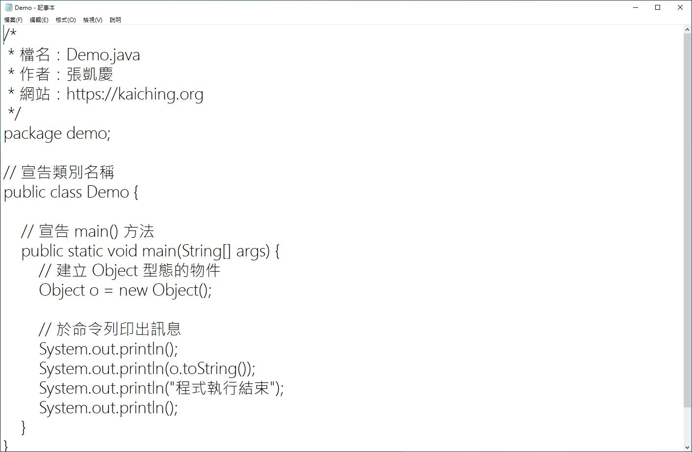
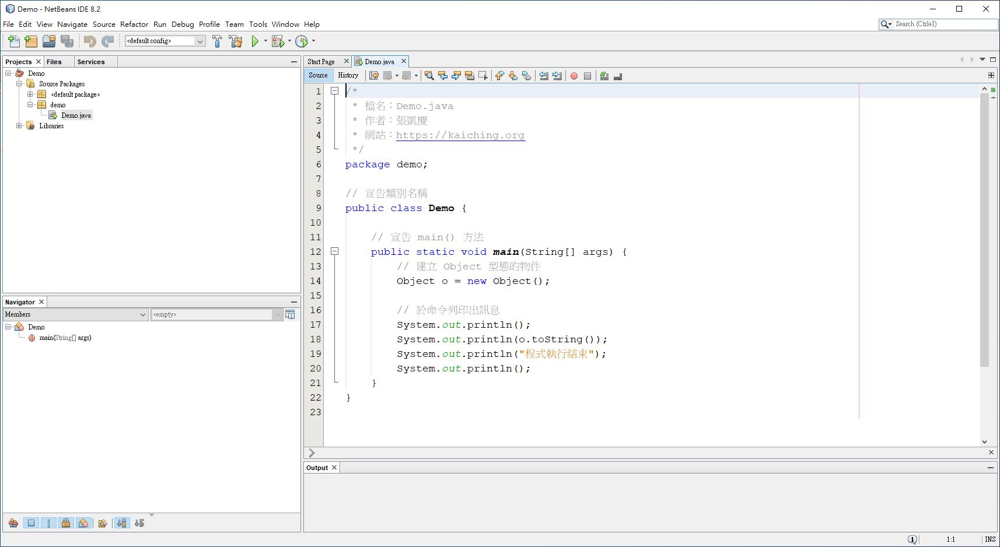
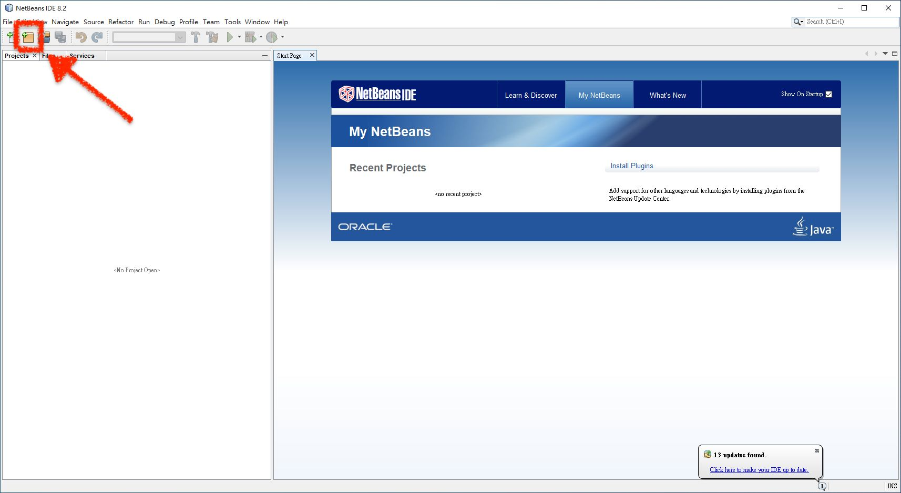
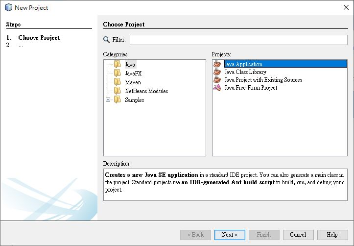
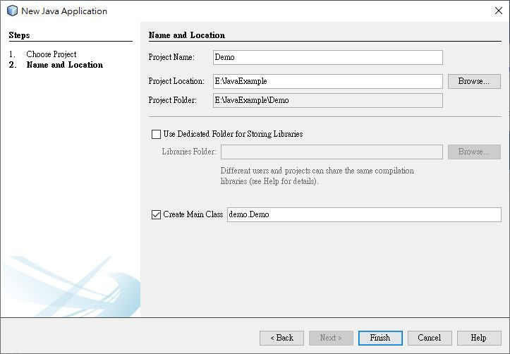
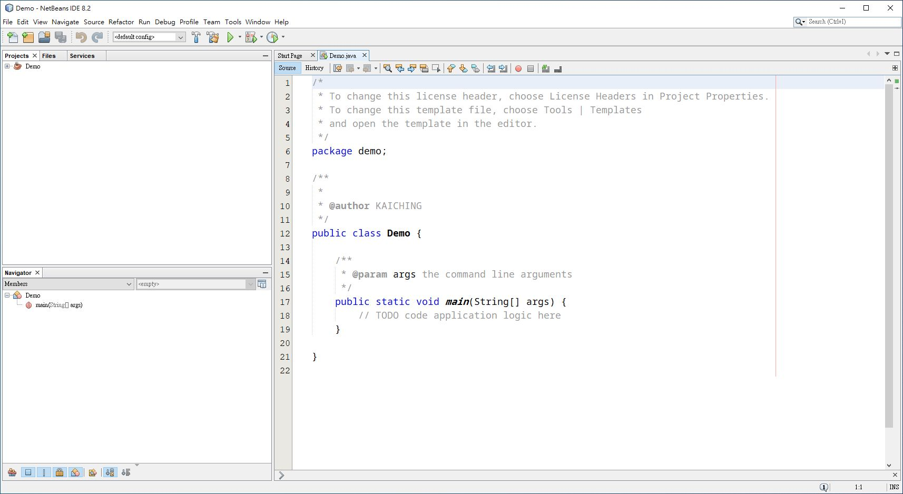
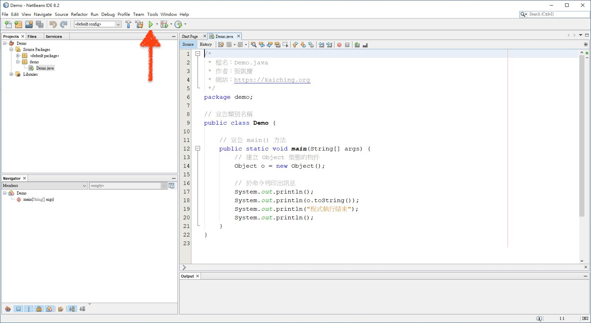
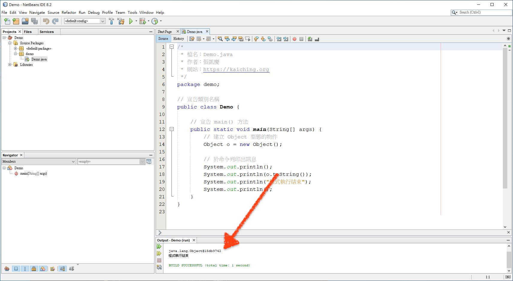

# JAVA 入門指南
## 目錄
Java 為熱門的程式語言之一，中英文學習資源都琳瑯滿目，無論是網路上免費的或是書店裡販賣的書籍，讀者可以找到各式各類的教材，目前中、英文學習資源都很豐富，無論是網路上免費的或是書店裡販賣的書籍，入門書籍方面，惟獨缺少直接帶領讀者學習開發軟體的教材，此亦本書的設計理念，希望藉由帶領讀者開發簡單的應用軟體，以此帶給讀者完整的軟體開發觀念。

本書分成四大部分，每一部分又分成 7 到 12 個單元，以下為學習路徑圖


- **「基礎學習篇」** 的學習目標包括認識 Java 、怎麼處理資料、控制結構、物件導向、模組化與關鍵字 static ，這部分累計十二個單元，預計帶領讀者學會寫簡單的 Java 小程式，具備寫小程式的能力之後，就進入接下來的「軟體開發篇」。

- **「軟體開發篇」** 的學習目標為開發、測試、除錯及重構，這部分累計八個單元，目的是讓讀者了解完整的軟體開發概念及流程，同時開發往後「JavaFX App 篇」及「Android App 篇」的計算核心類別 Encrypt ，帶讀者深入了解如何設計類別，此後先進入「JavaFX App 篇」，利用 FXML 替計算核心設計視窗應用軟體。

- **「JavaFX App 篇」** 的學習目標為開發 GUI 應用軟體， Java 是新一代 Java API 內的 GUI 開發框架，可以快速開發視窗應用程式，這裡把 Encrypt 放到 JavaFX 專案中運用，最後討論開發應用程式常用的 MVC 模式， Encrypt 類別為 M 的部分， JavaFX 專案的 XML 檔案為 V ，程式檔案為 C 。

- **「Android App 篇」** 緊接在「JavaFX App 篇」之後，利用 Android Studio 開發行動應用程式 Android App ，這裡會介紹開發 Android App 的基本觀念，簡單的兩頁 App 到打包成上架的 Budle 檔。

每一個單元的最後都有「中英文術語對照」、「重點整理」、「問題與討論」及「練習」，其中「練習」在「軟體開發篇」會帶領讀者開發猜數字遊戲，到「JavaFX App 篇」會把猜數字遊戲移植到視窗軟體上，「Android App 篇」會把猜數字遊戲變成 Android 應用程式。

> 電子書版本會隨 Android Studio 版本進行更新，目前介紹的是 Android Studio 版本為 3.5.3 。

---

| 主題           | 內容                                                                                                                                                                                                                                                                                                                             |
|---------------|--------------------------------------------------------------------------------------------------------------------------------------------------------------------------------------------------------------------------------------------------------------------------------------------------------------------------------|
| 基礎篇         | 單元 1 - 認識 Java 語言<br>單元 2 - 在 NetBeans 8.2 建立專案並執行<br>單元 3 - 基本資料型態與參考<br>單元 4 - 變數命名規則<br>單元 5 - 運算式與陳述<br>單元 6 - 選擇<br>單元 7 - 迴圈<br>單元 8 - 類別<br>單元 9 - 封裝與建構子<br>單元 10 - 物件導向程式設計<br>單元 11 - 介面與套件<br>單元 12 - static                        |
| 軟體開發篇     | 單元 13 - Encrypt 類別<br>單元 14 - 實作 setCode()<br>單元 15 - 繼續測試<br>單元 16 - 修正後的數學公式<br>單元 17 - 編碼與解碼<br>單元 18 - 重構<br>單元 19 - 認識 Java API 與 JavaFX                                                                                                                                            |
| JavaFX App 篇  | 單元 20 - MVC 模式與建立 JavaFX 專案<br>單元 21 - 利用 FXML 設計介面<br>單元 22 - 設定按鈕事件<br>單元 23 - 整合 Encrypt 類別<br>單元 24 - 存檔與載入<br>單元 25 - 完成版的 JavaFX 專案<br>單元 26 - 認識 Android App 開發                                                                                                       |
| Android App 篇 | 單元 27 - 建立 Android App 專案<br>單元 28 - string.xml 與 style.xml<br>單元 29 - 首頁<br>單元 30 - 換頁<br>單元 31 - 整合功能<br>單元 32 - 自訂 App 圖示與實機測試<br>單元 33 - 打包成 APK 或 Bundle 檔<br>單元 34 - 上架到 Google Play<br>單元 35 - 下一步                                                                     |
| 範例程式篇     | 📁Encrypt06 專案<br>__Encrypt06.java<br>📁Encrypt 專案<br>__Encrypt.java<br>📁JavaFX 專案<br>__FXMLDocument.fxml<br>__EncryptGUI.java<br>__FXMLDocumentController.java<br>📁AndroidAppDemo 專案<br>__strings.xml<br>__styles.xml<br>__activity_main.xml<br>__activity_encode.xml<br>__MainActivity.java<br>__EncodeActivity.java |

> 本書所有範例與練習程式 - [下載連結](http://kaiching.org/pydoing/java-guide/JavaExample.zip)。

---

## 基礎篇
### 基礎篇的學習目標如下
- 認識 Java
- 怎麼處理資料
- 控制結構
- 物件導向
- 模組化
- static

### 分成以下十三個單元來講解
- 單元 1 - 認識 Java 語言
- 單元 2 - 在 NetBeans 8.2 建立專案並執行
- 單元 3 - 基本資料型態與參考
- 單元 4 - 變數命名規則
- 單元 5 - 運算式與陳述
- 單元 6 - 選擇
- 單元 7 - 迴圈
- 單元 8 - 類別
- 單元 9 - 封裝與建構子
- 單元 10 - 物件導向程式設計
- 單元 11 - 介面與套件
- 單元 12 - static

其中單元 1 到 2 為介紹「認識 Java」，單元 1 先用簡單的 C# 專案 Demo 認識 Java 程式的樣貌、寫程式的工具等等，單元 2 則是認識如何用 NetBeans 8.2 建立並執行 Java 專案。

單元 3 到 5 為介紹「怎麼處理資料」，寫程式的主要目的就是為了處理資料，單元 3 先認識資料的型態，因為每一種資料都有專屬的型態，然後跟數學一樣，程式是把資料用變數代為處理，單元 4 就講到變數命型規則，單元 5 講到程式執行最基本的單位，也就是陳述，然後各種運算子構成的運算式。

單元 6 到 7 為介紹「控制結構」，控制結構為現代程式語言採用的結構化程式設計方式，主要有兩種，其一為選擇結構，這是單元 6 的主題， Java 有 if-else 及 switch-case 兩種選擇結構，其二為迴圈，這是單元 7 的主題，分為三種，分別是 while 、 do-while 及 for 。

單元 8 到 10 介紹「物件導向」，也就是類別設計，物件導向程式設計是現在寫程式最常使用的方式之一， Java 程式本身就是以定義類別開始，這裡進一步討論各種細節。

單元 11 介紹「套件」，「套件」是 Java 組織程式庫的方式，在 NetBeans 或 Android Studio 開發 Java 程式也都需要定義套件。

單元 12 介紹關鍵字 static ，凡是使用 static 宣告的成員屬於類別，物件導向程式設計中的物件分成類別與實體，兩者是不同的物件。

### 相關教學影片
- [第一堂課 認識 Java 程式語言：第一堂課導覽](http://kaiching.org/pydoing/java-lesson/java0101.html) ⇨ [YouTube 頁面連結](https://youtu.be/KOeiGg6Gl-4)
- [第一堂課 認識 Java 程式語言：第一堂課舉一反三](http://kaiching.org/pydoing/java-lesson/java0106.html) ⇨ [YouTube 頁面連結](https://youtu.be/FYEHP-U8qdw)
- [第二堂課 基本資料型態與命名習慣：第二堂課導覽](http://kaiching.org/pydoing/java-lesson/java0201.html) ⇨ [YouTube 頁面連結](https://youtu.be/IHQ8Yd9apbA)
- [第二堂課 基本資料型態與命名習慣：第二堂課舉一反三](http://kaiching.org/pydoing/java-lesson/java0205.html) ⇨ [YouTube 頁面連結](https://youtu.be/XhQZS23-WMY)
- [第三堂課 運算式、陳述與控制結構：第三堂課導覽](http://kaiching.org/pydoing/java-lesson/java0301.html) ⇨ [YouTube 頁面連結](https://youtu.be/JKDtJ7I0mNY)
- [第三堂課 運算式、陳述與控制結構：例外處理](http://kaiching.org/pydoing/java-lesson/java0305.html) ⇨ [YouTube 頁面連結](https://youtu.be/X7-ECH3Xl-o)
- [第三堂課 運算式、陳述與控制結構：第三堂課舉一反三](http://kaiching.org/pydoing/java-lesson/java0306.html) ⇨ [YouTube 頁面連結](https://youtu.be/feobDPmYrvk)
- [第五堂課 類別與物件導向程式設計：第五堂課導覽](http://kaiching.org/pydoing/java-lesson/java0501.html) ⇨ [YouTube 頁面連結](https://youtu.be/RMnpHUPl4pk)
- [第五堂課 類別與物件導向程式設計：第五堂課舉一反三](http://kaiching.org/pydoing/java-lesson/java0508.html) ⇨ [YouTube 頁面連結](https://youtu.be/76DNmavjx8s)

---

## 單元 1 - 認識 Java 語言
使用 Java 語言寫程式，最簡單的方式就是開啟文字編輯器 (text editor) ，然後將原始程式碼 (source code) 逐字元 (character) 一個一個打進文字編輯器中，然後依純文字檔案的編碼格式儲存檔案 (file) ， Java 程式的原始碼檔案採用 `.java` 的副檔名 (extension)

下面利用 Windows 系統的「記事本」開啟第一個範例 Demo.java


也可以利用具有語法高亮度顯示的文字編輯器，或是整合開發環境 (Integrated Development Environment, IDE) ，如下圖為 Windows 系統的 NetBeans 8.2


> 我們在「基礎篇」、「軟體開發篇」及「JavaFX App 篇」採用 NetBeans 8.2 介紹 Java 程式，「Android App 篇」則改用 Android Studio 介紹 Android App 的開發。

> NetBeans 8.2 是配合 JDK 1.8 的 NetBeans 版本，這是本書配合 Android 開發使用的版本，請從 Oracle 網站 JDK 8u111 with NetBeans 8.2 下載安裝檔。若往後 Andorid 提升支援 Java 的版本，本書也會隨之改版。

> NetBeans 8.2 在 Windows 裡只有用某些特定的字型才能正常顯示中文，此處採用的字型為 DialogInput ，或是要將 Windows 的預設編碼改為 UTF-8 ，在 Mac 裡則無此問題。

或是參考本書的語法高亮度顯示，此範例程式 Demo.java 如下
```java
/*
 * 檔名：Demo.java
 * 作者：張凱慶
 * 網站：http://kaiching.org
 */
package demo;

// 宣告類別名稱
public class Demo {

  // 宣告 main() 方法
  public static void main(String[] args) {
    // 建立 Object 型態的物件
    Object o = new Object();
    
    // 於命令列印出訊息
    System.out.println();
    System.out.println(o.toString());
    System.out.println("程式執行結束");
    System.out.println();
  }
}
```

我們先看到栗色標記的幾個字
```java
package public class static void new
```
`package` 、 `public` 、 `class` 、 `static` 、 `void` 、 `new` 被稱為關鍵字 (keyword) ，所謂的關鍵字是語法功能的保留字 (reserved word) ，具有既定特殊的用法，例如 `public` 為權限的修飾子 (modifier) ， `public` 表示公開的，也就是任何地方都可以存取以 `public` 宣告 (declare) 的內容。 Java 8 共有 50 個關鍵字，我們接下來會逐一介紹各個關鍵字的用法。

橄欖色標記的有
```java
String Object System out println
```
這幾個字是 API 中可直接使用的名稱，屬於 API 中的識別字 (identifier) 。

另外，雙引號為起來的內容為藍色
```java
"程式執行結束"
```

這是字串 (string) ，所謂的字串就是文字資料，由於 Java 採用 Unicode 編碼，因此字串內容可以是任何 Unicode 字元。

> Unicode 提供數十種文字系統編碼的方式，其中包括我們日常使用的中文，詳細可參見維基百科的介紹。

註解 (comment) 在語法高亮度系統採用綠色，連續兩個斜線為單行的註解
```java
// 宣告類別名稱
```

斜線、星號開始到另一組星號、斜線結束的範圍則為多行的註解
```java
/*
 * 檔名：Demo.java
 * 作者：張凱慶
 * 網站：http://kaiching.org
 */
```

所謂的註解就是在程式中輔助說明的文字，凡是註解文字，也就單行連續兩個斜線之後的文字，或是多行斜線、星號範圍間的文字，這些文字都不會被程式執行，因此可插入任何自然語言的說明字句，無須恪守 Java 的語法規則。

其他沒有粗體，也沒有特殊顏色的文字都是識別字，所謂的識別字是我們寫程式自行定義的名稱，如上例中的變數 (variable) `o` 。事實上，許多識別字已經是預設或存在於 Java API 之中，預設如上面的 `main()` 與 `args` ， `main()` 為方法 (method) 名稱，每個可執行的 Java 程式都必須有個 `main()` 方法， `args` 則是 `main()` 的參數 (parameter) 名稱。

Java API 提供許多已經寫好，測試無誤的類別 (class) ，因此我們寫程式可以直接使用這些類別，以及其所提供的方法與屬性 (field) ，方法為類別進行工作的地方，屬性則為類別專屬的資料。我們應該先認識什麼是什麼，往後才繼續瞭解這些東西的用法。

上例中， `Object` 、 `String` 、 `System` 、 `out` 與 `println()` 都屬於 API 中的識別字， `Object` 、 `String` 、 `System` 等三個都是類別名稱， `out` 為 `System` 類別的屬性，實際上 `out` 是一個物件 (object) ， `println()` 則是 `out` 物件的方法。

這個範例很簡單，大體上我們可以分成五個區域來看，分別是
 - 宣告套件名稱
 - 宣告類別名稱
 - 宣告 main() 方法
 - 建立 Object 型態的物件
 - 於命令列印出訊息

> 套件 (package) 是 Java 組織程式檔案的方式， NetBeans 8.2 建立專案 (project) 預設會連帶建立套件，因此第一個部分為宣告套件，有關套件的部分，會在單元 11 - 套件詳細介紹。

由於 Java 是物件導向程式語言 (object-oriented programming language) ，使用 Java 寫程式就是設計、規劃物件，而類別為物件的藍圖，因此所有的 Java 程式都至少有一個類別，也就是說， Java 程式都必須用 `class` 定義， `class` 就是定義類別所採用的關鍵字。

可執行的 Java 程式則需要定義 `main()` 方法，這個 `main()` 需要用 `public` 與 `static` 修飾， `public` 表示公開的， `static` 表示可由類別名稱存取，這是給 Java 虛擬機器 (Java Virtual Machine, JVM) 呼叫 (call) 之用， Java 程式實際上是由 Java 虛擬機器執行的。

`new` 關鍵字用來新建物件，變數 `o` 為對 `Object` 型態物件的參考 (reference) ，由於 Java 是強型態 (strong typing) 的程式語言，因此變數使用前需要先經過宣告 (declaration) ，宣告的目的就是指定變數的資料型態 (data type) 。 `new` 之後接的 `Object()` 為 `Object` 類別的建構子 (constructor)，透過建構子就可以把類別轉化為物件。

底下使用 API 中 `System` 類別 `out` 物件的 `println()` 方法，使參數一次一行印在命令列上，其中用到
```java
System.out.println(o.toString());
```
`println()` 需要 `String` 型態的物件當作參數， `String` 型態的物件也就是字串，雙引號圍起來的內容。 `o` 呼叫 `o` 自己的 `toString()` 方法，這個方法會回傳 `o` 的字串表達形式，也就是表示 `o` 的字串物件。

> 如果沒有提供參數給 println() ， println() 就會印出新行字元，也就是印出空白行的意思。

一種類別，也就是一種型態（資料型態），我們繼續來看看如何實際用 NetBeans 8.2 建立專案與執行吧！

### 相關教學影片
- [第一堂課 認識 Java 程式語言：Java 與 Java API](http://kaiching.org/pydoing/java-lesson/java0102.html) ⇨ [YouTube 頁面連結](https://youtu.be/ab9f006lmI0)
- [第一堂課 認識 Java 程式語言：Java 程式的基本結構](http://kaiching.org/pydoing/java-lesson/java0104.html) ⇨ [YouTube 頁面連結](https://youtu.be/P0XUg5HVZfs)
- [第一堂課 認識 Java 程式語言：關鍵字、識別字、字面常數與運算子](http://kaiching.org/pydoing/java-lesson/java0105.html) ⇨ [YouTube 頁面連結](https://youtu.be/ogjVTa8z14A)

### 中英文術語對照表
| 英文                                    | 中文             |
|-----------------------------------------|----------------|
| Integrated Development Environment, IDE | 整合開發環境     |
| Java Virtual Machine, JVM	Java          | 虛擬機器         |
| call                                    | 呼叫             |
| character                               | 字元             |
| class                                   | 類別             |
| comment                                 | 註解             |
| constructor                             | 建構子           |
| data type                               | 資料型態         |
| declare, declaration                    | 宣告             |
| extension                               | 副檔名           |
| field                                   | 屬性             |
| file                                    | 檔案             |
| identifier                              | 識別字           |
| keyword                                 | 關鍵字           |
| method                                  | 方法             |
| modifier                                | 修飾子           |
| object-oriented programming language    | 物件導向程式語言 |
| package                                 | 套件             |
| parameter                               | 參數             |
| project                                 | 專案             |
| reference                               | 參考             |
| reserved word                           | 保留字           |
| source code                             | 原始程式碼       |
| string                                  | 字串             |
| strong typing                           | 強型態           |
| text editor                             | 文字編輯器       |
| variable                                | 變數             |

### 重點整理
1. Java 程式的副檔名為 .java 。
2. NetBeans 8.2 的 Java 專案預設會宣告套件，接著定義類別。
3. 可執行的 Java 程式要在類別中定義 main() 方法。
4. 關鍵字在程式中具有語法上的功能。
5. 識別字是程式中自行命名的名稱。
6. API 為已經定義好的程式內容，在自己寫的程式可以直接使用。
7. 字串是雙引號圍起來的文字資料。
8. 註解是程式中不會被執行的部分， Java 有兩種註解，分別是連續兩條斜線及斜線、星號到另一組星號、斜線。

---

## 單元 2 - 在 NetBeans 8.2 建立專案並執行
NetBeans 是開放原始碼的整合開發環境 (integrated development environment) ，整合開發環境簡稱 `IDE`
> 本書採用 JDK 8 與 NetBeans 8.2 作為教學工具，請從 JDK 8u111 with NetBeans 8.2 下載安裝 JDK 8 與 NetBeans 8.2 。

> 目前 Java 最新的版本為 13 ，就初學的內容而言，其實不會涵蓋到 JDK 8 之後的範疇，因此可以先用 JDK 8 當初學的開發工具，之後有需要再去學新版本的東西。

> 也可以在命令列編譯執行 Java 程式，請參考附錄的如何在命令列編譯執行 Java 程式。

在 Windows 10 中打開 NetBeans 8.2 ，如下圖。點擊左上的 New Project 按鈕，就可以新增專案 (project)

點擊後就會出現 New Project 視窗，這裡選擇專案種類 Categories 為 Java ，然後 Projects 選 Java Application ，最後點擊 Next 按鈕

接下來設定專案名稱及儲存位置，這裡專案名稱設定為 Demo ，然後專案儲存到 E 槽的 JavaExample 資料夾，最後點擊 Finish 按鈕

接下來就會自動載入專案的程式檔案 Demo.java

以下將檔案內容換成我們第一個專案 Demo.java 的內容，繼續按上方中間的執行鍵就可以執行程式

執行結果會出現在編輯視窗區的下方

以上為基本的建立專案到執行，下面開始進行程式設計 (programming) 的各項主題，先來認識基本資料型態 (primitive data type) 與參考 (reference) 囉！

### 相關教學影片
- [第一堂課 認識 Java 程式語言：利用 IntelliJ IDEA CE 建立 Java 專案](http://kaiching.org/pydoing/java-lesson/java0103.html) ⇨ [YouTube 頁面連結](https://youtu.be/fYy6D5Qttxw)

### 中英文術語對照表
| 英文                                    | 中文         |
|-----------------------------------------|------------|
| Integrated Development Environment, IDE | 整合開發環境 |
| primitive data type                     | 基本資料型態 |
| project                                 | 專案         |
| programming                             | 程式設計     |
| reference                               | 參考         |

### 重點整理
1. NetBeans 是寫 Java 程式的開放原始碼整合開發環境。
2. 利用 NetBeans 左上角的 New Projects 按鈕可以建立新專案。
3. 利用 NetBeans 中間上方的 Run Project 按鈕可以執行專案。

---

## 單元 3 - 基本資料型態與參考
Java 中的變數 (variable) 有兩種，一種是基本資料型態 (primitive data type) ，另一種則是對物件 (object) 的參考 (reference)

### 基本資料型態共有八種，如下表
| 型態類型 | 關鍵字  | 位元數 | 範圍                                       |
|--------|---------|--------|--------------------------------------------|
| 整數     | byte    | 8      | -128 ～ 127                                 |
| 整數     | short   | 16     | -32768 ～ 32767                             |
| 整數     | int     | 32     | -2147483648 ～ 2147483647                   |
| 整數     | long    | 64     | -9223372036854775808 ～ 9223372036854775807 |
| 浮點數   | float   | 32     | 依據 IEEE 754 標準                         |
| 浮點數   | double  | 64     | 依據 IEEE 754 標準                         |
| 布林值   | boolean | 1      | true, flase                                |
| 字元     | char    | 16     | '\u0000' - '\uffff'                        |

依資料所佔位元數的不同，
整數有四種，
浮點數有兩種，
另外布林值與字元各一種。
一般來說，資料型態所佔據的位元數越多，可表示的數字範圍也越大。
字面常數 (literal) 也就是程式中直接寫出來的數值 (value) ，

以下表示布林值 (Boolean value) 、字元 (character) 、整數 (integer) 與浮點數 (floating-point number) 的字面常數
```java
boolean a = true;
char b ='2';
int c = 2;
double d = 2.0;
```

宣告布林型態的變數使用關鍵字 (keyword) `boolean` ， `true` 為布林值的字面常數，表示邏輯上的真，布林型態的另一個字面常數為 false ，表示邏輯上的假。

字元型態則使用關鍵字 `char` ，由於 Java 直接支援 Unicode 編碼，因此任何 Unicode 字元都可以當作字元型態的的字面常數。字元型態的字面常數為單引號圍起來的單一字元，或是單引號圍起來，反斜線加上四位的十六位元數字，例如
```java
char e = '\u0061'; // 小寫英文字母 a
char f = '\u0032'; // 阿拉伯數字 2
char g = '\u002E'; // 英文句點 .
char h = '\u0025'; // 百分比符號 %
```

反斜線加上特定英文小寫字母表示跳脫字元，用來表示一些不可見字元，例如
```java
char i = '\n'; // 新行符號
char j = '\t'; // tab 鍵
char k = '\a'; // 響鈴
char l = '\"'; // 雙引號
```

整數型態共有四種，一般來講，最常使用的是 `int` 型態，沒有特別指定的整數字面常數也會是 `int` 型態，而 `long` 型態又被稱為長整數，字面常數須加上英文字母 L 或 l 的字尾，如
```java
long m = 220L; // 長整數 220
long n = 220l; // 長整數 220
```

浮點數型態有兩種，最常使用的是 double 型態，沒有特別指定的浮點數字面常數也會是 double 型態，若是需要使用 float 型態的浮點數，需要在字面常數加上 F 或 f 的字尾，如
```java
float o = 22.0F; // 浮點數 22.0
float p = 22.0f; // 浮點數 22.0
```

除了以上八種基本資料型態之外，其餘的變數都是指向物件的參考，可以想像變數本身就是容器，基本資料型態所含的數值大小可以直接裝進變數之中，但是物件太大，塞不進變數裡頭，因此物件變數裡所裝的是對物件的連結，也就是參考。

例如 Demo.java 中
```java
/*
 * 檔名：Demo.java
 * 作者：張凱慶
 * 網站：http://kaiching.org
 */
package demo;

// 宣告類別名稱
public class Demo {
  // 宣告 main() 方法
  public static void main(String[] args) {
    // 建立 Object 型態的物件
    Object o = new Object();
    
    // 於命令列印出訊息
    System.out.println();
    System.out.println(o.toString());
    System.out.println("程式執行結束");
    System.out.println();
  }
}
```

變數 o 為對 Object 型態物件的參考
```java
Object o = new Object();
```
建立物件須使用關鍵字 `new` ，以及物件的建構子 (constructor) 。建構子類似物件的方法 (method) ，用來專門建立物件之用。一旦物件建立之後，物件就會包含許多屬性 (field) 與方法。

Object 型態的物件為 Java 所有物件之母，這是說， Java 中所有物件都繼承 (inherit) 自 Object 。繼承 (inheritance) 是物件導向程式語言 (object-oriented programming language) 中的一項重要特性，使類別 (class) 可以衍生自其他類別，子類別 (subclass) 可以擁有父類別 (superclass) 的特性。

> 繼承的英文原文為 inherit ，中文意思泛指從什麼得到什麼，生物學上的遺傳也是用這個詞。

由於 Object 型態為物件之母，因此 Object 型態的方法，也都會被 Java 中所有物件所繼承


回傳型態	名稱	功能
Object	o.clone()	複製回傳 o 本身的拷貝
boolean	o.equals(Object obj)	判斷 obj 是否與 o 相同
void	o.finalize()	呼叫資源回收者檢查此物件是否應該被回收
Class<?>	o.getClass()	回傳類別名稱
int	o.hashCode()	回傳物件的雜湊碼
void	o.notify()	喚醒等待中的單一執行緒 (thread)
void	o.notifyAll()	喚醒等待中的所有執行緒
String	o.toString()	回傳物件的字串表達形式
void	o.wait()	使 o 的執行緒進行等待
void	o.wait(long timeout)	使 o 的執行緒進行等待
void	o.wait(long timeout, int nanos)	使 o 的執行緒進行等待

有沒有看到，光是 `Object` 裡頭就有這麼多東東，所以變數裝的下對物件的參考，裝不了整個物件。

有一個特別的字面常數 `null` ，一旦物件的參考變數指向 `null` ，就表示參考變數失去對這個原本物件的連結，如果沒有其他的變數指向這個物件，這個物件就會被資源回收者 (garbage collector) 進行資源回收，好挪出記憶體空間，給其他程式利用。

另有一個特別的物件，說是特別其實也是太常使用了，就是字串 (string) 。程式中經常處理大量的字串工作，因此字串有專門的字面常數表示方法，也就是用雙引號圍起來的內容就是字串，例如

```java
String q = "There is no spoon.";
String r = "偷得浮生半日閒";
```

`Demo.java` 中的 `o.toString()` ，就是回傳 `o` 的字串表達形式，也就是一個字串物件。其他 `println()` 的參數都需要用到字串，我們直接提供字串的字面常數。

從 `a` 到 `r` 都是變數，變數取名有一定的規範，接下來，我們來看看變數命名規則吧！

### 相關教學影片
- [第二堂課 基本資料型態與命名習慣：基本資料型態與參考](http://kaiching.org/pydoing/java-lesson/java0202.html) ⇨ [YouTube 頁面連結](https://youtu.be/7qqGpwCP7KQ)

### 中英文術語對照表
| 英文                                 | 中文             |
|--------------------------------------|----------------|
| Boolean value                        | 布林值           |
| character                            | 字元             |
| class                                | 類別             |
| constructor                          | 建構子           |
| field                                | 屬性             |
| floating-point number                | 浮點數           |
| garbage collector                    | 資源回收者       |
| inherit, inheritance                 | 繼承             |
| integer                              | 整數             |
| keyword                              | 關鍵字           |
| literal                              | 字面常數         |
| method                               | 方法             |
| object                               | 物件             |
| object-oriented programming language | 物件導向程式語言 |
| primitive data type                  | 基本資料型態     |
| reference                            | 參考             |
| string                               | 字串             |
| subclass                             | 子類別           |
| superclass                           | 父類別           |
| value                                | 數值             |
| variable                             | 變數             |

### 重點整理
1. Java 的資料型態分成兩大類型，基本資料型態與參考。
2. 使用變數前要先宣告，宣告後的變數可以用等號用字面常數指派數值，或是用關鍵字 new 建立物件。
3. 基本資料型態包括整數、浮點數、字元及布林，參考型態主要由類別定義。
4. 整數依據範圍及正負號有四種。
5. 浮點數依據範圍及精確度有兩種。
6. 字元為 16 位元的整數。
7. 布林型態只有 true 及 false 兩種值。